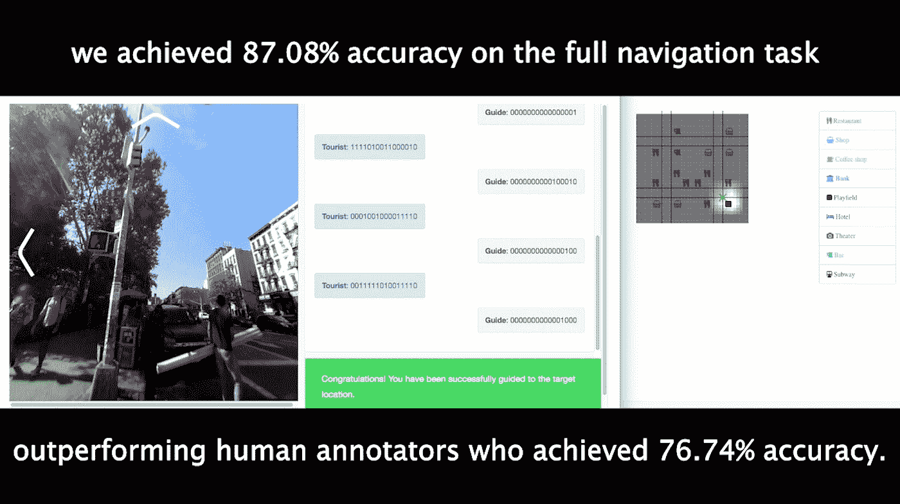
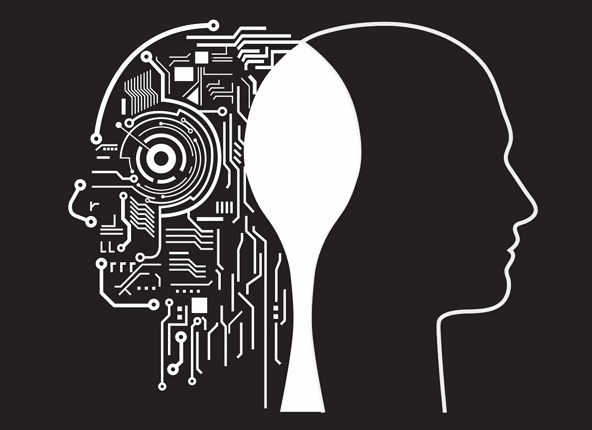
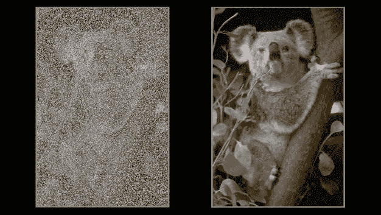

# 宝马机器学习周刊—第 14 周

> 原文：<https://towardsdatascience.com/bmw-machine-learning-weekly-week-14-f0eae8ce33d8?source=collection_archive---------14----------------------->

## 2018 年 7 月 5 日至 7 月 18 日

*关于机器学习(ML)、人工智能(AI)及相关研究领域的新闻。*

# 脸书的艾游客

如果你在纽约迷路了，没有智能手机或地图，你很可能会向当地人问路。脸书的研究人员正在训练人工智能程序做同样的事情，他们希望这最终能使他们更好地使用语言。纽约的脸书人工智能研究小组创建了两个人工智能程序:一个是在纽约迷路的“游客”，另一个是通过提供自然语言指令来帮助其同伴算法找到路的“向导”。迷路的游客看到的是真实世界的照片，而“导游”看到的是带有地标的二维地图。他们一起承担着到达特定目的地的任务。这个想法是，通过学习指令如何与现实相关，游客算法将开始找出这些东西实际上是什么。人工智能研究人员希望以这种方式教授的算法在使用语言时会更加复杂，这对人工智能来说仍然是一个巨大的挑战。

[继续阅读……](https://www.technologyreview.com/s/611629/facebooks-ai-tourist-finds-its-way-around-new-york-city-by-asking-for-help-from-another/)

# 人类智能:伪人工智能

在过去十年的大部分时间里，由智能手机主导的科技行业一直在追求一个单一的目标，即完全征服我们的眼睛，这让我们的手机屏幕越来越大。但我们似乎已经到达了一个被称为“峰值屏幕”的地方，科技巨头们开始构建一些新东西的开端:一个不那么坚持视觉化的科技世界，一个依赖语音助手、耳机、手表和其他可穿戴设备来减轻我们眼睛压力的数字景观。取决于这些技术如何发展，一个需要我们更少眼睛的数字生态系统可能对每个人都更好——更少沉浸感，更少上瘾，更有利于多任务处理。多年来，我们已经在汽车上看到了这一点:通过将内部控制放在触摸屏上，而不是触觉旋钮和开关上，汽车制造商已经使车辆变得更加令人讨厌和危险。特斯拉 Model 3 将这一点发挥到了荒谬的程度。正如几位评论家[对](https://www.edmunds.com/tesla/model-3/2017/review/)的哀叹，几乎每一个汽车控制器——包括侧镜的调节——都需要通过屏幕来操作。为了迈向“辉煌的小屏幕未来”，科技行业需要想出其他不那么身临其境的方式来与数字世界互动:语音助手。

[继续阅读……](https://www.theguardian.com/technology/2018/jul/06/artificial-intelligence-ai-humans-bots-tech-companies)

# 人工智能可以修复你粗糙的照片

来自英伟达、阿尔托大学和麻省理工学院的研究人员开发了一种深度学习算法，该算法已经学会修复照片:删除文本和水印或修复颗粒状照片分辨率。研究人员使用特斯拉 P100 GPU 和 TensorFlow 深度学习框架来训练算法 Noise2Noise。Noise2Noise 使用图像的有噪版本和干净版本对 ImageNet 数据集的 50，0 00 多幅图像进行训练，可以消除伪像、噪声、颗粒，并自动增强您的照片，而无需查看对象的原始无噪版本。该算法不仅用于恢复颗粒状照片，还用于磁共振图像(MRI)扫描，这在医疗领域非常有益。

[继续阅读……](https://news.developer.nvidia.com/ai-can-now-fix-your-grainy-photos-by-only-looking-at-grainy-photos/)

# 值得注意的

*   **遇见奥斯卡垃圾桶**
    奥斯卡来自[自主](https://www.autonomous.ai/)的人工智能垃圾桶，一家符合人体工程学的办公和游戏家具公司，为你回收。根据 Autonomous 的说法，当你把一件垃圾扔进奥斯卡的识别和分类机制时，图像识别相机会检测它是否可回收。如果 Oscar 的图像识别算法无法对物品进行分类，LED 会闪烁红光，提示用户通过“教授”物品的分类来提供帮助。[阅读更多…](https://www.digitaltrends.com/home/oscar-ai-trash-can-sorts-recyclables-garbage/#/1)
*   咨询公司普华永道(PwC)的一份报告预计，到 2037 年，人工智能将为英国经济增加的就业岗位(约 720 万个)将与该技术导致的失业(700 万个)一样多。[阅读更多内容……](https://www.technologyreview.com/the-download/611663/a-new-report-says-ai-will-replace-as-many-jobs-as-it-kills-take-that-with-a-huge/)