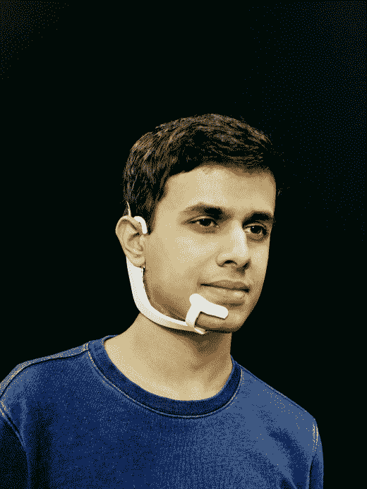
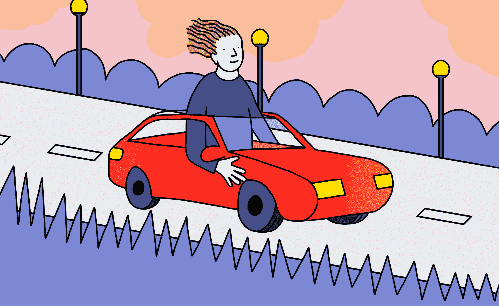

# 宝马机器学习周刊—第 9 周

> 原文：<https://towardsdatascience.com/bmw-machine-learning-weekly-week-9-d996c486dbb?source=collection_archive---------8----------------------->

## 2018 年 4 月 26 日至 5 月 2 日

*关于机器学习(ML)、人工智能(AI)及相关研究领域的新闻。*

# 奥特雷戈计划:半机械人

通过与它们交谈来控制你的小工具是如此的 2018。将来，你甚至不用动嘴唇。一个名为 [AlterEgo](https://www.media.mit.edu/projects/alterego/overview/) 的原型设备，由 23 岁的麻省理工学院媒体实验室研究生 Arnav Kapur 创造，已经使这成为可能。有了卡普尔的设备——一个 3d 打印的塑料小东西，看起来有点像一只瘦瘦的白香蕉，附在他的头上——他可以浏览电视频道，改变灯泡的颜色，下专家象棋，解决复杂的算术问题，以及[点披萨](https://www.cbsnews.com/news/mit-media-lab-where-tomorrows-technology-is-born/)，所有这些都不用说一句话或动一根手指。“我确实觉得自己像个半机械人，但这是最好的感觉，”他谈到自己对这款设备的体验时说，这款设备是他去年作为研究项目制造的。当我们安静地阅读或自言自语时，AlterEgo 会接收到我们面部和颈部肌肉的微小运动产生的微小电信号。Kapur 将 AlterEgo 视为一种对源于人工智能的日益增长的焦虑的解毒剂:他的设备显示了人工智能如何帮助增强而不是取代人类。

[继续阅读……](https://www.technologyreview.com/s/610949/say-goodbye-to-alexa-and-hello-to-gadgets-listening-to-the-voice-inside-your-head/)

# 无人驾驶汽车中的晕动病

尽管无人驾驶汽车还没有那么普遍，但它们正在走向消费者用途，谷歌(Google)旗下的 Waymo 等公司正在公共道路上测试它们。这些汽车很可能会加剧晕动病的问题，这是由于一个人的眼睛和内耳向大脑发出相互矛盾的信号:耳朵检测到汽车的运动，但眼睛看到的是内部静止的环境。一家名为 [ClearMotion](http://www.clearmotion.com/) 的初创公司是世界上第一个主动驾驶系统，它改变了你的汽车的驾驶和操控方式:它对运动的影响就像降噪对噪音的影响一样，在几分之一秒内减轻了道路的粗糙度。依靠软件和硬件的结合，ClearMotion 预测道路并使汽车做出反应，为乘客和司机提供无与伦比的舒适性、操控性和稳定性。

[继续阅读……](https://www.technologyreview.com/s/610882/this-startup-hopes-to-keep-barf-bags-out-of-self-driving-cars/)

# 使用无人机和人工智能修复中国的长城

中国墙的许多部分位于偏远或难以到达的地区，有些已经年久失修。麻省理工学院技术评论[报道](https://www.technologyreview.com/the-download/611036/drones-are-about-to-start-mapping-the-great-wall-of-china-in-incredible-detail/)称，英特尔和中国文化遗产保护基金会已经合作部署无人机来扫描和捕捉该建筑的 3d 图像。在北京北部的山区，将建立一个有近 700 年历史的箭扣长城的详细模型，用于确定最需要修复的部分。无人驾驶飞机的使用尤其有助于在建口段等地区进行定期维护和检查，这是一个众所周知的陡峭和植被茂密的地区。

[继续阅读……](https://newsroom.intel.com/news/intels-drone-artificial-intelligence-technology-help-restore-chinas-great-wall/)

# 值得注意的

*   **数据集数据表**
    微软发表了一篇[论文](https://arxiv.org/abs/1803.09010)建议数据集数据表。目前，还没有标准的方法来确定数据集是如何创建的，以及它代表了什么特征、动机和潜在的偏差。数据表应该是一个简短的文档，附带公共数据集、商业 API 和预训练模型。目标是使数据集创建者和用户之间能够更好地沟通，并帮助人工智能社区走向更大的透明度和问责制。[阅读更多…](https://venturebeat.com/2018/05/02/datasheets-could-be-the-solution-to-biased-ai/)
*   **谷歌的第一个虚拟现实涂鸦**
    今天访问谷歌主页，你会发现一个[不寻常的涂鸦，画的是一个穿着朴素西装的瘦子](https://www.google.com/)。点击后，你会看到一个 YouTube 播放器，在一个精彩的 360 度动画短片中，这个古怪的人物——法国电影制作人乔治·梅里爱——和他的创作栩栩如生。[阅读更多…](https://www.engadget.com/2018/05/02/google-vr-doodle-spotlight-stories-melies/)
*   **人工智能作曲的交响乐**
    使用基于 30000 个乐谱的算法组合，世界上第一部人工智能作曲的交响乐诞生了(正如*国家*声称的那样)，名为[迪拜颂](https://soundcloud.com/user-95265362/ode-to-dubai)[阅读更多…](https://english.alarabiya.net/en/variety/2018/05/02/How-Artificial-Intelligence-composed-an-Ode-to-Dubai-symphony-.html)