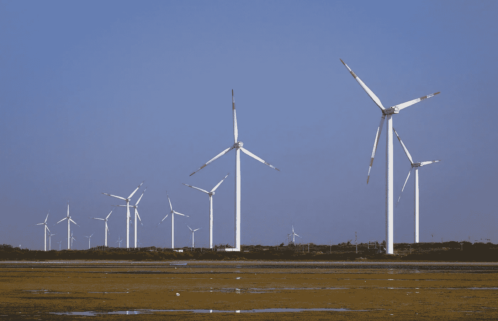
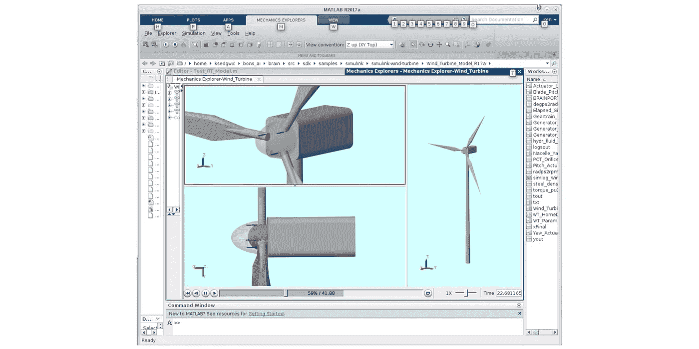
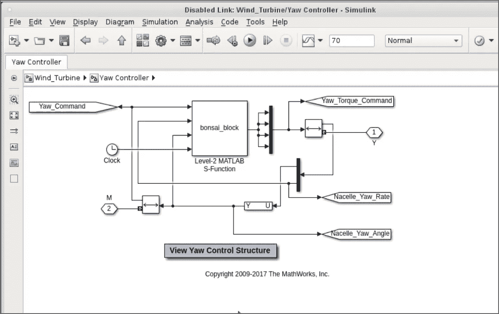
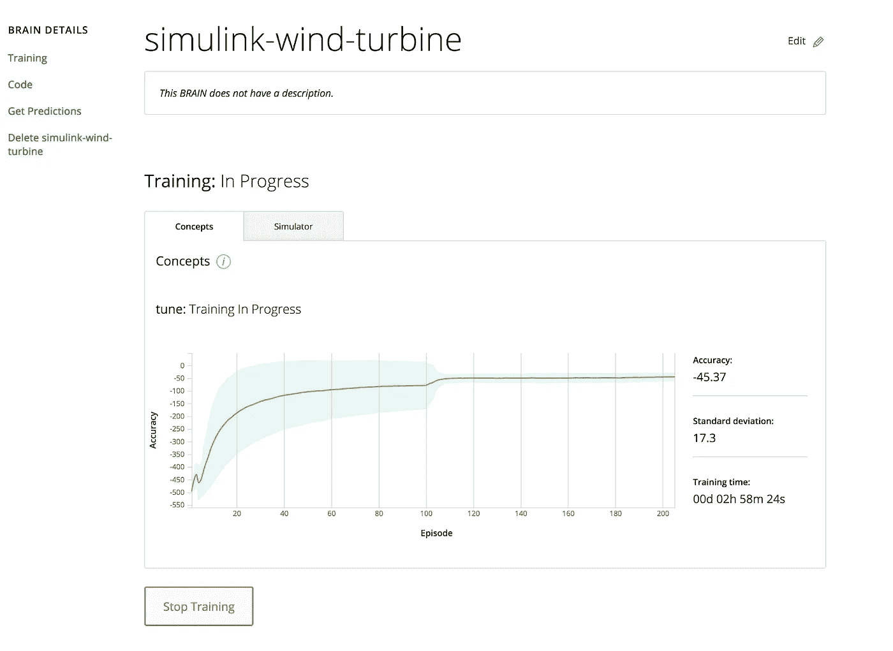

# Bonsai AI:使用 Simulink 进行深度强化学习

> 原文：<https://towardsdatascience.com/bonsai-ai-using-simulink-for-deep-reinforcement-learning-32dc11dfdc5a?source=collection_archive---------2----------------------->

这是我们的模拟和深度强化学习(DRL)系列的第二篇文章。在我们的[第一篇文章](https://bons.ai/blog/simulators-deep-reinforcement-learning)中，我们介绍了模拟作为 DRL 训练环境的好处。现在，我们将重点放在如何使模拟+ DRL 工作。

在下面的例子中，我们将使用 Simulink 模型训练盆景大脑。目标是教会大脑(Bonsai 平台中内置的人工智能模型)如何调整风力涡轮机，并通过保持风力涡轮机以最佳角度转向风来最大化其能量输出。

Simulink 为 DRL 提供了一个很好的培训环境，因为它允许 Bonsai 等第三方从外部集成和控制仿真模型。这种能力是仿真平台使用 Bonsai AI 进行深度强化学习可行的基本要求之一。更多需求可以在[这里](http://docs.bons.ai/guides/simulation-guide.html)找到。

**1:仿真模型**

这个 Simulink 风力涡轮机模型是由 MathWorks 提供的。对于这种情况，它代表了一个简单的控制问题，可以通过应用强化学习来解决。

Matlab/Simulink Wind Turbine model used for training

**2:识别动作和状态**

首先，我们需要在模型中确定一个控制点，这样 Bonsai 就可以接管输入和输出。我们通过在模型中插入一个 Bonsai 块来代替现有的控制块。

*   正如在第一篇文章中所讨论的，Bonsai 控制模拟模型中的动作，并接收状态和回报。在运行模型大量次之后，Bonsai 大脑已经学习了针对模拟所提供的环境的最优策略。
*   在这个例子中，Bonsai 块代替了涡轮机的偏航控制器。
*   控件可能有各种形状和结构。它们可以是输入、旋钮、开关或具有输入和输出的仿真模型中的任何其他控制点。

‍ Bonsai control block inserted in Matlab/Simulink model

**3:使用 Bonsai 通用协调器**连接 Simulink 模型

*   对于 Simulink 模型，Bonsai 开发了一个工具，提供 Bonsai 后端和 Simulink 模型之间的接口。它在训练和预测过程中控制模拟模型和大脑之间的信息流。
*   我们已经在 github 上发布了 [Bonsai 通用连接器以及两个 Simulink 示例来展示它是如何工作的。](https://github.com/BonsaiAI/bonsai-simulink)
*   对于其他模拟器，Bonsai 提供了一个 SDK，允许第三方将其软件和服务连接到 Bonsai 后端。
*   基础模拟器参考及示例:[http://docs.bons.ai/references/library-reference.html](http://docs.bons.ai/references/library-reference.html)[http://docs . bons . ai/examples . html # basic-Simulator-find-the-center](http://docs.bons.ai/examples.html#basic-simulator-find-the-center)
    http://docs.bons.ai/guides/simulation-guide.html

**4:暗示**

*   一旦模型被连接，用户需要使用 Bonsai 的专用编程语言[描述它的状态和动作。这可以使用 Bonsai web 界面或 CLI 来完成。](http://docs.bons.ai/guides/inkling-guide.html)

Bonsai Web Interface showing Inkling code describing State and Action and curriculum

**5:培训**

*   现在，您可以开始训练模型并监控训练图。
*   ‍During 训练，用户可能需要修改奖励函数，以优化学习时间和结果。关于编写奖励函数的一个很棒的资源可以在这里找到:[盆景训练视频](https://www.youtube.com/watch?v=0R3PnJEisqk)。
*   了解更多关于[训练图表](http://docs.bons.ai/guides/web-graphs-guide.html)的信息。

Bonsai BRAIN details showing training graph and status

**6:预测**

一旦训练完成，你可以使用经过训练的盆景大脑来获得预测。

*   将 Bonsai 大脑连接到您的模拟模型，并检查预测的质量。

Simulator view of Yaw Angle based on Bonsai BRAIN predictions

**结论**

模拟器是强化学习的重要工具。企业可以使用反映真实世界业务流程或物理现实的模拟模型，并通过 Bonsai 的强化学习技术对其进行优化。通常，不需要对模拟模型进行任何更改。如果你错过了我们关于模拟如何用于训练的第一篇文章，请在我们的[博客](https://bons.ai/blog/simulators-deep-reinforcement-learning)上找到它。

**入门**

Bonsai 可以帮助您应用深度强化学习技术，并使用 Simulink 作为培训环境，将智能控制构建到您自己的工业系统中。如果你正在使用 Simulink，并且你想尝试 Bonsai AI，请加入我们的测试程序，从这里开始。