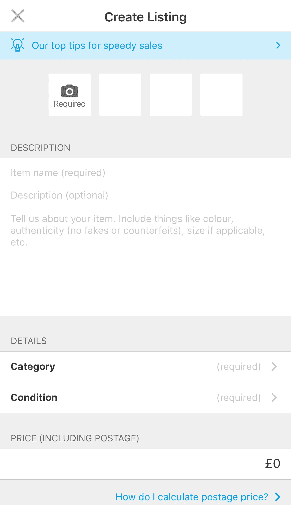
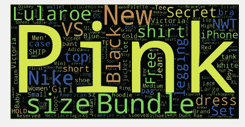

# 数据科学训练营:自然语言处理

> 原文：<https://towardsdatascience.com/bootcamping-in-data-science-natural-language-processing-bb5c8793f7f8?source=collection_archive---------4----------------------->

一个像世界著名的索菲亚这样的机器人对你说话的想法会让你兴奋还是害怕？尽管是通过一个应用程序，去度假并能够与当地人[交流的想法是否让你的假期听起来更放松？如何监测当前总统川普臭名昭著的](http://itranslatevoice.com)[推特，以实时衡量他的情绪](https://dev.to/rodolfoferro/sentiment-analysis-on-trumpss-tweets-using-python-)？或者更好的是，如果总统表现出老年痴呆症的迹象？

所有这些都包含了自然语言处理领域的思想。我喜欢把 NLP 想象成教计算机如何说话。语言当然有细微差别，但是量化文本是理解它的一种方法，是计算机的第一种方法。在这篇博文中，我将在我从 Kaggle 的网站创建的 [Mercari 价格预测器的背景下解释 NLP 背后的基本概念。这些绝对是迈向一个非常复杂和令人兴奋的领域的第一步！](https://www.kaggle.com/c/mercari-price-suggestion-challenge)

What it looks like when you create a listing to sell on the Mercari app

Mercari 是一款针对二手买家和卖家的应用。任何人都可以列出要出售的商品，任何人都可以浏览和购买。Kaggle 集合中的数据有一些数字和分类数据，您可以在我的上一篇博客文章中探索这些数据，但是大部分数据是文本。在发布列表之前，有些字段是必需的，如左侧所示。项目名称是列表的一种标题，并且是创建它的唯一强制字段。您可以选择在 description 下进入更多细节。

项目名称的示例如下:

' 24K 镀金玫瑰'

描述字段类似于:

“配有真品证书”

在计算机编程中，数据可以采取许多不同的形式。可以有整数、时间戳、浮点数(或浮点，数学上倾向的小数)、布尔值(真或假)，还有一种数据类型叫做字符串，通常由文本组成。在 python 中，它用引号表示，因此“cat”被识别为字符串数据类型。“我有 5 只猫，但我可以收养更多”也是一个字符串，尽管其中有数字和空格。“Cat”也是字符串“C”+“a”+“t”的加法。

‘How many cats is too many cats?’ is another example of a string.

因为我们试图预测价格，所以我们希望以一种有助于我们理解我们应该得到什么样的数字的方式来使用文本。例如，如果名称中包含“新”这个词，那么价格会高一点是有道理的。也许描述中的“真品证书”也会抬高价格。“打底裤”显然比“珠宝”卖得少。我们可以给这些词加上一个权重，这样当它们一起出现时，比如“有真品证书的珠宝”比“新打底裤”卖得更高。

起点是单词包，只有单词本身被创造成我们所说的记号。该字符串被分解成多个部分，因此“I”、“have”、“5”、“cats”、“but”、“could”、“adopt”、“more”都是标记。通过设置 stopwords = 'english '可以排除像' the '、' a '、' and '等常见单词(这里有一个[链接](https://martinapugliese.github.io/english-stopwords/)介绍不同 python 库中包含和不包含的内容)。请注意，语法、顺序、标点符号，任何可以给单词更多上下文的东西在这个例子中都被丢弃了。“看”既可以是一个词，也可以是一个名词，但单词包并没有考虑到这一点。它只是计算发生的次数。这在单词云中表现得最好，单词越大，它的数量就越多！

Item name text in a wordcloud — Pink is huge

对某些目的来说，比如搜索引擎，计算字数可能不够好。在这种情况下，你找到正确网站的可能性很大程度上取决于上下文，而不仅仅是其中出现的单词。你可以看出我是一个爱猫女士，因为我已经在这篇文章中用了 4 次“猫”的复数形式，但这篇文章最终不是关于猫的(现在是 5，跟上！).我们可以用 tf-idf(词频-逆文档频率)对一篇文章中的词进行评分。术语“频率”仍像以前一样是一个计数，但这次我们用 idf 来衡量该术语，IDF 定义为:

其中 t 表示术语，D 表示全部文档(也称为语料库)，N 表示数量。通过这种方式，语料库中的常用词将被扣分——如果我们的语料库中有 10 个句子，每个句子都包含单词“cat”(不是复数，仍然是 5，计算机是那样迂腐的)，那么 idf 术语将被删除。

一个句子中字母或单词的组合呢？“全新”唤起了与“新品牌”不同的东西。这些配对被称为 [n-grams](https://en.wikipedia.org/wiki/N-gram) ，“gram”源自希腊语γράμμα，意为“字母”。当 n-gram 出现在句子中时，它可以被分解成单个的字母或词组。让我们把我的疯猫女士的句子分解成两个二元模型(n = 2):

> 我有
> 
> 有 5 个
> 
> 5 只猫
> 
> 猫但是
> 
> 但是可以吗
> 
> 可以领养
> 
> 多领养

在我们简单的句子中，我们有 7 个二元模型。单词的配对会告诉我们更多短语的上下文。只是为了实践，三元模型或 n = 3 看起来像:

> 我有 5 个
> 
> 养 5 只猫
> 
> 5 只猫但是
> 
> 猫，但可以
> 
> 但是可以收养
> 
> 可以收养更多

这只是皮毛，使用简单的计数、称重和配对。我们还可以考虑标点符号(参见[切分](https://s3.amazonaws.com/tm-town-nlp-resources/ch2.pdf))、词性(参见[词性标注](https://nlp.stanford.edu/software/tagger.shtml))、词干(例如 scientist 和 science 都可以简化为 science)，或者它们的某种组合(参见[词条满足](https://en.wikipedia.org/wiki/Lemmatisation))。我们只谈过英语！出于价格预测的目的，我们将重点关注我上面提到的概念。在下一篇博文中请记住这些，我将解释它们是如何在我们的建模中使用的。敬请期待！