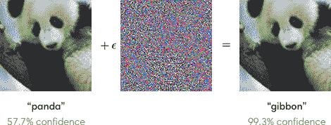
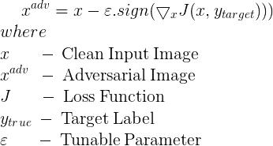
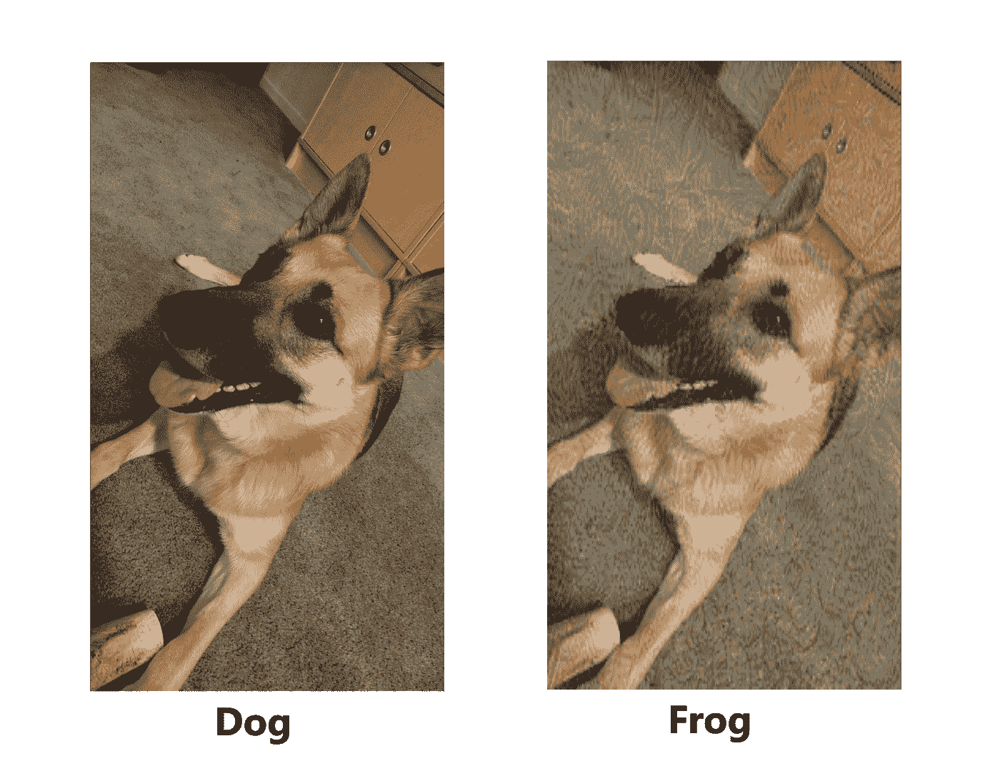

# 用对立的例子打破机器学习

> 原文：<https://towardsdatascience.com/breaking-machine-learning-with-adversarial-examples-a3ddc5c75ea4?source=collection_archive---------20----------------------->

机器学习是人工智能的前沿。随着对计算机视觉、自然语言处理等的应用，ML 对技术的未来有着巨大的影响！然而，随着我们对 ML 依赖的增加，我们对 ML 安全性的担忧也在增加。

我不是在谈论机器人起义，而是更现实的东西——敌对例子的威胁。

# 什么是对立的例子？

简而言之，对立的例子是专门设计来欺骗 ML 模型(例如神经网络)的模型输入。可怕的是，对立的例子与它们在现实生活中的对应部分几乎完全相同——通过向源图像添加少量的“对立噪声”,对立的例子可以与未改变的图像区分开来！

**一只熊猫(右)被误归类为长臂猿的反面例子*

# 那么我们如何产生对立的例子呢？

虽然可以使用许多不同的方法来生成对立的例子，但在本文中，我将重点关注一种叫做**快速梯度符号方法** (FGSM)的方法。此外，为了简单起见，我将介绍如何使用这种方法为图像分类任务生成一个对立的示例。

*FGSM Equation*

让我们花点时间将 FGSM 方程分解成几个步骤。

1.  设置损失函数，使得预期标签 y_target 将是我的模型将我的输入图像错误分类到的标签。
2.  一个输入图像被输入到我的模型中，模型的损失用上面提到的损失函数来计算。
3.  计算我的损失函数相对于我的输入图像的梯度。
4.  为了限制我改变图像的程度，我将把我的渐变的符号(我的渐变中每个值的符号(与输入图像的形状相同))乘以超参数/常数ε(通常是一个很小的数字，以限制图像的改变)。
5.  从我的输入图像中减去上面的表达式——因为损失函数的梯度总是将我指向一个会增加损失的方向，所以我减去来做相反的事情。

然后，FGSM 被重复多次，直到最终生成期望的对立示例。

*Code snippet for the FGSM equation (keras backend)*

使用这种技术，我能够创建一个狗的对立例子，在这里我成功地欺骗了 MobiNet 图像分类器，将我的图像错误地分类为一只青蛙！

*Admittedly, the generative example in this case has more visible differences, but can be improved with additional fine tuning.*

# 对抗性攻击及其影响

虽然我主要关注对立例子对图像分类器的影响，但对立例子可以在许多不同的场景中造成巨大的破坏。以自动驾驶汽车为例。如果停车标志以某种方式(贴纸、油漆等)被修改。)被错误地识别，那么自动驾驶汽车不会停下来——导致严重的后果。

此外，对立的例子在计算机视觉之外工作。如果将它应用于自然语言处理等领域，输入的句子可能会被识别为完全不同的东西(想象一下后果吧！).

简而言之，对抗性攻击对人工智能安全构成了非常现实的威胁。在这个领域一直有持续的研究(例如，生成防御网络、输入转换)，但仍然没有单一的解决方案来对抗对抗性攻击。最终，尽管展望人工智能发展的未来很重要，但我们始终需要意识到它带来的潜在问题。

## 在你离开之前:

1.  鼓掌这个故事！
2.  将此分享给你的网络！
3.  [在 Linkedin 上联系我](https://www.linkedin.com/in/james-l-3b150b134/)！