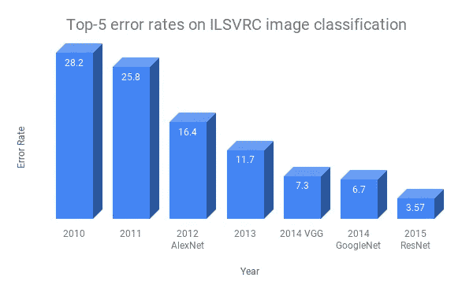
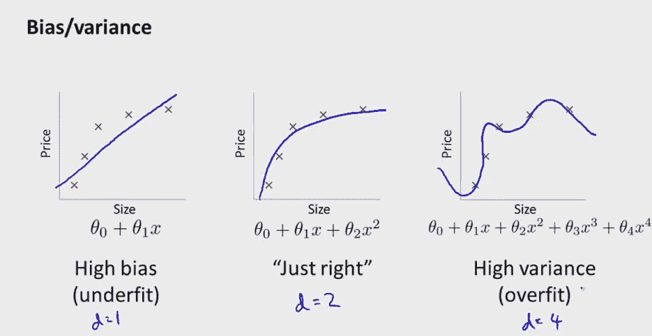
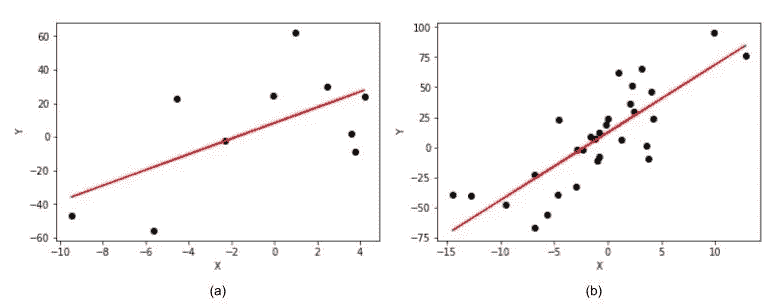
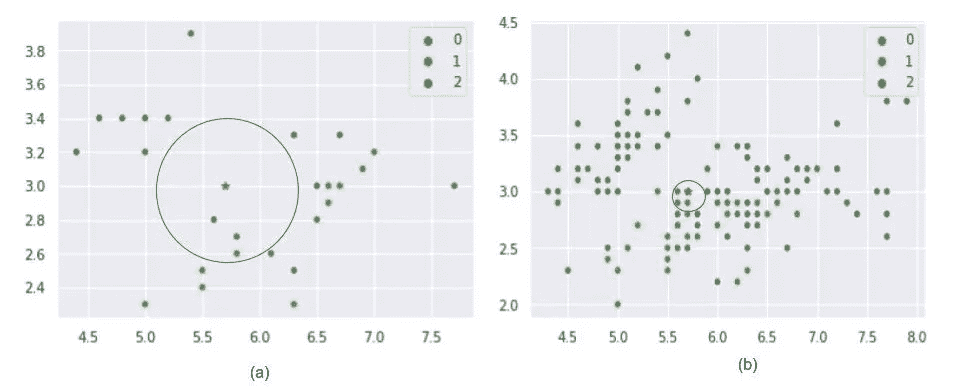
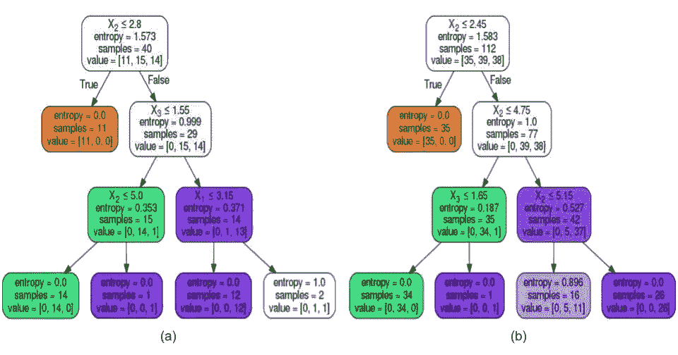

# 打破机器学习中小数据集的魔咒:第 1 部分

> 原文：<https://towardsdatascience.com/breaking-the-curse-of-small-datasets-in-machine-learning-part-1-36f28b0c044d?source=collection_archive---------0----------------------->

## 为什么数据的大小很重要，以及如何处理小数据？

***Source:*** *Movie Scene from Pirates of the Caribbean: The Curse of the Black Pearl*

这是打破机器学习中小数据集的诅咒的第一部分。在这一部分，我将讨论数据集的大小如何影响传统的机器学习算法，以及缓解这些问题的几种方法。 [*在第二部分*](/breaking-the-curse-of-small-data-sets-in-machine-learning-part-2-894aa45277f4) *中，我将讨论深度学习模型性能如何依赖于数据大小，以及如何与更小的数据集合作以获得类似的性能。*

# 介绍

我们都知道机器学习近年来如何彻底改变了我们的世界，并使各种复杂的任务变得更容易执行。最近在实现深度学习技术方面的突破表明，高级算法和复杂架构可以赋予机器类似人类的能力来完成特定任务。但我们也可以观察到，大量的训练数据在使深度学习模型成功方面发挥了关键作用。 [**ResNet**](https://arxiv.org/abs/1512.03385) 是一种流行的图像分类架构，在 ILSVRC 2015 分类竞赛中获得第一名，比之前的技术水平提高了约 50%。

Figure 1: ILSVRC top model performance across years

**ResNet** 不仅拥有非常复杂和深入的架构，而且还在 **1.2 Mn** 图像上进行了训练。*工业界和学术界都公认，对于一个给定的问题，如果数据足够多，不同的算法实际上执行起来是一样的。*需要注意的是，大数据应该包含有意义的信息，而不仅仅是噪音，以便模型可以从中学习。这也是谷歌、脸书、亚马逊、推特、百度等公司在人工智能研究和产品开发领域占据主导地位的主要原因之一。尽管与深度学习相比，传统的机器学习需要较少的数据，但大数据以非常相似的方式影响性能。下图清楚地描绘了传统机器学习和深度学习模型的性能如何随着大数据而提高。

Figure 2: Model performance as a function of the amount of data

# ***我们为什么需要机器学习？***

Figure 3: Projectile Motion formula

让我们用一个例子来回答这个问题。假设我们有一个以速度 ***v*** 和一定角度 **θ** 抛出的球，我们希望预测球会落地多远。从高中物理中，我们知道球将遵循抛体运动，我们可以使用图中所示的公式找到范围。上述等式可视为任务的模型/表示，等式中涉及的各项可视为重要特征，即 *v* ，θ和 *g* (重力加速度)。在上面这样的情况下，我们的功能更少，并且我们很好地理解了它们对我们任务的影响。因此，我们能够想出一个好的数学模型。让我们考虑另一种情况，我们想预测 2018 年 12 月 30 日苹果的股价。在这样的任务中，我们对各种因素如何影响股票价格没有充分的了解。在没有真实模型的情况下，我们利用历史股票价格和各种特征，如标准普尔 500 指数、其他股票价格、市场情绪等。用机器学习算法找出潜在的关系。这是一个例子，说明人类很难理解大量特征之间的复杂关系，但机器可以通过探索大量数据轻松捕捉到这种关系。另一个类似的复杂任务是将电子邮件标记为垃圾邮件。作为一个人，我们可能不得不提出许多难以编写和维护的规则和启发。另一方面，机器学习算法可以轻松地获取这些关系，并且可以做得更好，易于维护和扩展。由于我们不必明确制定大量这些规则，但数据有助于我们了解这种关系，机器学习已经彻底改变了不同的领域和行业。

# ***大型数据集如何帮助建立更好的机器学习模型？***

在我们跳到更多数据如何提高模型性能之前，我们需要理解**偏差**和**方差**。

**偏差:**让我们考虑一个因变量和自变量之间存在二次关系的数据集。但是，我们不知道真实的关系，近似为线性。在这种情况下，我们将观察到我们的预测和实际观测数据之间的显著差异。观察值和预测值之间的差异称为**偏差**。这种模型据说功率较小，代表不适合。

**方差:**在同一个例子中，如果我们将关系近似为三次或任何更高次幂，我们就有了高方差的情况。方差被定义为训练集和测试集的性能差异。高方差的主要问题是模型非常适合训练数据，但它不能很好地概括训练数据集之外的数据。这是验证和测试集在模型构建过程中非常重要的主要原因之一。

Figure 4: Bias vs Variance ([Source](https://www.coursera.org/learn/machine-learning))

> 我们通常希望最小化偏差和方差，即建立一个模型，它不仅能很好地拟合训练数据，还能很好地概括测试/验证数据。有很多技术可以实现这一点，但用更多数据进行训练是实现这一点的最佳方式之一。让我们通过下图来理解这一点:

Figure 5: Large data results in better generalization([Source](https://www.microsoft.com/en-us/research/people/cmbishop/?from=http%3A%2F%2Fresearch.microsoft.com%2Fen-us%2Fum%2Fpeople%2Fcmbishop%2Fprml%2Fwebfigs.htm))

假设我们有一个类似正弦波的数据分布。*图(5a)* 描绘了多个模型在拟合数据点方面同样出色。这些模型中有很多过度拟合，不能很好地概括整个数据集。随着我们增加数据，*图(5b)* 说明了符合数据的模型数量的减少。随着我们进一步增加数据点的数量，我们成功地捕捉到了数据的真实分布，如图*图(5c)* 所示。这个例子帮助我们清楚地理解更多的数据如何帮助模型揭示真实的关系。接下来，我们将尝试理解一些机器学习算法的这种现象，并弄清楚模型参数如何受到数据大小的影响。

***(一)线性回归:*** 在线性回归中，我们假设预测变量(特征)和因变量(目标)之间存在线性关系，关系式为:

其中 ***y*** 为因变量， ***x(i)的*** 为自变量。***β(I)***为真实系数，ϵ为模型未解释的误差。对于单变量情况，基于观察数据的估计系数由下式给出:

上述等式给出了斜率和截距项的点估计值，但这些估计值总是存在一些不确定性，这些不确定性可以通过方差等式量化:

因此，随着数据点数量的增加，分母值会变大，从而降低我们点估计的方差。因此，我们的模型对潜在的关系变得更有信心，并给出稳健的系数估计。借助下面的代码，我们可以看到上面的现象:

Fig 6: Improvement in point estimates with more data in Linear regression

我们模拟了一个线性回归模型，斜率(b)=5，截距(a)=10。当我们用较少的数据*图 6(a)* 和较多的数据*图 6(b)* 建立回归模型时，我们可以清楚地看到斜率和截距之间的差异。在*图 6(a)* 中，我们有一个线性回归模型，斜率为 4.65，截距为 8.2，而图 *6(b)* 中的斜率为 5.1，截距为 10.2，更接近真实值。

***(b)k-最近邻(k-NN):*** k-NN 是一种最简单但非常强大的算法，用于回归和分类。k-NN 不需要任何特定的训练阶段，顾名思义，预测是基于测试点的 k-最近邻进行的。由于 k-NN 是非参数模型，模型性能取决于数据的分布。在下面的例子中，我们正在研究[虹膜数据集](https://en.wikipedia.org/wiki/Iris_flower_data_set)以了解数据点的数量如何影响 k-NN 性能。为了便于可视化，我们只考虑了四个特征中的两个，即萼片长度和萼片宽度。

Fig 7: Change in predicted class in k-NN with data size

让我们从类别 1 中随机选择一个点作为测试数据*(用红星表示)*，并使用 k=3 来使用多数投票预测测试数据的类别。*图 7(a)* 表示数据较少的情况，我们观察到模型将测试点误分类为类别 2。对于较大的数据点，模型会正确地将类别预测为 1。从上面的图中，我们可以注意到 k-NN 受可用数据的影响很大，更多的数据可能有助于使模型更加一致和准确。

***(c)决策树:*** 与线性回归和 k-NN 类似，决策树性能也受到数据量的影响。

Fig 8: Difference in tree splitting due to the size of the data

决策树也是一个非参数模型，它试图最好地拟合数据的底层分布。对特征值执行分割，目的是在子级创建不同的类。由于模型试图最好地拟合可用的训练数据，所以数据的数量直接决定了拆分级别和最终类别。从上图中，我们可以清楚地观察到，分割点和最终类别预测受数据集大小的影响很大。更多的数据有助于找到最佳分割点，避免过度拟合。

# *如何解决数据少的问题？*

Fig 9: Basic implications of fewer data and possible approaches and techniques to solve it

上图试图捕捉处理小数据集时面临的核心问题，以及解决这些问题的可能方法和技术。在这一部分，我们将只关注传统机器学习中使用的技术，其余的将在博客的第二部分讨论。

***a)改变损失函数:*** 对于分类问题，我们经常使用交叉熵损失，很少使用平均绝对误差或均方误差来训练和优化我们的模型。在不平衡数据的情况下，模型变得更偏向于多数类，因为它对最终损失值有更大的影响，我们的模型变得不那么有用。在这种情况下，我们可以为不同类别对应的损失增加权重，以消除这种数据偏差。例如，如果我们有两个数据比率为 4:1 的类，我们可以将比率为 1:4 的权重应用于损失函数计算，以使数据平衡。这种技术可以帮助我们轻松缓解不平衡数据的问题，并提高不同类之间的模型泛化能力。我们可以很容易地找到 R 和 Python 中的库，它们有助于在损失计算和优化过程中为类分配权重。Scikit-learn 有一个方便的实用函数，可以根据课程频率计算权重:

我们可以通过使用 **class_weight=`balanced`** 来避免上述计算，它执行相同的计算来找到 class_weights。我们还可以根据自己的需求提供显式的类权重。更多详情请参考 [Scikit-learn 的](https://scikit-learn.org/stable/documentation.html)文档

***b)异常/变化检测:*** 在欺诈或机器故障等高度不平衡数据集的情况下，是否可以将此类例子视为异常值得深思。如果给定的问题满足异常的标准，我们可以使用模型如 [OneClassSVM](https://scikit-learn.org/stable/modules/generated/sklearn.svm.OneClassSVM.html) 、[聚类方法](https://anomaly.io/anomaly-detection-clustering/)或[高斯异常检测](https://www.coursera.org/lecture/machine-learning/anomaly-detection-using-the-multivariate-gaussian-distribution-DnNr9)方法。这些技术要求我们转变思维，将次要类视为离群类，这可能有助于我们找到新的分离和分类方法。变化检测类似于异常检测，只是我们寻找的是变化或差异，而不是异常。这些可能是通过使用模式或银行交易观察到的用户行为的变化。请参考以下[文档](https://scikit-learn.org/stable/modules/outlier_detection.html)以了解如何使用 Scikit-Learn 实现异常检测。

Fig 10: Over and Undersampling depiction ([Source](http://www.svds.com/wp-content/uploads/2016/08/ImbalancedClasses_fig5.jpg))

***c)上采样或下采样:*** 由于与少数类相比，不平衡的数据固有地以不同的权重惩罚多数类，所以该问题的一个解决方案是使数据平衡。这可以通过增加少数类的频率或通过随机或聚类抽样技术减少多数类的频率来实现。过采样与欠采样以及随机与聚类的选择取决于业务环境和数据大小。通常，当整体数据量很小时，首选上采样，而当数据量很大时，下采样很有用。同样，随机抽样与整群抽样取决于数据分布的好坏。详细了解请参考下面的[博客](https://www.analyticsvidhya.com/blog/2017/03/imbalanced-classification-problem/)。借助如下所示的[**imb learn**](https://imbalanced-learn.org/en/stable/generated/imblearn.under_sampling.RandomUnderSampler.html)**包，可以轻松完成重采样:**

*****d)生成合成数据:*** 虽然上采样或下采样有助于使数据平衡，但重复数据会增加过拟合的机会。解决这个问题的另一种方法是在少数类数据的帮助下生成合成数据。合成少数过采样技术(SMOTE)和改进的 SMOTE 是产生合成数据的两种这样的技术。简而言之，SMOTE 获取少数类数据点，并创建位于由直线连接的任意两个最近数据点之间的新数据点。为了做到这一点，该算法计算特征空间中两个数据点之间的距离，将该距离乘以 0 到 1 之间的随机数，并将新数据点放置在距离用于距离计算的数据点之一的这个新距离处。请注意，考虑用于数据生成的最近邻的数量也是一个超参数，可以根据需要进行更改。**

****

**Fig 11: SMOTE in action with k=3 ([Source](https://www.sciencedirect.com/science/article/pii/S0020025517310083))**

**M-SMOTE 是 SMOTE 的修改版本，它也考虑了少数类的基本分布。该算法将少数类样本分为 3 个不同的组——安全/安全样本、边界样本和潜在噪声样本。这是通过计算少数类样本和训练数据样本之间的距离来完成的。与 SMOTE 不同，该算法从安全样本的 k 个最近邻中随机选择一个数据点，从边界样本中选择最近邻，并且对潜在噪声不做任何事情。如需详细了解，请参考[博客](http://rikunert.com/SMOTE_explained)。**

*****e)集成技术:*** 聚合多个弱学习者/不同模型的思想在处理不平衡数据集时表现出了很好的效果。装袋和增压技术在各种问题上都取得了很好的效果，应该与上面讨论的方法一起探索，以获得更好的结果。为了限制这篇博客的篇幅，我将不讨论这些技术，但是要详细了解各种集成技术以及如何将它们用于不平衡数据，请参考下面的[博客](https://www.analyticsvidhya.com/blog/2017/03/imbalanced-classification-problem/)。**

# ****结论:****

**在这一部分中，我们看到数据的大小可能表现出与泛化、数据不平衡和难以达到全局最优有关的问题。我们已经介绍了一些最常用的技术来解决传统机器学习算法的这些问题。根据手头的业务问题，上述一种或多种技术可能是一个很好的起点。为了保持博客简短，我没有详细介绍这些技术，但是网上有很多很好的资源详细介绍了上述技术。[在第 2 部分](/breaking-the-curse-of-small-data-sets-in-machine-learning-part-2-894aa45277f4)中，我们将讨论小数据集如何阻碍深度学习模型中的学习过程，以及克服这一点的各种方法。**

****关于我:**研究生，旧金山大学数据科学硕士**

****LinkedIn:**[https://www . LinkedIn . com/in/jyoti-pra kash-maheswari-940 ab 766/](https://www.linkedin.com/in/jyoti-prakash-maheswari-940ab766/)
**GitHub:**[https://github.com/jyotipmahes](https://github.com/jyotipmahes)**

## **参考**

1.  **[如何处理机器学习中的不平衡分类问题？](https://www.analyticsvidhya.com/blog/2017/03/imbalanced-classification-problem/)**
2.  **[如何处理“小”数据？](https://medium.com/rants-on-machine-learning/what-to-do-with-small-data-d253254d1a89)**
3.  **[如何处理机器学习中的不平衡类](https://elitedatascience.com/imbalanced-classes)**
4.  **[小数据&深度学习(AI)——一个数据约简框架](https://medium.com/datadriveninvestor/small-data-deep-learning-ai-a-data-reduction-framework-9772c7273992)**
5.  **[基于 DTE-SBD 的非均衡企业信用评估:基于 SMOTE 和 bagging 的差别采样率决策树集成](https://www.sciencedirect.com/science/article/pii/S0020025517310083)**