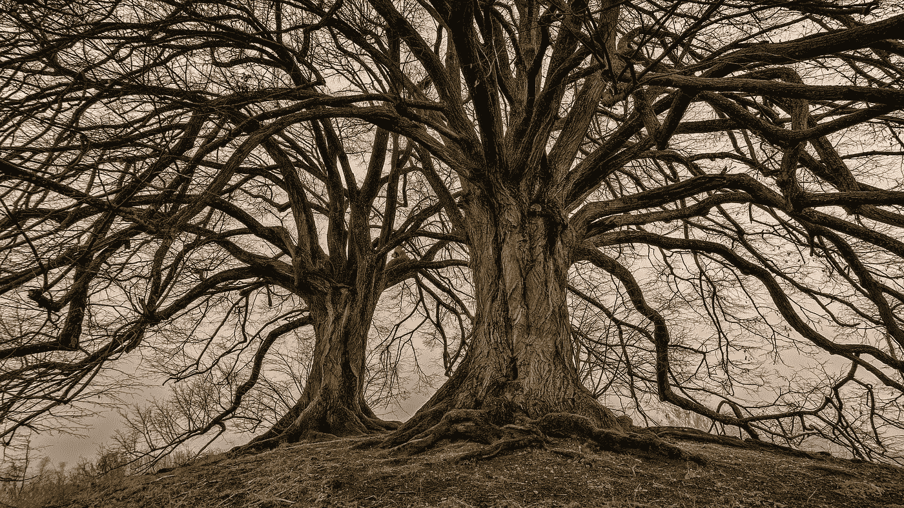
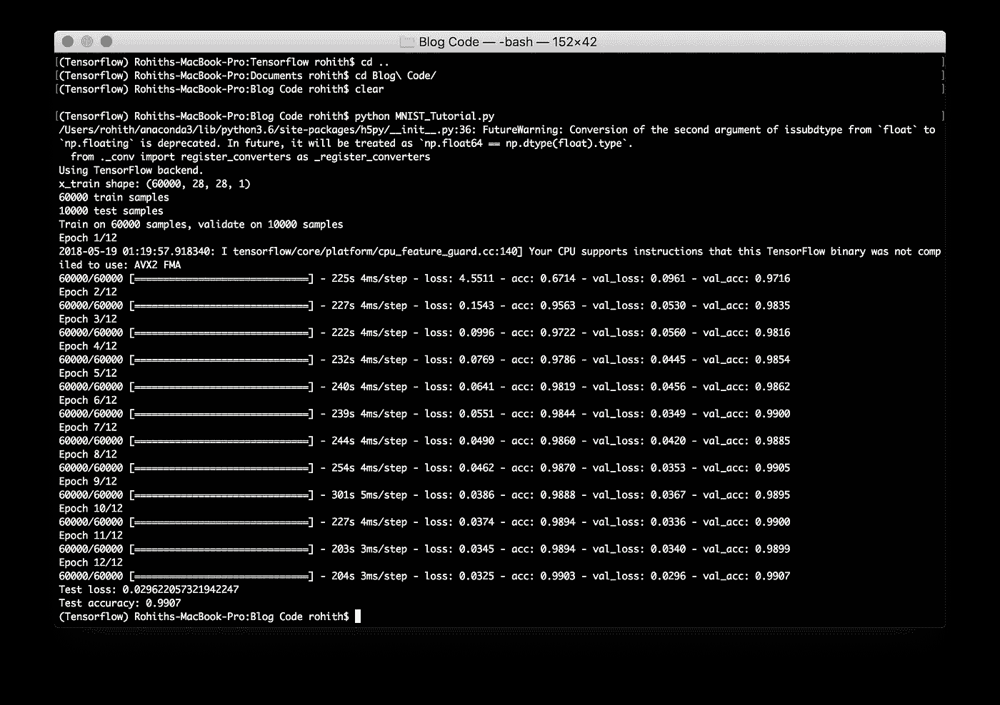

# 在 5 分钟内建立自己的卷积神经网络

> 原文：<https://towardsdatascience.com/build-your-own-convolution-neural-network-in-5-mins-4217c2cf964f?source=collection_archive---------0----------------------->

## CNN 和代码介绍(Keras)



## 什么是卷积神经网络？？


CNN

在回答什么是卷积神经网络之前，我相信你们都知道什么是神经网络。如果你基础不扎实，看看这个[链接](https://hackernoon.com/neural-networks-introduction-6048f69b68b0)。继续前进。卷积神经网络类似于多层感知器网络。主要的区别是网络学习什么，它们是如何构造的，以及它们主要用于什么目的。卷积神经网络也受到生物过程的启发，它们的结构类似于动物的视觉皮层。CNN 广泛应用于计算机视觉领域，并在各种测试案例中取得了很好的效果。

## 隐藏层学到了什么？？

CNN 中的隐藏层通常是卷积和汇集(缩减采样)层。在每个卷积层中，我们采用一个小尺寸的滤波器，并在图像中移动该滤波器，执行卷积运算。卷积运算只不过是滤波器值和图像中的像素之间的逐元素矩阵乘法，并将结果值相加。

Convolution operations

滤波器的值通过训练的迭代过程来调整，并且在神经网络已经训练了一定数量的时期之后，这些滤波器开始寻找图像中的各种特征。以使用卷积神经网络的面部检测为例。网络的早期层寻找简单的特征，例如不同方向的边等。随着我们在网络中的进展，这些层开始检测更复杂的特征，当你观察最终层检测到的特征时，它们几乎看起来像一张脸。


Different features recognised at different layers

现在，让我们继续池层。共用图层用于对图像进行缩减像素采样。图像将包含许多像素值，并且如果图像尺寸逐渐减小，网络通常很容易学习这些特征。池层有助于减少所需的参数数量，因此，这减少了所需的计算。合用也有助于避免过度拟合。有两种类型的池操作可以完成:

*   最大池化—选择最大值
*   平均池-将所有值相加，然后除以值的总数

很少使用平均池，您可以在大多数示例中找到最大池。


Max Pooling

## 密码

在我们开始编码之前，我想让你知道我们将使用的数据集是 [MNIST 数字数据集](http://yann.lecun.com/exdb/mnist/)，我们将使用 Keras 库和 Tensorflow 后端来构建模型。好了，够了。让我们做一些编码。

首先，让我们做一些必要的进口。keras 库帮助我们建立我们的卷积神经网络。我们通过 keras 下载 mnist 数据集。我们导入了一个顺序模型，这是一个预先构建的 keras 模型，您可以在其中添加层。我们导入卷积和池层。我们还导入密集层，因为它们用于预测标签。下降层减少过度拟合，展平层将三维向量扩展为一维向量。最后，我们为矩阵运算引入 numpy。

上面代码中的大部分语句都很琐碎，我只解释几行代码。我们重塑 x_train 和 x_test，因为我们的 CNN 只接受四维向量。值 60000 表示训练数据中的图像数量，28 表示图像大小，1 表示通道数量。如果图像是灰度图像，通道数设置为 1；如果图像是 RGB 格式，通道数设置为 3。我们还将目标值转换成二进制类矩阵。要知道二进制类矩阵是什么样子，请看下面的例子。

```
Y = 2 # the value 2 represents that the image has digit 2 Y = [0,0,1,0,0,0,0,0,0,0] # The 2nd position in the vector is made 1# Here, the class value is converted into a binary class matrix
```

我们构建了一个顺序模型，并添加了卷积层和最大池层。我们还在两者之间添加了 dropout 层，dropout 随机关闭网络中的一些神经元，迫使数据找到新的路径。因此，这减少了过度拟合。我们在末尾添加了密集层，用于类别预测(0–9)。

我们现在用分类交叉熵损失函数、Adadelta 优化器和准确性度量来编译该模型。然后，我们将数据集拟合到模型中，即我们针对 12 个时期训练模型。训练好模型后，我们在测试数据上评估模型的损耗和精度，并打印出来。

## 输出



## 结论

卷积神经网络确实有一些由杰弗里·辛顿指出的缺点。他认为，如果我们希望在计算机视觉领域达到人类水平的精确度，他的[胶囊网络](https://arxiv.org/pdf/1710.09829.pdf)是必由之路。但是，到目前为止，CNN 似乎做得很好。如果你觉得这篇文章有用，请告诉我，谢谢:)