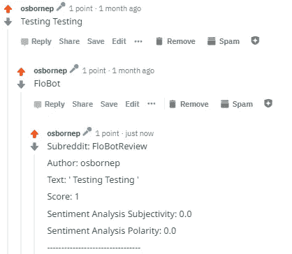
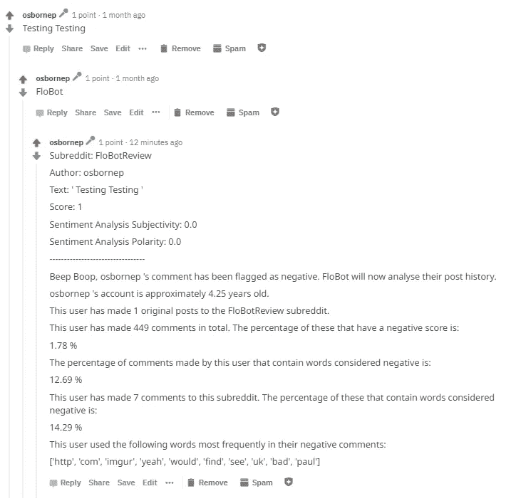

# 使用自然语言处理构建一个机器人来应对 Reddit 上的负面评论

> 原文：<https://towardsdatascience.com/building-a-bot-to-counter-negative-comments-on-reddit-using-natural-language-processing-83177e5c8d32?source=collection_archive---------7----------------------->


Reddit 是一个分享一切的神奇网站，它的口号是“互联网的首页”。它甚至在最近取代脸书成为美国第三大最受欢迎的网站。与其他社交媒体网站相比，Reddit 的独特之处在于用户可以匿名发帖。这种匿名性是 Reddit 如此受欢迎的部分原因，但正如任何好事一样，它也有一些负面影响。

几乎没有任何后果的发帖能力意味着几乎在任何提交的文章中都会有负面评论。虽然这些通常是建设性的批评，但少量的可能是全面的，令人讨厌的，总体上对讨论没有建设性。幸运的是，这些通常会很快被其他用户突出显示并否决，如果不够不受欢迎，可能会被隐藏。然而，那些向更小的子群(Reddit 上的子群)提交原创内容的人可能会受到这些负面评论的影响。这是我在一些小的子网站上发帖并收到如下评论后的亲身经历:


发布关于你自己的内容，尤其是图片，可能需要很多努力和信心，这样的评论让人很难继续投稿。不幸的是，我们的思维会自然地关注负面而不是正面的评论。

**每当这种情况发生，我的第一个问题总是‘你凭什么判断？’。**你是对这个子话题有所贡献并有权利不屑一顾的人吗？还是你只是路过，只是从对别人的刻薄中得到乐趣？

然而，我还没有脸皮薄到相信负面评论，不管它们是怎么写的，本质上都是不好的。任何提交到 subreddit 的人都需要了解他们在向谁发帖，以及这是否相关，接受建设性的批评只是这个过程的一部分。例如，在贴出我童年服装的拼贴画后，我收到了下面的回复。现在，这是否仅仅是一个个人观点还可以讨论，但是我承认我的观点可能不适合这个子主题，并且从这个话题中学到了很多。


# **目标**

我想创建一个 Python 机器人，当它被使用时，它可以对用户的判断做出反应，当被调用时，它可以消除负面评论不公平恶意的情况。

基于在 Reddit 上的观察逻辑，如果有人发表了我认为没有建设性的负面评论，我愿意回答如下:

1.用户的账号有多老？(也就是说，他们是否躲在一个新账户后面，不会因为被否决而承担任何后果？)

2.这个用户向 subreddit 提交了多少次他们自己的帖子？

3.用户整体评价中负面的比例是多少？

4.用户对这个子编辑的评论有多大比例是负面的？

如果我能确定这些，那么我希望要么将用户归类为某个似乎在网站上持续负面的人，要么，也许这是不寻常的，他们只是过了糟糕的一天。

# **设置机器人**

为了构建这个机器人，我遵循了 pythonforengineers.com 的[T3](http://pythonforengineers.com/build-a-reddit-bot-part-1/)编写的指南，该指南使用 Python 包 Praw 从 Reddit 的 API 中提取信息。

按照这个指南，第一步是让机器人找到负面的评论。出于前面提到的原因，用户会在使用特定文本短语时专门调用该机器人。为了做到这一点，我将机器人命名为“FloBot ”,如果用户在这里留下评论，机器人就会找到评论并开始分析父评论。下面显示了一个测试示例:



为了测试，我创建了 subreddit[/r/flobot review](https://www.reddit.com/r/FloBotReview/)，其中显示了一个[测试帖子](https://www.reddit.com/r/FloBotReview/comments/8ddoq0/test/)，演示了机器人给出的响应。机器人将检查对该子编辑的每个评论，如果任何评论包含“FloBot ”,它将选取该评论，然后查看该评论所响应的评论:

```
for comment_tracker in subreddit.stream.comments(): if re.search("FloBot", comment_tracker.body, re.IGNORECASE): comment = comment_tracker.parent()
```

然后，我们可以浏览并找出一些关于评论的基本信息(如上图所示)，如作者、文本(以防后来被删除)和当前分数。

```
print("Subreddit: ", comment.subreddit)print("Author: ", comment.author)print("Text: '", comment.body,"'")print("Score: ", comment.score)
```

# **自然语言处理**

这个过程的一部分是使用一些自然语言处理来确定被提问的用户写的评论是积极的还是消极的。为此，我使用了 Python 包 [TextBlob](http://textblob.readthedocs.io/en/dev/) ，它现在允许我们非常容易地分析文本的质量。我们使用这个包来确定评论的主观性和极性，如上面的例子所示。极性是我们将用来确定用户历史评论的负面性，并在以后更广泛地使用。

```
print("Sentiment Analysis Subjectivity: ", np.round(TextBlob(comment.body).sentiment.subjectivity,4))print("Sentiment Analysis Polarity: ", np.round(TextBlob(comment.body).sentiment.polarity,4))
```

# **分析用户的历史帖子和评论**

我们现在有了完成分析的基础，我们已经连接了 Reddit 的 API，以:

-找到我们想要反驳的评论

-收集用户的基本信息

-应用一些 NLP 来评估评论文本的负面性。

因为我们已经收集了负面评论作者的名字，所以我们现在可以遍历并收集他们所有的评论，并在 for 循环中计算每个评论的极性。一旦我们对每个评论都有了这些信息，我们就收集这些信息作为 Pandas 数据表，其中包含以下信息:


仅用这张表，我们就可以计算:

-总的评论数量

-负分数评论的百分比

-负面评论的百分比

-发布到此子编辑的评论数量

-发布到此子编辑中的负得分评论的百分比

-发布到此子编辑的具有负极性的评论的百分比

此外，我们可以使用 Python 包 [NLTK](https://www.nltk.org/) 来查找负面评论中最常用的单词。

最后，我们可以为用户的提交重复这个过程，以计算他们在这个子编辑中发布的帖子的数量。一旦我们获得了所有这些信息，我们就可以在一些标准文本中很好地对其进行格式化，以产生以下输出:



看起来我已经做出了相当多的负面评论，但总体来说，只有不到 2%的人投了反对票。看来我的评论 http://链接到 imgur.com 被否决最多。

# **进一步的工作**

我已经在 [Kaggle](https://www.kaggle.com/osbornep/python-bot-to-counter-negative-comments-on-reddit) 上分享了我的机器人的完整代码，它目前不会自动发布，但在我部署它之前，我需要确保以下问题得到解决。

首先，需要评估自然语言处理的质量，如果可能的话，还需要改进。这个第一阶段只是为了演示这个想法，极性测量肯定还有改进的空间。

此外，如果我要考虑部署它，我将需要考虑它可能被用户错误地滥用和调用的可能性。我希望有一个检查系统在这之前自动响应到位，以确保用户不使用它只是欺负其他用户或其他邪恶的原因。

最后，我想在回复中再补充一点，包括一些例句，比如“这个人通常不会在这个帖子里发表负面评论，也许他们今天过得很糟糕。”给我们的机器人增加一点生命力。

我希望你喜欢这个想法，如果你有任何意见或建议，请让我知道。

谢谢

哲学（philosophy 的缩写）