# 用 Dash (plotly)、AWS 和 Heroku 构建仪表板

> 原文：<https://towardsdatascience.com/building-a-dashboard-with-dash-plotly-aws-and-heroku-jean-michel-d-d102e26ac8c1?source=collection_archive---------9----------------------->

**你可以在这个** [**Github 库**](https://github.com/jeanmidevacc/dash_template_dashboard) **中找到这个仪表盘的模板。而你在我的** [**网站**](http://jmdaignan.com/2018/02/26/metricsdash/) **上还有一些其他的代码样本。**

你好，在这篇文章中，我将解释我创建一个显示一些个人信息的仪表板的过程。为了实现这个项目，我决定使用 [Dash](https://github.com/plotly/dash) 一个由 [Plotly](https://plot.ly/) 一家加拿大公司开发的 Python 框架，该公司开发了 Plotly 库来实现交互式数据可视化。

在这篇文章中，我将解释:

*   所涉及的数据
*   这个项目的后端(以及一些自己制作的技巧)
*   仪表板、他的部署和组件

# tha 数据简介

在我们的日常生活中，我们会产生大量的数据，作为一名数据科学家，我喜欢摆弄数据。就我而言，我有一些智能设备，如智能体重秤或智能手环，我每天都在使用，我有一些应用程序来监控我生活的某些方面，如 Strava，在这种情况下，我对以下数据源感兴趣:

*   我来自诺基亚设备的智能秤数据
*   我在 Strava 的跑步训练
*   我的交叉训练

对于前两个数据源，我有一个应用程序来跟踪不同指标的演变

这很好，但是一个服务/设备=一个应用程序，对发生的事情进行快速监控不是很有效。但是，谁说应用程序说潜在的开发者应用编程接口，在这种情况下，有一个(诺基亚和斯特拉发)。

最后一个数据源更像是一个“老派”数据源，因为它只是一个谷歌电子表格，我每周都会用我在 crossfit 会议期间完成的不同练习来填充它。我发现这是一个很好的和有效的方法来跟踪我在盒子上做了什么，并看到进展。有一个 [API](https://developers.google.com/drive/) 为我提供了访问这个数据源的可能性。

所以所有的数据都可以用于我的项目。

现在让我们看看后端的结构，它将为仪表板公开数据。

# 后端描述

对于这个项目，后端托管在 Amazon Web Services 上。有一个项目后端的图解。

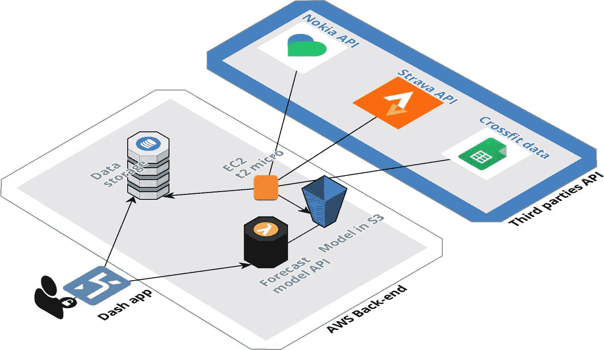

这个后端围绕两个元素构建，一个是用于从不同 API 收集数据的数据管道，另一个是提供预测体重和脂肪比率可能性的 API。

# 构建数据管道

对于数据的收集，管道托管在 Amazon Web Services 中，我有一个 EC2 实例(来自 [AWS 自由层](https://aws.amazon.com/free/)的实例)定期(每 3 小时)收集不同来源推送的新数据。收集的数据被清理并发送到 3 个不同的 DynamoDB 表中。

管道非常简单，对于 DynamoDB 表的配置，我设置了 2 个单位的非常小的写入容量，但是对于读取，我决定使用自动缩放功能，根据流量设置 10 到 50 个单位之间的动态读取容量。

# 部署预测模型

**免责声明:这不是一个超级高效的模型，但至少它存在**

这个模型非常简单，但不是非常有效，我目前有一个体重模型和另一个脂肪比例模型。

这是一个简单的 KNN 模型，在每种情况下，它接受以下输入:

*   距离在一周内跑完
*   时间在一周中流逝
*   交叉健身的次数
*   交叉体能训练中携带的平均重量(带重量)

该模型将预测体重和脂肪比率的每周变化。

该模型将每周更新，并发送一个 S3 桶。为了直接从仪表板访问模型，我创建了一个带有 [Flask](http://flask.pocoo.org/docs/0.12/quickstart/) 的 API，我将它部署在一个带有 [Zappa 包](https://github.com/Miserlou/Zappa)的 Lambda 中，我在 messenger chatbot 上的[文章](http://jmdaignan.com/2017/09/18/How-to-deploy-a-Messenger-bot-in-Python/)中使用了这个包。

没什么特别的，但一切都正常。现在让我们关注项目的数据收集部分，以填充 Dynamodb 表。

# 数据收集

正如我前面说过，有三个 API 连接到我们的后端:

*   诺基亚 API
*   斯特拉发 API
*   Google drive API

让我们看看每个数据源。

# 诺基亚 API

有了这个 API，我从 2017 年 2 月开始收集数据，从 2014 年 7 月开始使用智能手环，从 2014 年 11 月开始使用智能体重秤，我喜欢这些设备，它们的设计很好，应用也很好。我希望所有关于诺基亚的谣言都是错误的。

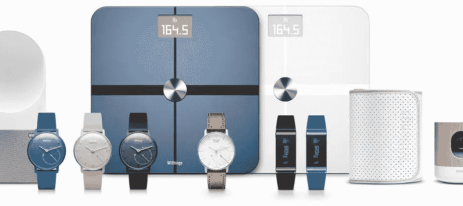

我创建了一个调用带有 GET 请求的 API 的脚本(就长度而言非常长)，老实说，我认为诺基亚的 API 是我迄今为止使用的最具技术性的 API(相比之下，Netatmo 是我最容易使用的 API)，但至少在过去的一年里它一直在工作。

为了这个项目，我试图做一些调整，我打破了一切，所以我决定使用这个 [GitHub 库](https://github.com/orcasgit/python-nokia)来管理与 API 的连接，它工作得很好！！

# 斯特拉发 API

我从 2016 年 9 月开始使用 Strava，之前我是一名 Runkeeper 和 Runstatic guy，但我在 2017 年到达英国时决定转换。

老实说，Strava 的 API 非常容易使用，只需创建一个应用程序获取您的访问令牌，并在 API 文档中发出以下 get 请求

# 交叉拟合数据(Google drive API)

我目前从 2017 年 8 月开始练习 crossfit，正如我之前所说，我在谷歌工作表的电子表格中监控我的训练。

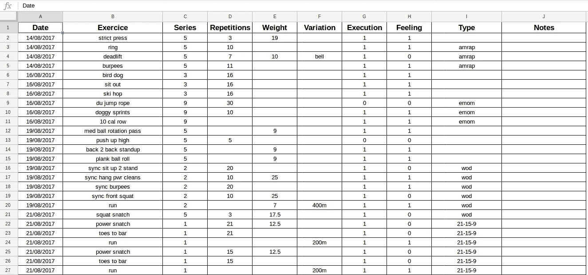

这是一种老式的方法，但我发现它比应用程序收集数据更有效。

我正在使用 Google Drive API 和 Twillio 制作的这个[教程](https://www.twilio.com/blog/2017/02/an-easy-way-to-read-and-write-to-a-google-spreadsheet-in-python.html)来设置一个将收集数据的 python 脚本。另一种方法是使用 [Sheetsu](https://sheetsu.com/) ，因为我有一些谷歌信用，我决定不使用这项服务(我过去曾使用 Alexa 技能，它很棒)。

# 数据存储(DynamoDB 和 Boto3)

收集完所有这些数据后，用 [boto3](https://boto3.readthedocs.io/en/latest/) 连接 DynamoDB 表就非常容易了。

现在我们有了后端的数据，让我们对它进行一些分析。

# 分析学

就像我之前说过的，对于这个数据源，我将把重点放在秤的数据上，参数是体重和[脂肪比率](https://en.wikipedia.org/wiki/Body_fat_percentage)。

下图显示了我过去一年的体重历史数据。

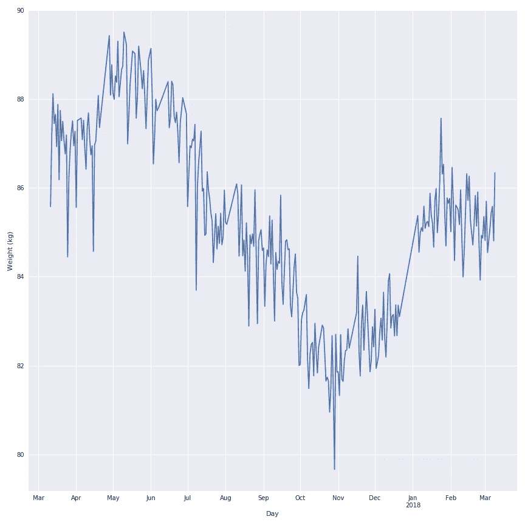

正如您所看到的，在过去一年中，权重的演变中有很多噪声，因此我将对信号应用滚动平均函数，使其看起来更好，并保持行为趋势。

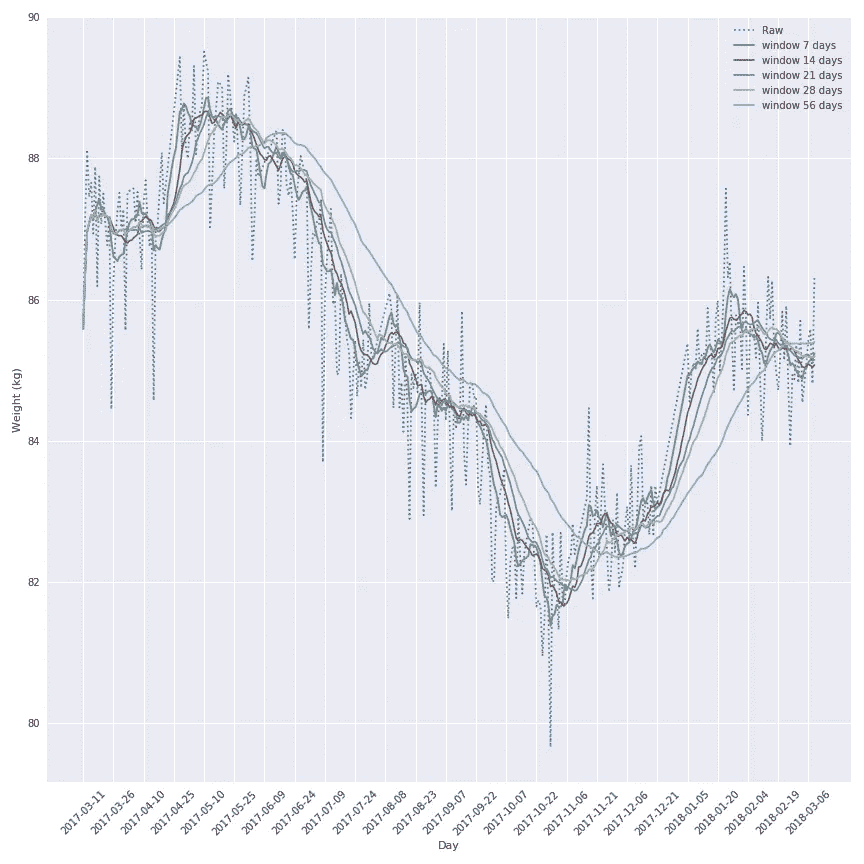

最有趣的窗口似乎是 **7 天窗口**，因为它保留了局部变化，但不受会破坏数据分析的滞后效应的影响。

脂肪率变化的结论是相同的。

要分析的另一个元素可以是指标的每周变化，以说明好的和坏的一周，并可能检测有趣的时期(例如，肌肉或脂肪的增加)

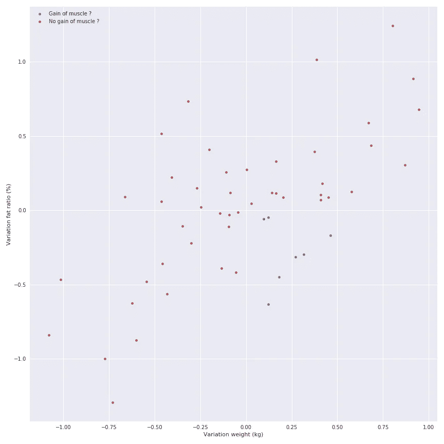

脂肪增加和体重增加之间存在线性关系，但我不想展示它，因为我知道在某些阶段，你可以增加体重，但减少脂肪(增加肌肉)，所以这种关系并不存在。

让我们看看斯特拉发的数据。

# 运行数据

我基本上每周跑步一次，平均不到一小时跑 10 公里左右。

这个数据源的有趣指标是:

*   距离
*   平均速度
*   立面图
*   时间流逝了

一些非常简单的条形图可以显示这些参数的演变。

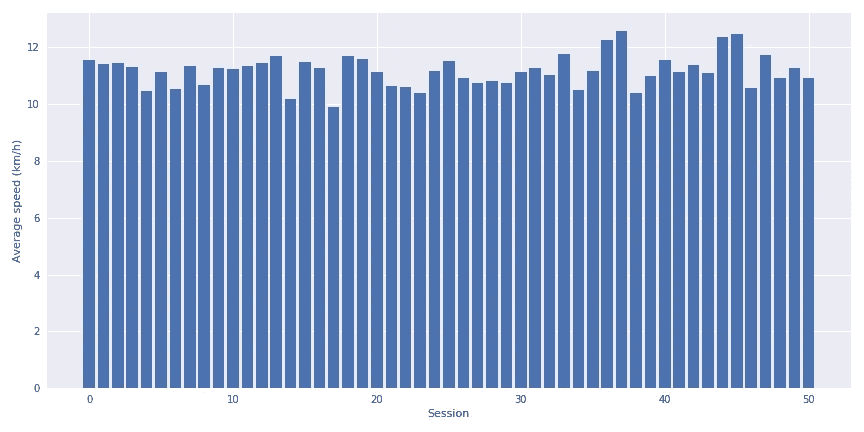

有趣的一点是把距离、平均速度和海拔高度交叉在一起，看最后一个参数对速度的影响。

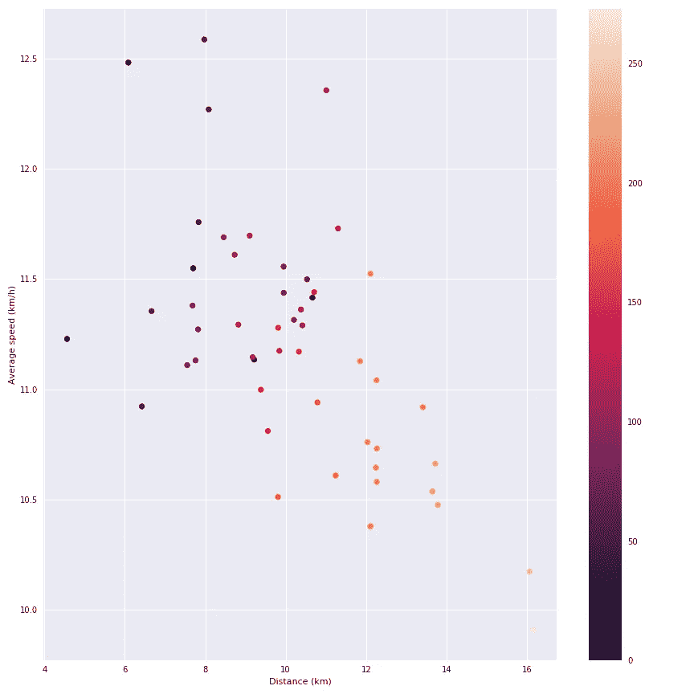

我们可以看到海拔对我平均速度的影响。但是说实话，这个数据源并不令人兴奋(我也在收集跑步会话的细节，比如会话期间的速度等等，但是我目前对这些数据什么也没做)。

我们来看看 crossfit 的数据。

# 交叉拟合数据

我从 2017 年 8 月开始练习 crossfit，每周 3 次，我绝对不是专业人士。下图显示了一次训练中的总重量与重复次数的函数关系。

这个数字很好地说明了 crossfit 中可能发生的各种情况，有些情况下你可以负重很多，但不需要太多的重复，相反，有些情况下你可以重复很多，但不需要太多的重量。

另一个有趣的部分是观察一次锻炼期间体重的变化(是的，我有一点进步)。

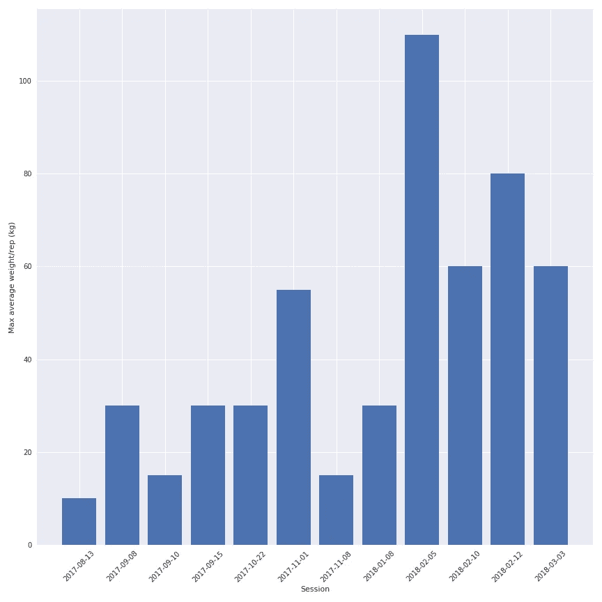

因此，数据的质量取决于我在电子表格中正确书写的动机，但信息量是相当有趣的。

现在是时候创建显示所有这些信息的仪表板了。

# 仪表板的设计

对于这个仪表板，我对应用程序的要求是:

*   易于部署且成本低廉
*   访问仪表板的身份验证流程

我看到人们说“哦，你应该用 R Shiny 来创建你的应用程序，因为..”我会说。

老实说，我不是 R 的忠实粉丝，我知道如何使用它，但当我想做更多与数据分析无关的高级计算时，我发现它非常有限。

而且我想写一篇关于 dash 的文章，那我们就 Dash 吧。

对我来说，仪表板上有以下部分很重要:

*   数据概述(如最后一个值和一些快速统计数据)
*   每个数据源的一个部分
*   我可以使用一点 ML 的预测部分

**我邀请你使用这个** [**Github 库**](https://github.com/jeanmidevacc/dash_template_dashboard) **中的代码和环境来启动。**

# 仪表板演示

在这一节中，我将描述并展示他的最新版本的仪表板(在最后的 css“政变”之前)。

对于应用程序的风格，我使用了以下资源:

# 概述部分

在这一节中，我们的想法是向用户提供一个非常清晰和简单的不同指标的概述，并快速了解它们的演变。

第一部分显示了一些关于体重和脂肪比例的信息。

每个参数都有:

*   最后一次测量(以及他发生的时间)
*   不同时期(自上周、上月和去年以来)的指标演变

我发现这部分信息非常丰富，很容易理解，你可以看到趋势(对我父母来说太完美了)

这一节后面是另一节，包含最后一个运行的会话，更简单。

有一些关于距离、平均速度和海拔的信息，并与之前的比赛进行了比较。

对于本节的其余部分，它是一个包含上次 crossfit 会话练习的表格，因此没有什么真正令人兴奋的，不需要缩放。

# 重量和跑步部分

对于下面的两个部分，基本上是一些非常基本的数字，我从这篇文章中提取了可视化。

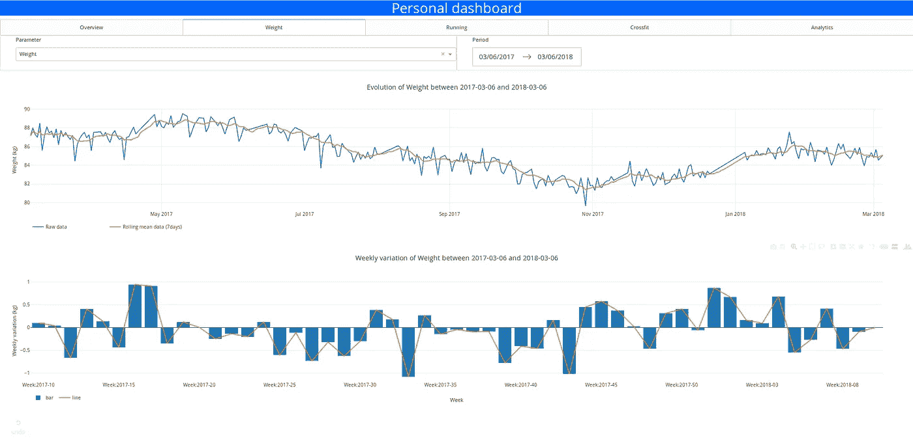

用户可以选择想要用 inputs 元素可视化的时间段和参数。他可以使用下拉面板和日期范围选择器选择参数和数据范围

布局超级简单，但很实用。

# 交叉部分

在这一部分中，我选择交叉前面部分的指标索引和输入选项。

您可以选择练习并获得一些快速统计数据:

*   携带的最大重量
*   重复执行的次数
*   每次重复的平均重量
*   重复次数与重量的关系图

这很简单，但非常有用，当我想快速找到我的 1 rep 最大重量。

# 预测部分

在这个部分中，基本上是控制面板调用包含模型的 API。

用户可以选择预测周期和每周训练设置，并了解预测周期结束时体重和脂肪比率的变化。

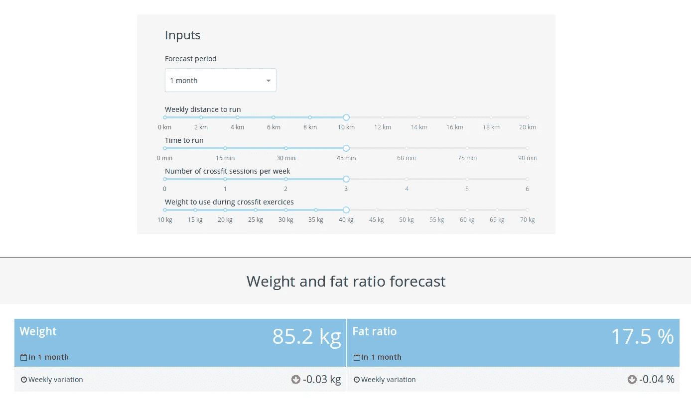

也许不准确，但至少它在这里，它肯定会随着更多的数据变得更好(该模型是在 30 点上训练的)。

# 现场演示

现在是时候更新最终的 css 了，瞧

没有什么疯狂的，但它的功能(可能有点慢)和易于使用。

# 结论和下一步措施

因此，原型运行良好，并部署在 Heroku 上(如果你想访问，可以联系我)。我花了 2 周的时间来做这件事(周末和午休)，所以我对此很满意。

**你可以在**[**Github repo**](https://github.com/jeanmidevacc/dash_template_dashboard)**中找到所有代码(至少是 app 的骨架)。**

接下来的步骤是:

*   尝试用 Flask 和 D3.js 做一个替代
*   添加更多的数据，也许是食物指数
*   实现运行会话细节的可视化([传单](http://leafletjs.com/)可能是一个好的开始)
*   找到一些其他要显示的指标
*   从用户那里得到一些反馈

*原载于 2018 年 2 月 26 日*[*【the-odd-dataguy.com*](http://the-odd-dataguy.com)*。*