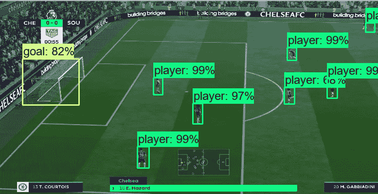
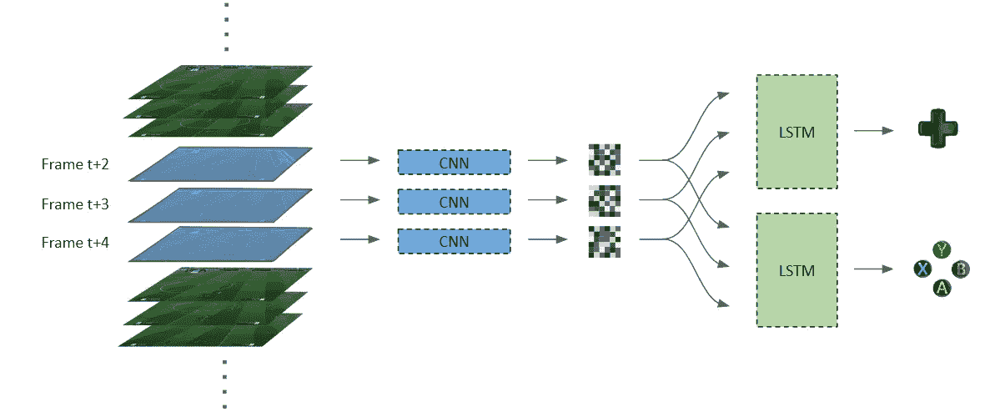
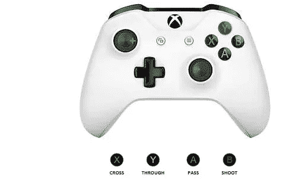

# 构建深度神经网络玩 FIFA 18

> 原文：<https://towardsdatascience.com/building-a-deep-neural-network-to-play-fifa-18-dce54d45e675?source=collection_archive---------1----------------------->

游戏中的人工智能机器人通常是通过手工编写一系列赋予游戏智能的规则来构建的。在很大程度上，这种方法在让机器人模仿人类行为方面做得相当好。然而，对于大多数游戏来说，仍然很容易区分机器人和真人游戏。如果我们想让这些机器人的行为更像人类，不使用手工编码的规则来构建它们会有帮助吗？如果我们简单地让机器人通过观察人类的游戏方式来学习，从而理解游戏，会怎么样？

探索这一点需要一个游戏，在开发游戏本身之前，有可能收集玩游戏的人的这种数据。FIFA 就是这样一款让我探索这一点的游戏。能够玩游戏并记录我在游戏中的行动和决定让我能够训练一个端到端的基于深度学习的机器人，而不必硬编码游戏的单个规则。

*这个项目的代码以及训练好的模型可以在这里找到:*[*【https://github.com/ChintanTrivedi/DeepGamingAI_FIFA.git】*](https://github.com/ChintanTrivedi/DeepGamingAI_FIFA.git)

## 玩游戏的机制

构建这种机器人的底层机制需要在不访问任何游戏内部代码的情况下工作。好消息是，这个机器人的前提是我们不想看到任何这样的游戏内信息。一个简单的游戏窗口截图就可以输入机器人的游戏引擎。它处理这些视觉信息，并输出它想要采取的动作，这些动作通过按键模拟与游戏进行交流。冲洗并重复。

现在，我们已经有了一个框架来为机器人提供输入，并让它的输出控制游戏，我们来到了有趣的部分:学习游戏智能。这通过两个步骤来完成:( 1)使用卷积神经网络来理解屏幕截图图像，以及(2)使用长短期记忆网络来基于对图像的理解来决定适当的动作。

## 步骤 1:训练卷积神经网络(CNN)

众所周知，CNN 能够高精度地检测图像中的对象。除了更快的 GPU 和智能网络架构，我们还有一个可以实时运行的 CNN 模型。

为了让我们的机器人理解输入的图像，我使用了一个非常轻量级和快速的 CNN，叫做 MobileNet。从这个网络中提取的特征地图代表了对图像的高级理解，比如玩家和其他感兴趣的对象在屏幕上的位置。该特征图然后与单镜头多框一起使用，以检测球场上的球员以及球和球门。

## 第二步:训练长短期记忆网络(LSTM)

现在我们已经理解了这个图像，我们可以继续下去，决定我们要做什么。然而，我们不想只看一个画面就采取行动。我们更愿意看看这些图像的一小段序列。这就是 LSTMs 发挥作用的地方，因为众所周知，LSTMs 能够对数据中的时间序列进行建模。在我们的序列中，连续的帧被用作时间步长，并且使用 CNN 模型为每个帧提取特征图。这些然后被同时输入两个 LSTM 网络。

第一个 LSTM 执行学习玩家需要做什么动作的任务。因此，这是一个多类分类模型。第二个 LSTM 得到相同的输入，并且必须决定采取什么动作:传中、穿过、传球和射门:另一个多类分类模型。这两个分类问题的输出然后被转换成按键来控制游戏中的动作。

这些网络已经在通过手动玩游戏并记录输入图像和目标按键而收集的数据上被训练。少数几个收集标签数据不像是一件苦差事的例子之一！

## 评估机器人的性能

除了让它出去玩游戏之外，我不知道用什么精确度来判断机器人的性能。仅仅经过 400 分钟的训练，机器人已经学会了向对手的球门跑去，向前传球，并在探测到球门时射门。在 FIFA 18 的初学者模式中，它已经在大约 6 场比赛中打入 4 球，比保罗·博格巴在截至本文撰写时的 17/18 赛季中的进球多 1 球。

机器人与内置机器人比赛的视频剪辑可以在我的 YouTube 频道上找到，视频嵌入在下面。

## 结论

我对这种构建游戏机器人的方法的最初印象当然是积极的。经过有限的训练，这个机器人已经掌握了游戏的基本规则:向球门移动，然后把球踢进网窝。我相信，通过更多小时的训练数据，它可以获得非常接近人类水平的性能，这对于游戏开发者来说是很容易收集的。此外，扩展模型训练以从真实世界的比赛镜头中学习将使游戏开发者能够使机器人的行为更加自然和真实。现在，如果 EA sports 的任何人正在阅读这篇文章…

我发表了这个项目的后续文章，使用强化学习。在此链接处查看[。谢谢！](/using-deep-q-learning-in-fifa-18-to-perfect-the-art-of-free-kicks-f2e4e979ee66)