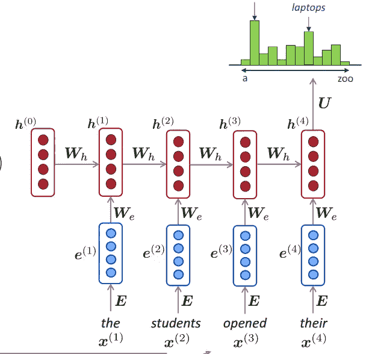

# 在 Tensorflow 中构建下一个单词预测器

> 原文：<https://towardsdatascience.com/building-a-next-word-predictor-in-tensorflow-e7e681d4f03f?source=collection_archive---------2----------------------->

*By*[*Priya DWI vedi*](https://medium.com/u/b040ce924438?source=post_page-----e7e681d4f03f--------------------------------)*，数据科学家@ SpringML*

下一个单词预测或者也称为语言建模是预测下一个单词是什么的任务。它是自然语言处理的基本任务之一，有许多应用。当你写短信或电子邮件时，你可能每天都在使用它而没有意识到这一点。

我最近在 Tensorflow 上建立了一个下一个单词预测器，在这篇博客中，我想介绍我遵循的步骤，这样你就可以复制它们并建立你自己的单词预测器。

1.  **数据下载和预处理**

我使用了从 2006 年 3 月的英语维基百科转储的数据集。该数据集非常庞大，总共有 16 毫米的单词。为了测试和建立单词预测模型，我随机抽取了一个数据子集，总共有 0.5 毫米的单词，其中 26k 是唯一的单词。正如我将在后面解释的那样，随着唯一单词数量的增加，你的模型的复杂性也会增加很多。

**2。生成单词向量**

在 NLP 中，首要任务之一是用单词向量替换每个单词，因为这能够更好地表示单词的含义。如需了解更多关于词向量以及它们如何捕捉语义的信息，请点击这里查看博文。

对于这个模型，我用 [Glove](https://nlp.stanford.edu/projects/glove/) Vectors 初始化这个模型，本质上是用一个 100 维的单词向量替换每个单词。

**3。模型架构**

对于此任务，我们使用 RNN，因为我们希望通过查看每个单词之前的单词来预测每个单词，并且 rnn 能够保持隐藏状态，该隐藏状态可以将信息从一个时间步转移到下一个时间步。RNN 的工作原理见下图:

RNN visualization from CS 224N

一个简单的 RNN 有一个权重矩阵 Wh 和一个在每个时间步共享的嵌入到隐藏矩阵 We。每个隐藏状态的计算方法如下

并且任何时间步长的输出取决于隐藏状态

因此，使用这种架构，RNN 能够“理论上”使用过去的信息来预测未来。然而，普通的 rnn 受到消失和爆炸梯度问题的困扰，因此它们很少被实际使用。对于这个问题，我使用了 [LSTM](http://colah.github.io/posts/2015-08-Understanding-LSTMs/) ，它使用门及时流回梯度，并减少消失梯度问题。

我在 Tensorflow 中设置了一个多层 LSTM，每层 512 个单位，2 个 LSTM 层。LSTM 的输入是最后 5 个单词，LSTM 的目标是下一个单词。

模型中的最后一层是 softmax 层，它预测每个单词的可能性。正如我之前提到的，我的模型有大约 26k 个唯一的单词，所以这一层是一个有 26k 个唯一类的分类器！这是模型中计算量最大的部分，也是单词语言建模中的一个基本挑战。

**4。模型训练和输出**

我用的损失函数是 [sequence_loss](https://www.tensorflow.org/api_docs/python/tf/contrib/seq2seq/sequence_loss) 。该模型被训练了 120 个时期。我观察了训练损失和训练困惑来衡量训练的进展。[困惑](https://www.google.ca/search?q=language+modeling+perplexity&oq=language+modeling+perplexity&aqs=chrome..69i57j0.4924j0j4&sourceid=chrome&ie=UTF-8)是用来衡量语言模型性能的典型指标。困惑度是由字数标准化的测试集的逆概率。困惑度越低，模型越好。在训练了 120 个时期后，该模型达到了 35 的困惑度。

我根据一些样本建议测试了这个模型。该模型输出前 3 个最高概率的单词供用户选择。见下面截图。考虑到该模型是在仅有 26k 个单词的有限词汇量上进行训练的，因此它工作得相当好

Trained model output

后续步骤

*   探索允许在更大词汇量上进行培训的替代模型体系结构。你可以在论文中看到这些策略——https://arxiv.org/abs/1512.04906
*   将模型更好地推广到新的词汇或罕见的单词，如不常见的名称。最近的一个发展是使用指针哨兵混合模型来做这个——见论文[https://arxiv.org/abs/1609.07843](https://arxiv.org/abs/1609.07843)

SpringML 是谷歌云平台的主要合作伙伴，专注于机器学习和大数据分析。我们已经在多家财富 500 强企业中实施了预测和分析解决方案。请联系了解更多:[*info@springml.com*](mailto:info@springml.com)*[*www.springml.com*](http://www.springml.com/)*