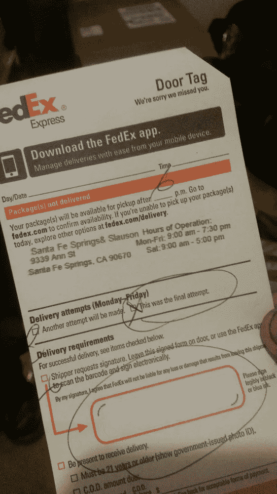
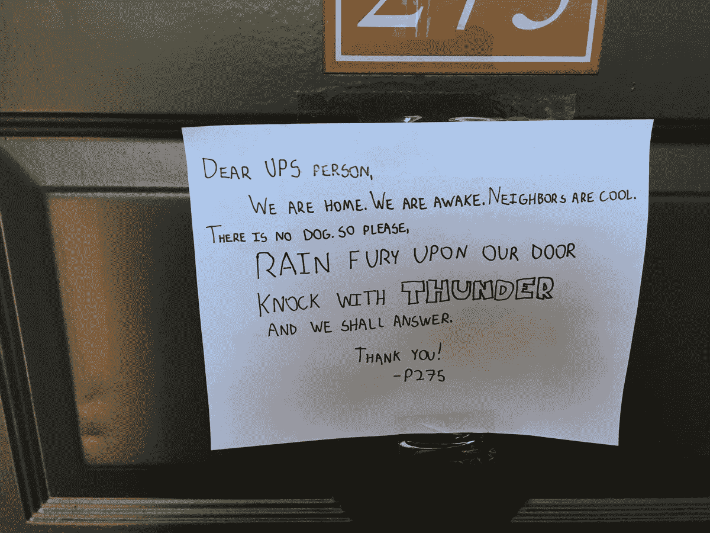

# YOLO 的首个实时联邦快递/UPS/USPS 检测系统

> 原文：<https://towardsdatascience.com/building-a-real-time-fedex-ups-usps-detection-system-with-yolo-1cc72382088a?source=collection_archive---------13----------------------->

> *您再也不会错过您的包裹了！*

在这篇文章中，我将与你分享用 Yolo 建立一个实时物体检测系统来检测 FedEx/UPS/USPS 送货卡车的步骤。这是两部分项目的第一部分:

a.第 1 部分(本文):动机，Yolo 的快速介绍，以及如何训练和测试模型。

b.第二部分(即将推出):通过 Yolo 的 Darkflow 实现，连接 Raspberry Pi 和网络摄像头/摄像机进行真实生活检测。

你可以在我的 GitHub 回购[这里](https://github.com/thoang3/portfolio/tree/master/FedEx-UPS-USPS-detection)找到代码，或者在我室友的 GitHub，Mladen 上找到代码，在[这里](https://github.com/ml1976/FedEx-UPS-USPS-detection)。

Another attempt will be made!

# **动机**

*“再来一次尝试。”对于需要签名的包裹，您经常会收到这样一份丢失的送货单。只剩下最后一次尝试了，所以你决定改变你的计划，第二天呆在家里。然而，你的公寓在大楼的后面，无论你在订购产品时提供了多么详细的说明，大多数情况下，送货人只会试图在前门或中门送货，而不会在你的后门送货。你对此感到厌倦，所以下次你主动打电话给快递公司，要求将你的包裹放在他们的总部，只是要意识到卖家不允许他们这样做。你感到绝望，所以你开始在前门、中门、后门贴上各种说明，上面有你的电话号码，他们不允许打电话！！*

是的，这些具有讽刺意味的情况一直发生在我和我的室友身上，也发生在很多我们认识的朋友和家人身上。上一次当我在等待我的新电脑时，我不得不花两个小时坐在大楼前，等待和阅读一本书来消磨时间。因此，我和我的室友决定开发我们自己的物体探测系统，当送货车辆在我们的大楼前停下或行驶时，它会通知我们。

# **为什么是 Yolo？**

在深度学习对象检测的最先进方法(更快的 R-CNN、SSD、YOLO)中，Yolo 因其在速度和准确性之间的巨大平衡而脱颖而出。在 Yolo 中，每个输入图像都被分成一个 S x S 网格。对于网格中的每个单元，一些边界框预测与用于预测与该网格单元相关联的对象的分类概率/分数同时生成。每个分数反映了模型对盒子包含某一类对象的置信度。

你可以在这里找到一些关于 Yolo 解释的有用链接:

[https://towards data science . com/yolo-v3-object-detection-53 FB 7d 3 bfe 6 b](/yolo-v3-object-detection-53fb7d3bfe6b)

[https://medium . com/diaryofwannapreneur/yolo-you-only-look-only-once-for-object-detection-explained-6 f 80 ea 7 AAAA 1 e](https://medium.com/diaryofawannapreneur/yolo-you-only-look-once-for-object-detection-explained-6f80ea7aaa1e)

【https://hackernoon.com/understanding-yolo-f5a74bbc7967 

如果你有关于 Yolo 的问题，我强烈推荐[这个](https://groups.google.com/forum/#!forum/darknet)谷歌团队。

总而言之:

- Yolo 在做决定时对图像进行全局推理，它只扫描图像一次，因此节省了时间和计算，因此得名“你只看一次”。

- Yolo 的检测速度使其成为实时检测的理想候选(在默认分辨率为 416 x 416 的情况下，GTX 1070 GPU 可以为 Yolov3 处理 32 FPS 的视频，为 Yolov2 处理 64 FPS 的视频)。

-具有“更深”层的 Yolov3 不仅能够探测大型和中型物体，还能以高精度探测小型物体。

- Yolo 学习对象的概化表示，因此它是高度概化的，因此，当应用于新的领域或意外输入时，它不太可能崩溃。

# **训练和测试模型**

为了训练模型，我们使用了由 AlexeyAB([https://github.com/AlexeyAB/darknet](https://github.com/AlexeyAB/darknet))优化的 Yolo 实现。

1.**收集训练数据**

首先，我们从搜集数据进行训练开始。我们的目标数据集是 FedEx/ UPS/ USPS 送货卡车/标志。其他服务，如 DHL，以后很容易扩展。为了避免手动下载图片，我们使用了 https://github.com/hardikvasa/google-images-download 的谷歌图片抓取工具。我们为每个类别下载了大约 400 张图片，但最终每个类别只标记了大约 200 张图片，因为这对第一个试点实验来说应该足够了。为了更好地进行培训，我们还提供了负面示例，即不包含上述公司的卡车/标志的图片。理想情况下，这些图像应该包括不同种类的车辆、房屋、树木……类似于我们房屋周围的类似环境。请记住，在他的 [GitHub repo](https://github.com/AlexeyAB/darknet#how-to-improve-object-detection) 中，Alexey 建议使用尽可能多的负面例子图像，以便更好地检测。根据我在其他 Yolo 项目上的个人经验，也许 40%-50%的负面图像是一个好的范围，超过 50%可能会使模型变得不那么“敏感”。

2.**标记图像**

下一步是为训练标记数据。在我们的案例中，我们标记的对象是公司的徽标。我们决定排除整辆车，只在车标周围画一个边框。然而，在未来，我们将尝试对所有车辆进行检测，因为像 UPS 和 DHL 这样的卡车都非常独特/容易识别。我们使用 [BBox-Label-Tool](https://github.com/puzzledqs/BBox-Label-Tool) 来标记图像。由于 BBox-Label-Tool 不会自动调整图像大小以适合计算机屏幕，因此在标记之前应调整过大图像的大小，以防止图像中的部分徽标丢失。

3.**训练模型**

如果你的 GPU 不是很强，你可以在云上训练模型。我刚买了一台装有 GTX 1070 的新台式机，对培训来说绰绰有余。我试验了 Yolo 作者的原始 darknet 版本和 AlexeyAB 的 T2 改进版本。根据我对几个项目的经验，包括这个项目，我注意到 AlexeyAB 的版本在训练和检测阶段确实快得多([https://github . com/AlexeyAB/darknet/issues/529 # issue comment-377204382](https://github.com/AlexeyAB/darknet/issues/529#issuecomment-377204382))。

为了训练模型，我们需要模型配置文件，其中包含几个用于训练的超参数。可以找找[。我的 GitHub repo 上的 cfg](https://github.com/htt1084/portfolio/blob/master/FedEx-UPS-USPS-detection/Inference-Computer/cfg/yolov2-fed.cfg) 文件。

在这个项目中，我们对 Yolov2 和 Yolov3 都进行了实验。

*免责声明:*在模型开始检测物体之前，训练 Yolov2 比 Yolov3 更快，但可能需要更多的迭代([https://github.com/thtrieu/darkflow/issues/80](https://github.com/thtrieu/darkflow/issues/80))。

在我们的例子中，Yolov2 进行了超过 12，000 次迭代，Yolov3 进行了 3000 次迭代，才开始检测送货卡车。总的来说，Yolov3 在准确性方面会更好，它在检测小物体方面明显更好。然而，我们最终使用了 Yolov2，因为我们想在 Raspberry Pi web 服务器设置中使用 DarkFlow(下一篇文章)，而 Yolov3 还没有在 DarkFlow 中可用。

该模型在 3 个类别上进行训练:联邦快递、UPS 和美国邮政，此外还有预训练的权重:[http://pjreddie.com/media/files/darknet19_448.conv.23](http://pjreddie.com/media/files/darknet19_448.conv.23)
关于如何使用 Yolov2 训练您的定制对象的详细说明可在此处找到:[https://github . com/AlexeyAB/darknet/tree/47 c 7a f1 ce a5 bb dedf 1184963355 e 6418 CB 8 B1 b4f # how-to-train-detect-your-custom-objects](https://github.com/AlexeyAB/darknet/tree/47c7af1cea5bbdedf1184963355e6418cb8b1b4f#how-to-train-to-detect-your-custom-objects)
或 if

4.**测试模型**

知道什么时候停止训练，选择哪组砝码进行检测是相当重要的。一旦你对模型进行了足够多的训练和测试，你会获得更多的经验和直觉，但是当你第一次开始时，拥有这样的指导方针可能会非常有帮助:[https://github . com/AlexeyAB/darknet # when-should-I-stop-training](https://github.com/AlexeyAB/darknet#when-should-i-stop-training)。
请记住，拥有一个小的训练数据集可能会很快导致过度拟合。在这种情况下，由于数据集很小，并且我已经从另一个项目中获得了足够的经验，我决定使用所有的数据进行训练，并通过对几个剪辑进行测试来选择最佳权重，而不是将我的数据分为训练集和测试集。一般来说，我们要把数据拆分成训练和测试，通过看 precision & recall，mAP (mean Average Precision)，IoU (Intersection over Union)来检查模型的准确性。关于这些措施的一个很好的解释可以在[这里](https://medium.com/@jonathan_hui/map-mean-average-precision-for-object-detection-45c121a31173)找到。

以下是三个竞争对手在芝加哥市区的一次精彩交锋中的测试结果:

Let’s race!

您还可以在下面找到联邦快递/UPS/USPS 检测我们项目的演示剪辑:

Test on a clip

考虑到训练数据集的大小，以及它是在 416 x 416 分辨率下测试的事实，这是一个相当好的结果。您可以按照 Alexey 的说明，通过将分辨率从 416 x 416 更改为 608 x 608 或更高来改善检测。为了创建一个更加通用和健壮的检测系统，我们只需要创建更多的用于训练的标记数据。

# **结论**

喜欢这个帖子就给我鼓掌(或者 50 :p)。请随意下载权重和配置文件并亲自测试。第二部分即将推出。我们基本上完成了实施，并且已经成功地对联邦快递、UPS 和 USPS 的送货卡车进行了现实生活中的检测。欢迎在下面留下任何评论和反馈！