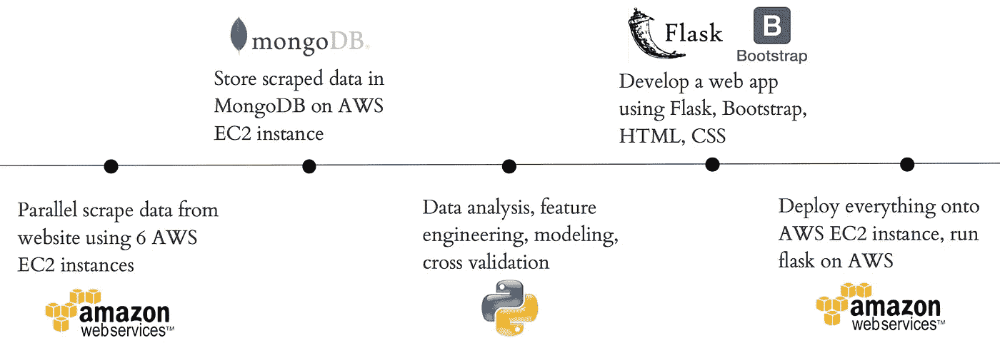
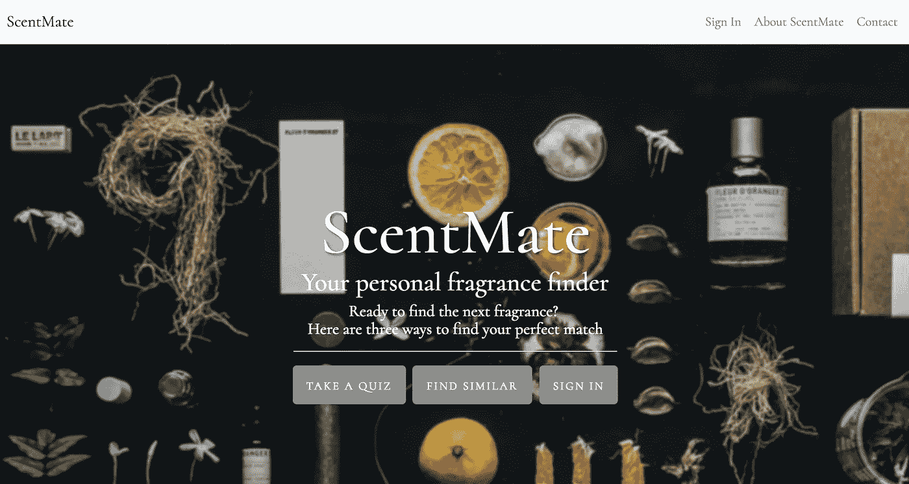
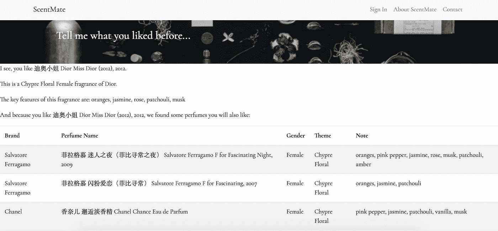
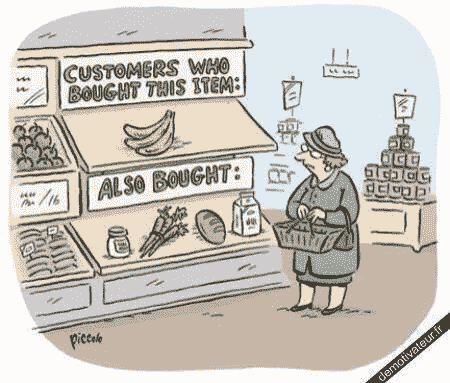

# 我如何建立一个香水推荐系统

> 原文：<https://towardsdatascience.com/building-a-recommendation-system-for-fragrance-5b00de3829da?source=collection_archive---------1----------------------->

正如网飞首席执行官雷德·哈斯汀斯所说，*“你知道，想想看，当你看一个来自网飞的节目，你会上瘾，你会熬夜到很晚。我们在边缘上与睡眠竞争。”*在我看来，竞争的关键部分是如何在正确的时间向正确的人提供正确的内容，这是关于推荐系统的。

推荐系统一直吸引着我的注意力。不仅因为它们是机器学习应用的一大部分，还因为它们与理解人有关。每当我在潘多拉上听音乐，在亚马逊上买东西，在 Stitch Fix 上订购衣服，在网飞上看电影，在 StumbleUpon 上阅读新闻，在 Instagram 或 Pinterest 上浏览照片，我都强烈地感觉到推荐者已经充斥在我们数字生活的每个角落，他们将继续塑造我们未来的生活。

这就是为什么我选择了我的激励顶点项目来构建香水的推荐系统。人们说你身上散发的香味表明你是谁。一个人对香水的选择受到他/她的性别、年龄、国籍、气候、心情、一年中的季节、一天中的时间等的影响。因为我在过去做过几次错误的决定，所以几个月前决定买一台新的时，我非常谨慎。然后我想，作为一名数据科学家，我应该可以用我的数据科学和机器学习知识来回答这个问题。这就是我如何发展这个想法的——帮助人们找到他们的签名香水。

# 1.项目工作流程

我使用 6 个 AWS EC2 实例从中国最大的香水论坛搜集数据。将它们存储在 MongoDB 的第 7 个 EC2 实例中。数据准备好之后，我做了数据分析、特征工程、建模和交叉验证。然后我用 Flask 和 Bootstrap 搭建了一个 web app。终于在 AWS 上托管了 web app。

# 2.数据

数据是从中国最大的香水论坛刮来的(因为美国最大的论坛禁止我刮)，它由两个表组成。一个表是香水数据，有品牌、性别、笔记、主题等特征。另一个表是用户评级数据，其中有用户 ID、香水 ID、用户评级得分(范围从 2 到 10)和用户评论。

# 3.模特们

在这个项目中，我针对不同的消费群体实施了不同的方法。对于冷启动问题(没有评级历史的新用户)，我将使用基于内容的模型。在最终的 web 应用程序中，我会要求他们要么参加一个小测验，要么输入一种你喜欢的香水，根据香水的特性进行推荐。对于有评分历史的用户，我将实现项目-项目相似性协同过滤模型和矩阵分解模型，然后比较它们的性能。在最终的 web 应用程序中，我会要求他们登录他们的帐户，并根据相似的用户生成个性化的推荐。

(网络应用主页提供了三个选项来寻找你的下一款香水)

## 模型 1:基于内容的推荐系统

要建立一个基于内容的推荐器，我们唯一关心的是香水的特性。由于我收集的数据还没有告诉我人们闻到香水时的感觉的特征，我将 NMF(非负矩阵分解)和 LDA(潜在狄利克雷分配)应用于用户评论文本以进行主题建模。在比较了每种方法生成的话题后，我发现 LDA 生成的 12 个话题更具可解释性。因此，我人工标记了 12 个 LDA 主题，将它们与其他香水特征(如性别、音符和主题)结合在一起，构建了香水矩阵，然后基于 Jaccard 相似度建立了基于内容的相似度模型。

(基于内容的推荐器的快照)

## 模型 2:协同过滤推荐器

协同过滤的两个主要领域是邻域方法和潜在因素模型。邻域法的核心是计算项目之间的关系，或者说是使用之间的关系。面向项目的方法基于同一用户对“相邻”项目的评级来评估用户对项目的偏好。一个产品的邻居是当由同一用户评级时倾向于获得相似评级的其他产品。另一方面，潜在因素模型是一种替代方法，它试图通过根据评级模式推断的潜在因素来描述项目和用户来解释评级。对于香水，发现的因素可能测量明显或不太明确的维度，如花卉或柑橘主题，对不同性别的取向，或完全无法解释的维度。对于用户来说，每个因素都衡量用户有多喜欢在相应电影向量上得分高的香水。

在这个项目中，对于有评分历史的用户，我应用了来自邻域方法的项目-项目相似性模型和来自矩阵分解方法的 UV 分解模型。我用来评估我的建议的评估指标是 RMSE(均方根误差)。

基线模型是为用户随机推荐香水，这意味着预测评级是所有东西的平均评级(7.25，满分 10 分)，它给了我 2.20 的 RMSE。

之后，我建立了项目-项目相似度模型。它表现很差(RMSE: 7.32)，因为用户评级矩阵太稀疏(0.3%的单元填充有值)，当矩阵太稀疏时，邻域方法不能很好地执行，因为进入每个预测的信息很少。

然后，我应用矩阵分解模型，通过随机梯度下降拟合。在调整了若干因素后，对线性项以及相互作用项进行正则化。矩阵分解模型给了我最好的表现(RMSE: 1.95)。因此，我使用矩阵分解模型作为我的协同过滤推荐器的最终模型。

(上图:矩阵 M 的紫外线分解)

协同过滤模型的性能如下图所示:

# 4.我如何进行训练测试分割和交叉验证

每当有人说“我建立了一个推荐者”，我脑海中浮现的第一个问题是:“你是如何验证你的推荐者的表现的？”因为这是所有推荐系统中最具挑战性的部分。在我的项目中，对于基于内容的推荐，由于它是无监督的，完全基于香水特征进行推荐，所以我通过让我的同学尝试并查看结果来验证它。总体来说，推荐是好的，尤其是主页上的“查找相似”功能，但最大的缺点是没有香水价格数据，一个喜欢香奈儿香水的顾客可能不会去一个大众市场品牌，即使它们有相似的成分。然而，对于主页上的“参加测验”功能，如果用户只选择了几个特征，结果将是 off，因为模型正在基于用户选择的所有特征构建向量，并计算用户向量和每种香水之间的 Jaccard 距离。

对于协同过滤推荐器，我尝试的第一个交叉验证方法是留一法交叉验证，但我花了 18 个小时来完成一个循环，计算量太大，因此我改用手动 K-fold 验证。首先，我手动删除了评分低于 3 的用户，将他们视为冷启动问题的一部分，并让他们使用基于内容的推荐器。然后，对于具有 3 个或更多评级的用户，我确保每个用户都存在于我的训练集、验证集和测试集中。因此，我可以使用用户在训练集中的评级来拟合模型，预测用户在验证集中的其他评级，并基于验证集上的 RMSE 来调整模型。最后，我使用用户在测试集中的评分来评估最终的模型。

# 5.局限性和未来工作

## 1)对数据的限制:

*   价格信息不可用:喜爱香奈儿香水的顾客可能不会去大众市场品牌，即使它们有相似的成分。
*   没有用户统计数据:人们对每种香水的感受在不同的文化和地域中是不同的，我的数据来自一个中国香水论坛，那里的人们对每种香水的感受并不反映其他国家的人们对每种香水的感受。
*   只有 20%的香水被评论过:好的推荐系统的一个优点是它的意外收获。但为了检索顾客对每款香水的感受，我只能查看已经有用户评论的香水。然而，80%的香水没有，要么是因为它们不流行，要么是因为它们是新的。因此，为了使我的推荐系统更好地工作，需要更多的香水领域知识和功能工程工作，这样我就不需要依赖用户评论来获得人们对每种香水的感觉。

## 2)顾客的口味会随着时间而改变

*   我现有的模型是静态的。但在现实中，顾客的偏好会发生变化，导致他们重新定义自己的品味。同样，随着新香水的出现，产品的认知和受欢迎程度也在不断变化。因此，系统应该考虑反映用户-项目交互的动态、时间漂移性质的时间效应。因此，对于未来的工作，我还应该收集用户评级数据，我的协同过滤模型应该考虑时间效应。

## 3)有更好的方法吗？

*   是的。永远不要停止学习。

# 6.最后的想法

在为期两周的项目体验中，我意识到我可以用推荐系统做很多事情，以及它们有多么强大。它们不仅仅是香水或任何消费品。它们可以是你可能在 MOOC 网站上喜欢的课程，或者你可能在约会应用程序上喜欢的人，不用说，新闻文章、书籍、音乐……背后的主要想法是关于你如何了解你的客户，你有多少领域知识，以及你如何利用数据科学和机器学习来帮助你实现你的理解。如果你碰巧也对这个领域感兴趣，我会非常乐意与你讨论。

> *代码可以在这里找到:*【github.com/kellypeng/scentmate_rec】T2
> 
> 【联系作者:[*https://www.linkedin.com/in/pengyuwei/*](https://www.linkedin.com/in/pengyuwei/)

参考资料:

1.  Anand Rajaraman 和 Jeffrey Ullman，*挖掘海量数据集，第 9 章推荐系统*
2.  Yehyda Koren，Robert Bell 和 Chris Volinsky，*推荐系统的矩阵分解技术*
3.  耶胡达·科伦，*因式分解与邻域相遇:多面协作过滤模型*
4.  斯蒂芬·高尔， *Netflix 奖和 SVD*
5.  Jiunn Haur Lim，*用矩阵分解法预测用户评分*