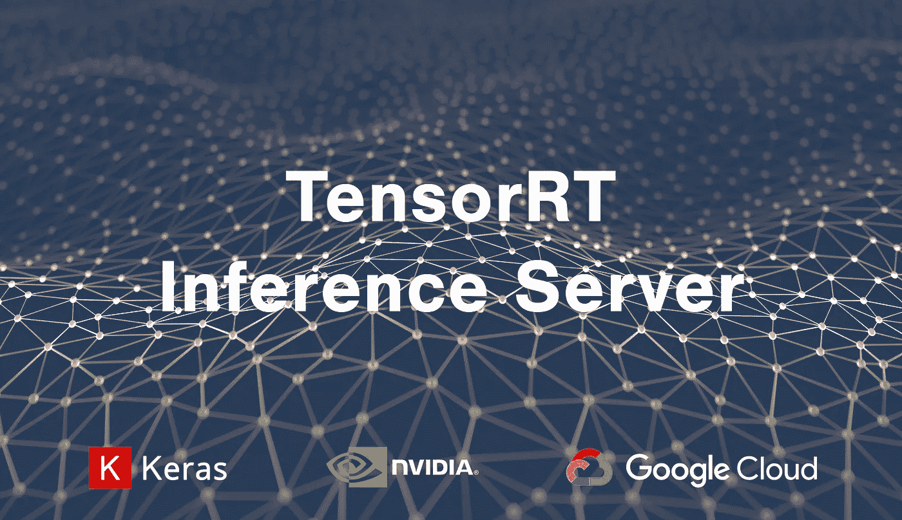
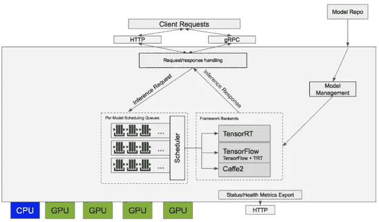
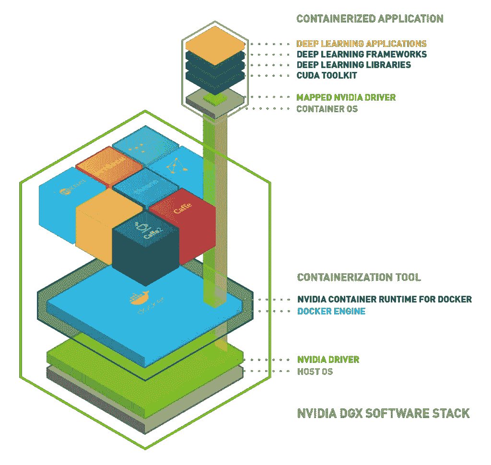

# 使用 NVIDIA TensorRT 服务器和谷歌云为 Keras 模型构建可扩展的深度学习服务环境

> 原文：<https://towardsdatascience.com/building-a-scaleable-deep-learning-serving-environment-for-keras-models-using-nvidia-tensorrt-a5c578af59ec?source=collection_archive---------24----------------------->



在最近的一个项目中，我使用 Keras 和 Tensorflow 开发了一个用于图像分类的大规模深度学习应用程序。开发完模型后，我们需要将它部署到云环境中一个相当复杂的数据获取和准备例程管道中。我们决定在通过 API 公开模型的预测服务器上部署模型。因此，我们遇到了英伟达 TensorRT 服务器(TRT 服务器)，一个不错的老 TF 服务的严肃替代品(顺便说一下，这是一个很棒的产品！).在权衡利弊之后，我们决定给 TRT 服务器一个机会。TRT 服务器有几个优于 TF 服务器的优点，如优化的推理速度、简单的模型管理和资源分配、版本控制和并行推理处理。此外，TensorRT 服务器并不“局限于”TensorFlow(和 Keras)模型。它可以服务于所有主要深度学习框架的模型，如 TensorFlow、MxNet、pytorch、theano、Caffe 和 CNTK。

尽管有很多很酷的功能，我发现设置 TRT 服务器有点麻烦。安装和文档分散在相当多的存储库、官方文档指南和博客文章中。这就是为什么我决定写这篇关于设置服务器的博文，让你的预言成真！

# NVIDIA TensorRT 服务器

TensorRT 推理服务器是英伟达将深度学习模型投入生产的前沿服务器产品。它是 NVIDIA 的 TensorRT 推理平台的一部分，提供了一个可扩展的、生产就绪的解决方案，用于为来自所有主要框架的深度学习模型提供服务。它基于 NVIDIA Docker，包含从容器内部运行服务器所需的一切。此外，NVIDIA Docker 允许在 Docker 容器中使用 GPU，在大多数情况下，这大大加快了模型推理的速度。谈到速度——TRT 服务器可以比 TF 服务器快得多，并允许同时从多个模型进行多个推理，使用 CUDA 流来利用 GPU 调度和序列化(见下图)。


通过 TRT 服务器，您可以使用所谓的实例组来指定并发推理计算的数量，这些实例组可以在模型级别进行配置(参见“模型配置文件”一节)。例如，如果您为两个模型提供服务，并且其中一个模型获得了明显更多的推理请求，那么您可以为该模型分配更多的 GPU 资源，从而允许您并行计算更多的请求。此外，实例组允许您指定模型应该在 CPU 还是 GPU 上执行，这在更复杂的服务环境中是一个非常有趣的特性。总的来说，TRT 服务器有一大堆很棒的特性，这使得它非常适合生产使用。



上图展示了服务器的一般架构。人们可以看到 HTTP 和 gRPC 接口，它们允许您将模型集成到通过 LAN 或 WAN 连接到服务器的其他应用程序中。相当酷！此外，服务器公开了一些健全的特性，如健康状态检查等。，这在生产中也派上了用场。

# 设置服务器

如前所述，TensorRT 服务器位于 NVIDIA Docker 容器中。为了让事情进展顺利，您需要完成几个安装步骤(如果您是从一台空白的机器开始，就像这里一样)。整个过程相当漫长，需要一定的“一般云、网络、IT 知识”。我希望下面的步骤能让你清楚安装和设置的过程。

# 在谷歌云上启动深度学习虚拟机

对于我的项目，我使用了预装 CUDA 和 TensorFlow 库的 Google 深度学习虚拟机。你可以使用 Google Cloud SDK 或者在 GCP 控制台中启动云虚拟机(在我看来，这非常容易使用)。GCP SDK 的安装可以在[这里](https://cloud.google.com/sdk/)找到。请注意，由于 CUDA 安装过程需要几分钟的时间，可能需要一段时间才能连接到服务器。您可以在云日志控制台中检查虚拟机的状态。

```
# Create project
gcloud projects create tensorrt-server# Start instance with deep learning image
gcloud compute instances create tensorrt-server-vm \
  --project tensorrt-server \
  --zone your-zone \
  --machine-type n1-standard-4 \
  --create-disk='size=50' \
  --image-project=deeplearning-platform-release \
  --image-family tf-latest-gpu \
  --accelerator='type=nvidia-tesla-k80,count=1' \
  --metadata='install-nvidia-driver=True' \
  --maintenance-policy TERMINATE
```

成功设置实例后，您可以使用终端 SSH 到 VM。从这里，您可以执行所有必要的步骤来安装所需的组件。

```
# SSH into instance
gcloud compute ssh tensorrt-server-vm \
  --project tensorrt-server \
  --zone your-zone
```

*注意:当然，您必须为您的项目和实例名修改脚本。*

# 安装 Docker

在设置了 GCP 云虚拟机之后，你必须在你的机器上安装 Docker 服务。谷歌深度学习虚拟机使用 Debian 作为操作系统。您可以使用下面的代码在 VM 上安装 Docker。

```
# Install Docker
sudo apt-get update sudo
apt-get install \
  apt-transport-https \
  ca-certificates \
  curl \
  software-properties-common
curl -fsSL https://download.docker.com/linux/ubuntu/gpg | \
sudo apt-key add - 
sudo add-apt-repository \
  "deb [arch=amd64] https://download.docker.com/linux/ubuntu \
  $(lsb_release -cs) stable"
sudo apt-get update
sudo apt-get install docker-ce
```

您可以通过运行以下命令来验证 Docker 是否已经成功安装。

```
sudo docker run --rm hello-world
```

你应该看到一个“你好，世界！”从 docker 容器中，您应该会看到这样的内容:

```
Unable to find image 'hello-world:latest' locally
latest: Pulling from library/hello-world
d1725b59e92d: Already exists
Digest: sha256:0add3ace90ecb4adbf7777e9aacf18357296e799f81cabc9fde470971e499788
Status: Downloaded newer image for hello-world:latestHello from Docker!
This message shows that your installation appears to be working correctly.To generate this message, Docker took the following steps:
1\. The Docker client contacted the Docker daemon.
2\. The Docker daemon pulled the "hello-world" image from the Docker Hub. (amd64)
3\. The Docker daemon created a new container from that image which runs the executable that produces the output you are currently reading.
4\. The Docker daemon streamed that output to the Docker client, which sent it to your terminal.To try something more ambitious, you can run an Ubuntu container with: 
$ docker run -it ubuntu bash
Share images, automate workflows, and more with a free Docker ID:  
https://hub.docker.com/ For more examples and ideas, visit: [https://docs.docker.com/get-started/](https://docs.docker.com/get-started/)
```

恭喜你，你已经成功安装了 Docker！

# 安装 NVIDIA Docker

不幸的是，Docker 对连接到主机系统的 GPU 没有“开箱即用”的支持。因此，需要安装 NVIDIA Docker 运行时，才能在容器化环境中使用 TensorRT Server 的 GPU 功能。NVIDIA Docker 也用于 TF 服，如果你想用你的 GPU 做模型推断的话。下图说明了 NVIDIA Docker 运行时的架构。



您可以看到，NVIDIA Docker 运行时围绕 Docker 引擎分层，允许您在系统上使用标准 Docker 和 NVIDIA Docker 容器。

由于 NVIDIA Docker 运行时是 NVIDIA 的专有产品，您必须在 [NVIDIA GPU Cloud (NGC)](https://ngc.nvidia.com/) 注册以获得 API 密钥，以便安装和下载它。要针对 NGC 进行身份验证，请在服务器命令行中执行以下命令:

```
# Login to NGC sudo docker login nvcr.io
```

将提示您输入用户名和 API 密钥。对于用户名，您必须输入`$oauthtoken`，密码是生成的 API 密钥。成功登录后，您可以安装 NVIDIA Docker 组件。按照 NVIDIA Docker GitHub repo 上的说明，您可以通过执行以下脚本来安装 NVIDIA Docker(Ubuntu 14.04/16.04/18.04，Debian Jessie/Stretch)。

```
# If you have nvidia-docker 1.0 installed: we need to remove it and all existing GPU containers
docker volume ls -q -f driver=nvidia-docker | xargs -r -I{} -n1 docker ps -q -a -f volume={} | xargs -r docker rm -f
sudo apt-get purge -y nvidia-docker# Add the package repositories
curl -s -L [https://nvidia.github.io/nvidia-docker/gpgkey](https://nvidia.github.io/nvidia-docker/gpgkey) | \
  sudo apt-key add -
distribution=$(. /etc/os-release;echo $ID$VERSION_ID)
curl -s -L [https://nvidia.github.io/nvidia-docker/$distribution/nvidia-docker.list](https://nvidia.github.io/nvidia-docker/$distribution/nvidia-docker.list) | \
  sudo tee /etc/apt/sources.list.d/nvidia-docker.list
sudo apt-get update# Install nvidia-docker2 and reload the Docker daemon configuration
sudo apt-get install -y nvidia-docker2
sudo pkill -SIGHUP dockerd# Test nvidia-smi with the latest official CUDA image
sudo docker run --runtime=nvidia --rm nvidia/cuda:9.0-base nvidia-smi
```

# 安装 TensorRT 服务器

成功安装 NVIDIA Docker 后，下一步就是安装 TensorRT 服务器。它可以从 NVIDIA 容器注册表(NCR)中提取。同样，您需要通过 NGC 认证才能执行此操作。

```
# Pull TensorRT Server (make sure to check the current version) sudo docker pull nvcr.io/nvidia/tensorrtserver:18.09-py3
```

提取映像后，TRT 服务器就可以在您的云机器上启动了。下一步是创建一个将由 TRT 服务器提供服务的模型。

# 模型部署

在安装了所需的技术组件并拉出 TRT 服务器容器之后，您需要关注您的模型和部署。TensorRT Server 在服务器上的一个文件夹中管理其模型，即所谓的模型库。

# 设置模型库

模型库包含导出的 TensorFlow / Keras 等。特定文件夹结构中的模型图。对于模型库中的每个模型，需要定义一个具有相应模型名称的子文件夹。在这些模型子文件夹中，有模型模式文件(`config.pbtxt`)、标签定义(`labels.txt`)以及模型版本子文件夹。这些子文件夹允许您管理和提供不同的模型版本。文件`labels.txt`包含适当顺序的目标标签的字符串，对应于模型的输出层。在 version 子文件夹中保存了一个名为`model.graphdef`(导出的 protobuf 图)的文件。`model.graphdef`实际上是一个冻结的 tensorflow 图，是导出 TensorFlow 模型后创建的，需要相应命名。

备注:由于一些变量初始化错误，我无法从 TRT 服务器的`tensoflow.python.saved_model.simple_save()`或`tensorflow.python.saved_model.builder.SavedModelBuilder()`导出中获得有效服务。因此，我们使用“冻结图”方法，将图中的所有 TensorFlow 变量转换为常量，并将所有内容输出到一个文件中(即`model.graphdef`)。

```
/models
|- model_1/
|-- config.pbtxt
|-- labels.txt
|-- 1/
|--- model.graphdef
```

因为模型库只是一个文件夹，所以它可以位于 TRT 服务器主机有网络连接的任何地方。例如，您可以将导出的模型图存储在云存储库或您机器上的本地文件夹中。新模型可以导出并部署到那里，以便通过 TRT 服务器进行服务。

# 模型配置文件

在您的模型库中，模型配置文件(`config.pbtxt`)为 TRT 服务器上的每个模型设置重要参数。它包含关于您的可服务模型的技术信息，并且是正确加载模型所必需的。这里有几件事你可以控制:

```
name: "model_1"
platform: "tensorflow_graphdef"
max_batch_size: 64
input [
   {
      name: "dense_1_input"
      data_type: TYPE_FP32
      dims: [ 5 ]
   }
]
output [
   {
      name: "dense_2_output"
      data_type: TYPE_FP32
      dims: [ 2 ]
      label_filename: "labels.txt"
   }
]
instance_group [
   {
      kind: KIND_GPU
      count: 4
   }
]
```

首先，`name`定义了模型下的标签在服务器上是可达的。这必须是模型库中模型文件夹的名称。`platform`定义了框架，建立了模型。如果你用的是 TensorFlow 或者 Keras，有两个选项:(1) `tensorflow_savedmodel`和`tensorflow_graphdef`。如前所述，我用的是`tensorflow_graphdef`(见上一节末尾我的备注)。`batch_size`，顾名思义，控制你预测的批量大小。`input`定义你的模型的输入层节点名称，比如输入层的`name`(是的，你应该在 TensorFlow 或者 Keras 中命名你的层和节点)`data_type`，目前只支持数值类型，比如`TYPE_FP16, TYPE_FP32, TYPE_FP64`和输入`dims`。相应的，`output`定义了你的模型的输出层`name`，分别是`data_type`和`dims`。您可以指定一个`labels.txt`文件，以适当的顺序保存输出神经元的标签。因为这里只有两个输出类，所以文件看起来很简单，如下所示:

```
class_0 class_1
```

每行定义一个类标签。请注意，该文件不包含任何头。最后一部分`instance_group`让您为您的模型定义特定的 GPU ( `KIND_GPU`)或 CPU ( `KIND_CPU`)资源。在示例文件中，有`4`个并发 GPU 线程分配给模型，允许四个同时预测。

# 构建一个简单的服务模型

为了通过 TensorRT 服务器为模型提供服务，您首先需要一个模型。我准备了一个小脚本，在 Keras 中构建一个简单的 MLP 用于演示目的。我已经在生产中成功地将 TRT 服务器用于更大的模型，如 InceptionResNetV2 或 ResNet50，它工作得非常好。

```
from sklearn.datasets import make_classification
from sklearn.model_selection import train_test_split
from sklearn.preprocessing import StandardScaler
from keras.models import Sequential
from keras.layers import InputLayer, Dense
from keras.callbacks import EarlyStopping, ModelCheckpoint
from keras.utils import to_categorical# Make toy data
X, y = make_classification(n_samples=1000, n_features=5)# Make target categorical
y = to_categorical(y)# Train test split
X_train, X_test, y_train, y_test = train_test_split(X, y)# Scale inputs
scaler = StandardScaler()
X_train = scaler.fit_transform(X_train)
X_test = scaler.transform(X_test)# Model definition
model_1 = Sequential()
model_1.add(Dense(input_shape=(X_train.shape[1], ), units=16, activation='relu', name='dense_1'))
model_1.add(Dense(units=2, activation='softmax', name='dense_2'))
model_1.compile(optimizer='adam', loss='categorical_crossentropy')# Early stopping
early_stopping = EarlyStopping(patience=5)
model_checkpoint = ModelCheckpoint(filepath='model_checkpoint.h5', save_best_only=True, save_weights_only=True)
callbacks = [early_stopping, model_checkpoint]# Fit model and load best weights
model_1.fit(x=X_train, y=y_train, validation_data=(X_test, y_test), epochs=50, batch_size=32, callbacks=callbacks)# Load best weights after early stopping
model_1.load_weights('model_checkpoint.h5')# Export model
model_1.save('model_1.h5')
```

该脚本使用`sklearn.datasets.make_classification`构建了一些玩具数据，并为这些数据拟合了一个单层 MLP。拟合后，模型被保存，以便在单独的导出脚本中进一步处理。

# 为上菜冻结图表

服务 Keras (TensorFlow)模型的工作方式是将模型图导出为一个单独的 protobuf 文件(`.pb`-文件扩展名)。将模型导出到包含网络所有权重的单个文件中的一个简单方法是“冻结”图形并将其写入磁盘。由此，图形中的所有`tf.Variables`被转换为`tf.constant`，并与图形一起存储在一个文件中。为此，我修改了这个脚本。

```
import os
import shutil
import keras.backend as K
import tensorflow as tf
from keras.models import load_model
from tensorflow.python.framework import graph_util
from tensorflow.python.framework import graph_io def freeze_model(model, path):
    """ Freezes the graph for serving as protobuf """
    # Remove folder if present
    if os.path.isdir(path):
        shutil.rmtree(path)
        os.mkdir(path)
        shutil.copy('config.pbtxt', path)
        shutil.copy('labels.txt', path)
    # Disable Keras learning phase
    K.set_learning_phase(0)
    # Load model
    model_export = load_model(model)
    # Get Keras sessions
    sess = K.get_session()
    # Output node name
    pred_node_names = ['dense_2_output']
    # Dummy op to rename the output node
    dummy = tf.identity(input=model_export.outputs[0], \
            name=pred_node_names)
    # Convert all variables to constants
    graph_export = \
    graph_util.convert_variables_to_constants(sess=sess,                                         
    input_graph_def=sess.graph.as_graph_def(),
             output_node_names=pred_node_names)
    graph_io.write_graph(graph_or_graph_def=graph_export,
                         logdir=path + '/1',
                         name='model.graphdef',
                         as_text=False)# Freeze Model
freeze_model(model='model_1.h5', path='model_1')# Upload to GCP
os.system('gcloud compute scp model_1 tensorrt-server-vm:~/models/ --project tensorrt-server --zone us-west1-b --recurse')
```

`freeze_model()`函数获取保存的 Keras 模型文件`model_1.h5`的路径以及要导出的图形的路径。此外，我还增强了该功能，以便构建所需的模型库文件夹结构，其中包含版本子文件夹`config.pbtxt`和`labels.txt`，两者都存储在我的项目文件夹中。该函数加载模型并将图形导出到定义的目的地。为了做到这一点，您需要定义输出节点的名称，然后使用`graph_util.convert_variables_to_constants`将图中的所有变量转换为常量，这使用了相应的 Keras 后端会话，必须使用`K.get_session()`获取这些会话。此外，在导出前使用`K.set_learning_phase(0)`禁用 Keras 学习模式非常重要。最后，我添加了一个小的 CLI 命令，将我的模型文件夹上传到我的 GCP 实例的模型库`/models`。

# 启动服务器

既然一切都已安装、设置和配置完毕，现在(终于)是时候启动我们的 TRT 预测服务器了。以下命令启动 NVIDIA Docker 容器，并将模型库映射到该容器。

```
sudo nvidia-docker run --rm --name trtserver -p 8000:8000 -p 8001:8001 \ -v ~/models:/models nvcr.io/nvidia/tensorrtserver:18.09-py3 trtserver \ --model-store=/models
```

`--rm`删除由`--name`给出的同名的现有容器。`-p`显示主机上的端口 8000 (REST)和 8001 (gRPC ),并将它们映射到各自的容器端口。`-v`将主机上的模型库文件夹(在我的例子中是`/models`)安装到容器中的`/models`,然后`--model-store`将其引用为查找可服务模型图的位置。如果一切正常，您应该会看到类似如下的控制台输出。如果您不想看到服务器的输出，您可以在启动时使用`-d`标志在分离的模型中启动容器。

```
===============================
== TensorRT Inference Server ==
===============================NVIDIA Release 18.09 (build 688039)Copyright (c) 2018, NVIDIA CORPORATION.  All rights reserved.
Copyright 2018 The TensorFlow Authors.  All rights reserved.Various files include modifications (c) NVIDIA CORPORATION.  All rights reserved.
NVIDIA modifications are covered by the license terms that apply to the underlying
project or file.NOTE: The SHMEM allocation limit is set to the default of 64MB.  This may be
   insufficient for the inference server.  NVIDIA recommends the use of the following flags:
   nvidia-docker run --shm-size=1g --ulimit memlock=-1 --ulimit stack=67108864 ...I1014 10:38:55.951258 1 server.cc:631] Initializing TensorRT Inference Server
I1014 10:38:55.951339 1 server.cc:680] Reporting prometheus metrics on port 8002
I1014 10:38:56.524257 1 metrics.cc:129] found 1 GPUs supported power usage metric
I1014 10:38:57.141885 1 metrics.cc:139]   GPU 0: Tesla K80
I1014 10:38:57.142555 1 server.cc:884] Starting server 'inference:0' listening on
I1014 10:38:57.142583 1 server.cc:888]  localhost:8001 for gRPC requests
I1014 10:38:57.143381 1 server.cc:898]  localhost:8000 for HTTP requests
[warn] getaddrinfo: address family for nodename not supported
[evhttp_server.cc : 235] RAW: Entering the event loop ...
I1014 10:38:57.880877 1 server_core.cc:465] Adding/updating models.
I1014 10:38:57.880908 1 server_core.cc:520]  (Re-)adding model: model_1
I1014 10:38:57.981276 1 basic_manager.cc:739] Successfully reserved resources to load servable {name: model_1 version: 1}
I1014 10:38:57.981313 1 loader_harness.cc:66] Approving load for servable version {name: model_1 version: 1}
I1014 10:38:57.981326 1 loader_harness.cc:74] Loading servable version {name: model_1 version: 1}
I1014 10:38:57.982034 1 base_bundle.cc:180] Creating instance model_1_0_0_gpu0 on GPU 0 (3.7) using model.savedmodel
I1014 10:38:57.982108 1 bundle_shim.cc:360] Attempting to load native SavedModelBundle in bundle-shim from: /models/model_1/1/model.savedmodel
I1014 10:38:57.982138 1 reader.cc:31] Reading SavedModel from: /models/model_1/1/model.savedmodel
I1014 10:38:57.983817 1 reader.cc:54] Reading meta graph with tags { serve }
I1014 10:38:58.041695 1 cuda_gpu_executor.cc:890] successful NUMA node read from SysFS had negative value (-1), but there must be at least one NUMA node, so returning NUMA node zero
I1014 10:38:58.042145 1 gpu_device.cc:1405] Found device 0 with properties: 
name: Tesla K80 major: 3 minor: 7 memoryClockRate(GHz): 0.8235
pciBusID: 0000:00:04.0
totalMemory: 11.17GiB freeMemory: 11.10GiB
I1014 10:38:58.042177 1 gpu_device.cc:1455] Ignoring visible gpu device (device: 0, name: Tesla K80, pci bus id: 0000:00:04.0, compute capability: 3.7) with Cuda compute capability 3.7\. The minimum required Cuda capability is 5.2.
I1014 10:38:58.042192 1 gpu_device.cc:965] Device interconnect StreamExecutor with strength 1 edge matrix:
I1014 10:38:58.042200 1 gpu_device.cc:971]      0 
I1014 10:38:58.042207 1 gpu_device.cc:984] 0:   N 
I1014 10:38:58.067349 1 loader.cc:113] Restoring SavedModel bundle.
I1014 10:38:58.074260 1 loader.cc:148] Running LegacyInitOp on SavedModel bundle.
I1014 10:38:58.074302 1 loader.cc:233] SavedModel load for tags { serve }; Status: success. Took 92161 microseconds.
I1014 10:38:58.075314 1 gpu_device.cc:1455] Ignoring visible gpu device (device: 0, name: Tesla K80, pci bus id: 0000:00:04.0, compute capability: 3.7) with Cuda compute capability 3.7\. The minimum required Cuda capability is 5.2.
I1014 10:38:58.075343 1 gpu_device.cc:965] Device interconnect StreamExecutor with strength 1 edge matrix:
I1014 10:38:58.075348 1 gpu_device.cc:971]      0 
I1014 10:38:58.075353 1 gpu_device.cc:984] 0:   N 
I1014 10:38:58.083451 1 loader_harness.cc:86] Successfully loaded servable version {name: model_1 version: 1}
```

还有一个警告，显示您应该使用以下参数启动容器

```
--shm-size=1g --ulimit memlock=-1 --ulimit stack=67108864
```

你当然可以这样做。然而，在这个例子中，我没有使用它们。

# 安装 Python 客户端

现在是时候测试我们的预测服务器了。TensorRT Server 附带了几个客户端库，允许您向服务器发送数据并获得预测。构建客户端库的推荐方法仍然是——Docker。要使用包含客户端库的 Docker 容器，您需要使用以下命令克隆[各自的 GitHub repo](https://github.com/NVIDIA/dl-inference-server) :

```
git clone [https://github.com/NVIDIA/dl-inference-server.git](https://github.com/NVIDIA/dl-inference-server.git)
```

然后，`cd`进入`dl-inference-server`文件夹并运行

```
docker build -t inference_server_clients .
```

这将在您的机器上构建容器(需要一些时间)。要在主机上使用容器中的客户端库，需要将一个文件夹挂载到容器中。首先，在交互会话中启动容器(`-it`标志)

```
docker run --name tensorrtclient --rm -it -v /tmp:/tmp/host inference_server_clients
```

然后，在容器的 shell 中运行以下命令(您可能必须首先创建`/tmp/host`):

```
cp build/image_client /tmp/host/.
cp build/perf_client /tmp/host/.
cp build/dist/dist/tensorrtserver-*.whl /tmp/host/.
cd /tmp/host
```

上面的代码将预构建的`image_client`和`perf_client`库复制到挂载的文件夹中，并使其可以从主机系统访问。最后，您需要使用

```
pip install tensorrtserver-0.6.0-cp35-cp35m-linux_x86_64.whl
```

在集装箱系统上。终于！就这样，我们准备好了(听起来这是一个简单的方法)！

# 使用 Python 客户端进行推理

使用 Python，您可以使用客户端库轻松执行预测。为了向服务器发送数据，您需要一个来自`inference_server.api`模块的`InferContext()`,它获取 TRT 服务器的 IP 和端口以及所需的型号名称。如果您在云中使用 TRT 服务器，请确保您有适当的防火墙规则允许端口 8000 和 8001 上的流量。

```
from tensorrtserver.api import *
import numpy as np# Some parameters
outputs = 2
batch_size = 1# Init client
trt_host = '123.456.789.0:8000' # local or remote IP of TRT Server
model_name = 'model_1'
ctx = InferContext(trt_host, ProtocolType.HTTP, model_name)# Sample some random data
data = np.float32(np.random.normal(0, 1, [1, 5]))# Get prediction
# Layer names correspond to the names in config.pbtxt
response = ctx.run(
    {'dense_1_input': data}, 
    {'dense_2_output': (InferContext.ResultFormat.CLASS, outputs)},
    batch_size)# Result
print(response)
{'output0': [[(0, 1.0, 'class_0'), (1, 0.0, 'class_1')]]}
```

注意:发送到服务器的数据必须与浮点精度相匹配，这一点很重要，浮点精度是先前在模型定义文件中为输入层定义的。此外，输入和输出层的名称必须与模型的名称完全匹配。如果一切顺利，`ctx.run()`返回一个预测值的字典，您可以根据需要对其进行进一步的后处理。

# 结论和展望

哇，那真是一段旅程！然而，TensorRT Server 是一款非常棒的产品，可以将您的深度学习模型投入生产。它速度快、可扩展，并且具有适合生产使用的简洁特性。我没有详细讨论推理性能。如果你对更多感兴趣，一定要看看 NVIDIA 的博客文章。我必须承认，与 TRT 服务器相比，TF Serving 在安装、模型部署和使用方面要方便得多。然而，与 TRT 服务器相比，它缺少一些在生产中方便使用的功能。一句话:我和我的团队一定会将 TRT 服务器添加到我们深度学习模型的生产工具堆栈中。

如果你对我的故事有任何意见或问题，欢迎在下面评论！我将尝试回答这些问题。此外，请随意使用我的代码或在您选择的社交平台上与您的同行分享这个故事。

如果你对更多类似的内容感兴趣，请加入我们的邮件列表，不断为你带来新的数据科学、机器学习和人工智能阅读，并从我和我在 [STATWORX](https://www.statworx.com/) 的团队直接发送到你的收件箱！

最后，如果你有兴趣与我联系，请在 [LinkedIn](https://www.linkedin.com/in/sebastian-heinz-90885272/) 或 [Twitter](https://twitter.com/statworx) 关注我。

# 参考

*   所有图片均来自这个 [NVIDIA 开发者博客](https://devblogs.nvidia.com/nvidia-serves-deep-learning-inference/)

*原载于 2018 年 11 月 19 日*[*www.statworx.com*](https://www.statworx.com/de/blog/building-a-scaleable-deep-learning-serving-environment-for-keras-models-using-nvidia-tensorrt-server-and-google-cloud/)*。*