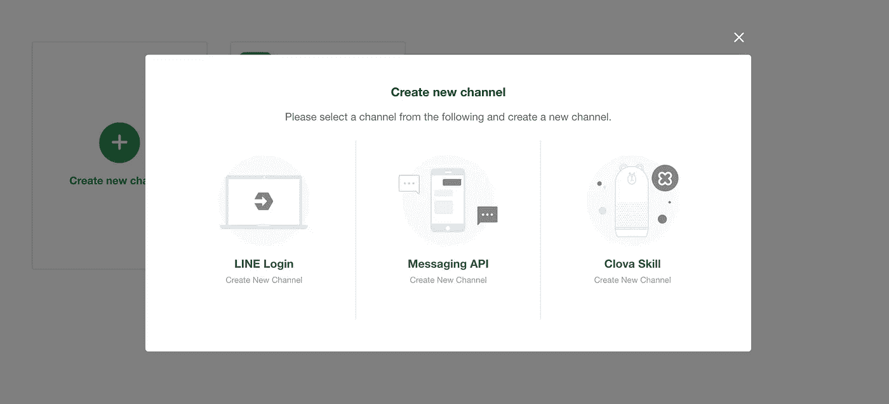
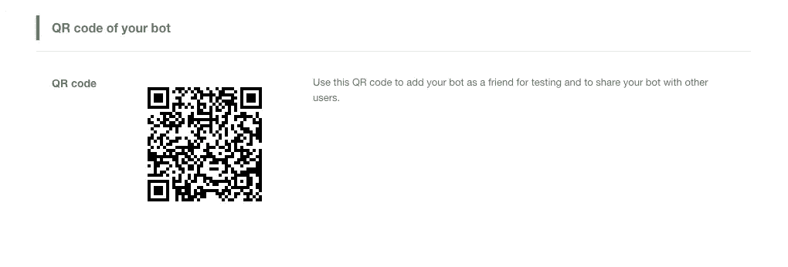
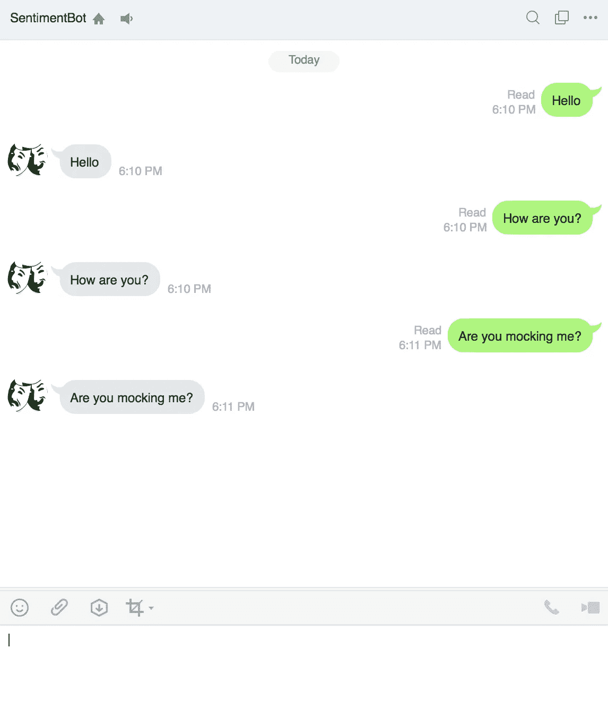
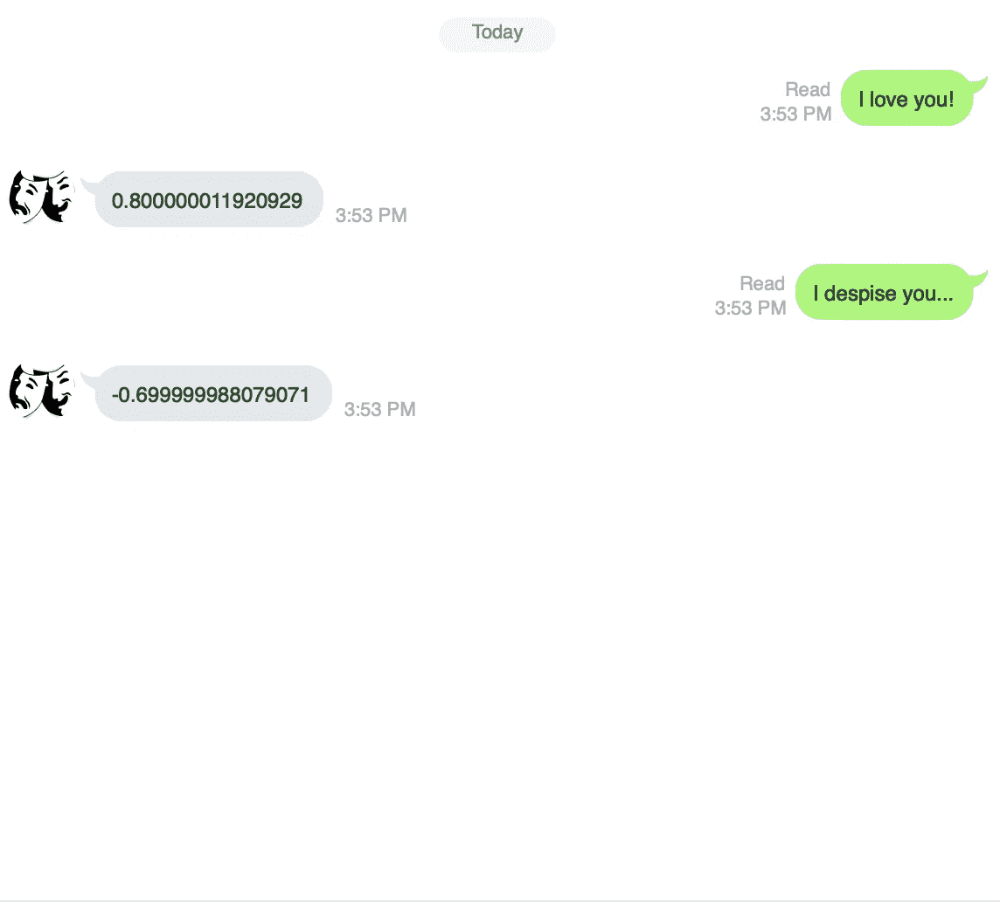
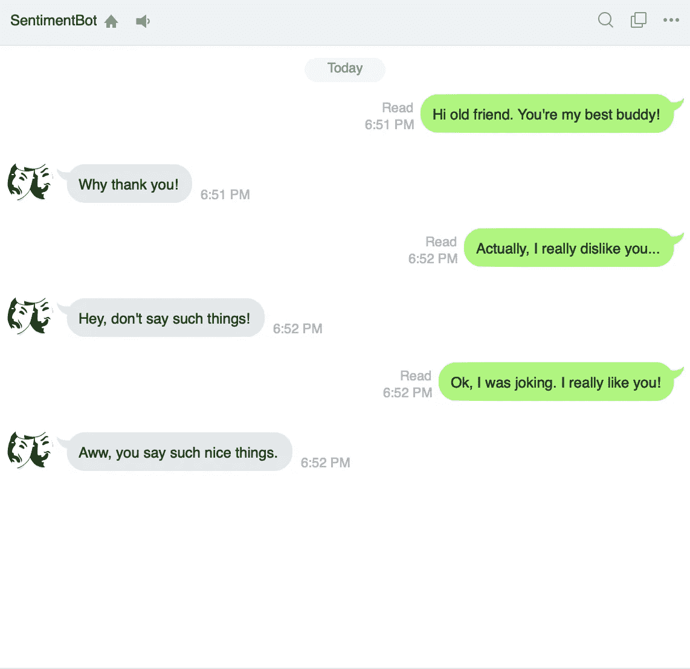

# 用 Google Cloud、聊天客户端和 Ruby 构建一个情感检测机器人。

> 原文：<https://towardsdatascience.com/building-a-sentiment-detection-bot-with-google-cloud-a-chat-client-and-ruby-cc280c61c6f0?source=collection_archive---------12----------------------->

# 介绍

在这个系列中，我将解释如何创建一个聊天机器人，它能够检测情绪，分析图像，并最终拥有一个不断发展的个性的基础。这是该系列的第 1 部分。

# 这些碎片

1.  红宝石
2.  西纳特拉
3.  谷歌云 API
4.  Line(聊天客户端)

因为我住在**日本:**


我将使用流行的聊天服务 [Line](https://line.me/en/) 作为我们的客户。对于情感检测，我们将使用[谷歌云自然语言 API](https://cloud.google.com/natural-language/) 。选择的语言将是 Ruby(因为，为什么不)，微框架 [Sinatra](http://sinatrarb.com) 作为我们的服务器。好了，让我们开始吧！

# 设置聊天客户端

Line 是这里非常受欢迎的聊天服务；然而，你不需要真的住在这里才能注册。所以你应该可以顺利跟进。

一旦下载了 app，做了账号，就可以在这里注册成为开发者: [Line 开发者页面](https://developers.line.me/en/)。

我们需要创建一个新的“提供商”:


和消息传递 API“通道”:



现在，我们必须给我们的频道一个名称(这将是我们的机器人的显示名称)，和应用程序图标(显示图片)。既然这是一个情感探测机器人，我们就用 apt 吧:“情感机器人”


Just a bit creepy…

创建时，请注意以下值:

1.  频道秘密
2.  通道访问令牌

此外，对设置进行以下更改:

1.  使用 webhooks: **启用**
2.  自动回复消息:**禁用**
3.  问候语:**禁用**

最后，我们必须设置我们的“Webhook URL”:这是 bot 和客户端通信的入口点。每当消息被发送到这个通道(我们的 bot)时，它将被中继到我们在这个字段中指定的任何端点。因为我们还没有，我们的下一步是创建一个。

# 设置服务器

服务器是我们的 bot 示例中的关键元素。实际上，它就是“机器人”。由于我们使用第三方聊天客户端(Line)作为我们的主要通信渠道，我们需要定义一个端点或 webhook，用于数据传输。

在这个上下文中，webhook 是一个 API 端点，聊天客户端将在收到消息时向其发布消息。然后由您(您的机器人)解析消息并提取必要的部分进行处理。处理完成后，我们会通过消息传递 API 将这些信息发送回我们的聊天客户端，最终由最终用户(即与您即将成为机器人的人)接收。

在这个例子中，我们将使用 Ruby 和微框架 Sinatra。

让我们继续创建我们的应用程序:

```
mkdir sentiment_bot && cd $_bundle inittouch main.rb
```

请注意，这些文件名和目录名完全是任意的，是为了简单和一致而选择的。

好了，让我们继续安装 Sinatra(我们的 web 框架),将以下内容添加到 Gemfile 中。

```
gem 'sinatra'
```

作为健全性检查，让我们创建一个准系统端点，当我们点击它时返回一个响应。作为“你好世界”的一部分，这将是我们的“こんにちは世界”。好了，我们开始吧，把下面的方法添加到 main.rb 中。

启动服务器:

```
ruby main.rb
```

并访问 localhost:4567/hello 。我们应该看到我们的问候响亮而清晰。世界上一切都是对的。现在，让我们设置端点，它将被用作聊天客户端和机器人之间的通信层。按照 Line 的要求，并且作为一个好的实践，这条路线将是一个“Post”，至于名称:“callback”是最好的。

将以下内容添加到 main.rb 中:

暂时把这条路留作空路也无妨。回到正题，我们的 webhook 需要是一个可公开访问的 https URL。然而，我们的服务器是在本地运行的。我们可以做到这一点的一个方法是将我们的代码推送到一个 [PaaS](https://en.wikipedia.org/wiki/Platform_as_a_service) ，比如 [Heroku](https://www.heroku.com/) ，但是这有点超出了本教程的范围。现在，让我们使用令人惊奇的服务 [Ngrok](https://ngrok.com/) ，用于 HTTP 隧道。在您安装了[ngrok 并启动了您的 web 服务器之后，您可以运行下面的命令来获取我们本地服务器的公共 URL:](https://ngrok.com/download)

```
ngrok http 4567
```

这告诉 ngrok 服务为本地端口 4567(这是 Sinatra 的默认端口)创建一个 URL。运行这个程序后，我们应该看到两个 URL 被打印到控制台，一个是 http，另一个是 https。我们将使用 https URL。它应该类似于:

```
[https://some_hex_string.ngrok.io](https://some_hex_string.ngrok.io)
```

复制它，并输入它作为您的僵尸网络挂钩网址，如下所示:

```
[https://some_hex_string.ngrok.io/callback](https://some_hex_string.ngrok.io/callback)
```


附加路径“callback”指的是我们刚刚在 main.rb 中添加的“post”方法。

一旦你输入了网址，你应该会看到一个“验证”按钮。点击后，我们应该看到对本地服务器的点击，并在线确认成功。


Upon Successful Verification

下一步是将我们的机器人添加为在线好友，并尝试与它交谈。我们没有给它任何功能，所以我们在这里的目标只是看看是否一切都通信正常:也就是说，当一个消息被发送到我们的机器人，我们的回调 url 实际上被触发。

使用您的 Line 移动客户端扫描为您的机器人提供的二维码。一旦你添加了你的机器人，给它发一条信息。您应该会再次看到我们的服务器被点击。



Sure, go ahead and add my bot.

我们已经验证了所有的东西都是相互关联的，但是如果聊天机器人不说话的话，它会很无聊。现在开始有趣的部分。

# 设置 Line SDK

当然，我们可以使用他们的文档编写自己的 Line API 工具，但这很耗时，超出了本教程的范围。还有，Line 刚好有官方 SDK。

将以下内容添加到您的 gem 文件中，并运行软件包安装:

```
gem 'line-bot-api'
```

既然已经安装了 gem，我们需要设置我们的凭证(可以从我们的开发控制台中获得)。

将以下导入添加到 main.rb 中

```
require 'line/bot'
```

以及以下内容:

这个方法将允许我们向我们的 bot/channel 发起经过验证的请求。你制作的每一个机器人都有一个唯一的秘密和访问令牌——你不应该公开这个信息，或者把它登记到你的版本控制系统中。

让我们继续设置从第行接收到的环境变量:

```
export LINE_CHANNEL_SECRET="you_channel_secret"
export LINE_CHANNEL_ACCESS_TOKEN="you_access_token"
```

现在，让我们将我们的“回调”函数更改如下(摘自 Line 的 sdk 文档):

现在，我们的机器人应该作为一个回声服务器，让我们来测试一下。



Rude…

好的，一切看起来都很好！我们已经将我们的机器人命名为“感知机器人”，所以它应该能够检测情绪。在自然语言处理的上下文中，情感测量给定输入相对于人类情感是消极的还是积极的(即，坏的还是好的)。一句“我爱你！”会被认为是积极的，而“我恨你！”会被认为是负面的。

# 设置 Google 自然语言

如果这是你第一次使用谷歌云，也就是谷歌最新的认证系统，那么你可以在这里查看他们的详细文档:[https://Cloud . Google . com/natural-language/docs/quick start-client-libraries](https://cloud.google.com/natural-language/docs/quickstart-client-libraries)。

一旦你完成了你的项目设置并且你的授权已经排序，我们就可以继续将 ruby 客户端添加到我们的 Gemfile 中，当然也可以运行 bundle install:

```
gem 'google-cloud-language'
```

如果您已经正确设置了您的服务帐户并安装了客户端 SDK，那么从[文档](https://github.com/GoogleCloudPlatform/ruby-docs-samples/blob/master/language/quickstart.rb)中复制示例代码并运行它。如果一切正常，您应该会看到类似下面的输出:

```
Overall document sentiment: (0.30000001192092896)
Sentence level sentiment:
Hello world: (0.30000001192092896)
```

一旦这些都工作了，让我们把它集成到我们的 bot 服务器代码中。目前，我们的机器人只模仿发送给它的任何文本或图像，但现在有了谷歌的力量，让我们把它变得更花哨一点。我们接下来的步骤如下:

1.  阅读发送给机器人的任何文本
2.  发送文本到谷歌进行情感分析
3.  通过我们的机器人返回给用户的情绪得分

首先，让我们做一个检测并返回其输入情感的函数。我们可以通过以下方法做到这一点:

这些方法非常简单。“ **google_language_client** ”简单地实例化客户端，而“**get _ opinion**”使用所述客户端并返回任何可行文本输入的情感分析。

让我们将“/post”路线更改为以下内容:



That settles it…

假设你所有的外部服务都设置正确，你应该可以和你的机器人聊天，它会返回你的文本的情感分数。让我们试一试:

对于任何不幸与这样的机器人互动的人来说，仅仅返回一个情感分数是非常无聊的。让我们给它一点个性。

让我们将 main.rb 文件修改如下:

我们在这里做了一些改变。首先，我们添加了一些常量来保存我们的文本响应，我们还添加了一个新方法“**get _ perspective _ response**”，它检查情感得分并返回一个适当的回复。让我们试一试:



我们做到了！我们的机器人可以检测消息中的情绪，尽管词汇量有限，并做出相应的响应。

在本系列的下一篇文章中，我们将通过使用谷歌云视觉 API，让我们的机器人能够理解我们发送给它的图像。