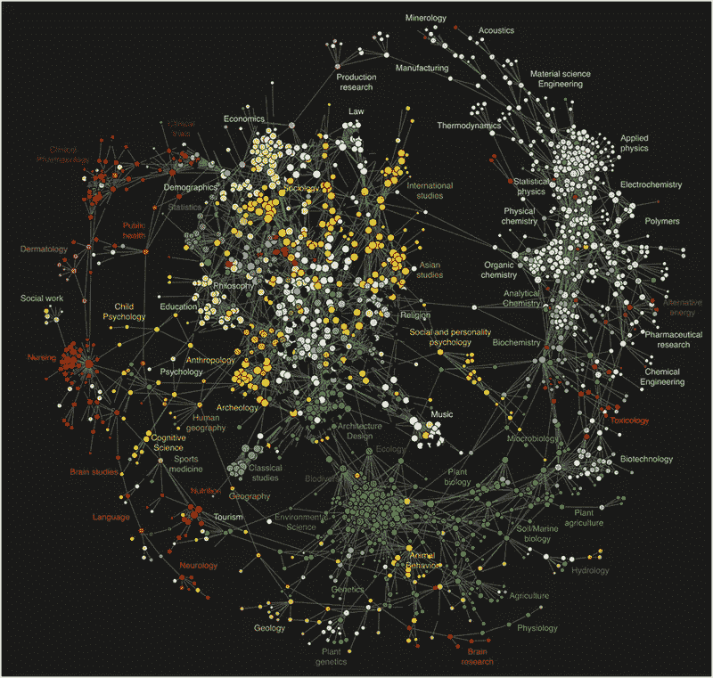

# 构建溶解度预测器

> 原文：<https://towardsdatascience.com/building-a-solubility-predictor-e9390de6a8?source=collection_archive---------22----------------------->

## 科学名义下的神经网络

人们正在沉睡于 21 世纪最激动人心的事件之一；技术和科学的交汇点。就像两个星系碰撞一样，随着我们开始意识到并获得合作的好处，科学和技术正在继续模糊行业之间的界限。

The real tree of knowledge; science, arts, and technology

最引人注目的合作项目之一是人工智能和化学之间正在萌芽的新关系**。***的起点*化学信息学加速了过去陈旧的研究过程，让工业和学术界的研究团队转向更快的化学创新。这些新的见解为研究开辟了新的途径，并释放出一个非常重要的副产品:**数据。**

我们对科学的理解让我们看到了更大的图景，现在比以往任何时候都更加明显的是，物理学和生物学、电子学和纺织以及其他任何领域之间几乎没有什么区别。我们的研究方法已经从经验主义转向更加数据驱动的方法，特别是当我们开始理解我们所拥有的数据中的潜在模式时。

> 数据有助于进行预测，运行模拟，并用于一整套计算过程，这些计算过程将科学方法的速度提高了好几年；随着我们收集的数据越来越多，速度只会越来越快。

尽管仍然供不应求，特别是与文本、数字和图像数据的巨大数据集相比，化学数据正在慢慢增加，并且一线希望是明显的；我们越来越接近技术融合。尤瓦尔·诺亚·哈拉里认为，正是数据/人工智能和生物学/生物技术的融合将决定人类的未来。如果生物学确实是数据的阴阳两极，那么物理学和化学就是这场婚姻的催化剂。毕竟:

> 生物只是活化学，化学技术上只是应用物理。

尽管如此，方向是明确的；我和化学是天作之合。

# 项目已解散

使用 SMILES 分子表示格式，我建立了一个能够预测给定分子溶解度的神经网络。在超过 1000 个数据点的数据集上训练，预测器能够以相当高的精度预测分子的溶解度。

该项目分为 4 个部分

1.  导入、格式化和规范化带标签的 SMILES 数据集
2.  将微笑转化为分子，然后转化为二进制指纹
3.  构建深度神经网络模型
4.  编译、拟合、训练和测试模型

使用与我的分子电荷分类器神经网络类似的技术，我将微笑字符串转换成每个 256 位的二进制指纹。这允许算法为每个输入神经元输入一位(因此有 256 个神经元输入层)。由于溶解度可能是负值，我使用了 tanh 激活函数，因为 tanh 表示负值。

作为损失函数，该项目使用带有 Adam 优化器的均方误差，因为两者都非常适合于单输出预测。利用我的 1000 个分子的数据集，我以 0.0005 的学习速率和 5 的批量大小训练算法，超过 200 个时期。1000 个微笑字符串中的 10%被保留作为验证数据。

经过训练，我意识到虽然损失确实在减少，但准确率一直低于 1%。在对潜在的错误进行了大量的努力之后，我意识到问题不在于算法或者我的数据预处理技术；问题在于数据本身。经过一些研究，我了解到溶解度是由成分和结构决定的。这是非常重要的，因为我的数据格式没有显示三维结构，只有分子的组成部分。

然而，更重要的是环境变量。温度和压力等外部条件会影响分子的溶解度。算法中没有指定这些条件，因此无法对算法进行训练。

从本质上讲，有一些因素可以增强和解决这些问题:

1.  规定的环境参数
2.  更多标记的数据点
3.  一种更体贴的分子表示方法

最终，该算法未能以有意义的准确性预测被搁置的 10 种测试分子的溶解度。同样的算法可以用于其他目的，所以我把代码上传到了 Github。知识库包括 2 组数据和模型文件。

为了继续探索人工智能和化学之间的互利关系，必须记住一些必要的行动:

1.  跨两个字段共享数据
2.  与两个领域的专家合作
3.  发展共同语言/共同点
4.  发展势头并自动化流程

如果我们继续走这条路，可以毫不夸张地说，也许有一天，化学创新将掌握在我们人工智能创造的安全手中。

# 关键要点

1.  随着科学、技术和工业的碰撞，未来取决于我们的创新
2.  由于技术的发展，科学之间的界限正在被跨越；更确切地说，多亏了数据
3.  神经网络受益于可用数据的激增，使得预测、分类和生成的结果更加准确
4.  A.I 从给定数据集中的模式中学习；如果没有相关性，人工智能的输出将会非常不准确。
5.  当我们将我们的人力资源、语言和数据集中在一起时，我们可以更有意识地加速开发。