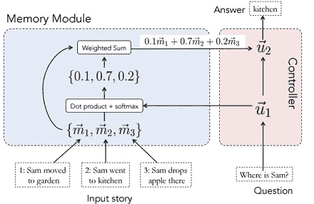

# 打造 AI 聊天机器人！

> 原文：<https://towardsdatascience.com/building-an-ai-chat-bot-e3a05aa3e75f?source=collection_archive---------1----------------------->

*第五章:用数据做酷事！*

特定领域的聊天机器人正在成为现实！使用深度学习聊天机器人可以“学习”提供给它的主题，然后能够回答与之相关的问题。像这样的技术的应用是无止境的。你只需提供关于某个主题的数据，然后看着机器人成为这方面的专家。

在这个博客中，我们将建立一个可以回答逻辑推理问题的博客。是的，这是可以做到的！见下图 gif:

链接到我的 [**GitHub**](https://github.com/priya-dwivedi/Deep-Learning/tree/master/qa_chat_bot) 用 Python 写的完整代码。

我们是这样做的:

数据:这里使用的数据是由脸书人工智能研究所开源的。bAbI 数据集由脸书创建，旨在实现自动文本理解和推理。这是一组 20 个问答任务，每个任务由几个上下文问答三元组组成。每个任务旨在测试推理的一个独特方面，因此，适合测试 QA 学习模型的特定能力。

下面是第二个任务中的一个例子，两个支持事实(QA2):

约翰搬到了卧室。玛丽在那里抓起了足球。桑德拉去了卧室。桑德拉回到了走廊。玛丽搬到了花园。玛丽去了办公室。
问题:**足球**在哪里？

答:办公室基于报表 2、6

每个问题有 1000 个训练例子。该数据集具有合成生成的故事，因此词汇非常有限，并且句子形式非常受限。一方面，这些限制使 bAbI 成为学习的理想数据集——不需要进行太多的数据清理，人们可以专注于模型构建。另一方面，他们对在一个控制不那么严格的环境中把 bAbI 上的结果推广到 QA 的能力提出了质疑。

**深度学习模型**:对于这个问题，我们使用了一个端到端的记忆网络，它是由脸书人工智能研究所设计的。

让我们首先讨论为什么带有 [LSTM](http://colah.github.io/posts/2015-08-Understanding-LSTMs/) 细胞的递归神经网络不能很好地解决这个问题。

1.  数据可能不得不无序访问。请参见下面的示例:

2.如果我们想通过网络“记忆”一本书或一段视频，我们需要长期记忆，而 LSTM 细胞实际上对长期记忆问题不起作用

端到端存储器网络使用外部存储器来解决这个问题。并且它可以在数据中执行多次查找(跳跃)来解决无序数据问题。简单来说这是什么意思？

该型号有两个模块—内存模块和控制器模块。记忆模块把我们要讲的故事写成了向量。由于计算机无法理解单词，我们需要将单词转换成数字/向量。我们不是将每个单词都转换成一个数字，而是使用一种叫做嵌入的技术，这种技术赋予意思相似的单词相似的向量。例如，由于单词“拾起”或“举起”具有相似的含义，因此它们将具有相似的向量，这有助于机器更好地理解单词之间的上下文。张量流嵌入功能可用于生成单词到向量。

控制器模块将被询问的问题写成向量。请参见下面的示例:

然后我们做控制器函数和记忆向量的点积。然后我们做一个 softmax，将总概率缩放到 1。并且这被传递回控制器。在上面的例子中，因为这个神经网络考虑了句子的顺序，所以它给第二个句子较高的权重。我们可以把得到的概率(上面的 0.1，0.7，0.2)看作是暗示网络“关注”哪个向量。

这个过程可以重复几次(也称为跳跃)，控制器有能力学习和重新查看存储向量，并再次做出选择。请看下面网络如何通过建立在前一跳中学到的知识来关注不同的向量

最后，输入被传递到一个解码器和向量，并转换成文字。

这是一个相当复杂的神经网络架构，是该领域的前沿技术。如果您想了解更多信息，请参考下面的参考资料。

总的来说，这对我来说是一次很棒的经历，我对学到的东西很满意。

**其他著述**:【https://medium.com/@priya.dwivedi/】T2

PS:我住在多伦多，我希望将职业生涯转向深度学习。如果你喜欢我的帖子，并能把我联系到任何人，我将不胜感激:)。我的电子邮件是 priya.toronto3@gmail.com

**参考文献:**

[Udacity](https://www.udacity.com/) 深度学习纳米学位为我提供了详细探索这个领域的动力

[Keras 巴比记忆网络](https://github.com/fchollet/keras/blob/master/examples/babi_memnn.py)

[脸书研究论文](https://arxiv.org/pdf/1503.08895.pdf)

Stroh 和 Mathu 的研究论文

http://smerity.com/articles/2015/keras_qa.html

端到端存储网络的好解释:【https://youtu.be/ZwvWY9Yy76Q 