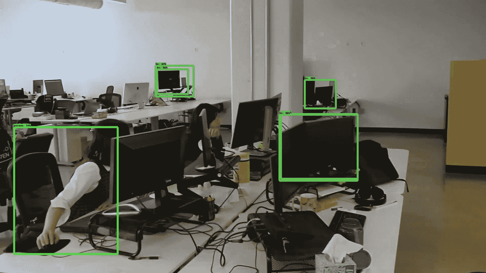

# 构建和测试一个简单的深度学习对象检测应用

> 原文：<https://towardsdatascience.com/building-and-testing-a-simple-deep-learning-object-detection-application-b2e6f07b9fba?source=collection_archive---------1----------------------->

深度学习是目前的热点。非常性感。这是因为在感知领域，可用的数据比以往任何时候都多。我所说的感知是指诸如图像中的物体识别、自然语言处理、语音检测等任务。基本上，我们每天都会产生大量的数据。许多公司都很好地利用了这些数据。谷歌，脸书，英伟达，亚马逊等。因为他们可以访问这些数据中的大部分。作为用户，我们很乐意通过我们所有的社交媒体帖子和在线存储利用率将它提供给他们。在任何情况下，我都想让大家体验一下，你可以用一个相对较小的卷积神经网络来检测图像中的许多不同对象。具体来说，我们将使用一种称为 MobileNet 的网络架构，它可以在较小的设备上运行。幸运的是，你可以接触到预先训练好的模型并进行测试。这正是我们今天要做的。

# 数据基础

该模型已经在 [COCO](http://mscoco.org/) 数据集(上下文中的公共对象)上进行了训练。就像听起来这个数据集包含了很多我们在日常生活中经常看到的物体的图像一样。具体来说，它由 90 个不同物体的 30 万张图像组成，例如

*   水果
*   车辆
*   人
*   等等。

# 模型

我们使用的型号是“带 MobileNet 的单次多盒探测器(SSD )”,位于[这里](http://download.tensorflow.org/models/object_detection/ssd_mobilenet_v1_coco_11_06_2017.tar.gz),下载需要一点时间。它是用谷歌的协议缓冲格式存储的。我知道你在想什么:为什么要发明另一种结构化存储格式？在谷歌的辩护中，这是非常酷的。基本上，它是一种语言中立、平台中立、可扩展的序列化结构化数据的机制——想想 XML，但是更小、更快、更简单。一旦定义了数据的结构化方式，就可以使用专门生成的源代码，使用各种语言轻松地将结构化数据写入各种数据流或从中读取。

# 卷积神经网络

A Generic Convolutional Neural Network Architecture with Kernel filters and Pooling layers

在我们查看结果之前，让我们快速介绍一下卷积神经网络到底是什么，以及为什么它们在图像分析方面比普通的多层感知器更成功。使用卷积神经网络背后的整个想法是，我们需要网络是平移和旋转不变的。这仅仅意味着我们需要能够识别一个物体，不管它在图像中的什么位置。实现这一点的一种方法是在图像上滑动对特定图案起反应的补丁。你可以把它想象成一个过滤器，当它检测到什么东西的时候就会亮起来。当然，我们不知道我们在寻找什么，因此这些过滤器是在训练中学习的。一般来说，在深度学习中，我们在初始层中学习较低级别的特征，而后面的层捕捉更精细的特征。这很酷，因为我们可以保存最初训练的早期层，并在其他模型中重用它们。

# 结果

下面的视频是我在建模团队工作时用手机拍摄的。正如你所看到的，这个模型确实很成功地识别了一些物体。但是它也没有检测到其中的许多。这有很多原因。其中之一是这个模型是针对速度而不是性能进行优化的。

Detecting Modelers using our convolutional neural network!

在这篇短文中，我向你展示了如何利用之前拟合的卷积神经网络对回顾视频中的对象进行分类。然而，这可以从网络摄像头或监控摄像机扩展到活动物体检测。如果你对自己做这件事感兴趣，看看 Tensorflow 的例子[这里](https://github.com/tensorflow/models/blob/master/research/object_detection/object_detection_tutorial.ipynb)。

黑客快乐！

*最初发表于*[*doktormike . github . io*](http://doktormike.github.io/blog/A-simple-object-detection-app/)*。*