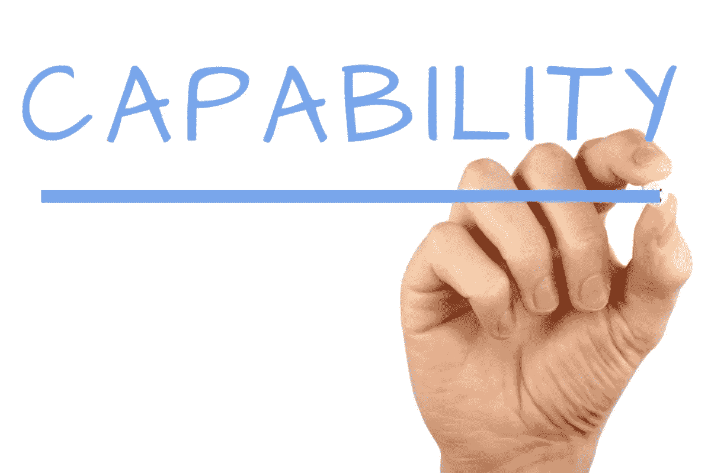

# 在组织中构建数据科学能力

> 原文：<https://towardsdatascience.com/building-data-science-capabilities-in-organizations-354705c1f868?source=collection_archive---------11----------------------->

在个人讨论或社交活动中，企业所有者、部门/职能负责人经常问我这样一个问题:“我相信数据科学的力量，但我该如何开始？”。所以这篇博文是我回答这个问题的尝试。

**记住什么**

在构建数据科学能力和制定路线图时，务必记住“*价值必须始终领先于成本*”。我看到过无法在构建数据科学能力方面创造可持续发展势头的努力，因为成本(主要是基础设施)远远超过了价值。随着成本的增加，许多人将被迫展示成果，如果没有对项目进行适当的规划，努力将无法持续。

**雇佣一名经验丰富的数据科学家**

是的，要开始，请雇用一个有经验的(！！！)数据科学家。为什么你可能会说是一个有经验的数据科学家，而不是那些有“数据科学家”头衔的人？经验丰富的数据科学家应该具备快速理解数据的专业知识，并确定是否有任何“唾手可得的果实”可以通过组织可以轻松访问的工具来采摘，如 Excel 或开源。这些“唾手可得的果实”与工具一起为组织提供即时(大约 1-2 个月的等待，取决于数据质量)价值。这些项目将被用来从组织的其他部分获得认同。

鉴于数据科学家是一个永久性职位，有时雇佣数据科学家可能是一个高风险的策略(数据科学家的需求量很大，所以请不要考虑尝试以合同形式雇佣)。另一种方法是聘请一位做过数据科学项目的顾问。顾问可以筛选可用的数据，并确定是否有足够的“低挂果实”。

*旁注*

我见过一些组织雇佣已经完成硕士或训练营的人，并希望他们知道如何处理现有数据。这些“新”学员中的大多数需要导师进一步指导，以便他们知道如何从数据中筛选见解。在数据科学中，经验真的很重要！

**采摘更多水果**

鉴于现有数据已经证明了足够的价值，下一步是从两个方面着手:(1)数据治理和管理(2)基础设施

(1)数据治理和管理

证明了数据的价值之后，就应该建立流程来管理数据，确保数据具有更高的质量，从而缩短从提取数据到以合适的质量使用数据之间的时间。这将允许数据快速转化为决策见解，进一步推动价值包络。

基于最初的几个项目(又名“低挂的果实”)，组织现在还可以查看可以捕获哪些进一步的数据(以合理的成本)，以便提高他们的洞察力。

(2)基础设施

从管理层那里获得了更多的认同后，组织现在可以在基础设施上工作了。构建基础设施通常需要更大的预算，因为需要与现有系统集成并存储数据。但是，由于我们有“低挂的果实”可以展示，现在就可以更容易地要求建立预算，管理层也将更有信心，预算将用于为组织创造更多的价值。

*旁注*

我在很多情况下看到，组织在没有关于如何使用它们的适当计划的情况下就购买了“大数据”技术，甚至更糟糕的是，是否有必要使用它们。最终，构建数据科学能力的势头没有持续下去，原因有多种，例如，创造的价值(如果它们是在最初创造的)不足以覆盖基础架构成本，这些组织被“白象”困住了。从这种失败的尝试中得出的结论是管理层不再相信数据科学(谁能责怪他们),这对我来说是非常可悲的，因为组织已经失去了竞争的机会。

所以记住我说的，“*价值必须永远领先于成本。”*

**基础设施越好&数据越多，价值越大**

设置基础架构和数据治理流程可能需要一些时间，比如 6 到 12 个月。在此期间，组织应该继续寻找更多的数据科学项目，为组织创造价值。有了更好的基础设施和数据质量，价值/时间花费比率将会增加。这种增长将带来另一个机会，投入更多的资源来建立更好的基础设施、更大的团队和收集更多的数据。

随着价值跑在成本前面，并确保它保持这种方式，它将创建一个良性循环，在适当的时候，数据科学能力将建立起来，并留在组织中。

**结论**

当然，这只是关于如何构建数据科学能力的一个非常简单的描述。考虑到不同的领域，还会有其他的考虑。但最终，我想传达的最重要的信息是“*价值必须永远领先于成本*”。否则，这种努力是不可持续的，组织可能会失去在这种动态和恶劣的环境中生存所必需的竞争优势。

希望博客有用！祝您的数据科学学习之旅愉快，请务必访问我的[其他博客文章](https://medium.com/@koolanalytics)和 [LinkedIn 个人资料](https://www.linkedin.com/in/koopingshung/)。