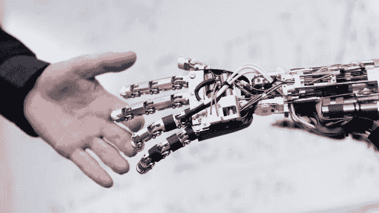

# 在医疗保健中建立伦理人工智能:为什么我们必须要求它

> 原文：<https://towardsdatascience.com/building-ethical-ai-in-healthcare-why-we-must-demand-it-ca60f4d28412?source=collection_archive---------11----------------------->

有一个学派思考着一个黑暗的、反乌托邦式的未来，在那里，人工智能机器残酷而冷酷地统治着世界，人类只是一个生物工具。从好莱坞大片到福音派科技企业家，我们都接触到了这种未来的可能性，但我们是否都停下来思考我们应该如何避免它？当然，现在所有这些反乌托邦都是几十年后的事了，而且只是未来无数可能结果中的一个。但这并不排除今天就开始对话。

对我和许多其他人来说，这可以归结为一件简单的事情:伦理。把你的道德规范搞对了，理论上，机器永远也不能接管和支配一个机器大脑版本的宇宙。在更简单的层面上，我们需要开始考虑如何避免不人道的决定，特别是在它们有可能对我们伤害最大的地方:在医疗保健的生死环境中。我们离完全自动化的医疗保健系统还有很长的路要走，然而，现在，人工智能正在被开发来帮助增强医生的决策。但是如果其中一些决定是错误的呢？

在这篇博客中，我将讨论 NHS 最近令人震惊的新闻，这些新闻突出了为什么每个人都应该要求有道德和负责任的人工智能。

首先，我需要告诉你一个故事…

## 一个电子表格错误如何摧毁生命

瑞秋和她的搭档大卫(化名)都是英国国民医疗服务系统的初级医生。他们在医学院相遇，一起度过了艰难的期末考试，经历了两年医学院基础培训后的测试环境，并庆祝他们最终被各自医学专业的培训岗位录取。

雷切尔想成为一名对中风护理感兴趣的全科医生，并在英格兰北部的一家领先单位工作。大卫正在接受心理医生的培训，并在 80 英里外的一家精神病院工作。尽管很难找到一个他们都能在合理的通勤距离内生活的地方，但他们迄今为止已经通过在工作地点中间的一个村庄租一套小公寓，找到了工作与生活的某种平衡。每当需要值夜班时，雷切尔就住在离她医院更近的朋友家，有时长达一周。需要的时候，大卫呆在他父母那里。他们同意，这种安排只会持续很短的两年，直到他们找到完美的高等培训工作，最终让他们能够更紧密地合作，买房子，组建家庭。

当申请下一份工作(被称为 ST3 选择)的时候，他们兴奋地开始一起规划他们的生活。他们画了一张他们想要居住的地区的地图，在他们想要工作的所有医院，他们想要靠近的城镇和城市中标出精确的位置，并用虚线和通勤距离、抵押贷款利率和好学校的计算将它们联系起来。最后，他们找到了田园诗般的伴侣。雷切尔和大卫决定申请同一个院长职位，以增加他们匹配大型教学医院的机会，该医院也有一个精神病科，位于一个拥有广阔农村郊区的好镇上，他们觉得他们可以在那里定居并抚养孩子。

他们辛辛苦苦地填写申请表，确保收集大量参考资料，参加课外课程以充实简历。当提交日到来时，他们俩在自己的小客厅里挨着坐，腿上放着电脑，数到三后一起在对方的屏幕上点击“提交”。这就是他们的未来。他们十指交叉着上床睡觉，梦想着他们未来的共同生活。

几个星期后的采访中，结果出来了！雷切尔和大卫一起打开了他们的电子邮件，读完之后，转向对方，两个人都说“你收到了吗？”…

“是的！”，他们都喊道。他们拥抱在一起。雷切尔在大卫的怀里哭了起来，巨大的起伏纯粹是解脱的抽泣。一个半小时的通勤时间过去了，数周的夜班工作结束了。买房子的机会现在实现了！就是这样，他们要一起开始正常的生活。第二天，他们开始找房子。他们申请了抵押贷款，递交了辞呈，准备开始新的生活。一天晚上，在纸板箱和两杯喝了一半的葡萄酒的包围下，大卫单膝跪地求婚了。他答应瑞秋他们会在几个月内结婚并住在自己的房子里。很自然地，她说“是”。

然而，第二天，他们[收到了一个炸弹壳](http://www.st3recruitment.org.uk/news/major-issue-with-st3-2018-r1-process-offers-to-be-re-run) …

显然，在一些候选人的排名中存在“行政错误”,因此，向一些人提供了不正确的职位。全国所有的工作机会都被立即撤回。

瑞秋是受影响的医生之一。这个消息是在一个周五的晚上晚些时候发布的，就在一个为期三天的银行假日周末之前。三天不知道，不确定和痛苦，梦想和期望破灭。目前没有人知道最终的结果会是什么。雷切尔和大卫不得不等待，看看未来会发生什么。突然之间，他们计划好的生活感觉好像还没来得及开始就被夺走了。

> 因为一个不人道的错误，已经存在的和将要产生的生命实际上被搁置了。

如果这个错误确实影响了瑞秋，而且她在别处找到了一份工作，在一个很远的地方，那么他们将不得不考虑现实，放弃购买他们梦想中的房子，放弃他们今年结婚的计划，甚至现在推迟要孩子。它的不人道是压倒性的。

现在，在这个故事中，重要的是要注意到这个错误，[完全真实，并影响到今天英国的初级医生](https://www.rcplondon.ac.uk/news/rcp-apologises-st3-recruitment-error)，是一个[脚本编程错误](https://twitter.com/rsnipps/status/992483817272369152?s=21)，而不是“人工智能”。显然，一些电子表格的格式互不相同，用于编译结果的自动化脚本没有考虑到这一点。然而，它赤裸裸地凸显了行政系统对问责制、稳健性和准确性的道德需求，尤其是因为人工智能被吹捧为非常相似的任务的替代工具。

皇家内科医生学院目前正在解决这个问题(这在 Twitter 上产生了典型的英国标签 [#ST3cockup](https://twitter.com/search?q=%23ST3cockup&src=tyah) )，在撰写本文时，仍有许多像 Rachel 和 David 这样的初级医生仍在等待发现这个错误对他们和他们的家人意味着什么。

英国的初级医生越来越觉得他们是一种可消耗的资源，而不是护理系统中的人。这个错误发生在最近的[Bawa Garba 医生](http://www.pulsetoday.co.uk/your-practice/regulation/gmc/bawa-garba-timeline-of-a-case-that-has-rocked-medicine/20036044.article)案件(一名初级医生在极其不公平的情况下被取消行医资格)尘埃落定之时，也是在极具破坏性的[初级医生因他们强加的新工作合同而罢工](https://en.wikipedia.org/wiki/Junior_doctors_contract_dispute_in_England,_2015)仅几年之后。对于一个行政系统来说，产生这样一个令人震惊的新错误，其影响仍在显现，在这样一个脆弱的时刻，听到 NHS 医疗队伍的喧嚣和失望并不奇怪。

## 将道德融入一切

然而，这里有一个更广泛的图景，我想重点关注:需要深入考虑自动化的潜在影响。

想到如果没有建立道德的人工智能，我们作为一个社会，就有可能将盲目的自主系统引入其中，从而做出比上面的例子更加残酷和不透明的决策，这令人心痛。人工智能没有能力理解一个更大的社会背景来评估它的错误，如果这样的管理错误是由一台机器犯的，我敢肯定骚动会更大。就目前的情况来看，很可能会有人被炒鱿鱼。但是，如果机器脑袋犯了类似的错误，它们会滚动吗？

最近，有一份由威康信托基金资助，由[未来倡导](http://futureadvocacy.com/#intro)撰写的精致报告发表了，关于[人工智能在健康](http://futureadvocacy.com/s/EthicalSocialPoliticalChallengesAIHealth.pdf)领域面临的伦理、社会和政治挑战。这篇报道中有几段话引起了我的注意:

> "..一些算法错误会系统性地加重某些群体的负担，如果我们只看整体表现，这个问题就不一定明显。”

我完全同意这种说法。将它放在 ST3 申请错误的背景下，很明显，某些年轻医生群体比其他人负担更重，只有当那些受影响的人开始报告时，问题才可见。我毫不怀疑，无论是谁编写了令人不快的电子表格脚本，都已经检查过它的工作情况(即总体性能良好)，但是完全不知道他们的代码能够做什么，并且很可能只有在众所周知的成功之后才被通知。

> “……一个系统越开放，包括在算法工具的开发、试运行和采购方面，用户就越能感受到风险的保护……”

在这种情况下，第二种说法也很有趣。如果招聘和选拔系统更加开放、透明，甚至与受其影响的人共同设计，这个错误还会发生吗？例如，如果初级医生知道排名系统、电子表格的格式和用于编译结果的代码，会有人事先注意到吗？现在，我并不是说在这种情况下，我们应该以理想的透明度为目标——我只是提出一个问题“我们在封闭系统和透明系统之间划一条线？”

当涉及到将人工智能和自主系统转化为更具潜在危险的情况时，如生死决策(如自动驾驶汽车、癌症诊断)，伦理问题就显得更大了。

我很幸运地与来自 T2 布里斯托尔机器人实验室的艾伦·温菲尔德教授相处了一段时间。他是伦理人工智能和机器人方面的杰出思想家，被广泛认为是该领域的权威。他正与 IEEE 合作，为未来技术引入道德规范创建新标准，这显然是一个热门话题！我从他那里学到的是，一个系统只有在充分考虑并包含了它可能影响的所有人之后，才是不道德的。这是一个非常有趣的想法，我认为应该全面推行。

## 统计是不道德的

人工智能本质上是一种计算统计学。在数学上，医疗保健中提供分类输出(例如，扫描中的“癌症”或“非癌症”)的人工智能系统可以在接收器操作者曲线(ROC 曲线)上进行评估。(放心吧，我不是要开什么统计学的讲座)。作为一个外行读者，你需要知道的是，这些曲线是一种简单的方法，可以很容易地比较系统。一个系统表现得越好，曲线就越向左上方移动。一个完美的 100%精确的系统甚至不会是一条曲线，它会是图表左上角的一个直角。

Three ROC curves: AUCc performs the best, but the area outside the ROC curve is still an ethical conundrum

在本例中，AUCc 表现最佳，ROC 曲线下面积(AUROC)约为 99%。这近乎完美，但还不够。AUCb 次之，AUROC 约为 85%，AUCa 表现最差，AUROC 约为 80%。在医疗保健领域，你可以绘制人工智能系统的 ROC 曲线，并将其与人类表现进行比较。在媒体上，当你听到一个人工智能“击败人类”时，往往是因为 AUROC 更好，或者曲线位于人类在图上操作的点的上方和左侧(我不会进一步深入语义——但相信我，这个话题有很多激烈的辩论)。

然而，AUROC 是不道德的。事实上，这是完全不道德的。它只报告积极的成功率，而完全忽略了消极的。有一个几乎没有人考虑的伦理灰色区域——我称之为 ROC 曲线(AOROC)外的*区域。这个区域可以被认为代表了人工智能系统做出错误决定的所有可能时间。与一系列人类医生相比，人工智能系统的这个领域可能更小，但人类至少可以理解和认识到自己的错误，改变自己的想法，并解释他们的推理。*

在上面的例子中，最佳性能系统的 AOROC 面积非常小，可能只有 1%左右。但是，当这 1%的人的自动化决策不正确时，这对他们意味着什么呢？我们如何训练系统认识到它们什么时候错了，以及如何改变它们的想法？我们如何在风险缓解中考虑这些错误以及它们可能带来的潜在生活改变效应？这些问题的答案很难回答，因此经常被忽视。

当我读到主流媒体报道“计算机在 X 击败医生”时，我很恼火，因为我知道在这条线上的某个地方，在 ROC 曲线之外的区域内的风险被忽视了，甚至被理应支持临床安全的医疗器械监管机构忽视了。我向阅读这篇文章的任何人发出挑战，让他们为我找到一个监管机构批准的人工智能系统，该系统发布了关于其失败率的统计数据，以及一份关于他们如何减轻可能受到不利影响的那些人的道德声明。我试图找到这些，但是失败了。

更糟糕的是，这些统计数据完全没有考虑到基础训练数据中的偏差。例如，当他们的高性能分类系统[将黑人标记为大猩猩](https://www.theverge.com/2015/7/1/8880363/google-apologizes-photos-app-tags-two-black-people-gorillas)时，谷歌不得不公开道歉，仅仅因为训练数据没有包括白人那么多的黑人面孔。ROC 曲线永远无法证明这种类型的数据偏差，因此我们必须强制使用其他透明方法，以确保人工智能开发人员在陈述他们的性能的同时陈述他们的数据质量。

## 道德方面的工作已经开始

令人欣慰的是，越来越多的人一致认为，人工智能的伦理是绝对必要的。我咨询的最近一份上议院特别委员会报告强烈建议[英国应该为自己打造一个独特的角色，作为伦理人工智能的先驱。](https://www.theverge.com/2018/4/16/17241996/uk-ai-government-report-lords-ethical-leadership)

人工智能中伦理的影响现在才触及主流意识。事实上，在最近的脸书数据共享丑闻之后，[公司已经建立了一个内部道德部门](https://www.cnbc.com/2018/05/03/facebook-ethics-team-prevents-bias-in-ai-software.html)来调查这类问题，并且[微软甚至因为道德问题而停止销售](http://uk.businessinsider.com/microsoft-gives-up-artificial-intelligence-sales-over-ethical-concerns-2018-4)。

我会敦促任何为医疗保健开发人工智能工具的人认真审视他们系统的潜在风险，并尝试跳出框框思考如何确保道德方法。我们经常看到开发人员急于成为“第一个上市的人”，并在头条新闻中宣称他们的性能，而不关心或提及道德，我相信，当这些系统最终失败时，我们开始看到残酷的反乌托邦影响只是时间问题，他们肯定会在某个时候失败——以最近的 [NHS 乳腺癌筛查错误](https://www.theguardian.com/commentisfree/2018/may/03/nhs-breast-screening-it-error-women-affected)为例。在这里，一个自动系统没有在正确的时间邀请妇女进行筛查，导致一些观察家声称多达 270 名妇女可能因此而死亡。这里的伦理分歧是惊人的，甚至已经在下议院进行了辩论。没有人知道谁应该对此负责；甚至运行系统的承包商也在别处推诿责任…

如果我们要避免一个冷酷、不人道的未来，真实的生活被自动化决策及其不可避免的错误所抛弃，我们必须现在就开始谈论并构建伦理。否则，T2 将无法从机器中拯救我们自己。

你可以点击这里了解正在上演的 ST3 传奇[。](http://www.st3recruitment.org.uk/news/update-on-the-re-running-of-the-st3-offers-process)

如果你和我一样对人工智能在医疗保健中的未来感到兴奋，并想讨论这些想法，请联系我们。我在推特上 [@drhughharvey](http://twitter.com/drhughharvey)

如果你喜欢这篇文章，点击推荐并分享它会很有帮助。

*关于作者:*

*Harvey 博士是一名委员会认证的放射科医生和临床学者，在英国国民医疗服务体系和欧洲领先的癌症研究机构 ICR 接受过培训，并两次获得年度科学作家奖。他曾在 Babylon Health 工作，领导监管事务团队，在人工智能支持的分诊服务中获得了世界第一的 CE 标记，现在是顾问放射科医生，皇家放射学家学会信息学委员会成员，Kheiron Medical 的临床总监，以及人工智能初创公司的顾问，包括 Algomedica 和 Smart Reporting。*