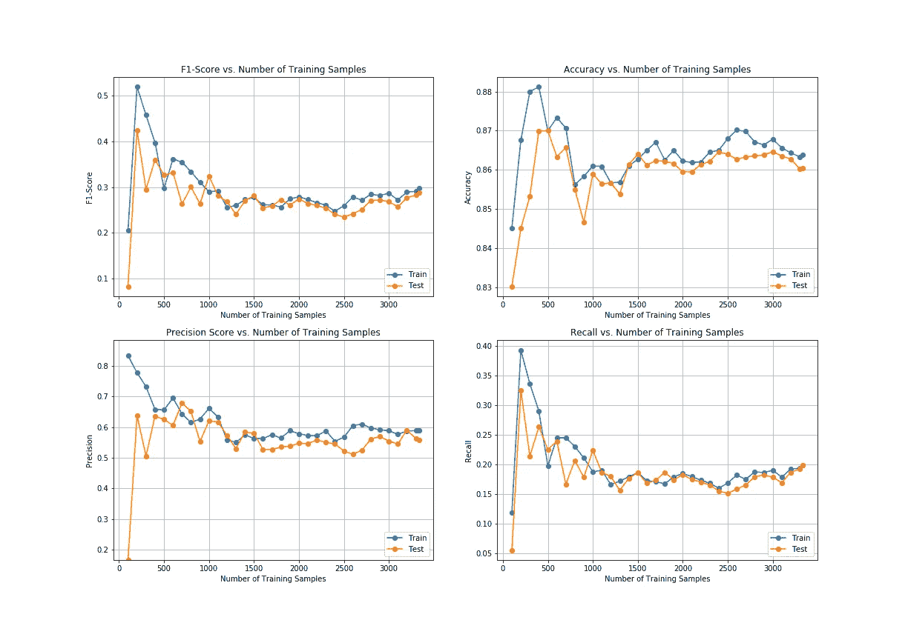
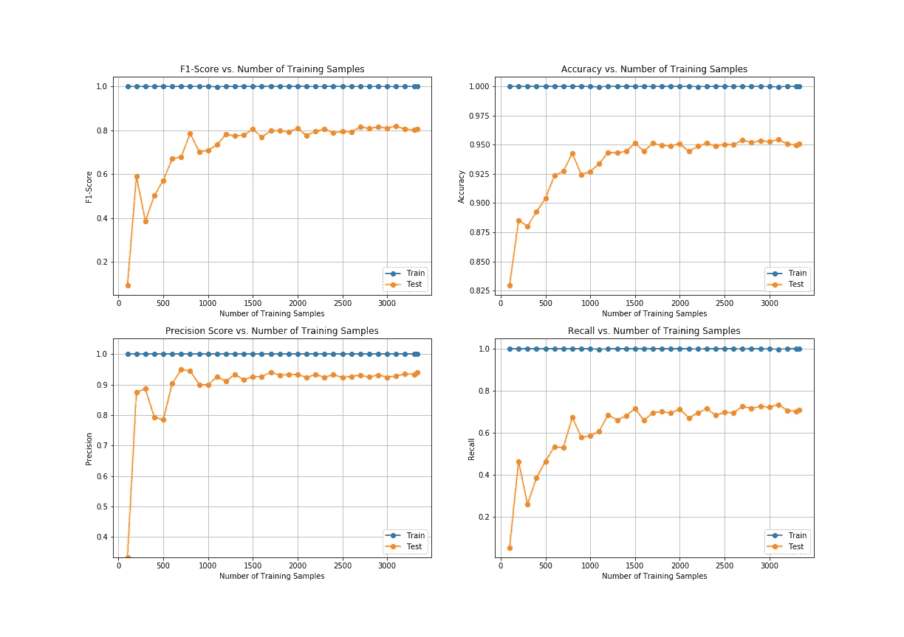
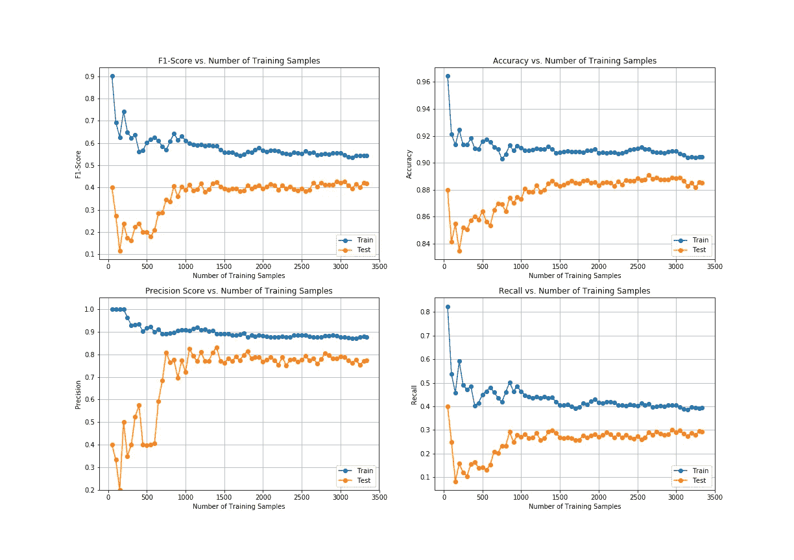

# 构建机器学习工程工具

> 原文：<https://towardsdatascience.com/building-machine-learning-engineering-tools-e348ae4edf8?source=collection_archive---------24----------------------->

定制工具案例研究

本文的重点是展示定制的机器学习工具如何帮助简化模型构建和验证工作流程。

这是通过用一个可重用的类抽象出所有的交叉验证和绘图功能来实现的。此外，该课程允许我们并行训练和评分这些模型。最后，我们将展示如何以及为什么使用学习曲线来评估模型性能是非常有益的。

作为案例研究，我们将使用一个移动服务提供商的数据集。我们的任务是建立一个模型，可以识别预测会流失的用户。自然，在基于订阅的服务中，这些数据集是不平衡的，因为大多数用户不会在任何给定的月份取消订阅。

让我们看看这个工具如何帮助我们实现目标！

查看我的 Github 个人资料上的代码。

[](https://github.com/DataBeast03/DataBeast/blob/master/ML_Tool/ML_Tool.ipynb) [## 数据广播 03/数据广播

### database-数据科学组合

github.com](https://github.com/DataBeast03/DataBeast/blob/master/ML_Tool/ML_Tool.ipynb) 

# **定制的 ML 工作流工具**

我们将使用一个学习曲线工具，它是对 Sklearn 实现的改进

[](http://scikit-learn.org/stable/modules/generated/sklearn.model_selection.learning_curve.html) [## sk learn . model _ selection . learning _ curve-sci kit-learn 0 . 19 . 2 文档

### 将用于生成学习曲线的训练示例的相对或绝对数量。如果数据类型是…

scikit-learn.org](http://scikit-learn.org/stable/modules/generated/sklearn.model_selection.learning_curve.html) 

这个自定义工具在以下方面有所改进。

在交叉验证我们的模型时，它根据 4 个分类指标(准确度、精确度、召回率和 F1 值)对模型进行评分。

Sklearn 版本只根据一个指标对模型进行评分。这意味着我们必须对相同的数据交叉验证我们的模型几次，以获得所有 4 个指标的分数，这不是一种非常明智的做法。此外，这个工具有一个方法，可以为您绘制所有 4 个指标的学习曲线。挺有用的！

```
# here's how you initialize the class

cv = cross_validation(model,                 
                      X_train,               
                      Y_train ,              
                      n_splits=10,           
                      init_chunk_size = 100, 
                      chunk_spacings = 25,   
                      average = "binary") # classification model
# Training Predictors
# Training Target
# Number of KFold splits
# initial size of training set
# number of samples to increase the training set by for each iteration 
# score metrics need the type of classification average specified (binary or multi-class)
```

**这个工具如何工作**

1.从 init_chunk_size
2 中指定的训练集中抽取一定数量的样本。对数据
3 执行 n_splits。在测试褶皱上对模型进行评分，并对所有褶皱的分数进行平均
5。对训练集上的模型进行评分，并对所有折叠的分数进行平均
4。将指标的平均分数存储在一个列表中，用于培训和测试折叠
5。按照 chunk_spacings
6 中指定的数量增加训练集大小。重复步骤 2 至 5，直到所有训练点都包含在训练集
7 中。调用“plot_learning_curve”方法来可视化结果

我们将通过一个例子展示这个工具是如何工作的。

# **标签不平衡**

显然，这些类别是不平衡的:负面案例比正面案例多 6 倍。

我们的假设是，这种不平衡会对我们模型的性能产生负面影响，使模型的性能偏向多数阶级。

如果我们有一个易于阅读的可视化工具来帮助我们分析模型的性能并测试我们的假设，这不是很好吗？

这正是我们的工具做得最好的！

```
# split predictors from response variable
Y_churn = df.Churn.values
X_churn = df[df.columns[:-1]].values# check label balance
Counter(Y_churn)
# OUTPUT: Counter({False: 2850, True: 483})# accuracy for guessing the majoirty class every time
navie_baseline = (Y_churn.shape[0] - Y_churn.sum())/Y_churn.shape[0]
# OUTPUT: 0.85508550855085508
```

# 交叉验证:逻辑回归

```
# create model 
lr = LogisticRegression(penalty='l2')# initialize ml tool 
cv = cross_validation(lr, 
                      X_churn, 
                      Y_churn, 
                      average='binary',
                      init_chunk_size=100, 
                      chunk_spacings=100,
                      n_splits=3)# call method for model training
cv.train_for_learning_curve()# call method for ploting model results
cv.plot_learning_curve(image_name="Learning_Curve_Plot_LR", save_image=True)
```



让我们确保我们明白发生了什么。

训练和测试曲线上的每个点都代表了从我们指定的 K 倍计算的指标的平均分数。

请注意，每个培训分数下面都有一个相应的测试分数点(或者在某些情况下，在它上面)。这是因为我们在训练集和测试集上对模型进行评分，以查看模型在两者之间的比较情况。这将使我们能够回答关于偏差和方差的问题。所以让我们继续前进，就这样做吧！

请注意，测试集的准确度达到了 87%的峰值，考虑到最初的准确度是 85%,这并不是很高。但是等等，我们还看到测试集的精确度峰值在 50%左右，召回率峰值在 33%左右，这是为什么呢？！

好吧，记住标签是非常不平衡的。

并且度量召回是模型正确区分不同类别的能力的度量。由于标签严重失衡，相对较高的准确率和较低的召回率实际上是有意义的。准确率相对较高，因为该模型有大量的负面案例进行训练，但召回率较低，因为该模型没有足够的正面案例进行训练，因此无法学习如何区分这两者。精确度本质上是随机的:在所有预测会流失的用户中，只有一半的人真正流失了。

学习曲线还向我们表明，无论我们在训练集中包括多少点，模型都不会继续学习，即提高其性能。我们可以从每个指标的结果中看到这一点。这意味着我们的模型不适合。

在这个工具的帮助下，这难道不是一个简单的分析吗？！？我们所要做的就是传入模型、训练数据和一些参数，机器学习工作流程就会自动完成。

说说高效利用时间吧！

# 交叉验证:随机林

基于我们以前的结果，我们得出结论，我们需要使用一个更复杂的模型。随机森林是个不错的选择。我们将使用相同的数据和参数。



让我们比较一下现成的随机森林与我们的逻辑回归的表现。

我们可以看到，准确率跃升至 95%，召回率约为 78%，精确度约为 94%。

我们当然可以把这种表现归功于 Random Forest 的架构，即。系综树和引导聚合。

更重要的是，我们可以从学习曲线中看到，模型的性能在大约 1500 的训练集规模时饱和，并且几乎没有过度拟合:训练和测试的准确度和精确度分数非常非常接近，尽管两者之间在召回率方面有很大差距。

那么这些结果意味着什么呢？

综合起来看，回忆告诉我们，10 个搅棒中只有 7 个能与非搅棒区分开，Precison 告诉我们，在这 7 个搅棒中，10 个中有 9 个能被正确归类为搅棒。

那么我们该如何进行呢？

好吧，假设对于我们的商业目标来说，这些结果还不够好；对我们来说，在预测中犯这样的错误仍然代价太高。好的，我们有几个选择:我们可以用网格搜索改进模型，训练不同的模型，或者我们可以改进数据。

假设随机森林在召回度量上过度拟合，这表明更复杂的模型只会导致更多的过度拟合，而不太复杂的模型(即逻辑回归)会导致欠拟合。所以这意味着我们需要改进数据。为此，一个显而易见的切入点是阶级失衡。

请注意，当我们的机器学习管道高效时，我们的分析是多么轻松？我们可以花更少的时间对模型构建的基础设施进行编码，而更多地关注结果以及它们所建议的行动过程。

# 并行处理

在实践中，我们会将我们的重点放在平衡类上。然而，在这里，我们将用一个更复杂的模型来证明这个工具的某个功能的有效性。

支持向量机(SVM)通常需要很长时间来训练。它们是展示该工具并行处理功能价值的绝佳模型。

我们只需传入我们希望用于并行处理的 CPU 数量，然后交叉验证类将接管剩下的部分！

首先，为了真正看到效果，让我们通过将 init_chunk_size 和 chunk _ spacings 减少到 50，并将 n_splits 增加到 10 来创建更多的模型进行训练。接下来，让我们用系列交叉验证训练 SVC 来计时跑步。

```
start = time()
# create model
svc = SVC(C=1.0, kernel='rbf', gamma='auto')# initialize ml tool 
cv_svc = cross_validation(svc, 
                      X_churn, 
                      Y_churn, 
                      average='binary',
                      init_chunk_size=50, 
                      chunk_spacings=50,
                      n_splits=10)# call method for model training
cv_svc.train_for_learning_curve()
end = time()print("Time Elapsed {:.3}".format(end - start))
# OUTPUT: Time Elapsed 64.1
```

现在，让我们并行地对 SVC 的交叉验证训练进行计时。

```
start = time()
n_cpus = 7
# create model
svc = SVC(C=1.0, kernel='rbf', gamma='auto')# initialize ml tool 
cv_svc = cross_validation(svc, 
                      X_churn, 
                      Y_churn, 
                      average='binary',
                      init_chunk_size=50, 
                      chunk_spacings=50,
                      n_splits=10)# call method for model training
cv_svc.train_for_learning_curve_PARALLEL(n_cpus)
end = time()print("Time Elapsed {:.3}".format(end - start))
# OUTPUT: Time Elapsed 29.0
```

我们观察到的是，并行训练时，训练时间是串行训练时间的 33%。当我们拥有更大的数据集时，这将节省大量时间。



最后，正如我们所怀疑的，使用比随机森林更复杂的(现成的)模型导致了更多的过度拟合。呀！

# 可量测性

包含并行处理的目的是帮助这个工具可扩展到更大的数据集，但是有一个限制。该工具是中小型数据集的理想选择。

当数据集达到 TB 甚至 100 GB 时，存在一个更具可扩展性的解决方案，即 Spark。Spark 可以在后端创建一个类似的工具。

# 结论

通过使用构建模型来预测用户流失的案例研究，我们展示了如何使用 **cross_validation** 数据工具来简化机器学习模型的构建和验证过程，并且节省时间。

这是通过抽象出围绕模型构建的所有模板代码，并简单地要求开发人员传入模型、训练数据和一些参数来实现的。

我们还展示了在学习曲线上显示 4 个最常见的分类指标的价值。以及它们如何**对分析偏差和方差等模型误差以及发现过度训练**具有不可估量的价值。

请随意在我的 Github 帐户上叉这个项目，并让我知道你在评论中的想法！