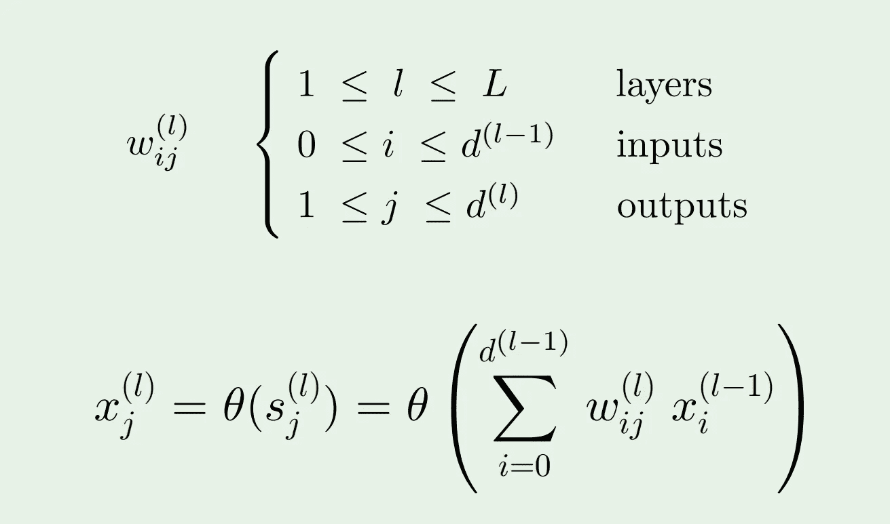
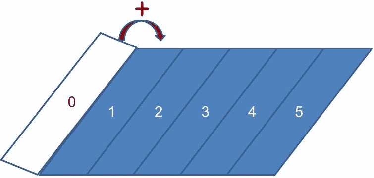
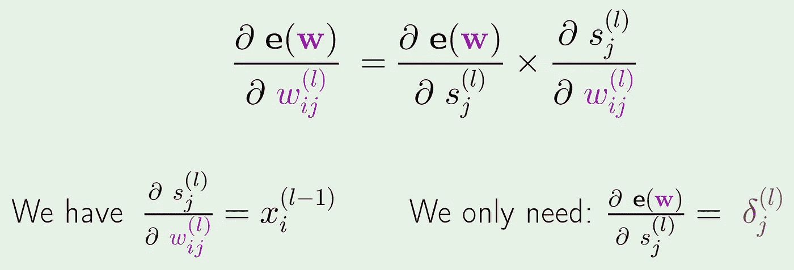

# 用 F#构建神经网络—第 1 部分

> 原文：<https://towardsdatascience.com/building-neural-networks-in-f-part-1-a2832ae972e6?source=collection_archive---------4----------------------->

Whats the next big step from linear regression?

# 前言

距离我上一篇关于 medium 的文章已经有一段时间了，所以这是另一篇关于神经网络的更深入的文章……用 F#写的。是的，我决定继续用机器学习的*功能*方式，下一步是从头开始构建这些。虽然你们中的一些人可能会抱怨函数式编程速度较慢，但它确实让你对任何问题有了不同的看法。在第一部分中，我将介绍如何设置核心函数，这些函数可以用来对任意数据集进行训练。

# 理论

在我们开始之前，理论上的一个旁注:我不会深究数学证明，尽管我会不时地使用几个方程。毕竟，整个问题可以归结为一些巧妙的数学运算。就我个人而言，到目前为止，我已经从亚塞尔·阿布·穆斯塔法教授的优秀的[免费课程](http://work.caltech.edu/lectures.html)中学到了大部分理论。我将使用[这些幻灯片](http://work.caltech.edu/slides/slides10.pdf)作为基础来实现大部分功能。我还假设你有一些函数式编程的基本知识，尽管从 F# [这里](https://fsharpforfunandprofit.com/)开始是个好主意。在整篇文章中，我会尝试将重要概念的参考链接起来。

# 设置

这里的主要目的是演示一个工作的神经网络，它可以根据需要构建成多深多宽。我们将使用上次的 [MSE](https://en.wikipedia.org/wiki/Mean_squared_error) 来计算我们的总成本，因为这简化了计算。使神经网络不同于任何任意分层的简单[感知器](https://en.wikipedia.org/wiki/Perceptron)的是[激活函数](http://mochajl.readthedocs.io/en/latest/user-guide/neuron.html)，它帮助神经网络学习数据集中的非线性。有许多不同的激活函数，每一个都有其优点，但在我们的情况下，[双曲正切](https://theclevermachine.wordpress.com/tag/tanh-function/)就足够了。最后，我们将在大部分数据结构和计算中使用 MathNet 库。这对于 F#来说基本上是微不足道的(但是不可否认的是要简单得多)。

# 助手功能

函数式编程的关键思想是将你的主要功能分解成更小、更简单的任务，这些任务更容易实现、调试和理解。记住这一点，我们将首先创建几个将在前向和后向传播中使用的辅助函数。

让我们从为我们的函数定义一些定制的[类型](https://fsharpforfunandprofit.com/posts/overview-of-types-in-fsharp/)开始。拥有一个好的类型系统是函数式编程的关键要素之一，除了其他好处之外，它还能让你的代码看起来更整洁，更不容易出错。重点关注的主要类型是“Layer”和“NodesVect”。每个层对象可以被认为是权重矩阵的标记元组和应用于该层输出的激活函数。 *wMatx* 将保存从前一层到下一层的每个连接的权重(i_max = m(行)，j_max = n(列))。每个节点 Vect 将由两个向量组成。 *sVect* 将在任意层的输出(和输入向量)通过激活函数之前保存它。在 *sVect* 通过激活函数后，xVect 仅保存其值。我们需要这两者来进行反向传播，所以我们不能只存储 *xVect。*

下图以数学形式总结了这些类型。关于偏差有一点需要注意:我们将把权重存储在权重矩阵中，但是因为它们只是前向连接的(即它们的节点值总是= 1)，我们将仅在需要时将这些“动态”附加到 *sVect* 或 *xVect* 。

Image Credit: [*Learning From Data — Lecture 10: Neural Networks*](http://work.caltech.edu/slides/slides10.pdf)

激活功能在这里被定义为[区别联合](https://fsharpforfunandprofit.com/posts/discriminated-unions/)。这些与枚举非常相似，但是更加灵活，它们允许我们通过使用关键字而不是实际的函数名将激活函数列表传递给网络生成器。 *getActFn* 接受特定激活函数的“关键字”和一个浮点数作为输入，并返回转换后的值。

lastLayerDeriv 是计算用于反向传播的最后一层的误差增量的函数。这里使用点乘，因为我们将得到任意维输出的导数，所以我们的输出现在是向量。

# 任意网络生成

为了能够处理任意数量的层和每层中任意数量的节点，我们将创建一个网络生成器，它将简单地接受网络中的输入、输出和隐藏节点的数量(不包括偏差)以及激活函数类型作为两个列表，并输出一个结果 [monad](https://medium.com/real-world-fsharp/understanding-monads-db30eeadf2bf) 。这将返回错误字符串或网络类型对象。如果节点和激活函数列表不符合要求的规范，我们将只使用结果单子来打印错误(这就是为什么你会看到这么多匹配！).这个函数几乎是不言自明的。

The network generator function

# 正向传播

对于神经网络，前向传递通常在概念上易于理解。简而言之，它包括将下一层中的节点值设置为前一层中的节点和偏差的加权和，并通过非线性激活函数传递该结果。

Animation showcasing List.fold ([source](https://openhome.cc/eGossip/Blog/FunctionalProgrammingforJavaDevelopers3.html))

在我们的 fwdProp 实现中，我们将使用 [List.fold](https://msdn.microsoft.com/en-us/visualfsharpdocs/conceptual/list.fold%5B't,'state%5D-function-%5Bfsharp%5D) ，这是递归遍历列表的有效实现。与上图不同的是，我们的累加器不是一个单独的元素，而是一个由*XV vectansvect*和 *Layer* 类型按相反顺序排列而成的列表。我们以相反的顺序返回它们，因为 F#列表是作为单链表实现的，所以在顶部附加 O(1)(在底部附加 O(n))。这也对我们有利，因为根据定义，反向传播将以相反的顺序工作！

List.fold 允许我们设置一个初始状态，这些将是输入向量对(这是特殊情况，当 *sVect == xVect* 时)和一个空列表以逆序存储权重。权重矩阵( *n*m* )乘以 x 向量( *m*1* )的转置将给出下一层的 s 向量( *n*1* )(如上面的数学形式所示)。特别注意偏差，在当前层的 x 向量上附加“1.0”，但是按照网络的设计方式，下一层仍然需要“1.0”(因为没有任何东西馈入偏差节点)。最后，对 s 向量中的每个元素执行简单的激活函数映射，以生成下一层的 x 向量。

# 反向传播

[Source](https://becominghuman.ai/back-propagation-in-convolutional-neural-networks-intuition-and-code-714ef1c38199)

该是认真对待的时候了。反向传播推导在许多在线资料中都有很好的解释。我们将使用随机梯度下降法，因此一些方程可能看起来略有不同。完整的方程式列表可以在前面提到的课堂笔记中找到。在阅读代码之前，记住这一点是个好主意。

Note: the error-delta here is a scalar corresponding to each node

我们首先将误差增量(描述归因于每个未激活输出的最终误差的贡献)计算为一个向量。我们使用前面描述的 helper 函数对最后一层进行计算。一旦我们得到这个值，我们现在需要计算所有层的误差增量矢量。严格地说，如果有什么东西进入一个层，这个层就可以被归类为这样一个层。因此，输入没有被分类为图层，计算它们的误差增量没有意义。使用当前层的权重矩阵和前一层(或输入)的 s 向量来计算前一层的误差增量。这可以使用自定义尾递归函数轻松完成。

The chain-rule formula for the final multiplication (given here on a per-weight basis)

一旦我们有了逆序的误差增量向量列表，我们需要将激活的输出(从倒数第二层开始)乘以误差增量，以产生 dE/dW 矩阵，该矩阵描述了每个权重的误差贡献，并将用于更新权重，从而允许机器从其错误中“学习”。简单地通过从原始权重矩阵中减去 dE/dW 的因子(学习率)来更新权重。为了在每层的基础上执行所有这些操作，我们使用了 [List.map3](https://msdn.microsoft.com/en-us/visualfsharpdocs/conceptual/list.map3%5B't1%2C't2%2C't3%2C'u%5D-function-%5Bfsharp%5D) 。这是一个内置的 F#函数，它允许我们同时迭代 3 个列表(权重矩阵，x 向量&误差增量向量)。这种映射的结果将按照正确的原始顺序产生更新的权重，然后可以由反向传播函数直接返回。

这里需要注意一些事情。x 向量、s 向量和 w 矩阵都以相反的顺序传递给递归函数。“Head”只返回列表中的第一个元素,“Tail”返回除第一个元素之外的所有元素。我们移除权重矩阵中的第一行，因为它对应于偏置节点，并且该节点对其后面的任何权重没有贡献，即没有权重馈入偏置节点。对*xandsltrev 进行迭代。Tail* 相当于迭代每个前一层的输出。

*层更新器*功能需要额外的 1.0 附加到 x 向量，因为这是前一层的激活输出，并且这里偏置*连接*到当前层中的权重分量，即权重矩阵具有 m 行，第 0 行对应于偏置权重。

# 结论

为自己走了这么远而感到欣慰吧！您现在可以使用这些函数从一个简单的顶级描述创建任意网络，比如:`initNetwork [1 ; 2 ; 1] [ID TANH]`。一旦您从输出中提取了网络对象，您只需要通过管道(`fwdProp |> backProp`)传递它，您就有了新的权重集。

在下一部分中，我们将利用这些和一些更多的“助手”函数，以便从一个非平凡函数生成训练数据，并使网络实际做一些实际工作。所以请继续关注，如果你喜欢这篇文章，请留下👏！

正如我所承诺的，下面是第 2 部分的链接:

 [## 用 F#构建神经网络-第 2 部分

### 你的神经网络训练够快吗？

towardsdatascience.com](/building-neural-networks-in-f-part-2-training-evaluation-5e3a68889da6)