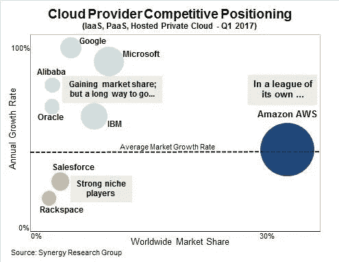
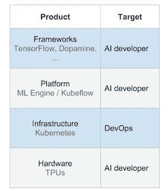
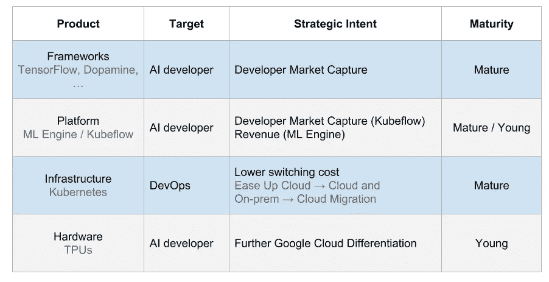
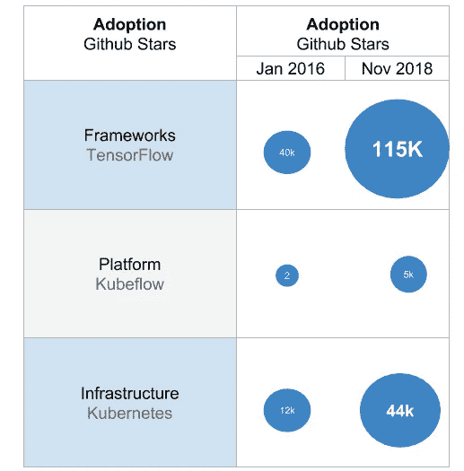
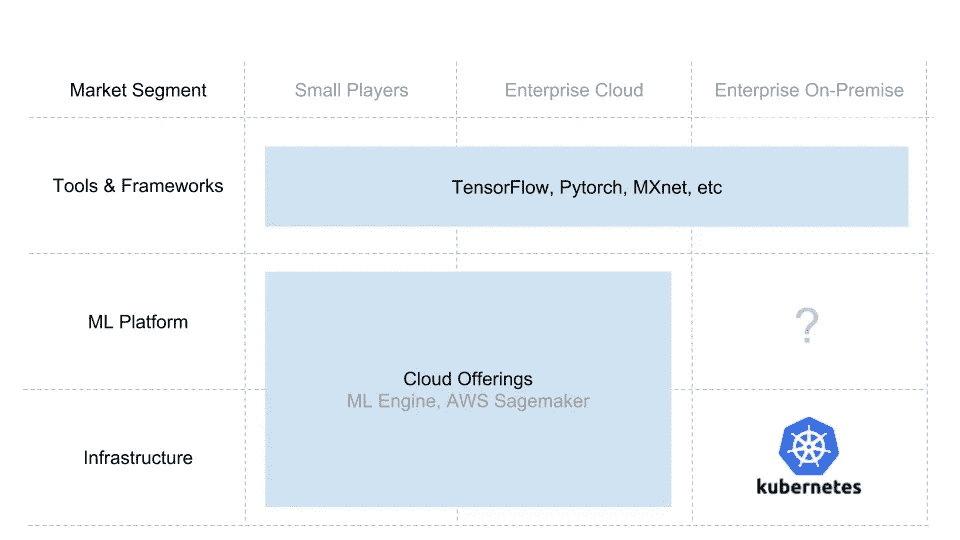

# 构建人工智能堆栈

> 原文：<https://towardsdatascience.com/building-the-ai-stack-ad23ac90405f?source=collection_archive---------5----------------------->

随着机器学习的使用——特别是计算密集型深度学习技术——在研究和行业中蓬勃发展，构建机器学习堆栈的市场也出现了爆炸式增长。谷歌、亚马逊和微软等科技巨头发布旨在使 ML(机器学习)技术更容易开发并最终推动云销售的云产品，完美地说明了这一点。从数据准备(图像标记)，到培训(模型优化)，再到部署，这一趋势也在大量构建基础设施和工具的初创公司中得到了强调。

我在 Elaia 和大型云提供商那里看到的创业公司的 5 个痛点:

*   **效率低下的 ML 团队**机器学习科学家和工程师在管道和低价值任务上花费了太多时间，例如建立他们的基础设施和工具，围绕数据管道进行黑客攻击，以及建立基本的自动化，从而推迟了研发项目。
*   **低硬件利用率**计算基础设施未得到充分利用，导致成本不理想和/或 ML 团队争夺稀缺资源
*   **技术不确定性**随着新的硬件产品(谷歌 TPUs，最新的英伟达芯片)和软件产品(谷歌 AutoML)的推出，决策者很难就 ML 基础设施做出长期决策。
*   **技能和堆栈的异构性**传统数据科学家和 IT 经理正在慢慢迁移到新技术(高级 ML 和深度学习)，并需要与新一代深度学习本地科学家一起工作。
*   **监管和隐私**数据要么至关重要，需要限制安全性，而新出现的监管带来了额外的挑战(HIPAA、GDPR 等)

市场仍然不成熟，尽管技术基础已经具备，可以构建一个全面的产品，最终实现快速的 ML 开发和广泛的现实影响

在这类文章中，很难使用正确的词汇。AI，ML，深度学习都被误用了。在某些方面，自第一台计算机制造出来，人工智能栈就已经永远存在了。在这里，我将重点关注能够开发当前一代产品的产品，通常是计算和数据密集型机器学习模型。我戏称它为*人工智能栈*。

认为谷歌的战略和产品将深刻影响市场，并从上一代技术(即 Map Reduce 范式和 Hadoop 生态系统)中汲取灵感，我将提出两种未来堆栈可能的情况。

# 1)谷歌的战略正在推动人工智能基础设施和工具市场

## 谷歌的战略

谷歌的商业模式过度依赖广告收入，投资者已经多次指出这个事实。随着新平台的出现，语音(如虚拟助手)等界面被广泛采用，我们现在知道的搜索格式的数量将慢慢减少。为了弥补这一点，谷歌推出了许多其他产品，这些产品在历史上对底线的影响有限，[直到最近。](https://www.reuters.com/article/us-alphabet-results-cloud/googles-search-for-non-ad-revenue-puts-spotlight-on-cloud-pixel-idUSKBN17U1N7)

人工智能领域似乎出现了两个战略机遇:

**通过人工智能附加服务创造收入**人工智能的崛起为谷歌创造了巨大的市场机会，谷歌在该领域、文化和内部基础设施方面拥有丰富的专业知识，可以快速开发和推出人工智能驱动的产品。

**征服云市场**虽然 AWS 仍然是云基础设施服务的市场领导者，拥有 30%以上的市场份额，但世界的云化并没有结束，这为新一代云产品留下了空间。在本文的其余部分，我们将重点关注谷歌为抓住这一机遇而部署的战略。

Cloud Prodiver Growth vs Market Share

**谷歌已经在人工智能堆栈中构建了产品**

虽然很容易认为谷歌正在影响任何市场，但它特别是在人工智能基础设施和工具市场。事实上，谷歌已经发布了不同层次的产品。机器学习框架 TensorFlow 是目前最受欢迎的。谷歌云是机器学习科学家最喜欢的云，在收入方面历史上与 AWS 相比相形见绌。

Google’s Products Cover the Stack. Some are open source software (Kubernetes, TensorFlow), some are Hosted services (ML Engine) and some hardware (TPU)

为了赢得云战争，谷歌使用了两个杠杆:

*   **产品差异化**:增值的人工智能基础设施产品和服务可能会赢得迫切需要获得坚实堆栈(自下而上采用)的人工智能开发人员，以及寻求支持建立其人工智能战略(自上而下采用)的领导层——在这方面，谷歌的品牌是一项重要资产。TensorFlow 等免费开源框架已经迅速普及，这使得谷歌 ML 引擎(一个高价的机器学习云平台)的营销变得更加容易。谷歌还发布了 Kubeflow，这是一个运行在 Kubernetes 之上的开源机器学习平台，可能为内部用户提供谷歌 ML 引擎的替代选择。
*   **更低的切换成本:**更好的产品可能不足以说服客户，尤其是在企业生产环境中，迁移工作负载成本高昂，并且可能需要大量的软件重新设计。应用程序的容器化创造了降低转换成本的机会。[谷歌赢得了与 Kubernetes](https://www.cloudhealthtech.com/blog/container-wars-are-over-kubernetes-has-won) 的战争，实施了其容器工作负载协调系统。这样一来，它还通过提高工作负载的可移植性显著降低了切换成本，既简化了云服务之间的切换，也简化了从内部部署到云产品的切换。

这对那些寻求了解人工智能栈未来的人来说很重要:谷歌正在为栈的各个层开发产品。TensorFlow 已经成为领先的(但不是唯一的)机器学习框架。谷歌 ML 引擎因其用户友好性而广受赞誉，尽管其高昂的价格可能会成为重度用户的阻碍。开源平台 Kubeflow 虽然还不成熟，但正在慢慢获得牵引力。

在堆栈的最底层，Kubernetes 在扩展到人工智能之外的容器工作负载编排领域获得了明确的优势。生产工作负载采用 Kubernetes 为构建整个 Kubernetes-native AI 生态系统创造了合适的基础。

Google Open Source Products Adoption

**结论**

谷歌战略的后果之一是，人工智能堆栈的每一层都得到服务，取得了各种各样但越来越大的成功，由谷歌维护的开源产品(尽管 Kubernetes 现在由云原生基金会维护)。

我想回答的问题是，专有机器学习产品是否会有空间，以及在哪里会有空间。

为了理解动态，我将使用 Hadoop 生态系统(第 2 部分)的类比，并尝试推断两个场景。

# 2)与 Hadoop 生态系统的类比(希望是合理的)

Hadoop 堆栈可以分解为基础设施、平台和工具，与 AI 堆栈非常相似。

这种类比至少有一些局限性:

*   Hadoop 是专为 map reduce 范式构建的，用于处理超大规模数据集。另一方面，Kubernetes 是为通用工作负载编排而开发的。除了技术上的影响，这意味着 Kubernetes 将在一个更大的市场上被采用。作为一个副作用，一个公司可能会采用 Kubernetes 来编排其主网站的容器——然后青睐能够利用其现有 Kubernetes 安装的 ML 产品。
*   深度学习模型的开发和训练从根本上来说比 ETL 操作(Hadoop 生态系统的原始用例)更复杂。他们经常利用 GPU 计算，这产生了另一种技术差异，并要求更复杂的堆栈。
*   Hadoop 的采用始于市场存在之时，但规模相当小——它始于少数客户，包括雅虎，维护大型 Hadoop 客户，并逐渐购买服务来帮助管理他们。点击此处了解 Hadoop 的历史。至于人工智能堆栈，在任何解决方案可用之前，大规模存在对机器学习平台的需求。目前的产品仍相对不成熟，但市场已经爆炸式增长。

从这个类比中我们能学到什么？

*   Hadoop 生态系统围绕着一系列开源产品和工具。
*   Hadoop 堆栈的业务模型主要由服务和企业支持及工具驱动，就像 Red Hat 一样。

从长远来看，AI 也会这样吗？市场会广泛采用 Kubernetes+Kubeflow 作为基础设施和机器学习平台吗，在这种情况下，其他玩家会转而为 Kubeflow 构建企业版、工具和服务吗？还是企业平台会有市场？

# 3)两种场景

在开始预测之前，让我回到市场上来。它可以大致分为三个角色:

*   **小玩家和个人开发者**喜欢简单性，但是简化了 IT 需求。他们是现有云产品的典型客户，如 Google ML Engine 或 AWS Sagemaker。
*   **企业云**用户同样也是现有产品的良好目标，尽管高级用户的特定需求也需要云提供商无法满足的定制服务。
*   **企业内部部署**目标目前在平台和工具方面严重不足。主要的不确定性就在于此，并证明了下面两种情况的合理性。

The AI Stack Broken down by segment — Major uncertainty lays in the on-premise segment

## 场景 1:相互竞争的开源和企业产品共存

由于对企业产品的需求已经存在，而开源产品还远未成熟，一些公司已经开始构建闭源产品。

Clusterone 和 RiseML 等公司以及其他几家公司就是这种情况。

如果开源产品不能很快成熟，对内部部署企业级产品的需求将推动它们的采用。开源可能会在第二波产品中赶上来。

**商业模式:**专有企业软件

**剩余机会:**因此，堆栈将保持相当分散的状态。这可能会使构建工具的主流产品变得更加困难。这些市场条件也可能有利于端到端的垂直机器学习平台。

## 场景 2:开源占主导地位，企业生态系统出现

现有的 Kubernetes 采用和 Kubeflow 的更快成熟可能会引发广泛的采用，以及对开源代码库贡献的良性循环。

这将为基于 Kubeflow 的企业级产品、服务和支持模型带来机遇，与 Cloudera 和 Hortonworks(现在的 Cloudera-Hortonworks)以及 MapR 的 Hadoop 生态系统产品非常相似。

**商业模式:**服务、支持和企业-Kubeflow

**剩余的机会:**围绕 Kubeflow 的栈的标准化将赋予公司在栈顶构建工具的特权，以及围绕 Kubeflow 的工具和应用的生态系统模型。

# 结论

预测堆栈将如何发展是一项棘手的工作。无论如何，记住这两种情况可以帮助决策者识别机会，并针对不断变化的市场条件进行对冲。

尽管栈的一些标准化将有益于那些构建应用程序和工具的人，但一个成熟的标准产品的出现还需要时间。可能有第三种方式，开源和闭源玩家在定义标准上合作，最大化他们成功的机会和最终用户的价值。

*感谢 Louisa Mesnard 在撰写本文时给予的帮助。*

*免责声明:观点仅代表我个人。我是 Clusterone 的联合创始人，持有该公司的股份。*