# 为计算机视觉模型构建 Web 应用并在 10 分钟内部署到生产环境*:详细指南

> 原文：<https://towardsdatascience.com/building-web-app-for-computer-vision-model-deploying-to-production-in-10-minutes-a-detailed-ec6ac52ec7e4?source=collection_archive---------5----------------------->

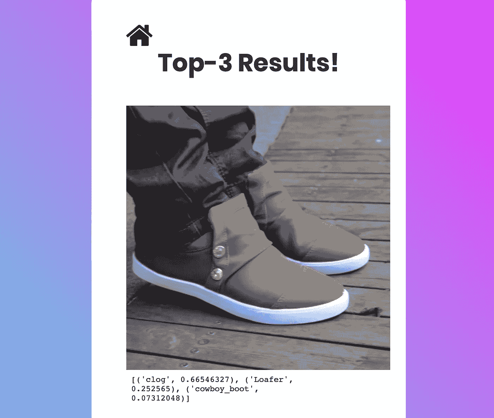

result.html

*下载入门包&为 Docker 托管的 web 应用程序提供商之一执行一次性设置后，您可以将 fast.ai 或 keras 库中创建的计算机视觉模型快速部署为响应性 web 应用程序，这一切只需不到 10 到 15 分钟。*

**2020 年 8 月 23 日更新:**世界变化很大，自从我更新了这篇文章，fastai 和 keras 库也是如此， [**Fastai 已经发布了完全重写 Fastai 的版本 2**](https://www.fast.ai/2020/08/21/fastai2-launch/) ，keras 也是如此，它现在是 [**tensorflow2**](https://www.tensorflow.org/guide/keras/sequential_model) 的一部分。我还为 fastai 和 keras 发布了更新的入门包，请在此下载:

Fastai 版本 2:

`git clone [https://github.com/psmathur/fastai2-vision-app](https://github.com/psmathur/fastai2-vision-app)`

Keras(在张量流 2 下)

`git clone https://github.com/psmathur/keras-vision-app`

**2019 年 1 月 4 日更新:**增加了一个部署选项:“呈现”一个新的最简单但功能强大的基于 Docker 的 web 服务托管提供商&更多。

**2018 年 12 月 4 日更新:**我我不确定，我想继续使用 Zeit 服务，因为 Zeit 最近做出了很多改变来限制 100 MB 的限制。我无法解决 100 MB 的限制问题，即使我有无限付费计划，甚至当我试图通过 CLI 用“now.json”显式使用平台的版本 1。依我看，他们用 100 MB 的限制来限制自己，肯定错过了巨大的商机！

********************************************************

**所以，你已经使用像 [Fast 这样著名的深度学习库建立了](https://docs.fast.ai/)**一个令人敬畏的图像分类模型。AI 或 [Keras](https://keras.io) ，然后写了一篇关于它的文章，同时解释了你的模型如何可以对各种类型的[蓝松鸦](https://blog.usejournal.com/if-i-can-you-can-and-you-should-a470d7aea89d) s、[植物病害](/transfer-learning-using-the-fastai-library-d686b238213e)、[意大利美食、](https://medium.com/@francesco.gianferraripini/buon-appetito-a-fast-ai-spin-on-italian-food-ee14631bbdb6) [薯条](https://medium.com/@apalepu23/what-the-french-fry-fast-ai-deep-learning-week-1-286fd2ac3cab)、[瑞士手表](https://medium.com/@cmcoto/convolutional-neural-network-cnn-applied-to-swiss-watches-using-fast-ai-library-and-resnet34-f7e99976dd52)进行分类，甚至可以预测出[你身边播放的古典音乐](https://medium.com/@zachcaceres/deep-learning-can-we-use-computer-vision-to-predict-the-composer-of-classical-music-464dd5516996)的作曲者，使用音频文件的声谱图(而你认为图像分类是被夸大其词了)。

现在，接下来呢？

嗯，除了写一篇关于你如何建立一个令人惊叹的计算机视觉模型的技术博客帖子，你还想与你的同事、朋友、家人或任何拥有带网络浏览器的设备的人轻松分享你的工作。您希望与他们分享您的工作，因为他们都可以快速测试您基于深度学习的模型结果并提供有价值的反馈，这是评估您最终 DL 模型的重要一步。

> 你需要一个演示网络应用程序！


Source: [https://gifsboom.net/post/141202971289/t-rex-vs-spiderman-in-real-life-superhero](https://gifsboom.net/post/141202971289/t-rex-vs-spiderman-in-real-life-superhero)

假设您已经建立了一个图像分类算法，现在需要一个简单的 web 应用程序，它可以以异步方式处理从 web 浏览器上传的图像或图片，然后它还需要以异步方式下载您训练过的模型，托管在其他地方。

深度学习模型很重，你知道一个巨大的多维激活矩阵，所以它们需要在一些云存储服务上独立上传，另外你想有一个切换到更好升级的模型的选项，特别是基于你收到的反馈，而不改变和重新部署底层 web 应用。

然后，这个 web 应用程序还应该能够使用您首选的深度学习库将您的模型加载到机器的内存中，然后它可以预测您上传的图像上的标签。

最终，所有这些东西都需要在某个云托管提供商上进行配置、部署和托管。听起来很有趣，对吧…

我们都知道，如果你没有一个既定的流程，尤其是在 bug 修复或部署配置期间，上面提到的任何步骤都会花费大量时间。因此，为了将所有这些步骤减到最少，我写了这个指南。一旦你遵循了这篇文章，你将有一个 3(或 2)步的过程，通过它你可以快速地为你的计算机视觉模型构建一个 web 应用&可以在< 10 Minutes.

Here is the link of a sample web app: [](https://keras-vision.app.render.com/)**将它们部署到生产中**

**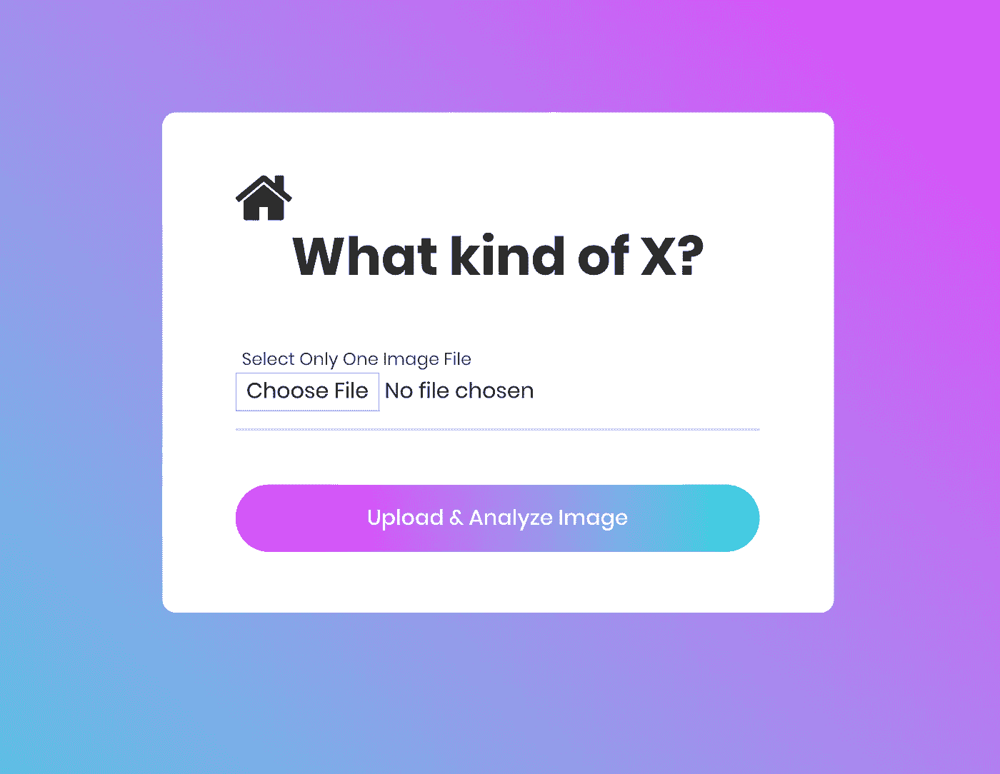**

**index.html**

**为了构建和部署这种 web 应用程序，首先，我们将下载或克隆托管在我的 GitHub repo 上的启动包，目前，这些 web 应用程序启动包仅用于使用 **Keras** 和**fast . ai**构建的计算机视觉模型**

**这些初学者包包含一个简单的响应式 web 应用程序，它构建在 ASGI 服务器的基础上。下载其中一个入门包后，您只需更改几行代码，就可以在本地机器上运行您的深度学习模型。**

**其次，我们将使用 Docker 托管的服务之一。我们将把静态 web 应用程序目录与 docker 配置放在一起，然后将它部署到这些完全托管的 docker 托管服务之一的生产环境中。**

**在这篇文章中，我正在覆盖， [**AWS 豆茎**](https://aws.amazon.com/elasticbeanstalk/) ， [**Azure Web App**](https://azure.microsoft.com/en-au/services/app-service/containers/) 和 [**现在版本 1**](https://zeit.co/docs/v1) **。**然而，你可以使用类似的步骤部署到任何其他 Docker 托管的服务。**

**那么，现在，事不宜迟，让我们从第一步开始。**

# **步骤 1:下载 web 应用程序入门包**

****对于你的 keras 模型部署** 去我的 Github 下载[*keras-vision-app*](https://github.com/pankymathur/keras-vision-app)*repo*。**

```
wget [https://github.com/pankymathur/keras-vision-app/archive/master.zip](https://github.com/pankymathur/fastai-vision-app/archive/master.zip)
```

****为了你的 fast.ai 模型部署** 去我的 Github 下载[*fastai-vision-app*](https://github.com/pankymathur/fastai-vision-app/archive/master.zip)*repo*。**

```
wget [https://github.com/pankymathur/fastai-vision-app/archive/master.zip](https://github.com/pankymathur/fastai-vision-app/archive/master.zip)
```

**解压缩 zip 文件，重命名目录，使其与您的应用程序名称相匹配**

```
unzip *fastai-vision-app*.zipmv fastai-vision-app YOUR-APP-NAME-HEREcd YOUR-APP-NAME-HERE
```

***注意:你也可以在 Keras 或者 Fast 的目录下，让一切都保持现在的样子。AI starter pack app，只需转到步骤 2 &步骤 3 进行快速试用部署，那样的话，你就要部署我的*[*X-Finder App*](https://x-finder.now.sh/)*或者* [*寻衣 App*](https://clothing-finder.now.sh/) *。如果您没有，并且想在部署之前完善一切，那么请继续阅读。***

****上传您的训练模型** 将您的训练模型上传到任何公共云托管服务。通常训练好的模型在 keras 中的文件类型为“***. H5****”*，可以使用 *model.save()* 方法和“ ***文件类型创建。并且可以使用方法 *learn.save()* 创建。*****

**举个例子，对于我的文章和 fast.ai 项目 [**“打细纹服装分类基准”**](https://medium.com/@pankajmathur/clothing-categories-classification-using-fast-ai-v1-0-in-10-lines-of-code-4e848797721) ，我最终的模型文件名是“[***stage-1 _ SZ-150 . PTH***](https://github.com/pankymathur/Fine-Grained-Clothing-Classification/blob/master/data/cloth_categories/models/stage-1_sz-150.pth)”。它的大小为< 100 MB，并公开托管在我的 public [**GitHub 项目回购上。**](https://github.com/pankymathur/Fine-Grained-Clothing-Classification/tree/master/data/cloth_categories/models)**

**如果您的模型文件大于 100 MB，您可以使用任何其他云服务，如 Google Drive 或 Dropbox 来上传您的模型文件，然后复制该文件的原始下载链接。**

****注:**原始下载链接是直接开始文件下载的链接，通常不同于您看到的共享链接。例如，dropbox 原始下载链接如下所示:**

```
'[https://www.dropbox.com/s/y4kl2gv1akv7y4i/stage-2.pth?raw=1'](https://www.dropbox.com/s/y4kl2gv1akv7y4i/stage-2.pth?raw=1')
```

*   ****为 Keras 车型定制的入门 Web 应用****

**打开“`app”`目录中的文件`"server.py”`，然后用托管模型文件的原始下载 URL 更新带有“`model_file_url”`变量的行。例如:**

```
model_file_url = 'https://github.com/pankymathur/Fine-Grained-Clothing-Classification/blob/master/data/cloth_categories/models/model.h5?raw=true'
```

**保持其他一切不变，如果你像我一样使用一些东西，例如，我已经在 Keras 中使用迁移学习过程创建了一个简单的图像分类模型，具有 Resnet50 架构和 Imagenet 预训练的权重，用于 46 种不同类型的服装类别。当然，您可以完全定制代码来满足您的需求。**

**然后我已经上传了我训练好的 Keras 模型< 100 MB on my GitHub public repo, so here is how my final “ ***server.py"*** 的样子，就在步骤 2 之前。**

**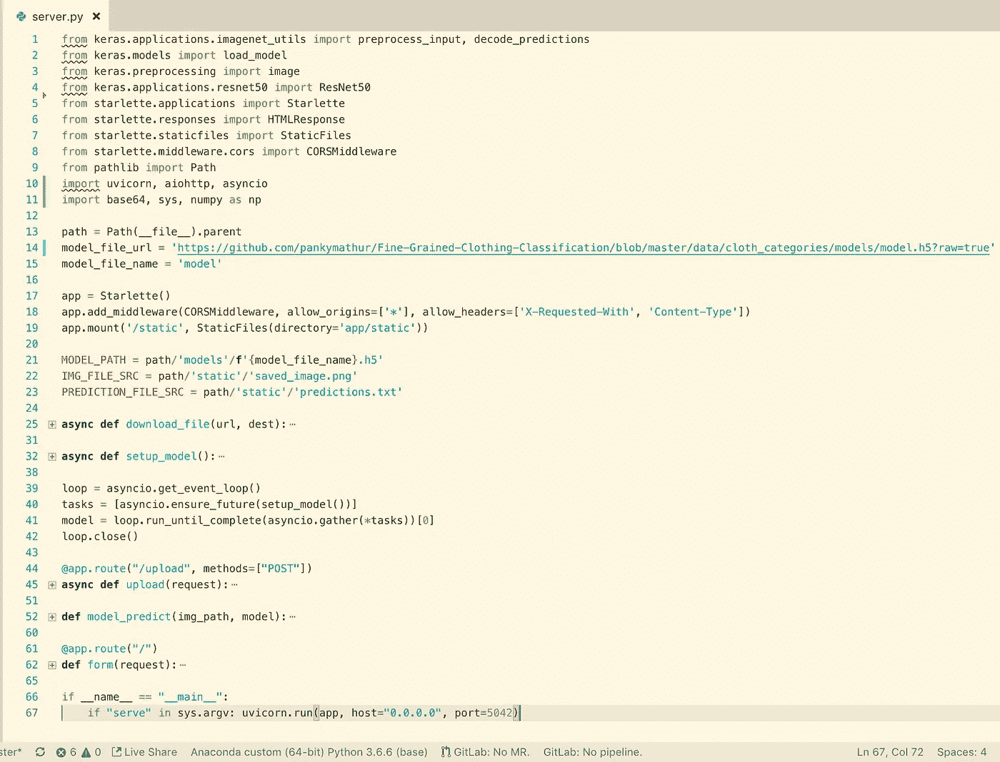**

**server.py**

*   ****针对 Fast 定制的 Starter Web 应用程序。人工智能模型****

**打开“`app”`目录中的文件`"server.py”`，然后用您的托管模型文件的原始下载 URL 更新带有“`model_file_url”`变量的行。例如:**

```
model_file_url = 'https://github.com/pankymathur/Fine-Grained-Clothing-Classification/blob/master/data/cloth_categories/models/stage-1_sz-150.pth?raw=true'
```

**在同一个文件中，用您期望从模型中预测的标签类更新下面的行。**

```
classes = ['Blouse', 'Blazer', 'Button-Down', 'Bomber', 'Anorak', 'Tee', 'Tank', 'Top', 'Sweater', 'Flannel', 'Hoodie', 'Cardigan', 'Jacket', 'Henley', 'Poncho', 'Jersey', 'Turtleneck', 'Parka', 'Peacoat', 'Halter', 'Skirt', 'Shorts', 'Jeans', 'Joggers', 'Sweatpants', 'Jeggings', 'Cutoffs', 'Sweatshorts', 'Leggings', 'Culottes', 'Chinos', 'Trunks', 'Sarong', 'Gauchos', 'Jodhpurs', 'Capris', 'Dress', 'Romper', 'Coat', 'Kimono', 'Jumpsuit', 'Robe', 'Caftan', 'Kaftan', 'Coverup', 'Onesie']
```

**保持其他一切不变，您的应用程序就可以快速部署了(当然，您可以完全定制代码来满足您的需求)。对于一些部署选项，您需要将您的应用程序推送到 GitHub repo，这可能是公共的，也可能是私有的，具体取决于您的选择。**

# **步骤 2(选项 1):渲染**

**[Render](https://render.com) 是一款简单而强大的云提供商服务，适用于您的所有应用和网站。点击此链接=>[https://dashboard.render.com/register?i=fastai-v3](https://dashboard.render.com/register?i=fastai-v3)注册，即可获得 25 美元的积分。渲染 web 服务的费用为每月 5 美元，按秒按比例分配。**

**注册后，转到你的渲染面板，然后创建一个新的 **Web 服务。**在这里使用 [**GitHub repo**](https://github.com/pankymathur/fastai-vision-app) 为你在上面步骤 1 中创建的应用程序。**

**请注意，在这一步中，您需要授予 Render 权限来访问您的 GitHub repo。**

****

**之后，在部署屏幕上，为您的服务选择一个名称，并使用`**Docker**`作为环境。此外，如果您在 GitHub repo 中有多个分支，请选择适当的分支，或者保留主分支选择。**

**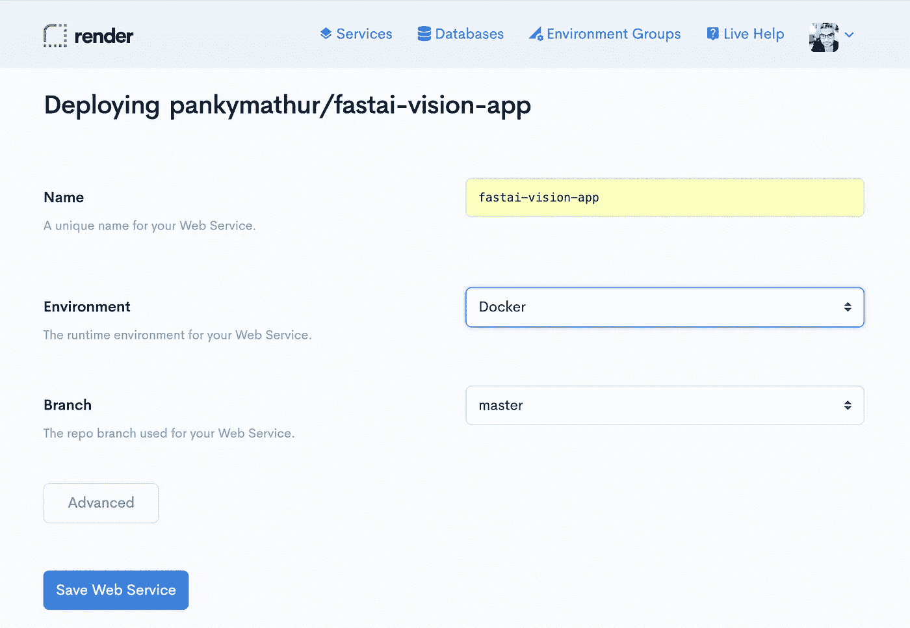**

**只需点击**保存 Web 服务**即可！您基于 docker 的 web 应用程序服务将开始构建，并且应该在大约 10 分钟后上线。您可以在部署日志中跟踪它的进度。最后，您可以检查显示在渲染面板中的 web URL**

**【https://keras-vision.app.render.com/ 号**

**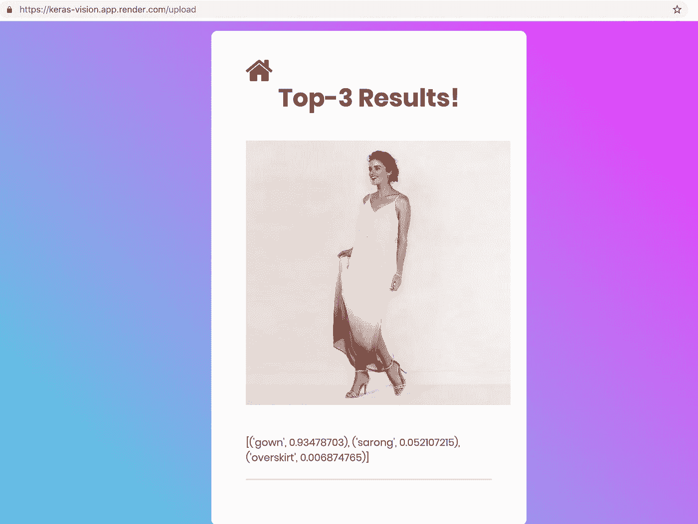**

# **第二步(选项 2): AWS 弹性豆茎**

**[AWS Elastic Beanstalk](https://aws.amazon.com/elasticbeanstalk/) 是一个易于使用的 AWS 服务，用于为 Docker 应用程序部署 web 应用程序，此外 AWS 还为新帐户提供免费试用。特别是因为我们的应用不打算使用任何数据库实例，最终定价将只包括 EC2 实例、负载平衡器和 S3 定价。点击这里阅读更多关于 AWS Beanstalk 定价的信息。**

**首先，打开 AWS Dashboard，搜索 Elastic Beanstalk services，然后单击“开始使用”**创建新应用程序。您将看到以下屏幕。****

**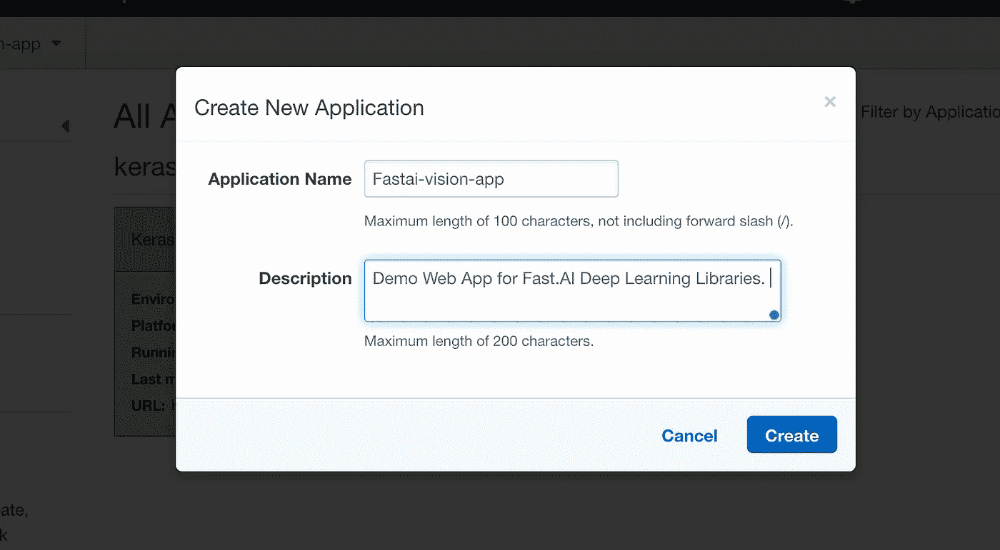**

**为您的演示应用程序名称和描述添加详细信息，然后单击“ ***”创建“*** ”。您将看到一个用于创建新环境的新屏幕。**

****

**选择 ***【立即创建一个】*** ，将出现如下画面。**

**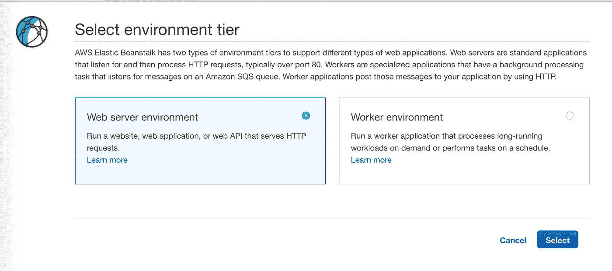**

**Create New Environment**

**在此选择 web 服务器环境，您将看到 ***创建 Web 服务器环境*** 详细信息屏幕。**

****

**添加你的“ ***环境名“*** ，选择你的“*域名，看看是否可用，然后添加“ ***描述”。******

*****重要提示:**在基本配置部分，选择 ***预配置平台*** ，然后选择“*”通用选项。****

****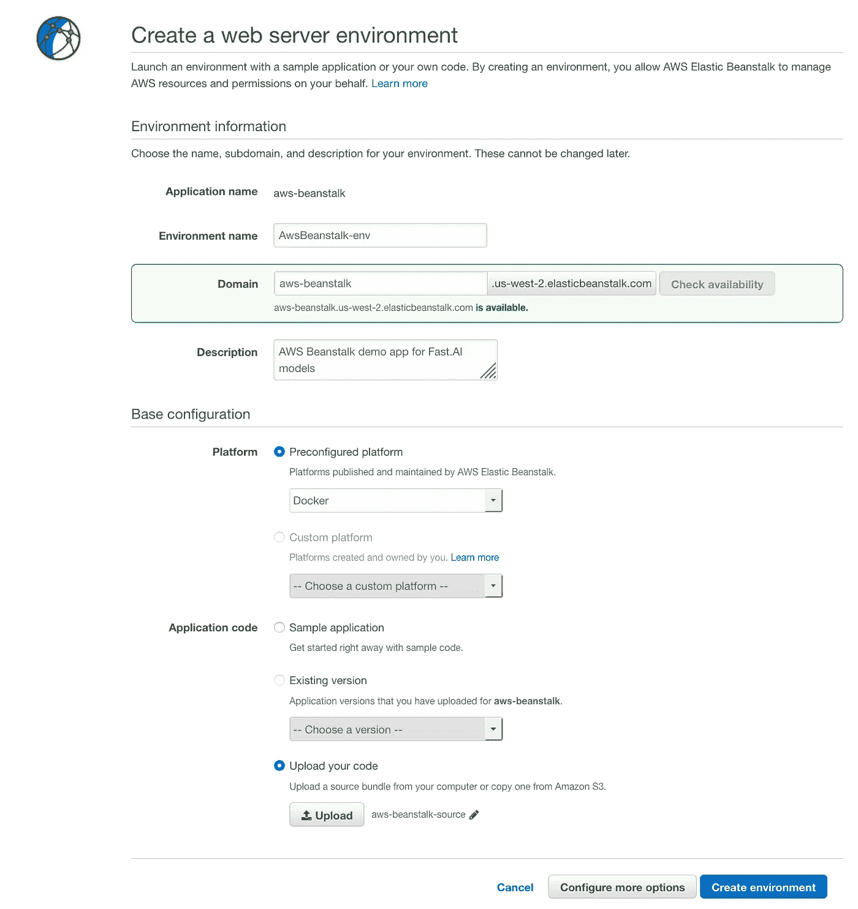****

****在同一页上向下滚动，因为你需要添加更多的细节。****

****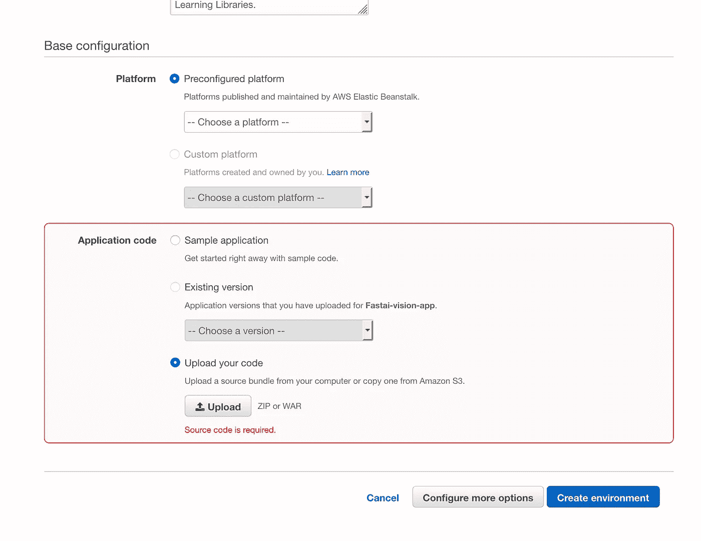****

****选择 ***【上传我们的代码】*** 选项，点击上传，会出现如下画面。在上传您的入门包**之前，请阅读下面的说明！******

****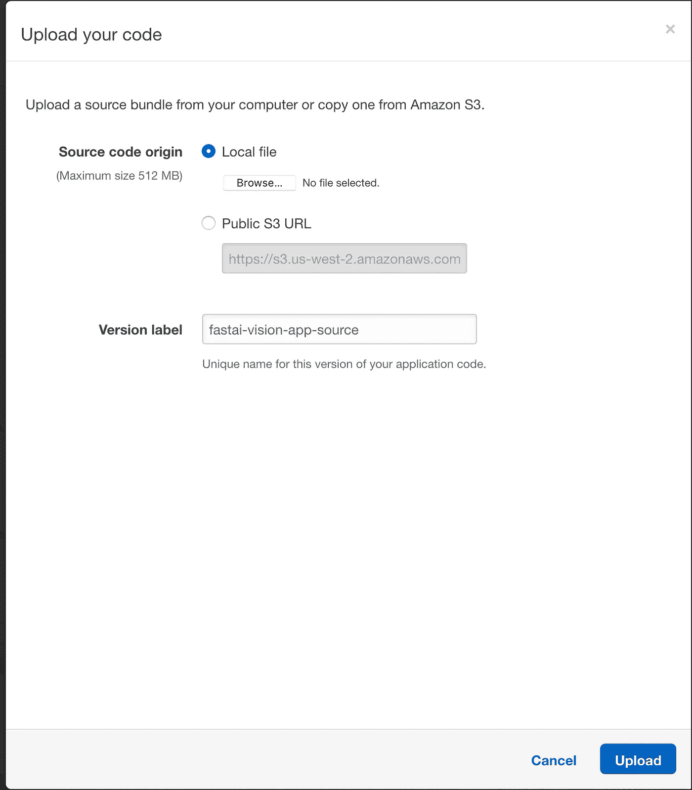****

******重要提示:**出于某种奇怪的原因，你可以直接上传我们 web app 文件夹的压缩文件，你必须将内容直接压缩到你的 web app 文件夹下，我猜是因为 AWS Beanstalk 需要看到直接在压缩文件的根目录下找到的 Dockerfile，而不是在 web app 文件夹下。因此，要做到这一点，只需在您的本地机器上打开 web 应用程序并直接压缩内容。这就是我在 Mac OS X 中的做法。****

******可选:**如果您已经在您的机器上本地运行了" ***server.py "*** ，那么您可能已经在目录 app>static>model>"*model . H5 "*或"*model . PTH "*下下载了模型文件，为了使这个压缩的压缩文件更小，您可以删除那些模型文件。但是，请注意，AWS Beanstalk 允许上传的文件大小不超过 512 MB。****

********

****上传你的一个 web app 的源码包后，“ ***创建 web 服务器环境页面”*** 会是下面这个样子。****

******重要:**不要按 ***【创建环境】*** 现在，我们要用 ***配置更多的选项！*******

****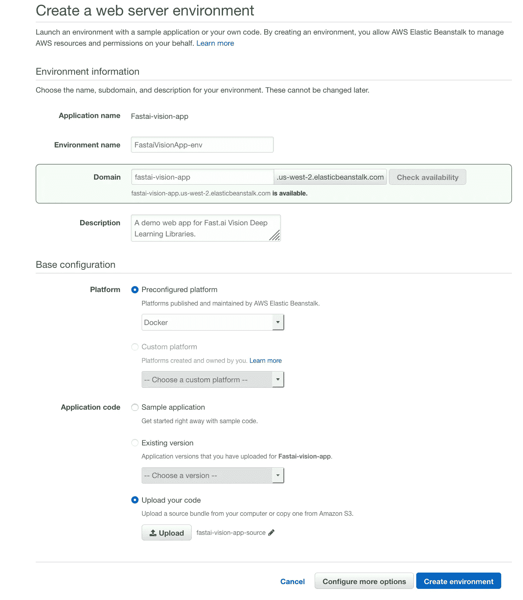****

****Don’t Click Create Environment Now! Use Configure More options****

****这些都是必要的步骤，为了让我们的 Web App 在 AWS Beanstalk 上顺利部署，点击 ***【配置更多选项】，*** 将会打开一个新的页面，在这里我们要将"**配置预置**部分改为" ***自定义配置"*** 选项，如下图所示****

****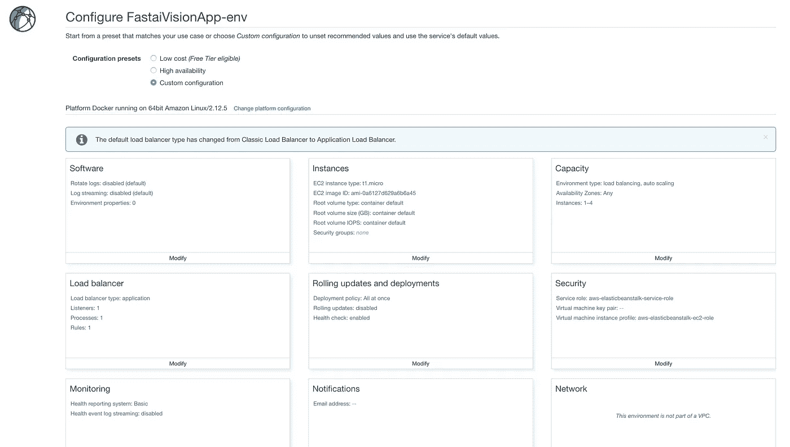****

****然后下到第一节>***软件】****点击 ***修改*** 会打开一个如下图的页面，将**代理服务器**从 *Nginx* 修改为 ***无。*** 保持其他一切不变，按保存。*****

********

****“保存”后你会回到配置页面，在这里下去第二节>***【实例】****点击 ***【修改】*** 会打开一个如下图的页面，将**实例类型从【t1.micro】改为***【T3 . medium】。*** 保持其他一切不变，按保存。*******

****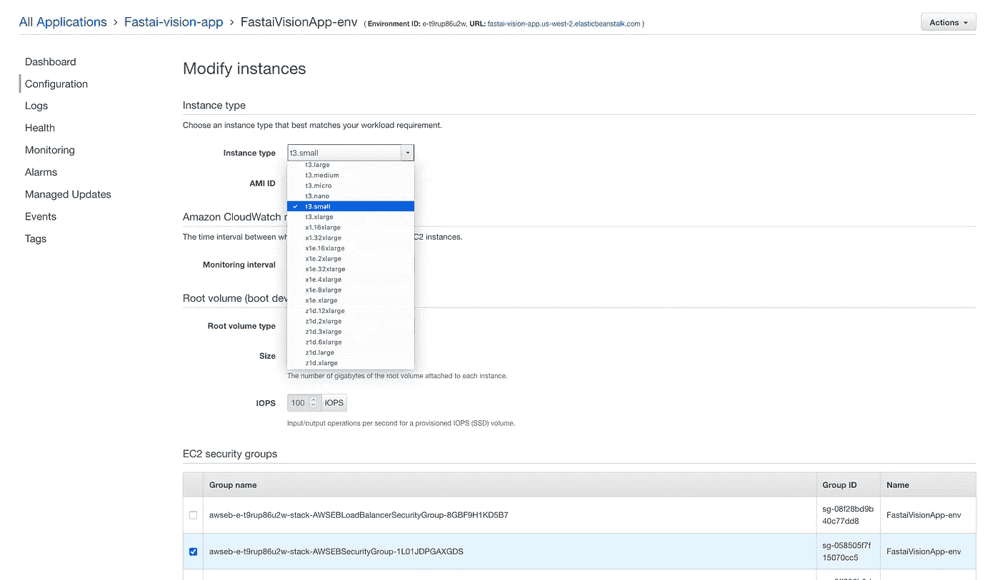****

****这就是自定义配置，现在按“ ***【创建环境】*** 然后去喝杯咖啡什么的，AWS Beanstalk 需要 10-20 分钟来部署您的源代码以创建 docker 映像，然后将该 Docker 映像部署到您选择的 ec2 实例，创建应用程序负载平衡器，使用入站和出站网络设置创建适当的安全组以及许多其他事情，这些都超出了本指南的范围。您将看到一个屏幕，显示 AWS BeanStalk 部署的日志文件条目。****

****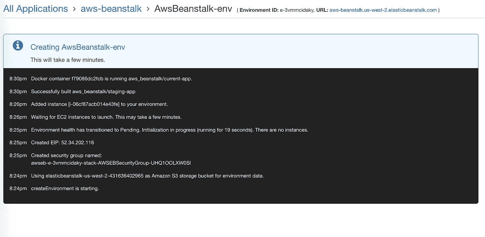****

****请耐心等待，8-10 分钟后，您会看到这样的仪表盘，它会显示健康状况，如每个阶段的 ***【绿色】*** 和详细日志。****

****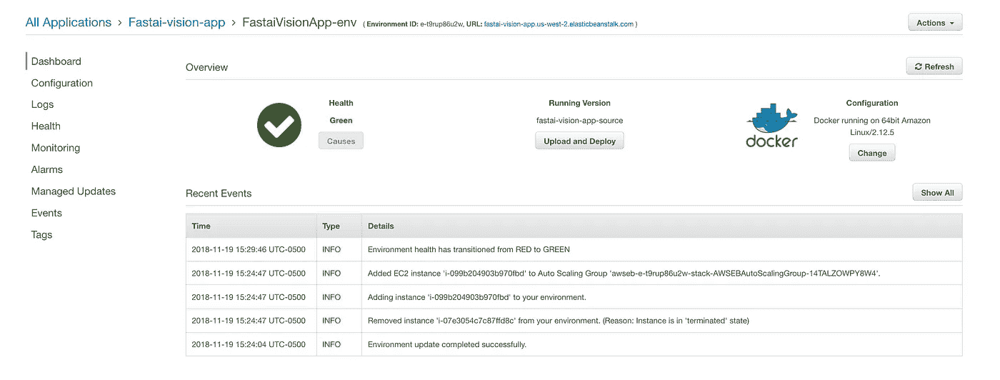****

****点击仪表板上显示的 URL，您将被重定向到新的演示应用程序，并在 AWS 上运行。****

********

******注:**如果你在仪表盘上看到，健康不是“*而是“*”，请详细查看日志文件。您可以在左侧的“日志”部分找到详细日志，按下请求日志>完整日志或最后 100 行。阅读日志将向您显示健康状态“红色”的主要原因以及您的部署失败的原因。 ***通常，这是你选择的小型 ec2 实例类型，它们在运行你的应用程序或尝试应用其他自定义设置时无法处理部署或内存问题，我在上面没有提到这一点。*********

# ****第 2 步(选项 3):带有自定义运行时的 Google 应用引擎****

****Google App Engine [自定义运行时](https://cloud.google.com/appengine/docs/flexible/custom-runtimes/about-custom-runtimes)让你构建在由 [Dockerfile](https://docs.docker.com/engine/reference/builder/) 定义的环境中运行的应用。此外，谷歌云确实为新账户提供 12 个月的免费试用，价值 300 美元。特别是因为我们的应用程序不打算使用任何数据库实例，最终定价将只包括谷歌计算实例、负载平衡器和谷歌云存储定价。点击此处阅读更多关于[谷歌应用引擎定价](https://cloud.google.com/appengine/pricing)的信息。****

****首先，打开 Google Cloud Dashboard，点击**创建项目**，然后命名您的新 GCP 项目。通过创建新的计费帐户或设置现有帐户，在您的新 GCP 项目中启用计费。您将看到以下屏幕。****

********

****创建新项目后，您将看到 GCP 仪表板页面，转到页面的最右上角，单击“ ***【激活云壳】”*** 。终端窗口将在同一页面中打开。****

********

****此时，您可以继续使用同一个终端窗口，或者在新的浏览器页面中打开该终端窗口。****

****运行以下命令创建 App Engine 应用程序，并指定希望应用程序运行的地理区域。****

```
**gcloud app create**
```

****我选择 13 并按回车键，几分钟后，它会显示类似“成功！应用程序现已创建。”****

****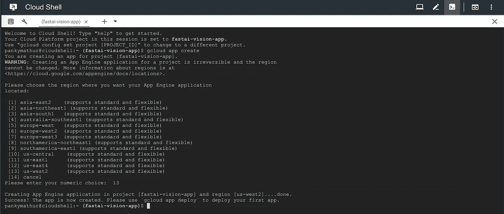****

****现在，通过键入以下命令，下载 Github 或任何其他 git 存储库管理服务上托管的 starter pack 应用程序存储库。确保您的入门包与我的 repo 中的 app.yaml 和 Dockerfile 相同。****

```
**git clone [https://github.com/pankymathur/fastai-vision-app](https://github.com/pankymathur/fastai-vision-app)**
```

****下载存储库后，导航到您的应用程序目录。****

```
**cd fastai-vision-app**
```

****将您的应用部署到 Google 应用引擎****

```
**gcloud app deploy**
```

****您将看到一个屏幕，显示“*要部署的服务”，输入 Y*****

********

****然后去喝杯咖啡，因为 app engine 需要 8~10 分钟来部署基于 docker 的应用程序，并呈现到您的最终 URL。要查看您的应用在`http://YOUR_PROJECT_ID.appspot.com`运行，运行以下命令启动您的浏览器:****

```
**gcloud app browse**
```

****这是我在 GCP 上运行的默认 fastai-vision-app starter pack 应用。****

********

# ****第二步(选项 4): Now.sh****

****[现在版本 1](https://zeit.co/docs/v1) 有一个[免费计划](https://zeit.co/pricing/v1)，可以为你的静态网络应用程序无限部署&域，可以处理高达 1 GB 的存储&带宽，&许多其他功能，只要你的最大文件大小不超过 5 MB。****

## ****现在桌面应用程序****

*   ******用于 Mac OSx 和 Windows******

****前往[https://zeit.co/download](https://zeit.co/download)下载 now.sh 桌面 app 进行快速拖拽&展开。****

## ****命令行安装****

*   ******在 Mac OS X 上******

```
**# *Intall* [*https://brew.sh*](https://brew.sh)*, if not already installed*
# a mac without brew is just another empty glass/usr/bin/ruby -e "$(curl -fsSL https://raw.githubusercontent.com/Homebrew/install/master/install)"*# Install npm, if not already installed*
brew install npm# *Install now.sh cli*
sudo npm i -g --unsafe-perm now**
```

*   ******在 Linux 上******

```
***# if not already installed*
sudo apt install npm# *Install now.sh cli*
sudo npm i -g --unsafe-perm now**
```

*   ******在 Windows 上******

****下载 https://nodejs.org/en/download/的 NPM 视窗安装程序****

****使用 Powershell:****

```
**# *Install now.sh cli*
sudo npm i -g --unsafe-perm now**
```

****在 Windows 10 上使用 Linux 应用程序:****

****选择你选择的 Linux 应用:[https://docs.microsoft.com/en-us/windows/wsl/install-win10](https://docs.microsoft.com/en-us/windows/wsl/install-win10)安装好 Linux 应用后，进入终端，按照上面的 Linux 说明安装 now.sh CLI****

## ****部署****

*   ******通过 Now 桌面******

****通过拖放或上传您的`responsive-web-app`目录到“Now Desktop”进行部署。****

****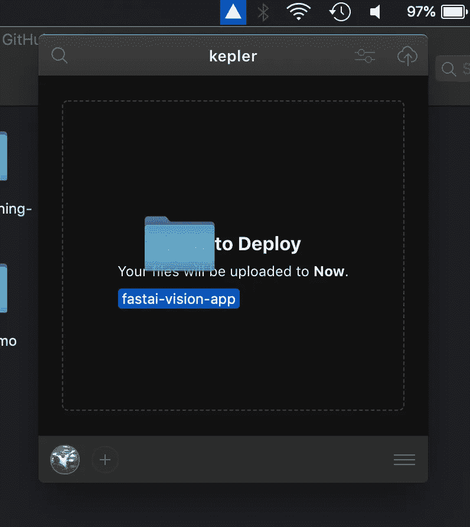****

****它将在一个单独的浏览器窗口中显示所有的部署日志细节。您可能需要在部署开始前登录 zeit.co。****

****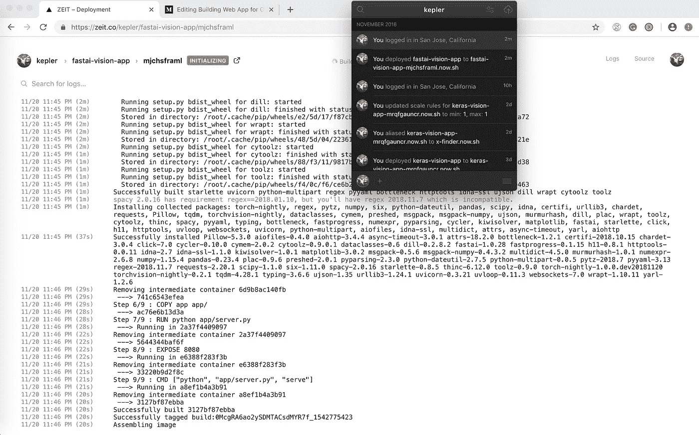****

****它将为您的静态应用程序创建一个唯一的**部署 URL** ，并在部署期间的前几行日志中显示出来。通常，它的格式为`[https://YOUR-APP-NAME-HERE-xxxxxxxxxx.now.sh](https://YOUR-APP-NAME-HERE-xxxxxxxxxx.now.sh)`****

****当部署完成时，它将显示"*成功！浏览器窗口中的*部署就绪。****

****可选:如果你像我一样，你想为你的应用程序使用一些漂亮的 URL 名称，而不是默认的名称，如 `[https://YOURAPPNAMEHERE-xxxxxxxxxx.now.sh](https://YOUR-APP-NAME-HERE-xxxxxxxxxx.now.sh)`****

****您可以转到[zeit.co](https://zeit.co/dashboard/deployments)上的仪表盘，使用当前部署的创建别名选项，将别名添加到您的应用中****

********

*   ******通过 Now CLI******

****在终端上，确保您在`keras-vision-app` 或`fastai-vision-app`目录中，然后键入:****

```
**now**
```

****每次使用“Now CLI”进行部署时，它都会为您的静态应用程序创建一个唯一的**部署 URL** ，并且会在部署期间的前几行日志中显示出来。通常，它的格式为`[https://YOURAPPNAMEHERE-xxxxxxxxxx.now.sh](https://YOURAPPNAMEHERE-xxxxxxxxxx.now.sh)`****

****当部署完成时，它将显示"*成功！终端上的*部署就绪。****

*****可选:如果你像我一样，你想为你的应用程序使用一些漂亮的 URL 名称，而不是默认的名称，如* `[https://YOURAPPNAMEHERE-xxxxxxxxxx.now.sh](https://YOUR-APP-NAME-HERE-xxxxxxxxxx.now.sh)`****

****您可以使用以下命令更改应用程序的别名:****

****`now alias PRETTY_URL_NAME [YOURAPPNAMEHERE-xxxxxxxxxx.now.sh](https://YOUR-APP-NAME-HERE-xxxxxxxxxx.now.sh)`****

****它会显示一些东西:****

```
**> Success! YOUR-APP-NAME-HERE.now.sh now points to YOURAPPNAMEHERE-rhainypwfk.now.sh**
```

## ****缩放比例****

****默认情况下，now.sh 上的 all now deployment 会在一段非活动时间后进入睡眠状态。如果你想让你的应用程序在分享或演示过程中处于活动状态，这并不好。因此，扩展您的应用实例:****

```
**# You only need to do this once.
now scale YOUR-APP-NAME-HERE.now.sh sfo 1**
```

****它会显示一些东西:****

```
**> ✔ Scaled 1 instance in sfo1 [923ms]
> Success! Scale state verified**
```

****现在，您可以与任何人分享`[https://YOUR-APP-NAME-HERE.now.s](https://YOUR-APP-NAME-HERE.now.sh)h`，以获得快速反馈和演示。****

****例如，这里是我的默认演示应用程序的链接[https://x-finder . now . sh](https://x-finder.now.sh/)****

****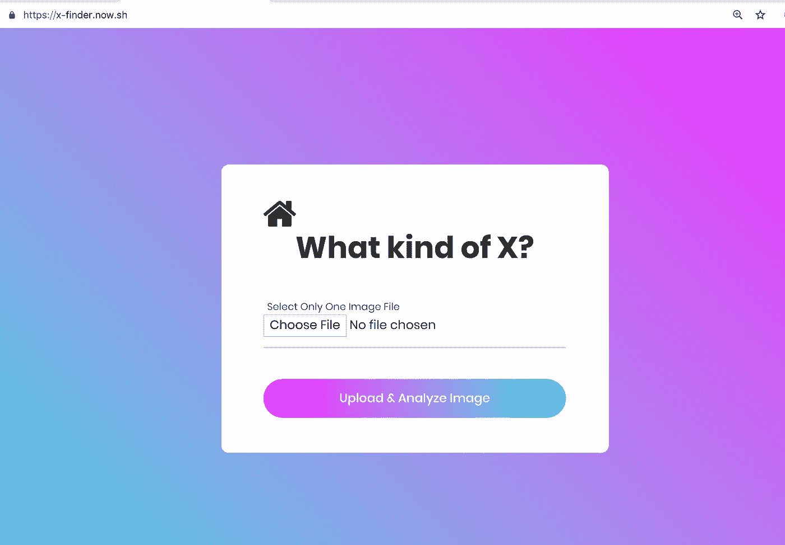****

# ****设置 Docker Hub 帐户并上传您的 docker repo(选项 5)****

****你需要一个[免费 Docker hub 账户](https://hub.docker.com/)。docker Hub 是容器托管存储库，我们将使用它向 Docker 托管的应用程序服务提供商之一提供 Docker 映像，如“ [***Azure 网站 for Containers***](https://azure.microsoft.com/en-au/services/app-service/containers/)***”***这样这些服务就知道从哪里获取 Docker 映像。****

****有很多很多的容器托管服务，提供公开或私有托管你的 docker 镜像的选项，例如，这些是业界常见的容器注册表 [Docker Hub](https://hub.docker.com) 、 [Azure Container](https://azure.microsoft.com/en-us/services/container-registry/) Registry、[Amazon Elastic Container Registry](https://aws.amazon.com/ecr/)或 [Google Container Registry](https://cloud.google.com/container-registry/) 。对于我们的场景，Docker Hub 上的公共容器存储库是一个很好的选择。****

****有两种方法可以在 docker Hub 上创建 Docker 存储库，第一种是使用 Docker CLI，它与 Mac OSx 或 Windows 的 Docker 桌面应用程序[](https://www.docker.com/products/docker-desktop)**打包在一起。******

******安装 Docker 桌面应用程序并登录 [**Docker Hub**](https://hub.docker.com/) 帐户后，以下是构建 Docker 映像并将其上传到 Docker Hub 容器注册表的步骤:******

*   ********创建一个 Docker 图像********

```
****docker build -t <imageName> .*#For ex: docker build -t keras-vision-app .*****
```

*   ********在本地运行映像，查看您的应用程序运行情况********

```
****docker run -p 5042:5042 <imageName>#*For ex: docker run -p 5042:5042 keras-vision-app*****
```

*   ******用你的 Docker Hub 用户名标记图片******

```
****docker tag image username/repository:tag#*For ex: docker tag keras-vision-app pankajmathur/keras-vision-app*****
```

*   ********将图像推送到 Docker Hub********

```
****docker push username/repository:tag#F*or ex: docker push pankajmathur/keras-vision-app*****
```

******成功推送后，您可以在 docker Hub 帐户中看到您的本地 Docker 映像。******

************

******keras-vision-app docker repo******

******第二种方式是使用 [**GitHub 与**](https://docs.docker.com/docker-hub/github/)**Docker Hub 账户集成。这是从 0 到 Docker 容器注册表最快的方法。********

*   **********将 Docker Hub 与您的 GitHub 个人资料相链接**********

******登录 Docker Hub，然后导航至**个人资料>设置>关联账户&服务**然后点击 GitHub 服务。弹出窗口提示您输入 GitHub 凭据。授予对代码库的访问权限后。您的 DockerHub 链接账户&服务页面将如下所示:******

******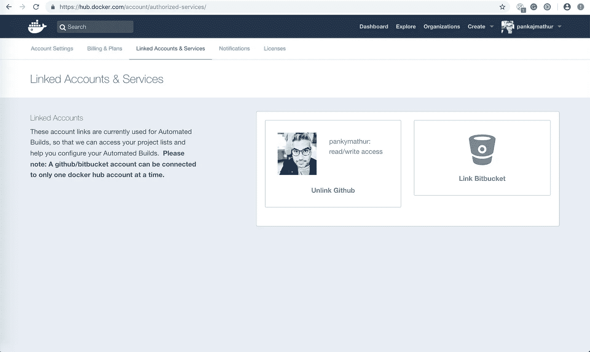******

*   ********创建自动化构建********

******转到您的 DockerHub 仪表板，然后从右上方的下拉菜单中选择**创建** > **创建自动化构建**。它会要求您选择 GitHub 关联帐户:******

******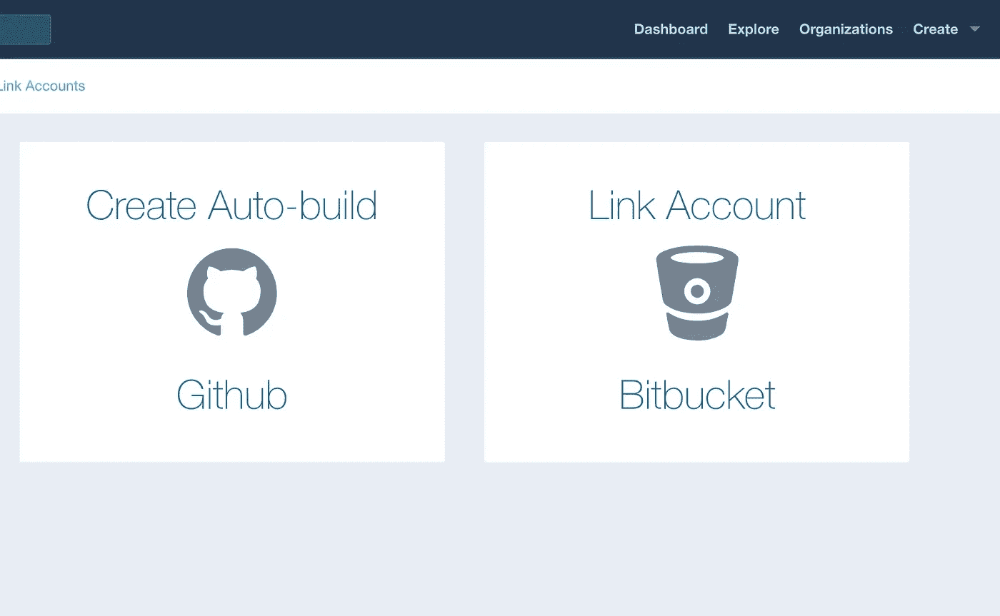******

******系统提示将显示您所有的 GitHub 存储库，键入以过滤存储库列表，然后选择要构建的项目。******

************

******系统提示将显示**创建自动构建**对话框。该对话框采用了一些您可以自定义的默认值。默认情况下，Docker Hub 会为存储库中的每个分支构建映像。它假设 docker 文件位于您的源存储库的根目录下。当它构建一个映像时，Docker Hub 用分支名称标记它。如果你想自定义默认选项，那么**点击这里自定义**这个行为链接。(对于我们的用例，保留默认值是好的)******

******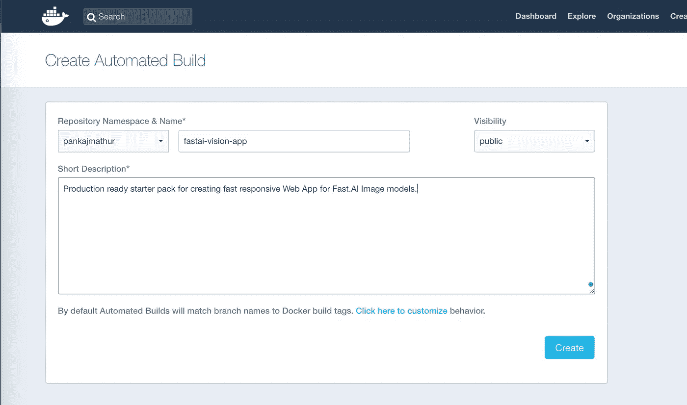******

******点击**创建，**系统显示你的自动化构建的主页。******

******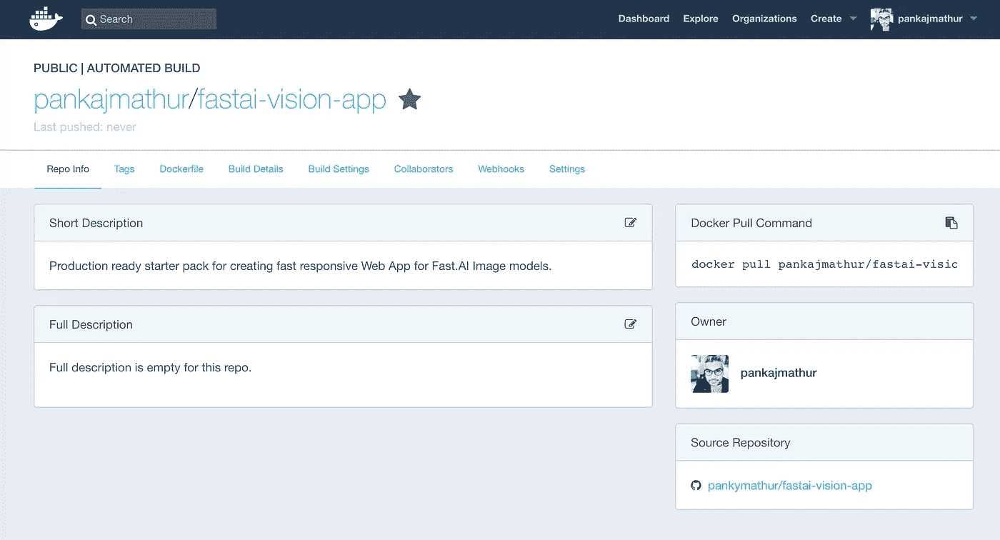******

******就这样，你让你的 docker 托管容器注册中心复制你的存储库的名称，在我的例子中，它是***pankajmathur/fastai-vision-App***，现在你已经准备好*步骤 2(选项 4):Azure Web App for Container Service*。******

# ******步骤 2(选项 4): Azure Web App for Containers 服务******

******[Azure Web App for Containers](https://azure.microsoft.com/en-au/services/app-service/containers/)one click docker App 提供了非常易于部署和托管的 docker 静态应用机制。有一篇好文章是同道 fast.ai 学员 ***日产*** [写的 https://redditech . blog/2018/11/04/hosting-fastai-app-in-azure-websites-for-containers/](https://redditech.blog/2018/11/04/hosting-fastai-app-in-azure-websites-for-containers/)。******

******请阅读这篇文章，它展示了 Azure Portal App Services for Container Services 流程的一步一步的截图。我能够阅读这篇文章，并能够在< 10 minutes***.******

*******中设置我的 web 应用程序*** Azure 最初需要很长时间来部署整个容器并传播 DNS，几乎需要额外的 10 分钟。*******

## ******缩放比例******

******Nissan 没有涵盖这一部分，所以默认情况下，所有 azure web 应用程序部署在一段不活动时间后都会进入睡眠状态。如果你想让你的应用程序在分享或演示过程中处于活动状态，这并不好。因此，通过转到 Azure *应用服务设置>应用设置* 并打开***App Always =>***并关闭***ARR Affinity =>***来扩展您的应用实例******

******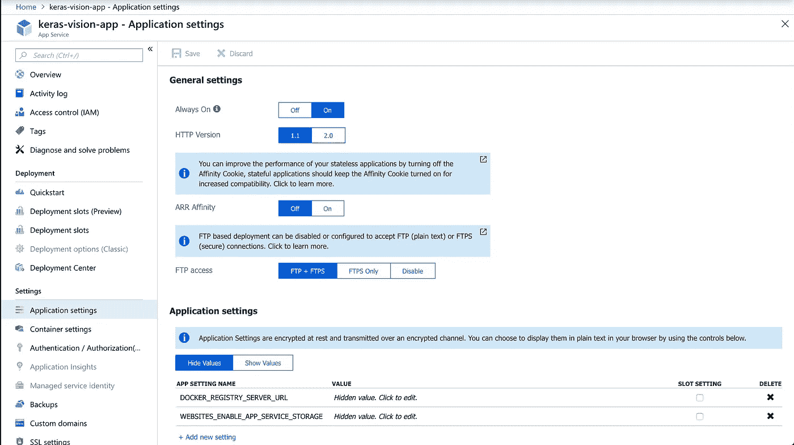******

******目前 Azure 提供前 30 天 200 美元的免费试用积分来试用他们的服务，所以你可以很容易地注册一个新帐户并尝试所有步骤。******

******这是我们的 Azure Web App = >[https://keras-vision-app.azurewebsites.net](https://keras-vision-app.azurewebsites.net)******

************

# ********入门包的罩下是什么？********

******嗯，我的两个 [**keras**](https://github.com/pankymathur/keras-vision-app) 和[**fast . ai**](https://github.com/pankymathur/fastai-vision-app)**starter packs 库都是 GitHub 上的开源，所以你可以在下载或克隆它之前检查所有代码。启动包的主体是" ***server.py"*** ，这是一个小型的 starlette . io&uvicon 驱动的 ASGI 服务器。********

******这个小小的服务器实际上一点也不小，而是一个强大的服务器，这个小小的服务器在[**Asyncio**](https://docs.python.org/3/library/asyncio.html)**库的帮助下，使用“ ***【上传(请求)】***方法，以并发方式处理您的图像或图片上传，然后它有“***【download _ file(URL，dest)*** 方法，优雅地将您的训练好的模型下载到本地驱动器，然后这个小小的 在**事件循环**、**任务、**和**协同程序**机制的帮助下，使用您的 keras 或 fast.ai 深度学习库将您下载的模型文件加载到主机内存中，最终这个微型服务器预测您上传的图像上的标签，并将其吐回到 prediction.txt 文件中。********

******frontend statics 是一个简单的 HTML5 响应式 web 应用程序，带有几个整洁的 JS hacks 来处理大图像文件上传，特别是对那些令人敬畏的 raw 相机或自拍图片有用。******

******最后，微型 ASGI 服务器和 responsive statics 被放入一个 docker 中，使用 docker 配置安装正确的 python 版本，并在 requirement.txt 的帮助下安装 Keras 或 Fast.ai、starlette.io、uvicorn 和所有其他库依赖项，然后这个 docker 配置将暴露端口 5042 并启动服务器。所有这一切，让你可以轻松地在 docker 云机器上托管你的 Docker 映像…******

*******注意:大多数现代浏览器都能很好地处理这些 JS hacks 和 HTML5 文件。如果你还停留在 21 世纪初，忽略这篇文章。*******

************

******source: [https://cheezburger.com/8348948736](https://cheezburger.com/8348948736)******

******就这样，希望你喜欢这个指南，并能够为你的计算机视觉模型构建你的 Web 应用程序&能够将它们部署到生产中，并在这样做的同时建立一个 3 步流程，因此你可以立即重复所有这些步骤。如果没有，请在评论区告诉我你的问题。如果是的话，我真的很希望得到一些关于这篇文章的反馈和改进意见。******

******同时，快乐深度学习…******