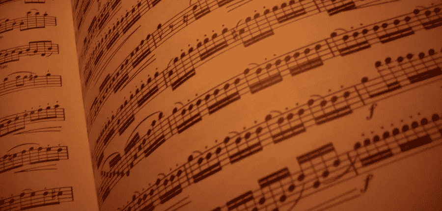
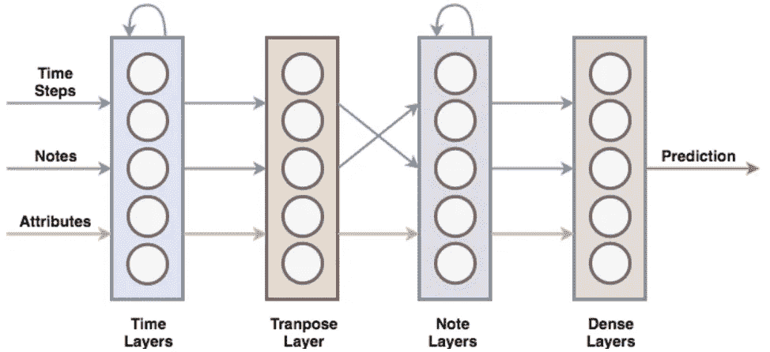
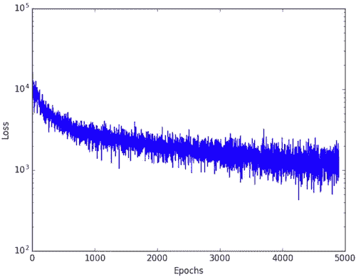
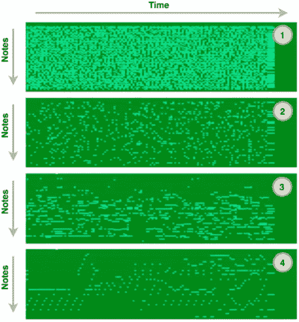

# 深度神经网络可以作曲吗？

> 原文：<https://towardsdatascience.com/can-a-deep-neural-network-compose-music-f89b6ba4978d?source=collection_archive---------6----------------------->

当我去年九月开始读研时，我想尽快投入到深度学习的热潮中。当我在纽约作为一名软件开发人员工作时，我不断听到关于深度学习的惊人事情: [DeepFace](http://www.cv-foundation.org/openaccess/content_cvpr_2014/papers/Taigman_DeepFace_Closing_the_2014_CVPR_paper.pdf) 可以像你和我一样识别人的脸， [AlphaGo](https://storage.googleapis.com/deepmind-media/alphago/AlphaGoNaturePaper.pdf) 在一场最初对人工智能来说似乎难以捉摸的游戏中摧毁了玩家， [GANs](http://papers.nips.cc/paper/5423-generative-adversarial-nets.pdf) 刚刚开始获得动力。所以当我得知我的部门要办[他们第一个真正的深度学习班](https://compsci697l.github.io/)的时候，我立马就报名了。尤其是因为它将由计算机视觉领域的一位名人来教授，埃里克·勒德-米勒，他在这里经营着计算机视觉实验室。顺便说一下，值得表扬的是，[最初的课程](http://cs231n.stanford.edu/)是由[费-李非](http://vision.stanford.edu/feifeili/)、[斯坦福视觉实验室](http://vision.stanford.edu/)的主任[和](http://cs.stanford.edu/people/karpathy/)安德烈·卡帕西开发的。

快进过去一些巨大的任务，使我们实现了神经网络框架的本质，包括密集层、漏失层、批量规范层、卷积层、递归层、你能想到的每一个激活层、市场上可用的所有优化器、反向传播以及计算机视觉中的一系列应用，如对象识别、图像字幕和图像生成， [Sam Witty](https://samwitty.github.io/) 和我最终必须选择我们想要为我们的最终项目做什么。由于山姆是一个名为 [*白卡带*](http://www.whitecassette.com/) 的乐队的键盘手，这意味着他在与音乐相关的一切方面都绝对*。凭借他的专业知识和我严重缺乏的音乐天赋，我们决定看看是否可以像人一样使用深度学习作曲。*

**

*Source: [Music Lover Stock](http://music-lover-stock.deviantart.com/)*

*这让我们看到了[丹尼尔·约翰逊](http://www.hexahedria.com/2015/08/03/composing-music-with-recurrent-neural-networks/)在一个名为[六面体](http://www.hexahedria.com/)的博客中发的一篇非常甜蜜的帖子。丹尼尔建立了一个可以创作古典钢琴曲的深度神经网络。在那篇文章的帮助下，我和萨姆开始了我们的最终项目——遗憾的是，我们不假思索地将其命名为*Deep Jammer*——通过学习巴赫、贝多芬、莫扎特和其他著名作曲家的大量音乐，可以无休止地创作古典钢琴曲。如果你想了解详情，你可以查看我们的报道、海报和 T21。我们也使用迁移学习来创作爵士乐，但是我们将把它留到另一篇文章中。虽然 Deep Jammer 是基于 Daniel 所做的，但我们重构了他的许多代码(他甚至承认这些代码很乱)，优化了设计和超参数，并在 Keras 中实现了一个更干净的版本，这个版本可以工作，但不太好。言归正传，下面是 Deep Jammer 作曲的一首古典钢琴曲的预告:*

*背景故事够多了。让我们继续表演吧。既然对这篇文章标题的明显回答是响亮的是，现在让我们问一个不同的问题。*

***深度神经网络如何作曲？***

# *概观*

*为了让你对我们所做的有一个基本的概念，让我们对我们的最终项目有一个大概的了解。看看这个:*

**

*如您所见，该图只有三个部分:*

*   ***代表一段音乐的输入矩阵**。*
*   ***输出矩阵**，表示对下一步播放什么的预测。*
*   ***通过听大量音乐来学习模式的神经网络**。*

*因为这可能现在对你来说很模糊，让我们慢慢地走过输入矩阵、输出矩阵和神经网络。没那么糟。*

# *投入*

*我们网络的输入是一段音乐，我们把它转换成一种特定的表达方式。说得好听点，我们把这个叫做**段**。这只是一个三维矩阵:*

*   ***时间:**该段有 128 个**时间步长**。打个比方，每个时间步长就像一首歌的 100 毫秒。类似于一首活页乐谱，这将帮助我们了解一个片段如何随时间变化。*
*   ***注:**每个时间步有 88 个**注** *。我们有 88 个，因为一架钢琴上有 88 个键。再一次，如果我们想到乐谱，这代表了五线谱上所有的线条和空间。**
*   ***属性:**每个音符有 78 个**属性** 描述该音符的状态，我们将在后面介绍。基本上，对于每一个音符，我们都需要知道一些关于它的事情。*

*由于谈论三维矩阵可能会令人困惑，现在让我们把所有的东西放在一起。第一，输入只是一段。第二，每段有 128 个时间步长来表示时间。第三，钢琴上每个键的每个时间步有 88 个音符。第四，每个音符有 78 个属性来概括音符的状态。简而言之，输入——我们称之为片段的三维矩阵——只是描述了一段音乐。*

*到目前为止，我们还没有讨论每个音符的属性是什么样的。那么它们是什么呢？请看下面:*

*   *位置:钢琴上相应音符的键的位置。这个范围从 1 到 88，因为钢琴上有 88 个键。更重要的是，我们需要这一点，因为网络必须理解相同音高的音符之间的差异，就像当我们有两个不同八度的 a 时。*
*   ***音高类:**一个数组，每个元素对应一个音高( *C* 、 *D* 、 *E* 、 *F* 、 *G* 、 *A* 、 *B* 连同降半音和升半音)。与相应音符相关联的音高被设置为*真。*每隔一个间距设置为*假*。*
*   ***neighborhood:**包含与相应音符相邻的音符状态的数组。我们为每个相邻的音符存储两个值:如果它刚刚被弹奏，我们存储(1) *真*(否则存储*假*);如果它刚刚被按住，我们存储(2) *真*(否则存储*假*)。为了简单起见，我们只采集相应音符的上下八度音程中的相邻音符。*
*   ***节拍:**在其小节中对应音符的位置。例如，一个音符与一个从 0 到 16 的整数相关联，因为我们的时间分辨率在第 16 个音符。然而，这可能会随着训练集中古典钢琴作品的分辨率而改变，我们将会谈到这一点。*

# *输出*

*我们网络的输出预测了在输入段之后的下一个时间步应该播放什么。再一次，说得好听点，我们称之为**预测** *。*这只是二维矩阵:*

*   ***注:**预测有 88 个**音符**对于像输入一样的钢琴的每个键。*
*   ***属性:**每个音符有 2 个**属性** 描述该音符的预测状态。*

*那么属性是什么呢？请查看以下内容:*

*   ***弹奏概率:**音符在下一时间步弹奏的概率。*
*   ***发音概率:**音符在下一时间步被保持的概率。*

# *体系结构*

*现在我们已经了解了网络的输入和输出，让我们来看看每一层的作用。但是，在我们这样做之前，先来看一个简化的图表，它给出了大致但很好的概述:*

**

*这些层看起来和听起来都比它们实际上更令人困惑。如果我们把每一个都分解开来，那就很简单了。顺便说一句，如果你不知道什么是 LSTM，它只是一种特殊类型的 RNN。如果你想了解更多，可以在 [colah 的博客](http://colah.github.io/)上查看[这篇文章](http://colah.github.io/posts/2015-08-Understanding-LSTMs/)。在任何情况下，检查每一层:*

*   ***时间层:**捕捉音乐时间模式的 LSTM 层。我们将之前的**时间**维度视为 LSTM 的时间维度。这意味着网络学习每个音符的属性如何随时间变化。比如这里可以想到琶音和音阶。*
*   ***转置层:**转置**时间**维度和**音符**维度的处理层。为什么我们要翻转这两个维度？这将**音符**维度设置为 LSTM 的新时间维度，为下一层做准备。*
*   ***音符层:**LSTM 层，捕捉音乐的空间(或音符)模式。我们将之前的**音符**维度视为 LSTM 的时间维度。这使得网络能够了解属性如何随着音符而变化。最好的例子是一起演奏的一个和弦或一组音符。(我同意你的观点。这是一个奇怪的想法。)*
*   ***致密层:**全连通层，将**注层**的高维输出降低为非标准化预测。这一层*总结了**时间层**和**笔记层**所学的*。*
*   ***激活层:**对来自**密集层**的非标准化预测的每个元素进行标准化——或挤压——的层。我们使用 *sigmoid 激活函数*来完成此操作:*

**

*请注意，我们可以在架构中调整几件事情，如**时间**、**注释**、**、**和**密集**层的数量以及每层中的节点数量。如果愿意，我们还可以添加辍学层。我将忽略这一点，因为它们是实现细节。*

# *培养*

*走过了我们网络的一切，是时候训练它了。这和你训练任何网络没什么不同。我们是这样做的:*

1.  *我们从[这里](http://www.piano-midi.de/)收集了 325 首古典音乐作品。它们是 MIDI 文件。如果你不知道那是什么，我也不会担心。MIDI 只是一种将音乐编码为一系列事件的格式。为了简洁起见，我们跳过细节。*
2.  *我们一拿到 MIDI 文件就做了一个训练集。为此，我们从 MIDI 文件中随机取样，并将它们转换成适合我们网络的表示形式。在我们的训练集中，一个训练示例是一对两个矩阵(即我们已经讲过的输入和输出矩阵): **(a)****特征**只是一段(具有**时间**、**注释**、**属性**维度的三维矩阵)。
    **(b)****标签** 是一个预测(二维矩阵用**标注**和**属性**维度)。*
3.  *我们设计了一个定制的损失函数，因为我们跳过了太多的符号，所以我们将忽略它。如果你感兴趣的话，报纸上有这方面的报道。除了损失函数，我们还导出了反向传播的梯度。*
4.  *我们使用 [adadelta](https://arxiv.org/pdf/1212.5701.pdf) 来训练我们的网络，这是一种自适应学习率梯度下降方法，用于 5000 个时期，批量大小为 5 个段。*

*如果你有兴趣，你可以看看下面这个训练损失的好图。这里没有什么太令人惊讶的。它像大多数训练损失曲线一样减少。*

**

*每隔 100 个时代，我们用我们的网络作曲，看看随着训练损失的持续减少，音乐是什么样子的。看看下面的可视化。请注意，**时间**轴代表时间步长，**音符**轴代表 88 个琴键。你可以看到随着网络训练越来越多，音乐变得越来越好。到最后，你肯定能看到琶音、音阶和和弦。*

**

# *产生*

*现在我们已经训练了我们的网络，让我们创作一些古典钢琴曲。为此，我们一遍又一遍地重复以下步骤:*

1.  *我们从训练集中随机选择了一个片段。*
2.  *我们将该片段作为输入输入到网络中。*
3.  *我们从网络得到一个预测作为输出。*
4.  *我们将预测转换成一个新的部分。*
5.  *跳到**第二步**。*

*简单地说，我们输入一个片段，得到一个预测，然后将预测反馈给网络。如果我们跟踪每一个预测，我们就可以把一首听起来不太糟糕的古典钢琴曲串起来。*

# *结果*

*为了评估我们的网络创作的古典钢琴音乐，我们发出了一份调查，参与者必须从 10 首作品中选出一组不同的作品进行评分。此外，我们还加入了一首真正的古典钢琴曲，它来自一位不为参与者所知的著名作曲家。由于我们的海报已经过时，这里有一些最新的有趣数据:*

*   *我们电视网的最佳节目平均得分为 7.5*
*   *真品的平均评分为 7.9 分*
*   *奇怪的是，有三个人不相信真正的曲子是人类创作的*
*   *12 个人更喜欢我们电视网的最佳节目*

*现在我们已经结束了，是时候听一些由我们的网络创作的古典钢琴曲了！我希望你喜欢这场表演。停留片刻，倾听:*