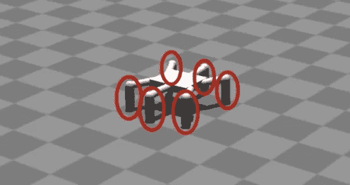
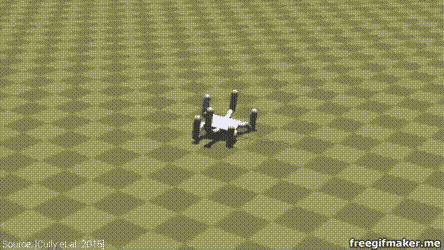
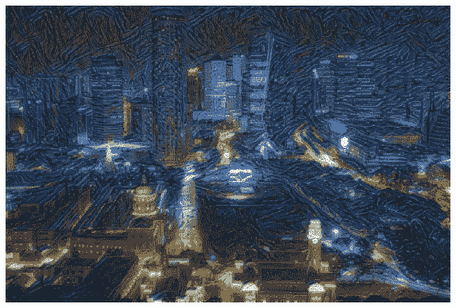
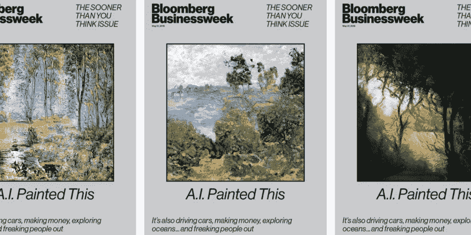

# AI 能有创造力吗？

> 原文：<https://towardsdatascience.com/can-ai-be-creative-2f84c5c73dca?source=collection_archive---------0----------------------->

## 全面审视计算机和创造力的现状

2015 年，研究人员安托万·库里、杰夫·克伦、达内什·塔拉波和让·巴普蒂斯特·穆雷在他们的屏幕上看到了一个古怪的异常现象。

他们在模拟环境中训练机器人，如果它们的腿受伤了，就能适应行走。当他们试图找到机器人行走所需的与地面的最少接触时，他们发现了一个不可能的值——计算机计算出机器人可以在脚与地面 0%接触的情况下行走。

机器人不接触地面怎么可能行走？

当他们播放视频时，他们发现了一些惊人的东西。计算机已经提出了一种步态，在这种步态中，机器人可以翻转自己，用肘关节行走，从而将脚的接触减少到 0。

The AI came up with a creative solution to walk without any of its feet

如果这项任务交给人类，他们似乎不太可能考虑不使用腿的机器人行走步态。人工智能自己想出了一个独特的解决方案。

那么问题就来了——**人工智能有创造力吗？**

创造力是我们通常认为人类独有的技能。有史以来，我们一直是地球上最有创造力的生物。鸟类可以筑巢，蚂蚁可以筑巢，但在地球 5.101 亿公里的表面上，没有任何其他物种能接近我们人类表现出的创造力水平。

然而，就在过去的十年里，我们已经获得了用电脑做惊人事情的能力，就像机器人一样。随着 2010 年代的人工智能热潮，计算机现在可以识别人脸，在各种语言之间进行翻译，为你接听电话，并在世界上最复杂的棋盘游戏中击败玩家，等等。

突然间，我们必须面对这样一种可能性，即我们的创造力在宇宙中并不是无与伦比的。

那么，创造力不再是人类独有的特征了吗？**人工智能能有创造力吗？**

# 反对人工创造的论点

Computers enabled a 16 y/o me to create this (questionable) art

反对计算机有创造力的通常论点是，它们只能做被告知要做的事情。人类是给它们编程的人，它们只是给定指令的奴隶，并据此执行任务。他们是*机器人*——这个术语来自捷克语 *robota* ，字面意思是*强迫劳动*。

另一方面，人类不受规则的约束，他们可以创新，跳出框框思考；他们很有创造力——无中生有。

但这一论点在两个层面上失败了。

首先，认为人类摆脱了“编程”的束缚是自私的，因为在现实中，我们就像计算机一样，固有地运行在一套基本规则上，只是我们的编程不是用 0 和 1，而是用 A、C、T 和 Gs。

正是这些相互对立的规则创造了我们定义为创造力的复杂性。然而，这同样适用于计算机。在目前可能是计算机科学中最热门的领域之一——机器学习中，计算机通过融合成千上万个人工神经元的计算来进行学习。人们很容易将计算机视为许多简单规则的组合，但复杂性只不过是复合的简单性。

其次，考虑一个 AI 如何学习。在当今最成功的方法之一中，计算机被输入了数千条(如果不是数百万条的话)与它要学习的任务相关的数据。例如，如果它需要检测图像中的肿瘤，它会被输入突出显示肿瘤的 x 光图像。它试图检测肿瘤，并根据它是对还是错，调整自己以更加准确。在看过数百万张这样的图像后，计算机学会了如何突出肿瘤的图像。

> 复杂只不过是复合的简单。

人类的学习方式几乎相同。我们反复尝试，基于我们是对还是错，我们调整我们的方法，直到我们达到一定的能力水平。

因此，即使我们的学习方法非常相似，当计算机做独特的事情时，我们经常会找到方法避免称之为创造性。

# 对创造性计算的偏见

当人类想出新奇和令人惊讶的东西时，它被视为创造性天才，被称为洞察力。

当计算机创造一些新奇和令人惊讶的东西时，我们认为创造者是有创造力的，或者认为它是危险的，需要人工智能来解释自己。

在许多情况下，这种解释是有根据的。如果一辆自动驾驶汽车做出了转向以避免杀死乘客或保持路线以避免杀死行人的决定，伤亡者的家属会想要一个解释，为什么人工智能做出了这个决定，[即使得到这个问题的答案并不容易](https://www.technologyreview.com/s/604087/the-dark-secret-at-the-heart-of-ai/)。

A trolley problem for the 21st century

另一方面，当一个人工智能学习生成莫奈风格的绘画时会怎么样？我们认为人工智能和艺术家做同样的事情一样有创造力吗？通常，这种创造力被置之不理，理由是计算机用原始数学来做，而人类会用直觉来做。

事实上，每当计算机学会做一些我们认为只有人类才能做的事情时，我们就会改变我们的假设，认为这种活动对计算机来说很简单。

例如，自动字幕视频，下棋，甚至垃圾邮件检测曾经被认为是极其困难的，甚至是计算机不可能做到的，但现在是规范。从本质上说，我们对计算机已经取得的进步视而不见，因为我们一直通过贬低它们执行的任务来忽视它们的创造力。

重要的是要记住，与人类相比，人工智能已经走了多远。然而，了解他们的缺点也很重要。

# 人类和人工智能的区别

Perhaps one of the better style transfers I’ve made

我们人类在许多领域都有中等的才能，而人工智能只在一个极其狭窄的领域有着极高的能力。

人类可以学习走路、说话、理解、绘画、创作音乐、与他人交流等等。人工智能只能做其中一件事，但做得很好。

例如，研究人员训练一个人工智能将绘画风格转换为普通照片的内容。与人类不同，人工智能可以在一小时内数字化复制数千幅这些风格化的画作。然而，同样的人工智能不能做任何其他事情。

因此，有人可能会说，如果没有人类创造和部署人工智能来完成这些任务，人工智能什么也做不了——作为它们的创造者，它们的创造力实际上就是我们的创造力。

然而，如果没有人工智能中数千个神经元的数学计算值，这些画也不会被制作出来。

创造性的输出——绘画，既依赖于人工智能，也依赖于人类，所以它们不能在不包括另一个的情况下归于任何一个。

# 数字艺术家的崛起

Bloomberg’s Cover Featuring AI Art

人工智能和人类的这种结合在任何领域都比不上最典型的创造性学科——艺术。

有无数的艺术家结合他们的艺术洞察力和人工智能的创造能力，在网上创造惊人的创造力展示。

Twitter 用户 Manoloide 和 Robbie Barrat 利用电脑创作出令人惊叹的艺术作品；罗比·巴拉特制作的人工智能艺术甚至登上了彭博杂志的封面。

人工智能本身对哪种艺术好看没有任何品味或洞察力，但如果没有人工智能，人类就无法做出他们目前所做的令人惊叹的创作。

 [## 马诺洛伊迪(@马诺洛伊迪)|推特

### Manoloide 的最新推文(@manoloidee)。创意编码员和生成设计师。可供自由职业者使用…

twitter.com](https://twitter.com/manoloidee)  [## 罗比·巴拉特(@DrBeef_) |推特

### Robbie Barrat 的最新推文(@DrBeef_)。📺+👁//我爱机器学习🤖💭+艺术🎨+植物🌱🌷//就……

twitter.com](https://twitter.com/DrBeef_) 

# 创造力的未来

总之，人们经常说计算机只能做它们被明确编程的事情，因此它们不可能有创造力。然而，随着机器学习的兴起，AI 现在可以学习某些技能。

这就是说，人工智能只会像它的训练一样好，除了它被训练的狭窄领域之外，它将无法在其他领域做任何事情。这需要人类组装数据集并为人工智能编码。人工智能在理解上也没有任何判断或细微差别。这是人类带来的技能。

所以，AI 和人类放在一起，可以成就大事。他们可以成为世界上最好的棋手，将世界名画的风格转移到成千上万的图像中，并为我们认为不可能解决的问题找到极具创造性的解决方案。

我将引用美国历史学家梅尔文·克兰兹伯格的一句话来总结这个观点

> 一场音乐会后，一位女士来到伟大的小提琴家弗里茨·克莱斯勒面前，激动地说:“大师，你的小提琴奏出了如此美妙的音乐。”克里斯勒把他的小提琴举到耳边说:“我没听到里面有任何音乐。”你看，乐器，硬件，小提琴本身，没有人的因素是没有用的。但是话说回来，没有乐器，克里斯勒就不可能创作音乐。

人工智能是未来创造力的画笔。对于它来说，创造它的艺术，它需要一个人类的使用者，而对于人类来说，创造艺术，它需要画笔的笔触。