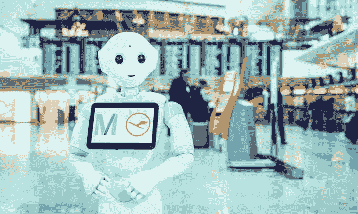

# AI 能否重塑机场卓越？

> 原文：<https://towardsdatascience.com/can-ai-reinvent-airport-excellence-bbf581939c4e?source=collection_archive---------19----------------------->

Photo credits : International Airport Review

如果航班调节着机场的心跳，那么管理就是它的灵魂。

几乎在任何地方，管理层都可以利用数据来提高机场服务质量。开放数据的集成可以减少进入机场和航站楼登机口的排队时间。更好地利用信息可以促进飞机、乘客和物资的实时流量预测。通过更深入地了解客户、员工部署和资源分配，机器学习可能是优化流程的关键。随着机场从航站楼向多模式商务和休闲中心发展，人工智能可以成为收入机会的来源。将有利可图的大数据和人工智能应用于机场管理的关键成功因素是什么？

大数据方法解决了改善机场流程的五大挑战。*数量*机场管理数据，传统上与其他行业相比并不多，但现在由于安全和监管限制而呈指数级增长。随着数据科学团队希望更好地了解飞机、资源和人员的移动，数据的*多样性*正成为一个真正的挑战。随着自动化空侧操作成为现实，数据的*速度*也成为一个紧迫的问题。随着管理团队努力理解实时数据、数据科学和预测分析的重要性，数据的*准确性*现在是一个关键的成功因素。最后，数据的*值*与改善个人和集体航空旅行体验的应用直接相关。

人工智能的商业价值与其降低商业预测成本和减少运营过程中的可变性的潜力相关联。人工智能的应用已经证明了它们在自动化计划、组织和预算方面的价值。在不久的将来，机场管理层将专注于定义和评估人工智能的方向和采用率，以优化主动员工和预测人工智能代理的团队。随着机场从航站楼演变为多模式服务中心，经理们今天需要思考机场有一天可能会是什么样子，并问自己人工智能实验在什么程度上可以证实这种愿景。

不幸的是，从这里到那里的飞行路线没有清晰的轨迹。今天的大多数机场离人工智能就绪的组织还很远。机场不是传统意义上的连贯组织，而是*复杂的适应系统*，容纳了多个业务，它们具有相互竞争的逻辑、网络和目标。“机场”不仅接待航空公司制造商、运营商、监管者，还接待共享机场空间的零售、餐饮、休闲和娱乐实体。这些企业对经济周期、政治和环境压力、社会人口统计和技术创新的反应可能大不相同。*几乎没有共同的流程，没有单一的控制点，也没有创建世界级机场的“唯一最佳方式”。*利用数据或开发人工智能应用程序，必须考虑机场的现状以及未来的发展趋势。

在这样的背景下，过程挖掘可能是数据科学最有用的应用之一。流程挖掘是流程管理领域的一系列技术，支持基于不同机场技术留下的数据线索的业务流程分析。流程挖掘不是试图开发机场应该如何运营的更好模型，而是试图将运营流程与不同客户、代理和经理的互动方式相协调。这种“翻转”过程模型的目标是从经验中学习，而不是从专业知识中学习。虽然在这一领域的第一次实验主要集中在行李处理和队列管理上，但人们可以预期，过程挖掘技术将在解决机场当局目前面临的许多挑战方面产生红利。

*人工智能的最终目的不是让机器变得更聪明，而是帮助管理者在他们的组织环境中做出更好的决策。*管理决策不是基于数据，而是基于对数据的理解，这些数据本身就受到移情、直觉、想象力和情感的影响。在复杂的机场中，管理层根据可用数据与运营伙伴协商共同决策。如果机器学习旨在突出数据集的相似性，管理层将继续关注运营流程中异常(异常值)的重要性。与过去一样，在可预见的未来，管理人员的表现将不会根据他或她在电脑后对数据的处理来评估，而是根据他们在同事和客户面前对信息的处理能力来评估。

我将在法兰克福机场卓越运营和自动化 IQPC 会议上讨论和发展这些主张。我们将与其他会议发言人一起讨论如何使 IT 流程适应实际的机场和航空公司实践。我们将扩展讨论，探索人类和人工智能之间的相互关系如何真正为机场生态系统增加价值。我期待在法兰克福见到你。

商业分析研究所的 Lee SCHLENKER 博士

2018 年 10 月 12 日

Lee Schlenker 是商业分析和社区管理教授，也是 http://baieurope.com 商业分析研究所[的负责人。](http://baieurope.com./)他的 LinkedIn 个人资料可以在[查看](http://www.linkedin.com/in/leeschlenker.)你可以在[的 Twitter 上关注白](https://twitter.com/DSign4Analytics)