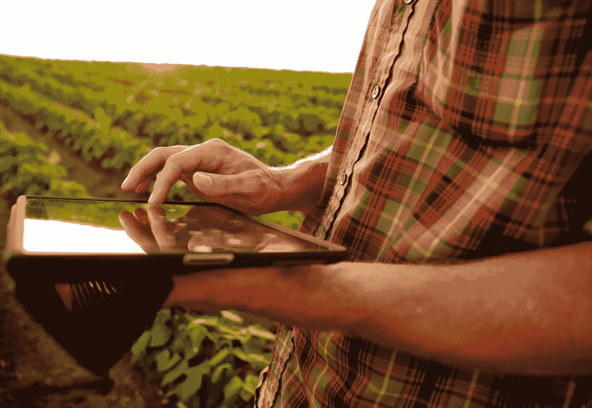
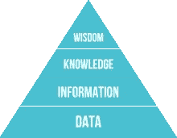

# 大数据能给农业带来巨大回报吗？

> 原文：<https://towardsdatascience.com/can-big-data-deliver-big-returns-for-agriculture-8800d31440a?source=collection_archive---------0----------------------->

你好 2017！这是一个大胆的新年，也是开始一些新习惯的好时机。我围绕太阳旋转的目标之一是写更多我热爱的事情。

> 尤其是……技术。农业。初创企业。和其他相关的东西。

我喜欢阅读这些话题，但是我没有看到足够的关于它们的文章。特别是农业科技。为什么会这样？

所以我想在 2017 年，我将停止抱怨，开始贡献我自己在农业科技领域的经验和教训。这是一个令人兴奋且快速增长的领域，需要更多的关注。我希望我能帮助照亮一些光。

同时，我会分享我对创办农业科技公司其他方面的想法。是的，所有这些其他的(有时是混乱的)幕后活动都是将想法转化为市场所必需的。比如创新、犯过的错误、吸取的教训、建立一个团队/产品，以及创办、运营和发展一家科技公司的基本要素。

四年前，我创办了 [AgDNA](https://agdna.com/) ，并成功地走过了艰难的创业之路，建立了一家正在崛起的伟大的农业科技公司。我也将分享一些我在硅谷和风险投资领域的经历。虽然 AgDNA 没有筹集风险投资基金(我们选择保持私有)，但我也学到了很多关于 AgTech 创业场景的那一面。

因此，为了不跑题，不让人觉得我是在推销，我想从大数据这个话题以及它如何惠及农业开始。我希望这将是有趣的农业科技系列文章的第一篇。

享受吧。

# **大数据的前景**

你可能听说过科技行业中提到的术语[大数据](https://en.wikipedia.org/wiki/Big_data)。这是一个经常被放错地方的标题流行语。在农业方面尤其如此。

大数据通常以数量、多样性、速度、可变性和准确性为特征。农业绝对有这些！

数量——仅美国就有 3.5 亿英亩农场。

多样性——不同的作物类型、拖拉机、技术提供商、数据格式。

速度—拖拉机现在每秒钟可以在整个田地中记录多达 5 次的数百个数据点。

可变性——土壤类型、降雨模式、温度、风暴事件，还需要我多说吗！

真实性——糟糕的手机连接、恶劣的环境条件、大量的断点。

> **农业绝对有资格成为大数据参与者！**

农业部门在利用大数据技术方面处于有利地位，许多公司正在为其成功做出贡献。所有主要的拖拉机制造商都在他们的设备中嵌入了传感器，[将他们的机器连接到云端](http://www.networkworld.com/article/3071340/internet-of-things/john-deere-is-plowing-iot-into-its-farm-equipment.html)。科学气象研究人员创造了专门针对农业的天气解决方案。出现了无数的初创公司，它们开发各种各样的田间传感器，以捕捉土壤、水分、作物和其他关键数据点。

然而，最终结果往往是数据过载。

除此之外，气候模式的变化也导致了复杂多变的作物生产环境。数据过载会很快导致数据混乱。

这是大数据解决方案真正大放异彩的地方。

# **大数据幻觉**

各地的农业科技公司都在谈论他们的大数据解决方案、云、数据分析和其他技术术语，这些听起来很聪明，但没有充分说明对种植者的真正价值。现在，我确信这些公司中有许多是出于好意，但从我的观察来看，他们中的许多人甚至没有触及我们新兴的大数据世界需要什么或可能什么的表面。

收集大量数据是一回事。将它转化为可操作的见解，进而转化为种植者更高的利润率，则完全是另一回事。农业科技公司必须投入艰苦的努力，代表客户爬上从数据到知识的金字塔。最终我们必须获得智慧，但这是另一篇文章本身。

攀登金字塔是一个滑动的斜坡，有许多移动的部分来开发所需的大数据解决方案，从季节开始到收获，一路上展示明确的经济价值。

DIKW Pyramid *Source:* [*https://en.wikipedia.org/wiki/DIKW_pyramid*](https://en.wikipedia.org/wiki/DIKW_pyramid)

# **大数据机遇**

那么什么是大数据，为什么它对农业如此重要？

大数据本质上是使用非常强大的计算机来执行数据分析任务，这些任务无法由人类在使用传统软件的标准计算机上轻松执行。由于持续不断的数据流经常 24/7 全天候传输，而且不断变化的信息涉及气候、作物、空间变异性、农业设备和其他条件监控传感器，因此自动化和智能化的大数据解决方案至关重要。

大数据可以开始揭示对任何个人来说都不明显的问题和趋势。复杂的数学技术，如[机器学习](https://en.wikipedia.org/wiki/Machine_learning)也在这里发挥作用*(我将把它作为另一个话题)。*

不用说，确定这些趋势和见解对农业部门来说是至关重要的结果。对于一些种植者来说，耕作是艰苦的，有时甚至是与世隔绝的。”。

通常情况下，种植者会根据他们传统的作物管理方法、农学家的建议以及在当地咖啡店的谈话来为他们的农场做出决策。但是你怎么知道是否有一个更优的决策是基于以前的经验在其他地方做出的呢？

这就是大数据和基准测试可以发挥作用的地方。

# **大数据的承诺**

想象一下，一个种植者准备在他的农场种植玉米，土壤类型从轻沙质土壤(持水能力差)到重粘土(持水能力高)。除此之外，还有一些有陡峭山脊和山坡的田地，以及一些排水不畅的大面积平地。已经有许多关于地形、地表水管理的考虑，我们甚至还没有开始处理天气！

这种情况可能会进一步加剧，因为雨季开始时天气潮湿寒冷，在收获前雨水很少，天气相当干燥。围绕种植什么、如何管理作物以及在整个季节采取什么行动的决策是复杂的。也很难知道赛季结束后会发生什么。

> *是的，农业是艰苦的！*

大数据不寻找因果关系。相反，它寻找趋势。大数据并不试图告诉你为什么会出现特定的结果，但它可以告诉你结果是最佳的，并且代表了非常广泛的数据集。把它想象成一个非常大的现场试验。

通过汇总大量具有相似特征的农场的结果，大数据可以寻找以前不明显的趋势。这可以是根据预测的气候条件将种子品种与特定的土壤类型相匹配。同样的种子品种在其他土壤类型或不同的天气模式下可能表现得非常不同。

大数据平台及其底层算法的作用是分析这些信息，并确定哪些种子品种将在各种土壤类型和生长条件下实现最高产量。这最大限度地减少了每个种植者进行田间试验的需要，而是依赖于大型匿名真实数据集的结果。

**优化种子选择是大数据解决方案的众多可能结果之一。*

# **大数据隐私**

关于数据隐私和安全已经写了很多，这是正确的。然而，对于那些选择追求大数据道路并选择匿名分享数据的种植者来说，他们将获得巨大的回报价值。在当今大宗商品价格低迷的经济环境下，这一信息可能意味着是实现盈利，还是安排与当地银行经理的另一次会面。

不以销售其他产品(或数据)为经济动机的独立公司正带头冲锋陷阵。聚合大数据解决方案的投资回报(ROI)越来越有价值，不容忽视，这些解决方案可提供用于提供可操作见解的公正决策信息。

# **大数据的未来**

良好的农业通常是关于风险管理的。种什么。如何管理。何时收割。这些都是至关重要的决定，而且做出这些决定的环境也每年都在变化。不同的杂交种子，新的种植技术，化学和肥料解决方案的变化，它们都在决策过程中发挥作用。天气就更不用说了！

大数据是农民和整个行业解决问题并取得阶段性成果的唯一途径。随着大量连续数据(有时是非结构化数据)源源不断地流向云，大数据算法将处理这些数据，以寻求洞察力。

> 最终，在种植者知道该问什么问题之前，大数据就会给出答案。

除了大数据在农业中的作用，下一代软件系统的工作流程和易用性也得到了简化。至关重要的是，整个行业要继续改进技术解决方案，使其易于农民使用。无论拖拉机是红色、黄色、蓝色还是绿色，工具都必须能够跨不同制造商的数据集进行互操作。玉米、小麦或水稻，数据互操作性是关键。

短期内，农业的经济状况可能会继续艰难。然而，长期前景是光明的。大数据等下一代技术正在进入农业生态系统，将为各地的种植者带来巨大的经济价值并显著改善风险管理。

因此，下次你在媒体上提到大数据这个术语时，请注意，因为它将成为未来几年农场管理的重要组成部分。

如果处理得当，大数据甚至不会显而易见。这将是一个简单的提醒，在你的智能手机开始影响产量之前，你有一个值得检查的潜在问题。

> 一个简单的消息，可能会节省数千美元！

***关于 AgDNA***

AgDNA *正在通过智能软件帮助种植者最大限度地提高每英亩土地的收益，从而塑造农业的未来。它的企业级精准农业平台结合了数据科学和物联网(IoT ),帮助商业作物生产商提高产量、降低投入成本和最大化农场盈利能力。被 Lux Research 评为 2015 年十大最具创新性的公司，AgDNA 被认为是世界上最智能的农业平台之一。*