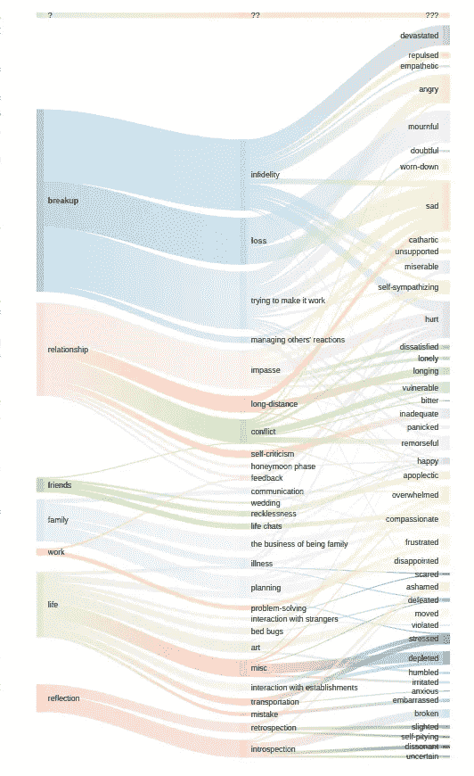
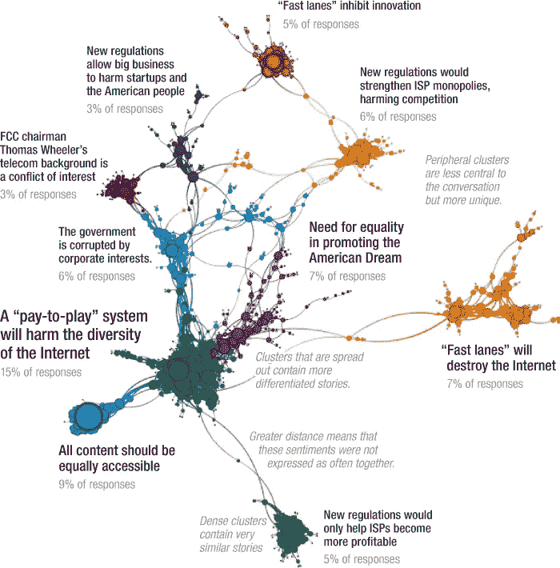

# 我们能不能不要再用单词云了

> 原文：<https://towardsdatascience.com/can-we-please-stop-using-word-clouds-eca2bbda7b9d?source=collection_archive---------2----------------------->

自然语言处理中有很多有趣的、更科学的问题，但我今天在这里只是和大家分享一个观点。

字云是一流的丑陋。

有时候感觉就像人们把他们漂亮的大数据放进一个单词云生成器，把它粘在一个布里斯托尔板上，然后在科学展上迟到两个小时。

我刚刚关闭了本来会是一篇好文章的浏览器，因为他们巨大的文字云刚刚开始对我大喊大叫。“数据科学”、“机器学习”、“内容分析”！我已经读了标题，我看到了标签…那张图片真的有任何附加值吗？它向读者传达了什么重要的信息吗？

这就是为什么我对他们有如此强烈的感觉。语言的意义不仅仅存在于关键词中。

名词、形容词、动词重要。并不意味着停止单词限定词介词删除。

如果你必须重读最后两句话，你可能会意识到除了关键词之外，保留停用词(如“the”、“of”、“should”)也是必要的。比如[的句子“生存还是毁灭”，虽然有些古旧，但是](https://www.elastic.co/blog/stop-stopping-stop-words-a-look-at-common-terms-query) [完全是由停止词](https://www.elastic.co/blog/stop-stopping-stop-words-a-look-at-common-terms-query) [组成的。](https://www.elastic.co/blog/stop-stopping-stop-words-a-look-at-common-terms-query)

从文章 URL 的搜索引擎优化(SEO)角度来看，这可能是一个更好的停用词移除出错的例子:

*   [https://www。](https://www.) …。/伴着失聪长大→/伴着失聪长大
*   /听力受损的世界→/听力受损的世界
*   /什么是听力损失→/什么是听力损失

*(来源:* [*网络媒体大师*](http://www.onlinemediamasters.com/why-you-shouldnt-remove-stop-words-from-urls/) *)*

或者，这里有一些昨天的热门推文，没有停用词:

*   "很遗憾听到马尔科姆·杨，优秀的球员."
*   “马克·斯通男孩”
*   **“亚历克斯·崔贝克**应得人物乡村游戏节目主持人。”

如果人类有这些我们实际上经常使用却没有注意到的奇怪的习惯用语会怎么样呢？

*   “他打了…指甲…头”
*   “……果壳”
*   “她今天真的……很开心”

停用字词删除减少了处理时间。它使语言分析的效率大大提高(对计算机来说！).但是，如果你曾经生成过一个词云，提取了一个完全不相关的关键词(比如来自马克·斯通的词云，其中有“男孩”)，你可能会同意关键词频率或[词袋](https://en.wikipedia.org/wiki/Bag-of-words_model)不能是一个独立的分析。

**语言数据可视化需要有一些分类的成分(见:任何好的机器学习)。**

我们都为此感到内疚。我做过一两个单词云。但是我们不再需要文字云了。我们比那更好！我想介绍 3 个我觉得更有趣(也更有知识性)的选择。)而不是这些美化的标签。

# 桑基图

[UX 设计师罗宾·维斯用一年半的时间绘制了她的哭泣模式。她想更好地理解自己的情绪。通过创建桑基图，她能够显示她对每种叫声的分类，以观察趋势。](http://robinwe.is/explorations/cry.html)

A Classification Diagram of Cries

以下是桑基图的工作原理。他们想象从一套价值观到另一套价值观的流动。它们非常适用于分级多元分类数据。连接被称为链接，就像一个树形结构，被连接的东西被称为节点(来源: [Google Charts](https://developers.google.com/chart/interactive/docs/gallery/sankey) )。

韦斯发现，分手和恋爱是她 63%哭泣的根源。她根据原因对她的哭声进行了分类。在分手的情况下，她确定了不忠，损失，试图让它工作，并管理他人的反应。从那以后，她用形容词来提炼她为什么会哭背后的情感。[在这里阅读全文](http://robinwe.is/explorations/cry.html)。

这是一种有机的、令人难以置信的独特方式来展示关键词分析，只需要一个小数据集，想必也不需要什么花哨的机器学习。接受吧，情感分析。

# 平行集

并行集也显示数据流。来自英国的自由软件开发者杰森·戴维斯创造了一个泰坦尼克号幸存者的可视化图像。[去这里看互动版。](https://www.jasondavies.com/parallel-sets/) [他的代码也在这里。](https://github.com/jasondavies/d3-parsets)

乍一看似乎很吓人(也很催眠)，但下面是这张图所暗示的。

1.  女性幸存者的相对比例远远大于男性幸存者。(第 1 行，蓝色)
2.  船上大约一半的孩子活了下来。(第二排最左边)
3.  一眼就可以看出，这些数据与疏散过程中“妇女和儿童优先”的方法相关。

戴维斯说如何阅读图表:

“对于每个维度(幸存者、性别、年龄和阶级)，每个可能的类别都会显示一个水平条。条形的宽度表示该类别匹配的绝对数量。

“从第一维度(幸存)开始，它的每一个类别都与下一维度的若干个类别相连，显示出那个类别是如何被细分的。这种细分递归重复，产生一个“丝带”树。

因此，平行集提供了一种方法，可以同时可视化不同种类的数据，并快速从中得出结论。如果你有混合了人口统计信息和语言信息的数据，那么很容易回答“谁说了什么”。比“没人说一个字云什么的”有趣一点。

# 聚类图

我发现这个提交给联邦通信委员会的关于网络中立性的意见的惊人的可视化。旧金山一家名为 Quid 的数据分析公司对近 25 万份提交材料进行了[主题建模](https://www.kdnuggets.com/2016/07/text-mining-101-topic-modeling.html)。这不是一个小壮举。你可能需要一点深度学习。还有资金。和来自科幻的天才。

简而言之，每个集群都有一个不同的主题，响应的比例以灰色显示。更紧凑的集群争议更少。更接近其他聚类的聚类显示主题之间的相关性。如上所述，外围集群对整个对话来说不太重要，但它们被认为更独特。

话虽如此，但如果能更深入地了解这种方法，看看是如何偷工减料的，那就更好了。作为局外人，它看起来像是一种无监督的机器学习算法，可能是 K-means，这通常意味着将观察值划分为指定数量的簇。或者，如果这是某种贝叶斯分类，我也不会感到惊讶，这种分类对语言数据很有效。这里看起来它最大的优点也是它最大的缺点——这是一个非常固执己见的分析。

不是每个人都能做机器学习。请放心，我一点也不想忽视这样一个事实:从数据收集到一幅漂亮的图片，需要数周的数据清理、数据透视表和对一切事物的质疑。但是数据科学中的想法是一样的。将您的数据分类。画趋势线。如果有必要，可以手动操作。做一些假设，建议一些关联，或者根本不做分析。

不要让数据自己说话。聚集你的云。