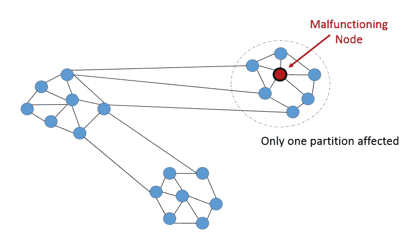
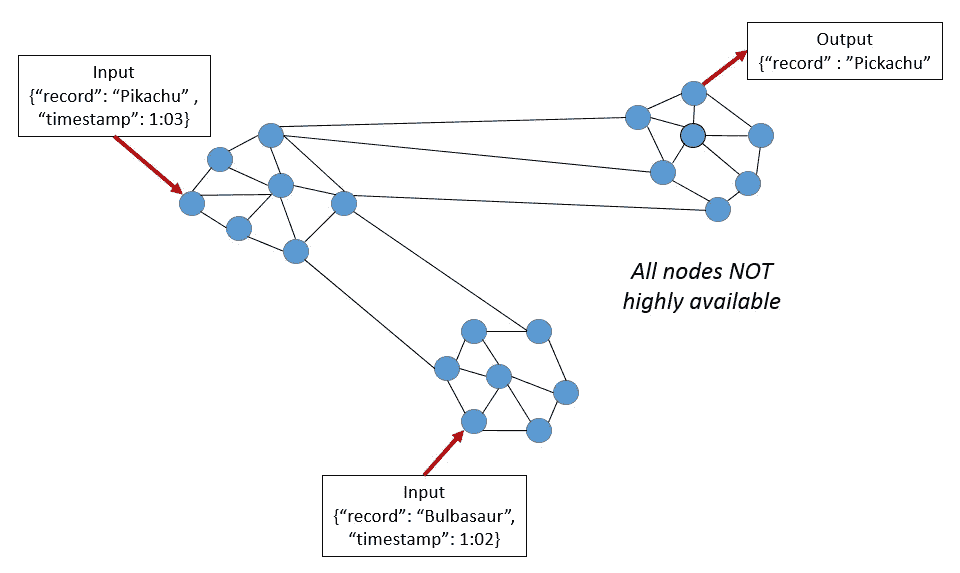

# CAP 定理和分布式数据库管理系统

> 原文：<https://towardsdatascience.com/cap-theorem-and-distributed-database-management-systems-5c2be977950e?source=collection_archive---------0----------------------->

过去，当我们想要存储更多数据或提高处理能力时，常见的选择是纵向扩展(获得更强大的机器)或进一步优化现有的代码库。然而，随着并行处理和分布式系统的进步，更常见的是进行水平扩展，或者让更多的机器并行执行相同的任务。我们已经可以在 Apache 项目中看到一堆数据操作工具，比如 Spark、Hadoop、Kafka、Zookeeper 和 Storm。然而，为了有效地选择工具，CAP 定理的基本思想是必要的。CAP 定理是一个分布式数据库系统只能拥有 3 个中的 2 个的概念:一致性、可用性和分区容忍度。

CAP 定理在大数据世界中非常重要，尤其是当我们需要根据我们独特的用例在三者之间进行权衡时。在这篇博客上，我将试着解释每一个概念和权衡的原因。我将避免使用具体的例子，因为 DBMS 正在迅速发展。

## 分区容差

这种情况表明，尽管节点之间的网络延迟了大量消息，系统仍会继续运行。容许分区的系统可以承受任何数量的网络故障，而不会导致整个网络的故障。数据记录在节点和网络的组合中得到充分复制，以保证系统在间歇性故障中正常运行。在处理现代分布式系统时，分区容错不是一个选项。这是必须的。因此，我们必须在一致性和可用性之间进行权衡。

## 高一致性

这种情况表明所有节点同时看到相同的数据。简单地说，执行一个*读*操作将返回最近的*写*操作的值，导致所有节点返回相同的数据。如果事务以系统处于一致状态开始，以系统处于一致状态结束，则系统具有一致性。在这种模型中，系统可以(而且确实)在事务期间转换到不一致的状态，但是如果在流程的任何阶段出现错误，整个事务都会回滚。在图中，我们有两个不同的记录(“妙蛙种子”和“皮卡丘”)，它们的时间戳不同。第三个分区上的输出是“皮卡丘”，最新的输入。然而，这些节点需要时间来更新，并且不会经常出现在网络上。

## 高可用性

这个条件声明每个请求在成功/失败时得到一个响应。在分布式系统中实现可用性要求系统 100%的时间保持运行。无论系统中任何单个节点的状态如何，每个客户端都会得到响应。这个度量是微不足道的:要么可以提交读/写命令，要么不能。因此，数据库与时间无关，因为节点需要随时在线。这意味着，与前面的例子不同，我们不知道是“皮卡丘”还是“妙蛙种子”先被添加。输出可能是其中之一。因此，当以高频率分析流数据时，高可用性是不可行的。

## 结论

分布式系统使我们能够获得一定水平的计算能力和可用性，这在过去是不可能的。在遍布全球的数据中心中，我们的系统具有更高的性能、更低的延迟和接近 100%的正常运行时间。最重要的是，今天的系统运行在商品硬件上，这些硬件很容易获得，并且可以以可承受的成本进行配置。然而，这是有代价的。分布式系统比单一网络系统更复杂。理解分布式系统中产生的复杂性，为手头的任务(CAP)做出适当的权衡，并为工作选择正确的工具对于水平扩展是必要的。