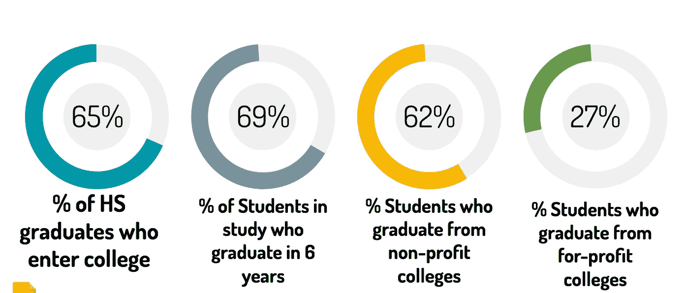
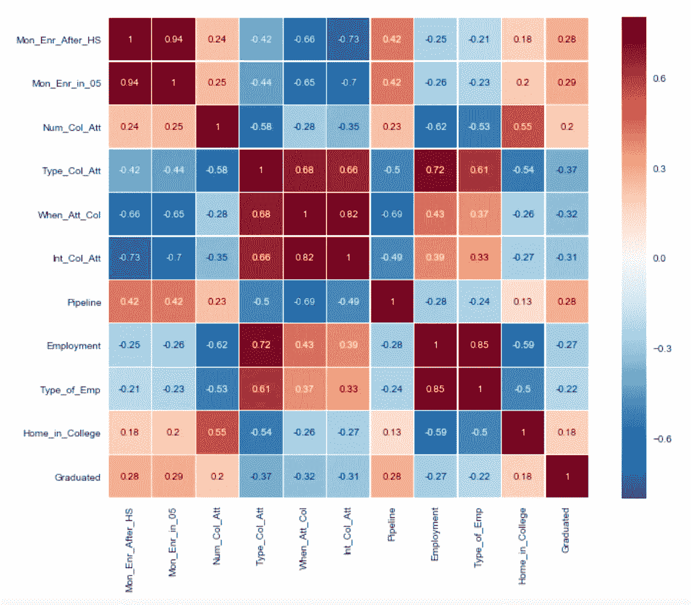

# 毕业率

> 原文：<https://towardsdatascience.com/capstone-blog-62002ebacf6b?source=collection_archive---------11----------------------->

对于我完成的编码训练营的最后一个项目，我想看一些将我以前的兴趣与我当前的数据科学知识相结合的东西。因为我从头到尾都要选择这个项目的每个方面，所以我想看看现实世界的问题。低收入社区存在一个巨大的问题，学生在没有准备好的情况下被鼓励进入大学，并带着大量学生债务辍学，没有任何表现。

第一步是寻找数据！我从国家教育统计中心 [(NCES](https://nces.ed.gov/edat/variableSelect.aspx?guide=&hnt=&srch=&rnd=11&agrmnt=1&sessionid=906e43ae-f68c-4e24-a582-e282eb623ad3) )找到了一组数据，这是从 2002 年开始对 16000 名学生从高中开始到高中毕业后 8 年的纵向研究。这听起来像是完美的数据集，我唯一的问题是它有太多的数据，这从来不是一个真正的问题。有超过 10，000 个变量，所有这些变量都是分类调查数据。使用分类数据可能会有其自身的问题；主要的一点是排序，并确保数据的顺序对回归模型有意义。幸运的是，国家教育统计中心在整理数据方面做得很好，所以这并不像我担心的那样是个大问题。

得到数据后，下一步是缩小变量范围。由于这个数据集包含了学生的个人信息，许多数据在数据集的公共版本中是“受限的”。为了获得完整的数据集，您必须申请受限使用数据许可证。此后，我申请了其中一个，试图让我的发现更有用，但我发现公共使用数据集相当有限。公共使用数据集抑制了所有人口统计信息，这些信息可能是非常好的预测工具，使我的预测更具普遍性。

我的第一步是删除所有以 F3 开头的栏目，因为这意味着来自第三次跟进调查。当我第一次发现与我的目标变量(称为“F3 achievement ”)高度相关的列时，所有的变量都来自第三次跟踪调查。我发现这对于概括预测特别没用，因为知道一个学生大学毕业或没毕业后会发生什么不会帮助某人预测谁会大学毕业。所以我决定去掉这些变量。

下一步是确保调查中留下的学生曾经上过大学。因为我只是在寻找那些愿意或不愿意大学毕业的人，所以我决定只调查那些上过大学的人。

变量选择的最后一步是确定哪些变量与目标变量的相关性超过 0.25。这给我留下了大约 25 个变量，在去掉彼此高度相关或者有很多缺失值的变量后，我最后只剩下 11 个变量。我认为这个数字比我开始时的 4000 英镑要合理得多。

我发现一些变量仍然彼此高度相关，所以我创建了交互项来避免这个问题。

我建立了 5 个不同的模型，发现逻辑回归和线性判别分析表现最好。因为我想要一个更白盒的方法，因为我关心哪些变量是最重要的，所以我选择使用逻辑回归。我发现最重要的变量是学校的类型和他们上大学的时间。这是有道理的，因为正如我们在之前的图表中看到的，与就读于非盈利性大学的学生相比，就读盈利性大学的学生毕业的可能性要小得多。没有全日制上学的学生毕业的可能性也小得多。这些都是学生可以用来决定上哪所大学以确保毕业的可操作的小事情。

鉴于本次调查的基线为 69%，这些模型的性能仅比基线高出约 5%。在未来，我希望获得完整的数据集，并利用人口统计数据做出更好、更有趣的预测。如果这个模型可以获取一个大学生的一些基本信息，并告诉你他们是否有无法毕业的风险，那就更好了。虽然美国高中推动所有学生上大学，但可能有一些学生应该追求另一条道路，如实习或学徒。

 [## Jupyter 笔记本浏览器

### 在我的顶点项目中，我想看看我在教学工作中遇到的一个现实世界的问题。很多低…

nbviewer.jupyter.org](http://nbviewer.jupyter.org/github/rowandl/portfolio/blob/master/How%20to%20Improve%20College%20Graduation%20Rates/How%20to%20improve%20college%20graduation%20rates.ipynb)