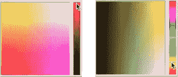
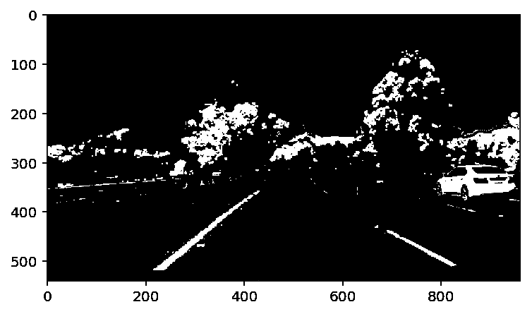

# CarND 项目 1:车道线检测—完整的管道

> 原文：<https://towardsdatascience.com/carnd-project-1-lane-lines-detection-a-complete-pipeline-6b815037d02c?source=collection_archive---------0----------------------->

你们中的一些人可能知道我最近开始了 [Udacity 的自动驾驶汽车工程师纳米学位](https://www.udacity.com/drive)。这是一个令人惊叹的独特计划，由许多关于自动驾驶主要方面的项目组成。这是我对第一个项目的解决方案:车道线检测。首先，看下面的视频——我非常相信先获得灵感，然后再深入细节。

现在你看到这个项目有多酷了，让我们深入了解一下实现的细节。

这个项目的目标是建立一个简单的图像管道(从视频中提取一帧作为输入，做一些事情，返回该帧的修改版本)，它允许在简单的条件下检测车道线:阳光明媚的天气，良好的能见度，视野中没有汽车，只有直道。还有一点:*我们的车道线检测器应该是线性的*。还不允许多项式！

当然，这是一个玩具项目，它并不打算用于生产，但它确实有助于获得自动驾驶汽车工程师解决的问题的一些直觉。

## 我的成就:

—完全丢弃硬编码的感兴趣区域(除了必须初始化通道的第一帧)。
—无需任何调整，代码在任何项目 1 和项目 4(高级车道线)视频上都能很好地工作(除了最后一个更难的挑战)。无论如何，山路不在本项目范围内。

# 图像管道解释

让我从代码中复制并粘贴`image_pipeline`函数的签名和 docstring:

该管道获取一个 3 通道 RGB 图像，对其进行过滤和转换，更新`Lane`和`Line`对象的内部状态，并在该图像上绘制所有需要的元素。我们可以这样想象整个管道:

我们可能会注意到阶段 1 和阶段 2 是相互独立的。我们可以(也应该)抽象出每个阶段的细节，以便能够以模块化的方式修改代码。

## 阶段 1:预处理和矢量化

第一个阶段是数据科学家和任何处理原始数据的人都熟知的:我们需要对它进行预处理，使用我们认为合适的任何矢量化程序将其转换为工作数据集。以下代码将原始图像转换为我们可以在阶段 2 中使用的矢量化数据集:

让我们简单讨论一下代码。我们的项目基于 OpenCV，这是一个非常棒的库，使用矩阵运算在像素级上进行图像操作。由于我们的管道质量依赖于正确的颜色选择，我们需要一种方法来有效地选择一系列相似的颜色(在我们的例子中是白色和黄色)。标准的 RGB 调色板不适合这个——我们必须先[将我们的图像转换成 HSV 调色板](http://docs.opencv.org/3.2.0/df/d9d/tutorial_py_colorspaces.html)。

RGB (left) and HSV (right) palettes

接下来，我们跳过推荐的灰度和高斯模糊阶段。我发现我们可以直接进行二值化——将二值掩码与模糊图像相结合只会给我们的矢量器增加不必要的噪声。我们选择黄色和白色范围，并得到我们的帧的二进制掩码:

最后，我们准备矢量化这个图像。我们应用两种转换:

1.  [Canny 边缘检测](https://medium.com/@tempflip/lane-detection-with-numpy-56b923245fc9#.ek9oe9ucu):一种算法，计算图像的强度梯度，并应用双阈值来确定边缘(我们在`canny`函数中使用`(280, 360)`作为阈值)。
2.  [霍夫线变换](https://medium.com/@esmat.anis/robust-extrapolation-of-lines-in-video-using-linear-hough-transform-edd39d642ddf#.a2hapdyyu):当我们从 canny 检测中得到单个边缘时，我们可以用线将它们连接起来。我们不打算深入挖掘这个算法的细节(如果你好奇，请查看上面的链接，这里是[和另一个](https://alyssaq.github.io/2014/understanding-hough-transform/))，但主要的收获是我们确实得到了一组线(每一个都是一个`Line`实例，具有计算的斜率、截距等等)。

为了初始化视频第一帧的车道线，我们必须使用一个感兴趣的区域来屏蔽图像的其余部分。接下来，我们删除该区域，仅使用`Lane`和`Line`类中的域逻辑来过滤噪声数据，并决定是否将霍夫变换的输出视为车道线的候选线段。

## 阶段 2:车道线更新

使用`image_pipeline`中的一个函数`update_lane(segments)`调用这样的更新。正如我们看到的，我们从最后一个阶段得到了`segments`对象(这只是来自霍夫变换的`Line`对象)。

为了方便整个内务处理，我决定使用 OOP 方法，将车道线表示为`Lane`类的属性:`Lane.left_line, Lane.right_line`。我本来可以使用`global`对象，但是我不喜欢这种方法:污染全局名称空间肯定是一种不好的做法，并且会给代码增加混乱和不确定性。

让我们看一下`Line`和`Lane`类和实例。

`Line` instance 表示一条直线:一段车道线或者我们从 Hough 变换中得到的任意一条直线。`Lane`对象的主要目的是计算它与车道线的关系:我们是否可以考虑将它作为车道线的一部分？为此，我们使用以下领域逻辑:

如此保守和挑剔的候选人选择过程让我放弃了投资回报率。我们可能仍会得到有噪声的数据，但该过程仅接受接近车道线且看起来也与当前车道线相似的线的一部分。

我们使用一个简单的逻辑来确定一个`Line`实例属于哪条车道线:这是由这条线的斜率决定的。这里有很大的改进空间。

`Lane`类是两条车道线的容器(是这个`Lane`类的实例——这个部分需要重构)。它还提供了许多与车道线相关的方法，其中最重要的是`fit_lane_line`。为了得到一条新的车道线，我将正的`Line`候选表示为点，并用`numpy.polyfit`例程拟合一个一级多项式(这只是一条线)。

**车道线稳定。**这是一个需要解决的重要问题。我使用了几种稳定技术:

1.  **缓冲液。**我的车道线对象记忆 N 个最近状态，并通过从当前帧插入一个线状态来更新缓冲器本身。
2.  **智能车道线状态更新。**如果我们在过滤后仍然得到有噪声的数据，线拟合很容易出错。如果我们看到当前帧的拟合线的估计斜率与缓冲区的平均值相差太多，我们需要更保守地处理这条线。为此，我创建了`DECISION_MAT`，这是一个关于如何组合当前行位置和缓冲区平均位置的简单决策矩阵。

例如，对于`DECISION_MAT = [[0.1,0.9],[1,0]]`，我们只有两种情况:不稳定线(与平均值的斜率差太高)和稳定线。**对于不稳定的线**，我们使用车道当前位置和缓冲区平均值的`0.1`和`0.9`的加权平均值。**对于稳定的线**，我们简单地使用其当前位置，而不使用历史数据进行任何加权。当前帧的车道线稳定性指示器在`Lane.right_lane.stable`和`Lane.left_lane.stable`布尔属性中描述。如果它们中的任何一个变成了`False`，我会把它想象成两条车道线之间的红色多边形(稍后你会在这篇文章中看到)。

最后，我们得到了相当稳定的车道线:

Hough lines converted to points (left). Fitted regression line (right)

## 阶段 3:绘制和更新初始图像

为了很好地渲染车道线，我写了一个计算消失点(两条车道线相交的点)坐标的程序。目前为止，消失点在我的项目中有两个目的:

1.  限制车道线外推至其坐标。
2.  消失点以上的每条霍夫线都不能被认为是候选线。这是一种定义感兴趣区域的软方法(而不是硬编码)。

我喜欢很多漂亮的可视化效果，所以我决定实现更多的绘图例程，并为它们使用统一的签名:

绘制本身是作为对初始图像进行变换的一个步骤来实现的:

正如我们在这里看到的，我渲染了两个快照，并将它们添加到第三个图像的仪表板上，这是一个经过转换的初始图像，上面有车道线。这种结构使得重新组合要在图像上呈现的内容变得很简单，并有助于可视化多个组件——所有这些都没有任何麻烦或重大的代码更改。

This is the video for Project 4\. Linear detector works pretty well on it

顺便说一下，车道线之间的绿色多边形偶尔会变成红色，这是我前面描述的车道线的稳定性指示器。

# 从这里去哪里？

这个项目远远没有结束。我接触它越多，我就越能发现新的工作内容:

*   使得检测器是非线性的。据我所知，这是项目 4 的主要目标:高级车道线检测。
*   代替图像二值化的简单方法(选择颜色范围)，实现一个 CNN，它可以在不同条件下检测车道线的部分。
*   道路检测。检测道路本身并将其用作 ROI 是一件很棒的事情。

这个项目的完整代码可以在 GitHub(Jupyter 笔记本的直接链接)上获得:[https://GitHub . com/kidra 521/carnd/blob/master/P1 _ lane _ lines _ detection/P1 . ipynb](https://github.com/Kidra521/carnd/blob/master/p1_lane_lines_detection/P1.ipynb)

# 附:有趣的部分

当然，这个帖子里应该有好玩的部分！现在让我们看看，当遇到山路时，这种线性检测器是如何失败的。虽然对于这样一个快速变化的斜坡来说太慢了，但它的开始还是令人满意的:

但是在森林中，当光线变化很快时，它会被完全破坏:

这太棒了——我将有机会在项目 4 中应对这一挑战。

敬请期待未来更多无人驾驶汽车的精彩！