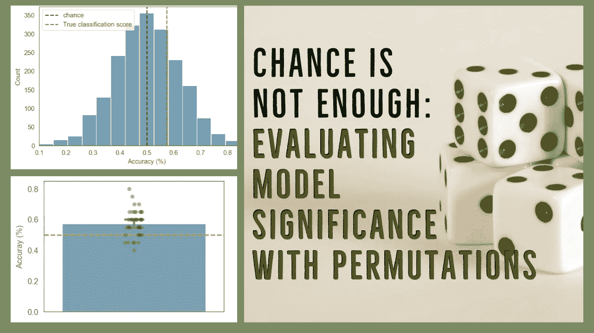
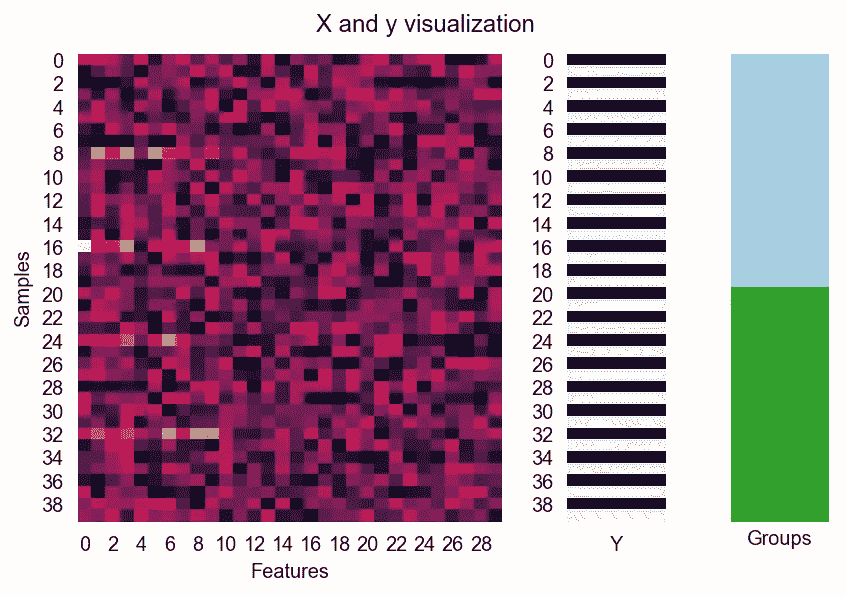
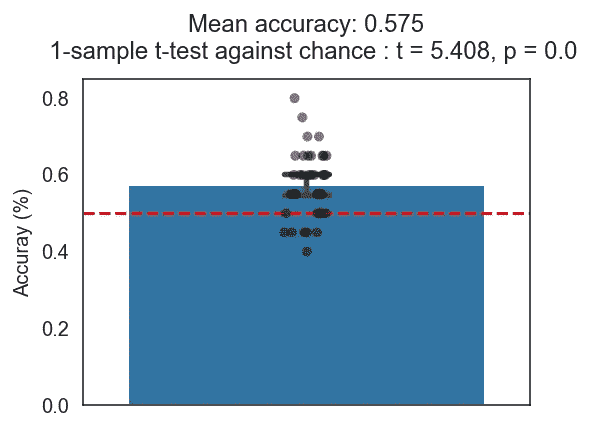
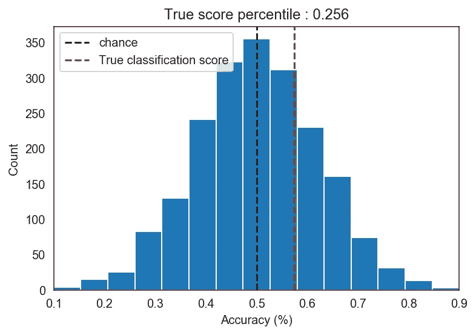
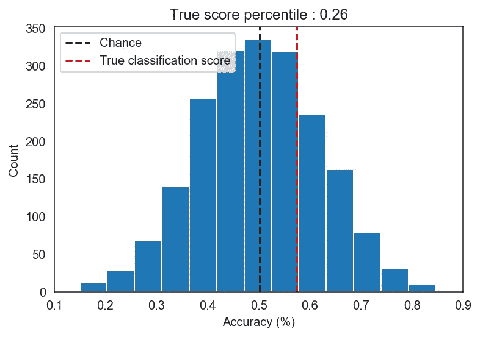

# 机会是不够的:用排列评估模型的重要性

> 原文：<https://towardsdatascience.com/chance-is-not-enough-evaluating-model-significance-with-permutations-e3b17de6ba04?source=collection_archive---------16----------------------->

## 理解你的回归

## Python 模拟展示了为什么模型精度应该与排列而不仅仅是机会进行比较



当训练机器学习模型进行分类时，研究人员和数据科学家经常将他们的模型性能与机会进行比较。然而，这通常是不够的。通过将模型与垃圾标签上训练的模型集合进行比较，可以实现真正的显著性测试。如果大量根据垃圾数据训练的模型也可以用来预测，这表明你的模型并不比垃圾模型好多少。因此，在某些情况下，明智的做法是不仅将模型的准确性与概率进行比较，还与垃圾模型的表现进行比较。在本教程中，我们比较了比机会更好的分类性能实际上并不一定比随机模型好得多。

让我们考虑一个假设的研究，在这个研究中，我们试图对参与者从他们的大脑活动中看到的图像进行分类。参与者看了 10 次带有*快乐脸*(标为 1)或*愤怒脸*(标为 0)的图像，每个参与者有 20 次试验。在这个设置中，预测一个条件优于另一个条件的*几率是 50%* 。我们为 40 名参与者(组)生成 800 次试验的 60 个体素(特征)数据，这意味着每位参与者都有 20 次(=800/40)试验。在这 20 次试验中，一半是快乐的脸，另一半是愤怒的脸。所有特征都是从 0 到 1 之间的均匀分布中随机抽样的，平均值为 0.5。为了给模型提供分类的有用特征，我们将一组具有相同分布的随机值添加到数据中的每第 8 个值，以便试验 0、8、16 等将具有更高的值，可以利用这些值来对笑脸进行分类。

```
# Load required packages. 
%matplotlib inline import numpy as np, pandas as pd, matplotlib.pyplot as plt, seaborn as sns, os, glob 
import matplotlib.gridspec as gridspec 
from sklearn.linear_model import LogisticRegressionCV 
from sklearn.model_selection import LeaveOneGroupOut 
from scipy import stats # set random seed for same answers np.random.seed(1) 
n_samples = 800 # Total number of samples 
n_features = 60 # Total number of features (~voxels) 
n_groups = 40 # Total number of participants 
n_features_useful = 10 # Subset of features that would be useful n_skip = 8 # Every Nth trial that would be infused with slightly useful features # Generate random data 
X = np.random.rand(n_samples,n_features) # Add random values to make every n_skip-th feature useful X[::n_skip, :n_features_useful] = X[::n_skip,:n_features_useful]+np.random.rand(X[::n_skip,:n_features_useful].shape[0],X[::n_skip,:n_features_useful].shape[1]) # Generate labels 
y = np.tile([0,1],int(n_samples/2)) 
# Generate groups 
groups = np.repeat(range(0,n_groups),int(n_samples/n_groups))
```

现在让我们可视化两个受试者(40 次试验)的数据子集。请注意列之间的水平亮光，这是我们的模型应该能够用来预测笑脸的特征(Y 的暗条)。



```
# Here we visualize the data 
gs = gridspec.GridSpec(1,5) 
ax1 = plt.subplot(gs[0, :3]) 
ax2 = plt.subplot(gs[0, 3]) 
ax3 = plt.subplot(gs[0, 4]) sns.heatmap(X[:40,:30],cbar=False,ax=ax1) ax1.set(xlabel='Features',ylabel='Samples') sns.heatmap(np.array([y]).T[:40],ax=ax2,xticklabels='Y',cbar=False) sns.heatmap(np.array([groups]).T[:40],ax=ax3,xticklabels='',yticklabels='',cmap=sns.color_palette("Paired",40),cbar=False) ax3.set(xlabel='Groups') 
plt.suptitle('X and y visualization',y=1.02) 
plt.tight_layout()
```

现在，我们使用留一名受试者交叉验证的逻辑回归来训练我们的预测模型。对于每一个被遗漏的对象，我们训练一个内置交叉验证的新模型来选择最佳的正则化强度(详见)。

```
logo = LeaveOneGroupOut()scores = []
for train_ix, test_ix in logo.split(X,y,groups):
    X_train, X_test = X[train_ix], X[test_ix]
    y_train, y_test = y[train_ix], y[test_ix]
    clf = LogisticRegressionCV()
    clf.fit(X_train,y_train)
    score = clf.score(X_test,y_test)
    scores.append(score)
mean_score = np.mean(scores)
t,p = np.round(stats.ttest_1samp(scores,.5),3)
title = f'Mean accuracy: {mean_score}\n  1-sample t-test against chance : t = {t}, p = {p}'f,ax = plt.subplots(figsize=(4,3))
sns.barplot(scores,ci=95,orient='v', capsize=.1,ax=ax)
sns.stripplot(scores,ax=ax,orient='v',color='k',alpha=.5,jitter=.05)
ax.axhline(.5,color='r',linestyle='--')
ax.set(ylabel='Accuray (%)')
plt.title(title, pad=10)
plt.show()
```

这是结果，红色虚线表示几率为 50%。



呜-呼！我们的交叉验证模型显示了 57.5%的交叉验证准确性，这明显优于 t-检验和 bootstrapped 置信区间(柱状图中显示的 95% CI)。不是世界上最好的模型，但仍然比机会好，所以我们应该很好地发表，对不对？

没那么快。

很有可能这个模型并没有比任何从数据中产生的垃圾模型做得更好。一个更严格的测试是将模型精度与根据随机标签训练的垃圾模型的精度分布进行比较。这样，你就可以估计出你的模型比垃圾模型好多少。

为了建立这种准确度分布，我们在每个交叉验证折叠中训练 50 个额外的模型，最终创建 2000 个准确度的分布。在每一次折叠中，训练集的标签被打乱以预测被遗漏的对象的真实标签。显著性得分由得分优于真实模型得分的排列的数量决定。

```
np.random.seed(1)
logo = LeaveOneGroupOut()
n_permute = 50
permuted_scores = []
count = 0 
for train_ix, test_ix in logo.split(X,y,groups):
    X_train, X_test = X[train_ix], X[test_ix]
    y_train, y_test = y[train_ix], y[test_ix]
    train_df = pd.DataFrame({'y':y_train,'groups':groups[train_ix]})
    for permute_ix in range(n_permute): 
        count+=1
        if count%100==0:
            print(count,end=',')
        y_train_shuffled = train_df.groupby('groups')['y'].transform(np.random.permutation).values
        clf = LogisticRegressionCV()
        clf.fit(X_train,y_train_shuffled)
        score = clf.score(X_test,y_test)
        permuted_scores.append(score)
train_shuffled_score = np.mean(permuted_scores)
score_percentile = np.mean(mean_score < permuted_scores)
title = f'True score percentile : {score_percentile}'f, ax = plt.subplots() 
plt.hist(permuted_scores,bins=15)
ax.axvline(train_shuffled_score,color='k',linestyle='--',label='Chance')
ax.axvline(mean_score,color='r',linestyle='--',label='True classification score')
ax.set(xlim=[0.1,.9],xlabel='Accuracy (%)',ylabel='Count',title = title)
plt.legend()
```



在这个过程之后，我们发现我们的 57.5%的模型性能实际上并不比垃圾模型的精度好多少。p = .256 的百分位数 p 值表明，大约 26%的混合标签训练模型实际上比我们的模型表现得更好。

在 scikit-learn 中，这个方法也被实现为`[permutation_test_score](https://scikit-learn.org/stable/modules/generated/sklearn.model_selection.permutation_test_score.html#sklearn.model_selection.permutation_test_score)`,它混合了训练和测试标签。在某些情况下，这可能会产生比仅混洗训练标签更紧密的分布。

```
np.random.seed(1)
logo = LeaveOneGroupOut()
n_permute = 50
permuted_scores = []
count = 0 
for train_ix, test_ix in logo.split(X,y,groups):
    X_train, X_test = X[train_ix], X[test_ix]
    y_train, y_test = y[train_ix], y[test_ix]
    train_df = pd.DataFrame({'y':y_train,'groups':groups[train_ix]})
    test_df = pd.DataFrame({'y':y_test,'groups':groups[test_ix]})
    for permute_ix in range(n_permute): 
        count+=1
        if count%100==0:
            print(count,end=',')
        y_train_shuffled = train_df.groupby('groups')['y'].transform(np.random.permutation).values
        y_test_shuffled = test_df.groupby('groups')['y'].transform(np.random.permutation).values
        clf = LogisticRegressionCV()
        clf.fit(X_train,y_train_shuffled)
        score = clf.score(X_test,y_test_shuffled)
        permuted_scores.append(score)
train_test_shuffled_score = np.mean(permuted_scores)
score_percentile = np.mean(mean_score < permuted_scores)
title = f'True score percentile : {score_percentile}'f, ax = plt.subplots() 
plt.hist(permuted_scores,bins=14)
ax.axvline(train_test_shuffled_score, color='k', linestyle='--',label='Chance')
ax.axvline(mean_score,color='r',linestyle='--',label='True classification score')
ax.set(xlim=[0.1,.9],xlabel='Accuracy (%)',ylabel='Count',title = title)
plt.legend()
```



在我们的模拟数据中，我们看不出混合训练和测试标签与仅混合训练标签之间有多大区别。

在这里，我们模拟数据，以显示比较模型准确性的机会，有时可能会误导。一个比机会稍微精确一点的模型可能不会比其他在混洗标签上训练的垃圾模型好很多。然而，我们也应该考虑到每个受试者的样本数量可能会限制你的置换模型真正的“随机”程度。例如，如果每个对象只有 2 个样本，那么混洗这些样本不会像你想的那样给你一个大的准确度分布。

这里有一些关于这件事的文件:

[奥贾拉和加里加。研究分类器性能的排列测试。《机器学习研究杂志》(2010 年)第 11 卷](http://www.jmlr.org/papers/volume11/ojala10a/ojala10a.pdf)

标签:`[machine-learning](http://jinhyuncheong.com/tag/machine-learning)` `[chance](http://jinhyuncheong.com/tag/chance)` `[significance](http://jinhyuncheong.com/tag/significance)` `[permutations](http://jinhyuncheong.com/tag/permutations)` `[analysis](http://jinhyuncheong.com/tag/analysis)` `[data](http://jinhyuncheong.com/tag/data)`

*原载于 2018 年 12 月 5 日*[*jinhyuncheong.com*](http://jinhyuncheong.com/jekyll/update/2018/12/05/Chance_is_not_enough.html)*。*