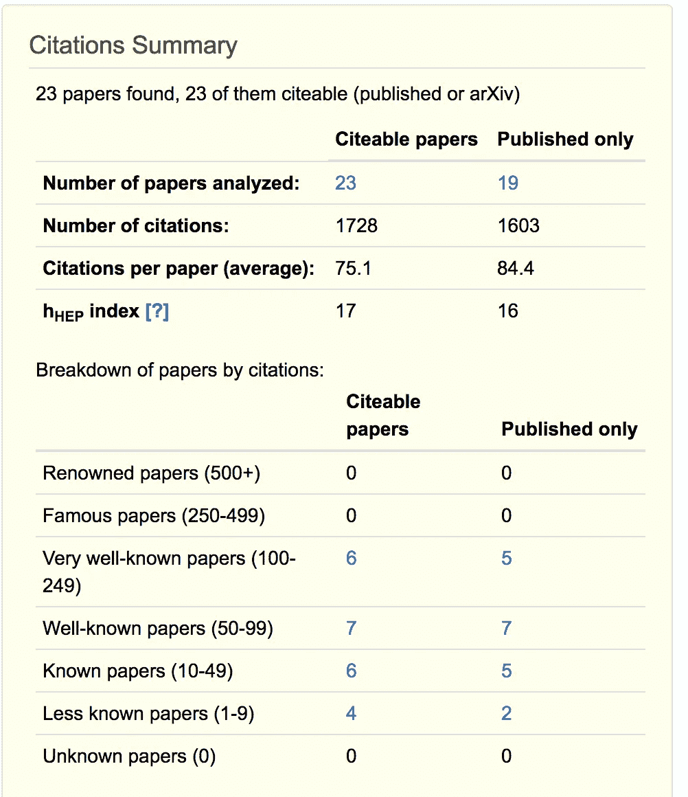

# 用 PageRank 描述科学影响——推荐聘用决定

> 原文：<https://towardsdatascience.com/characterizing-scientific-impact-with-pagerank-recommending-hiring-decisions-e394f02989c0?source=collection_archive---------12----------------------->

这是我正在撰写的系列文章的第三部分，记录了一个关于通过网络分析评估科学重要性的附带项目。作为一个案例研究，我一直在使用 PageRank (PR)来量化高能物理学(HEP)中论文和作者的重要性。在前两篇博客文章中，我们主要看到了自 20 世纪 60 年代初以来 HEP 所做工作的广泛描述。这被证明是一种识别 HEP 诺贝尔奖获得者的简洁方法，这是引用次数等更标准的指标无法充分捕捉的。在这里，我描述了这种衡量重要性的方法的一个简单应用:作为学术界招聘决策的推荐系统。

我在终身职位上的第一年即将结束，我有机会参加博士后研究员和教师级别的招聘委员会。引用是人们非常重视的一个指标，尤其是对于教师招聘和高级博士后研究员。一个例外是:当雇佣一个直接从博士学位毕业的博士后时，引用证明不那么重要，因为人们主要依赖申请人的博士导师的信。当然，还有其他重要因素在起作用，比如业内资深人士的推荐信。然而，在这个例子中，我将只依靠单个作者的 PR 权重。为了完整起见，让我总结一下我是如何获得作者的 PR 的。通过将出版物的 HEP 网络视为节点，其中有向边由处方形成:(引用的论文，被引用的论文)，我们可以为出版物分配 PR 权重。所以一个出版物的“重要性”与其公关成正比。现在，我们可以将出版物的 PR 分配给作者，方法是在他们之间平均分配。然后每个作者得到该论文总的 *PR* 的( *1/N)*PR* ，其中 *N* 是手稿中作者的总数。一个特定作者的总 PR 是他们每篇论文的 PR 的总和。

让我们讨论一下如何推荐一个特定的人。让我们来关注一下 2017-2018 学年的招聘情况。任何被聘为教员的人都将在今年九月左右开始工作。不管是好是坏，HEP 在一年中有一些特定的时间是招聘季节。因此，所有 2017 年的职位都将在 2016 年秋季发布。大多数地方在 2017 年 3 月或 4 月之前发出要约。那么，如果你是这一季招聘委员会的成员，你应该关注谁呢？我们可以依靠历史趋势来缩小范围。这是一个人走向教师工作的“典型”路径:

1.  在 5 年内完成他们的博士学位，尽管有些人确实在 4 年内完成；然后
2.  在被雇佣之前，继续参加一两个三年期的博士后研究。

这些当然不是规则。我知道一些明显的例外，比如那些在第三个三年博士后任期内被聘用的人。但是现在让我们采用这个简单的方法。有一个潜在的问题我们必须解决:我从 [InspireHEP](http://inspirehep.net/?ln=en) (一个 HEP 论文和作者的数据库和搜索引擎)下载的出版物数据库没有作者的博士学位授予日期。我们仍然可以通过下载 HEPNames 数据库来获得这些信息，该数据库提供了作者信息，但是让我们采用一种简单的替代方法，即依靠历史趋势。因此，我们将使用作者的**第一次**出版日期来代替作者的博士日期。大多数人在研究生院的第二或第三年发表他们的第一篇论文。同样，这一趋势也有明显的例外。但是，让我们看看我们的建议使用这些简化的假设结果是什么。

# R 结果

好吧，假设招聘委员会真的想要一个年轻的人，所以他们只想看着申请人完成他们的第一个*三年*博士后。这样做的理由是，在这一点上，申请人已经证明了他们的独立研究能力，但仍然有很大的潜力进一步发展。所以，让我们不情愿地考虑委员会的愿望。然后，对于 2017-2018 学年，我们需要找到在 2014 年开始博士后研究，并在 2010-2011 年左右发表第一篇论文的人。当我们这样做的时候，这是三个公关最好的作者:

1.  道格拉斯·斯坦福。
2.  蒂姆.林顿。
3.  Sudhaker Upadhyay。

PR 最高的人，斯坦福，其实是 2010-2014 年拿到博士的。他现在是普林斯顿高等研究院的博士后，并将于今年秋天在斯坦福大学开始教职。(奇怪的是，考虑到他的姓)。

Publication statistics for D. Stanford, the author with the highest PR in HEP who got their PhD around 2013-2014.

林登于 2008 年至 2013 年在圣克鲁斯获得博士学位，现在是他在俄亥俄州的第二个博士后，此前他在芝加哥进行了两年的博士后研究。我知道他的工作。我想他很快就会得到一份教职。

另一名研究员 Upadhyay 于 2008 年至 2013 年在印度获得博士学位，目前是那里的博士后。我不知道他的工作，因为我们在不同的学科，但我看到他已经写了多达 60+的论文！

现在，如果我们只依靠引用，引用最多的人，他们在三四年前获得博士学位，都是 CMS 或 ATLAS 的成员。如前所述，实验合作的成员通常会在实验出版的每一份出版物上署上他们的名字。

原则上，我们可以将这种方法应用于推荐前几年的招聘职位，以确定我们得到的实际招聘决定有多接近。但有一个复杂的问题是，我计算了截至今年六月的论文和作者的 PR。因此，如果我们想向 2000 年招聘的教师遴选委员会推荐一个招聘决定，我们获得的 PR 包括潜在申请人在 2000 年的未来工作。而当时审查申请的委员会只能访问在做出雇用决定时计算的 PR。我可能会在将来的某一天回到这里进行研究。

总之，在这篇博文中，我描述了一个简单的应用程序，它利用通过公关获得的作者的重要性，向学术界的教师招聘委员会提出招聘建议。