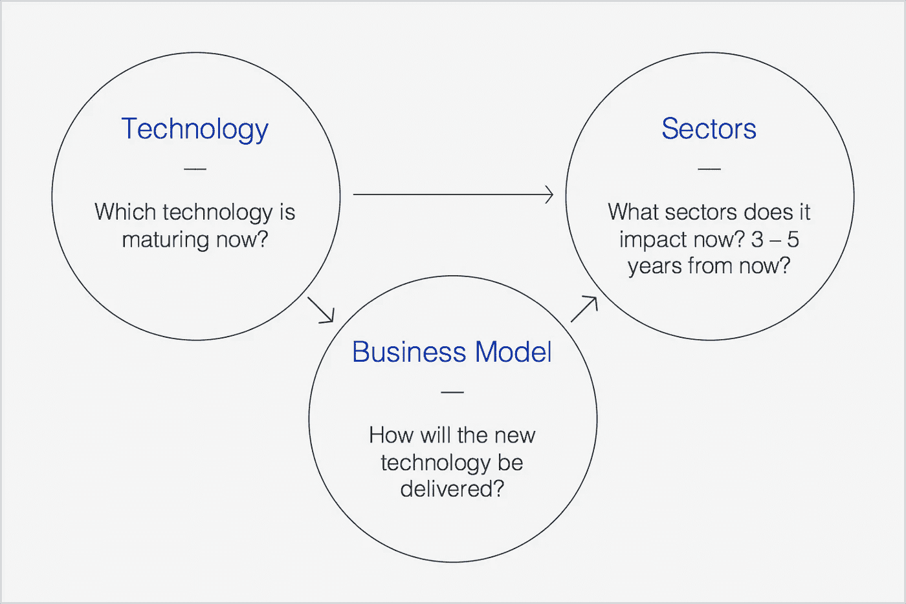
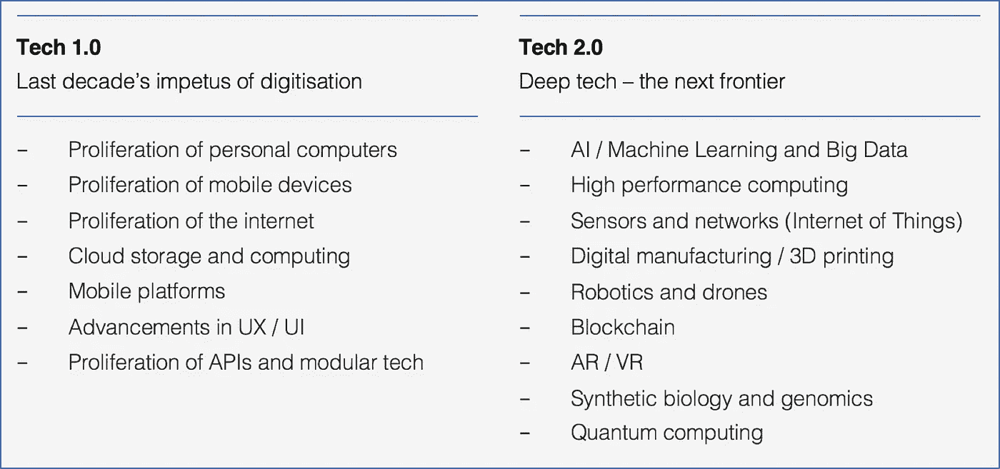
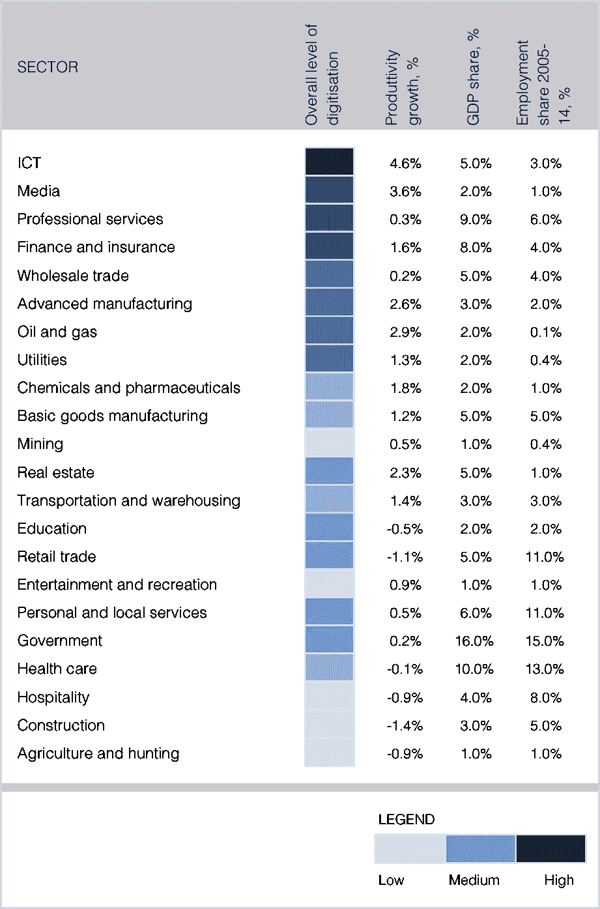
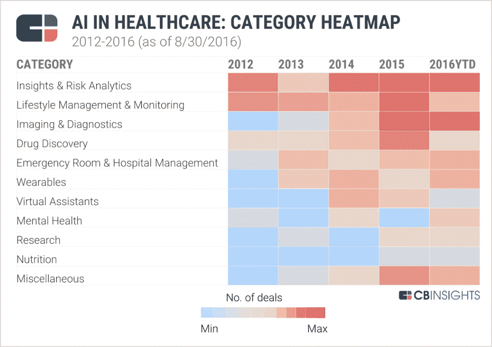

# “Cherchez la Tech”或如何增加你发现今天的谷歌的机会

> 原文：<https://towardsdatascience.com/cherchez-le-tech-or-how-to-increase-your-chances-of-spotting-the-google-of-today-200ece78f690?source=collection_archive---------9----------------------->

## *为早期投资者制定投资方案的系统方法*

# 摘要

[“软件正在吞噬世界”，](https://a16z.com/2016/08/20/why-software-is-eating-the-world/)安德森·霍洛维茨公司的马克·安德森有句名言。我完全同意。然而，世界很大，有很多软件。如果你是一个有抱负的技术投资者，对行业有一些不可知的看法，你从哪里开始呢？你能在 1999 年发现谷歌，2005 年发现脸书，2010 年发现优步，或者 2011 年发现 DeepMind 吗？

考虑一个我半开玩笑地称之为“Cherchez la Tech”的框架，它有三个关键部分:

1.  一项成熟的技术，
2.  “随时准备颠覆”的部门，以及
3.  “最佳交付”商业模式

颠覆始于某项面向大众应用的技术的成熟，这项技术必须既有效又足够便宜。一旦确定了技术，寻找特定技术有潜力创造新产品和服务或使现有产品和服务更快、更好或更便宜的部门和更重要的部分。最后，选择一个最适合在你所选择的领域提供技术的商业模式。

“Cherchez la Tech” framework, Cornel Chiriac

请继续阅读，了解更多详情。

# 技术:圣杯

技术为选择行业细分和商业模式焦点提供了强有力的指导，两者都遵循。作为这个过程的第一步，我问自己“现在什么技术正在成熟？”时机是相关的，因为已经成熟的技术很可能实现了先进的商业应用。空间将会或开始变得拥挤，新来者将处于不利地位。

回到 90 年代末。个人电脑在美国的渗透率超过了 50% ( [Pegasus Research](http://answers.google.com/answers/threadview?id=380304) )，互联网的使用处于大规模采用的边缘，很快接近 50%的采用率大关([互联网实时统计](http://www.internetlivestats.com/internet-users/us/))。成熟的互联网接入技术为网上超市(如亚马逊)和世界信息的组织者(如谷歌)铺平了道路。它还允许“车库销售”走向全球(如易趣)，通过可信的方法(如贝宝)完成交易。那个时代的远见者抓住了技术成熟的机会。一旦他们开始，很少有人加入他们在同一空间的金字塔顶端的行列。未来的大部分现金流已经分配出去了。

快进到 2000 年中期，社交网络革命正在进行。这是社会行为因素综合作用的结果，如个人在日益增长的技术、全球化和个人对拓展和社会友谊的渴望中的孤立。科技使之成为可能。同样的技术进步在 90 年代末引发了在线商务的发展，让人们能够相互联系和分享经验。如果有人在那个阶段发现了这一趋势，并在 MySpace、Friendster、脸书和其他几个人之间平均分配 10 万美元，那么今天的结果将是数百万美元(约 5000 万美元)，尽管脸书是唯一一个站在人群中的人。当然，有很多方法可以增加投资成功初创企业的机会，但这是有据可查的，这篇文章的重点是“空间”而不是“空间内的目标”

那么，如何知道哪种技术正在成熟呢？下面的列表(Tech 2.0)是对主导初创企业生态系统或即将进入市场的技术的广泛当前指示。外面还有更多。订阅技术博客，了解最新动态。跟踪顶尖大学的研究成果(例如麻省理工学院、加州理工学院和我自己的母校芝加哥大学)。阅读思想领袖的作品，比如彼得·迪亚曼迪斯的[指数技术](https://www.youtube.com/watch?v=vlCb-1NM8mY)。例如，跟随该领域的专家，如 Yann LeCun、吴恩达、Geoffrey Hinton 和其他机器学习专家。

“Technology commercialisation”, Cornel Chiriac

举一个例子——机器学习——我们正在见证这个领域前所未有的进步。随着机器学习算法在图像识别和语言处理等专业任务上变得比人更好，我们可以看到这些进步为许多高价值行业带来了颠覆。这让我想到了下一步——关注一个对商业采用成熟技术阻力最小的大行业。

# 扇形:阻力最小的路径

“我想投资一家使用机器学习的初创公司。现在怎么办？”这种追求本身愚蠢地进入了无数急于吹捧“我们是扰乱 X 部门的人工智能初创企业”的创始人圈子。机器学习本身不是目的，而是达到目的的手段。虽然机器学习只是一种用于构建智能企业的工具，但它可以作为筛选下一个可能经历革命的行业的起点。那么，应该怎么做呢？

在选择行业重点时，问问自己:

1.  在哪个部门和分部门，一项特定的成熟技术会将现状提高一个数量级？
2.  行业(机会的大小)是否足够大？
3.  它为技术采用做好准备了吗？

一种观点将这一领域分为数字化和欠数字化两部分。麦肯锡 2015 年的一项研究指出，美国 65%的部门(按 GDP 份额计算)数字化不足。数字领导者平均为其底线增加了 6%至 11%，而落后者则保持不变或利润下降(衡量 1993 年至 2013 年)。这两个群体在美国国内生产总值中占有相似的份额——分别为 30%和 35%。“机会的大小”是可比的，因此数字化水平的差异是由于“采用的准备程度”。尽管领导者很早就接受了技术创新，落后者却没有。然而，潮流正在改变，我们看到越来越多的资本流入“无聊”的行业，颠覆了它们(正如 [CB Insights](https://www.cbinsights.com/) 经常指出的)。彻底改变传统的、数字化不足的业务的机会是巨大的，这个空间作为一个整体资产配置类别是有意义的。从低基数开始，数量级的飞跃更容易。我们很可能会看到新的技术巨头在突破性技术的推动下出现在这些领域。

*资料来源:麦肯锡全球研究院，2015 年 12 月(* [*链接*](http://www.mckinsey.com/industries/high-tech/our-insights/digital-america-a-tale-of-the-haves-and-have-mores) *)*

话虽如此，这个游戏通常是在子行业层面上进行的。在高度数字化的行业中也有“绿色领域”的机会，尽管它们可能更难找到。成功的初创企业可能会为自己赢得一席之地，但很快就会被现有的科技巨头之一吞并(这是一个不错的结果)。然而，这种战略不太可能让一家初创企业成为科技巨头。现任者已经获得了相当大的权力来控制最大的份额，而新来者如果不被收购，很可能最终会失败。

为了举例说明技术进步如何改变一个行业，让我们看看医疗保健。医疗保健是前面提到的麦肯锡研究中提到的数字落后者之一。计算机视觉和图像处理的技术发展对成像和诊断的医疗保健领域产生了革命性的影响( [CB Insights](https://www.cbinsights.com/research/artificial-intelligence-healthcare-investment-heatmap/) )。计算机视觉技术成熟的早期迹象可以追溯到 2009 年，当时 [ImageNet](https://www.ted.com/talks/fei_fei_li_how_we_re_teaching_computers_to_understand_pictures#t-1060882) 在一个免费提供给计算机视觉研究的数据库中收集了 1500 万张图像。在 [2012 年，谷歌大脑发现了一只猫](https://googleblog.blogspot.co.uk/2012/06/using-large-scale-brain-simulations-for.html)，没有任何标签数据的帮助。2014 年，谷歌收购了机器学习初创公司 Deep Mind，该公司在该领域取得了令人印象深刻的成果。2016 年，谷歌 DeepMind 与 NHS 合作，利用机器学习[对抗失明](https://www.theguardian.com/technology/2016/jul/05/google-deepmind-nhs-machine-learning-blindness)。人工智能很可能将计算机辅助青光眼诊断带入现实，并预防 98%的最严重视力丧失病例([眼科时报](http://ophthalmologytimes.modernmedicine.com/ophthalmologytimes/news/artificial-intelligence-will-bring-reality-glaucoma-diagnosis?page=0,0))。

*资料来源:CB Insights《医疗保健中的 AI》，2016 年 9 月(* [*链接*](https://www.cbinsights.com/research/artificial-intelligence-healthcare-investment-heatmap/) *)*

发现 2009 年至 2010 年计算机视觉技术的进步，并将这些进步与成像和诊断应用联系起来，会直接帮助投资者押注于一个即将被颠覆的领域。

# 商业模式:最佳递送代理

这个相对简单。一旦缩小了技术和部门的关注范围，接下来的任务就是确定哪些模型最有可能服务于业务。

在过去二十年里，商业模式从简单的电子商务结构发展到旨在实现网络效应的市场，最后发展到 SaaS(尽管它主导了电信业几十年，但仍是初创企业的宠儿)。由于技术的进步，它们像部门一样进化。如果没有编程语言的优雅、基础设施(高性能计算、计算堆栈本身、存储)和连接速度的进步，SaaS 在当前的采用规模下是不可能实现的。看起来，SaaS 以其各种各样的方式主导着当前的风险投资环境。暂时如此。

“Business model evolution in the start-up ecosystem”, Cornel Chiriac

Greylock Partners 的陈佳瑞在“[新护城河](https://news.greylock.com/the-new-moats-53f61aeac2d9)”中介绍了“智能系统”的概念，作为下一个可防御的商业模式。陈认为，强大的技术，如机器学习(ML)，将与数据、业务流程和企业工作流相结合，以创建一个智能系统的环境。例如，陈将谷歌定位为将 ML 应用于流程和工作流的早期先驱:谷歌收集了更多关于每个用户的数据，并应用机器学习在网络搜索的工作流中提供更及时的广告。

*出处:“* [*【新护城河】*](https://news.greylock.com/the-new-moats-53f61aeac2d9) *”，灰锁伙伴的陈佳瑞*

Gil Dibner 进一步发展了智能系统的概念，并将其作为一个新兴的风险投资元论题。网络效应作为有意义的进入壁垒的时代正在结束。技术可能正在经历价值倒置。吉尔的最后声明称，“在评估‘智能系统’公司的价值时，我们必须关注该公司正在创建的特定系统所造成的进入壁垒。价值不会仅仅来自于“智力”。价值在系统本身。”

确定最适合建立有意义的进入壁垒和建设智能企业的商业模式，可以为投资者指明钟形曲线前方的空间。在关于如何构建企业的无数选择中，只有一个最佳选择。确定最佳选择是一个过程，涉及对技术、其行业应用和行业本身的深刻理解。

# 结束语

软件将继续蚕食世界。在早期技术投资的大量机会中，专注、时机和深入的尽职调查是最重要的。在投资者将资本分配给机会并对特定目标进行尽职调查之前，最好设定“在哪里玩”的界限。我相信，技术将继续充当探路者，并在以最佳方式应用于成熟行业时，引领公司和投资者获得更高的经济回报。Cherchez la Tech，你可能会发现在选择行业和商业模式的重点清晰。

我很想听听你的想法，

山茱萸

__

特别感谢[韦弗利·多伊奇](https://www.linkedin.com/in/waverlydeutsch/)、[费尔南德·伦多耶](https://www.linkedin.com/in/fernandlendoye/)、[维多利亚·鲁斯纳克](https://www.linkedin.com/in/vrusnac/)和[弗拉德·卡拉](https://uk.linkedin.com/in/vladcara)教授在撰写本文时提供的宝贵反馈。

__

*以上帖子并非投资建议。所有观点，如果没有出处，都是主观的。这篇文章表达了对行业层面资产配置的看法，不涉及任何与目标尽职调查相关的话题。请在投资前进行彻底的尽职调查，并在适用的情况下寻求专业的投资、法律和会计建议。*