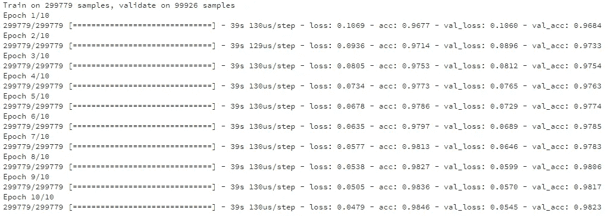
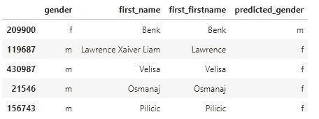

# 使用 Keras 为简单 LSTM 选择正确的超参数

> 原文：<https://towardsdatascience.com/choosing-the-right-hyperparameters-for-a-simple-lstm-using-keras-f8e9ed76f046?source=collection_archive---------0----------------------->

Photo by [Mika Baumeister](https://unsplash.com/photos/Wpnoqo2plFA?utm_source=unsplash&utm_medium=referral&utm_content=creditCopyText) on [Unsplash](https://unsplash.com/search/photos/machine-learning?utm_source=unsplash&utm_medium=referral&utm_content=creditCopyText)

构建机器学习模型从未如此简单，许多文章对什么是数据科学以及它可以做的惊人事情进行了高度概述，或者深入讨论了一个非常小的实现细节。这使得像我不久前一样有抱负的数据科学家经常看着笔记本电脑，心想:“它看起来很棒，很有效，但为什么作者选择了这种类型的架构/神经元数量或这种激活功能，而不是另一种呢？在这篇文章中，我想就如何做出一些决定给出一些直觉，比如在建立模型时找到正确的参数，在一个非常基本的 LSTM 上演示根据给定的名字预测性别。由于有许多关于递归神经网络(RNN)背后的数学和一般概念的伟大课程，例如[吴恩达的深度学习专业化](https://www.coursera.org/specializations/deep-learning)或这里的[媒体](https://medium.com/search?q=lstm)，我不会深入挖掘它们，并认为这些知识是已知的。相反，我们将只关注使用 Keras 的高级实现。我们的目标是对构建这样的神经网络所做的决策有更实际的理解，尤其是如何选择一些超参数。

带有代码和输出的完整文章可以作为笔记本在 [Github](https://github.com/R4h4/Firstname_gender_prediction/blob/master/Article_Gender_Prediction.ipynb) 上找到。

在 Keras 上:自 2017 年支持 TensorFlow 以来的最新产品， [Keras](https://keras.io/) 作为更复杂的机器学习库的易于使用和直观的界面，引起了巨大的轰动。因此，构建实际的神经网络以及训练模型将是我们脚本中最短的部分。

第一步是确定我们要使用的网络类型，因为这个决定会影响我们的数据准备过程。任何名字(或单词)中的字符顺序都很重要，这意味着，如果我们想用神经网络分析一个名字，RNN 是合乎逻辑的选择。长短期记忆网络(LSTM)是 RNNs 的一种特殊形式，当输入组块链变长时，它在寻找正确特征方面特别有效。在我们的例子中，输入始终是一个字符串(姓名),输出是一个 1x2 向量，表示该姓名属于男性还是女性。

做出这个决定后，我们将开始加载我们将需要的所有包以及数据集——一个包含超过 150 万德国用户及其姓名和性别的文件，女性编码为 *f* ，男性编码为 *m* 。

## 预处理数据

任何自然语言处理的下一步都是将输入转换成机器可读的矢量格式。理论上，Keras 中的神经网络能够处理形状可变的输入。在 praxis 中，使用 Keras 中的固定输入长度可以显著提高性能，尤其是在训练期间。这种行为的原因是，这种固定的输入长度允许创建固定形状的张量，因此更稳定的权重。

首先，我们将把每个名字转换成一个向量。我们将使用的方法是所谓的一键编码。这里，每个单词由 n 个二进制子向量的向量表示，其中 n 是字母表中不同字符的数量(使用英语字母表是 26)。为什么我们不能简单地将每个字符转换到它在字母表中的位置，例如 a-1、b-2 等。)这将导致网络假设字符是有序的，而不是分类的——字母 *Z* not 比字母 *A* 更“有价值”。

例:
*S* 变为:
【0，0，0，0，1，0，0，0，0，0，0，0，0，0，0，0，0，0，0，0，0，0，0，0，0，0，0】

*你好*变成:
[[0，0，0，0，0，0，1，0，0，0，0，0，0，0，0，0，0，0，0，0，0，0，0，0，0，0，0，0，0，0，0，0，0，0，0，0，0，0，0，0，0，0，0，0 0，0，0，0，0，0]，
【0，0，0，0，0，0，1，0，0，0，0，0，0，0，0，0，0，0，0，0，0，0，0，0，0，0，0，0，0，0，0，0，0，0，0，0，0，0，0，0，0，0，0，0，0，0，0，0，0，0，0

既然我们已经确定了输入应该是什么样子，我们有两个决定要做:char 向量应该有多长(我们允许多少个不同的字符)和 name 向量应该有多长(我们想要查看多少个字符)。我们将只允许使用德语字母表(标准拉丁语)中最常见的字符和连字符，连字符是许多旧名称的一部分。
为了简单起见，我们将名称向量的长度设置为数据集中最长名称的长度，但以 25 为上限，以确保我们的输入向量不会因为一个人在名称输入过程中出错而变得过大。

Scikit-learn 已经在其预处理库中整合了一个热门编码算法。然而，在这种情况下，由于我们的特殊情况，即我们不是将标签转换成向量，而是将每个字符串拆分成其字符，因此创建自定义算法似乎比其他情况下所需的预处理更快。

[已经证明【Numpy 数组需要的内存比 Python 列表少 4 倍左右。出于这个原因，我们使用 list comprehension 作为创建输入数组的一种更 pythonic 化的方式，但是已经将每个单词向量转换为列表内部的数组。当使用 Numpy 数组时，我们必须确保所有组合在一起的列表和/或数组具有相同的形状。](https://www.draketo.de/english/python-memory-numpy-list-array)

现在我们已经准备好输入，我们可以开始建立我们的神经网络。我们已经决定了模型(LSTM)。在 Keras 中，我们可以简单地将多层堆叠起来，为此我们需要将模型初始化为`Sequential()`。

## 选择正确数量的节点和层

对于应该选择多少个节点(或隐藏神经元)或多少层，没有最终的、明确的经验法则，并且对于您的个别问题，试错法通常会给出最佳结果。最常见的框架很可能是 [k 倍交叉验证](http://en.wikipedia.org/wiki/Cross-validation_%28statistics%29#K-fold_cross-validation)。然而，即使对于一个测试过程，我们也需要选择一些( *k* )数量的节点。
下面的[公式](https://stats.stackexchange.com/a/136542)或许可以给你一个起点:

*Nᵢ* 是输入神经元的数量， *Nₒ* 是输出神经元的数量， *Nₛ* 是训练数据中的样本数量， **α** 代表一个比例因子，通常在 2 到 10 之间。我们可以计算 8 个不同的数字，输入到我们的验证过程中，并根据得到的验证损失找到最佳模型。

如果问题很简单，时间也是一个问题，那么有各种其他的经验法则来确定节点的数量，这些法则大多简单地基于输入和输出神经元。我们必须记住，虽然易于使用，但它们很少会产生最佳结果。这里只是一个例子，我们将在这个基本模型中使用:

如上所述，对于要使用的隐藏层的数量，也存在相同的数量不确定性。同样，任何给定用例的理想数字都是不同的，最好通过运行不同的模型来决定。一般来说，两层已经足够检测更复杂的特征。层数越多越好，但也越难训练。一般来说，一个隐藏层处理简单的问题，就像这样，两个隐藏层足以找到相当复杂的特征。
在我们的例子中，添加第二层仅在 10 个时期后将精度提高约 0.2% (0.9807 对 0.9819)。

## 选择附加超参数

每个 LSTM 层都应该有一个下降层。该层将通过在训练期间忽略随机选择的神经元来帮助防止过度拟合，并因此降低对单个神经元的特定权重的敏感性。20%通常用作保持模型准确性和防止过度拟合之间的良好折衷。

在我们的 LSTM 层做了所有的工作来转换输入，以使预测朝着期望的输出可能，我们必须减少(或，在罕见的情况下，延长)形状，以匹配我们期望的输出。在我们的例子中，我们有两个输出标签，因此我们需要两个输出单元。

要添加的最后一层是激活层。从技术上来说，这可以包含在密度层中，但有理由将其分开。虽然与此不相关，但分割密度层和激活层可以检索模型密度层的缩减输出。使用哪种激活功能同样取决于应用。对于我们手头的问题，我们有多个类(男性和女性)，但一次只能出现一个类。对于这些类型的问题，一般来说， [softmax 激活函数](https://en.wikipedia.org/wiki/Softmax_function)效果最好，因为它允许我们(和你的模型)将输出解释为概率。

损失函数和激活函数经常一起选择。使用 softmax 激活函数向我们指出交叉熵是我们优选的损失函数，或者更准确地说是二进制交叉熵，因为我们面对的是二进制分类问题。这两个函数彼此配合得很好，因为交叉熵函数抵消了 soft-max 函数两端的平稳状态，因此加快了学习过程。

在选择优化器时，自适应矩估计(short _Adam_)已被证明在大多数实际应用中工作良好，并且仅在超参数变化很小的情况下工作良好。最后但并非最不重要的是，我们必须决定，在哪个指标之后，我们要判断我们的模型。Keras 提供了[多种精度功能](https://keras.io/metrics/)。在许多情况下，从整体准确性的角度来判断模型的性能是最容易解释的选择，也足以产生模型性能。

## 构建、训练和评估模型

在对如何选择最重要的参数有了一些直觉之后，让我们把它们放在一起，训练我们的模型:

Training output

98.2%的准确率令人印象深刻，这很可能是因为验证集中的大多数名字已经出现在我们的测试集中。使用我们的验证集，我们可以快速查看我们的模型在哪里得出错误的预测:

Model validation output

查看结果，至少一些错误的预测似乎发生在那些在名字字段中输入他们的姓的人身上。看到这一点，下一个好的步骤似乎是清除那些案例中的原始数据集。目前，结果看起来很有希望。以我们所能达到的精确度，这个模型已经可以用于许多真实世界的情况。此外，为更多时期训练模型可能会提高其性能，这里重要的是注意验证集的性能，以防止可能的过度拟合

## 最后的想法

在这篇文章中，我们成功地构建了一个小模型，以超过 98%的准确率从一个给定的(德国)名字预测性别。虽然 Keras 让我们从编写复杂的深度学习算法中解放出来，但我们仍然必须在这个过程中就一些超参数做出选择。在某些情况下，例如选择正确的激活函数，我们可以依靠经验法则，或者可以根据我们的问题确定正确的参数。然而，在其他一些情况下，最好的结果来自于测试各种配置，然后评估结果。