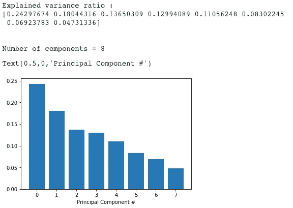
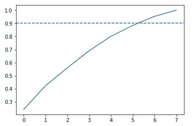
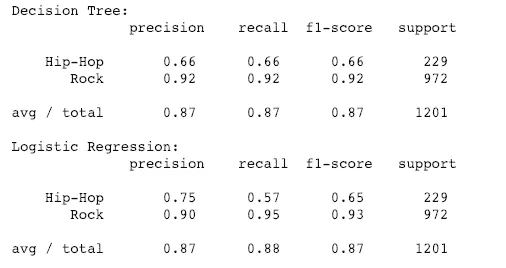

# 从音频数据中分类歌曲流派

> 原文：<https://towardsdatascience.com/classify-songs-genres-from-audio-data-554546280817?source=collection_archive---------14----------------------->

## *这些建议非常中肯！这个播放列表怎么这么了解我？*

Photo by [bruce mars](https://unsplash.com/@brucemars?utm_source=medium&utm_medium=referral) on [Unsplash](https://unsplash.com?utm_source=medium&utm_medium=referral)

# 介绍

在过去的几年里，拥有巨大目录的流媒体服务已经成为大多数人收听他们喜爱的音乐的主要方式。但与此同时，提供的音乐数量之多意味着用户在试图寻找符合他们口味的新音乐时可能会有点不知所措。

出于这个原因，流媒体服务已经开始研究对音乐进行分类的方法，以便进行个性化推荐。一种方法包括直接分析给定歌曲中的原始音频信息，根据各种指标对原始数据进行评分。在本文中，我将检查由一个名为 Echo Nest 的研究小组收集的数据。我们的目标是浏览这个数据集，将歌曲分为“嘻哈”或“摇滚”——所有这些都不需要我们自己去听。在这样做的过程中，我们将学习如何清理我们的数据，进行一些探索性的数据可视化，并通过一些简单的机器学习算法(如决策树和逻辑回归)使用特征约简来实现馈送数据的目标。

*那么，让我们开始吧*

1.  ***加载并准备数据集***

首先，让我们加载关于我们的跟踪的元数据以及由 Echo Nest 编译的跟踪度量。一首歌不仅仅是它的标题、艺术家和收听次数。我们有另一个数据集，它有每个音轨的音乐特征，比如从-1 到 1 的范围内的`danceability`和`acousticness`。它们存在于两个不同的文件中，格式不同——CSV 和 JSON。CSV 是表示表格数据的流行文件格式，而 JSON 是另一种常见的文件格式，数据库经常使用这种格式返回给定查询的结果。

*同样，让我们检查一下我们的数据框看起来像什么*

**②*。连续变量之间的成对关系***

我们通常希望避免使用相互之间相关性很强的变量，从而避免特征冗余，原因如下:

*   为了保持模型简单并提高可解释性(对于许多特性，我们冒着过度拟合的风险)。
*   当我们的数据集非常大时，使用较少的特征可以大大加快我们的计算时间。

为了了解我们的数据中是否有任何强相关的特征，我们将使用`pandas`包中的内置函数。

从上面的图中，我们可以看到任何特征之间都没有很强的相关性。因此，我们不需要从数据中删除任何特征。

***3。归一化特征数据***

如前所述，简化我们的模型并使用尽可能少的必要特征来获得最佳结果是非常有用的。由于我们没有发现我们的特征之间有任何特别强的相关性，我们可以使用一种称为 [**主成分分析**的通用方法来减少特征的数量。](/the-mathematics-behind-principal-component-analysis-fff2d7f4b643)

不同流派之间的差异可能只由数据集中的几个特征来解释。PCA 沿最高方差轴旋转数据，从而允许我们确定数据的每个特征对类间方差的相对贡献。

但是，由于 PCA 使用要素的绝对方差来旋转数据，因此相对于其他要素而言，具有更大范围值的要素会压倒算法并使算法产生偏差。为了避免这种情况，我们必须首先规范化我们的数据。有几种方法可以做到这一点，但一种常见的方法是通过*标准化*，这样所有的特征都有一个`mean = 0` 和`standard deviation = 1`(结果是一个 z 值)。

*让我们看看标准化后我们的数据框是什么样子的*

***4。对我们的缩放数据进行主成分分析***

既然我们已经对数据进行了预处理，我们就可以使用 PCA 来确定我们可以将数据的维度减少多少。我们可以使用 **scree-plots** 和**累积解释比率图**来找到用于进一步分析的组件数量。

Scree-plots 根据每个组件解释的方差显示组件数，按方差降序排序。Scree-plots 帮助我们更好地理解哪些成分解释了我们数据中足够多的差异。当使用碎石图时，图中的“拐点”(从一个数据点到下一个数据点的陡峭下降)通常用于决定适当的截止点。

不幸的是，在该碎石图中似乎没有明显的弯头，这意味着使用该方法不容易找到固有维度的数量。

***5。PCA 的进一步可视化***

但是并没有失去一切！相反，我们也可以查看*累积解释方差图*来确定需要多少特征来解释，比如说，大约 90%的方差(这里的临界值有些随意，通常由“经验法则”决定)。一旦我们确定了合适的组分数量，我们就可以用那么多组分进行 PCA，理想地降低我们数据的维数。

现在，我们可以使用数据的低维 PCA 投影来将歌曲分类成流派。为此，我们首先需要将数据集分为“训练”和“测试”子集，其中“训练”子集将用于训练我们的模型，而“测试”数据集允许模型性能验证。

***6。训练决策树对流派进行分类***

在本文中，我们将使用一个简单的算法，称为决策树。决策树是基于规则的分类器，它接受特征并遵循二元决策的“树结构”,最终将数据点分类为两个或更多类别中的一个。除了易于使用和解释之外，决策树还允许我们将模型从训练数据生成的“逻辑流程图”可视化。

虽然我们的树的性能还不错，但是立即认为它是这项工作的完美工具是一个坏主意——总有其他模型表现更好的可能性！至少测试几个其他算法并找到最适合我们数据的算法总是一个值得的想法。

**第七期*。将我们的决策树模型比作逻辑回归***

有时最简单的是最好的，所以我们将从应用*逻辑回归*开始。逻辑回归利用所谓的逻辑函数来计算给定数据点属于给定类别的概率。一旦我们有了这两个模型，我们就可以在一些性能指标上对它们进行比较，比如假阳性和假阴性率(或者有多少点被错误分类)。

我们的两个模型都做得很好，平均精度都达到了 87%。然而，在我们的分类报告中，我们可以看到摇滚歌曲被很好地分类了，但是嘻哈歌曲被不成比例地错误分类为摇滚歌曲。

***为什么会这样？***

好吧，仅仅通过查看每个类别的数据点数量，我们就可以看到摇滚类别的数据点远远多于嘻哈类别的数据点，这可能会扭曲我们的模型区分不同类别的能力。这也告诉我们，我们的模型的大部分准确性是由其仅分类摇滚歌曲的能力驱动的，这并不理想。

***8。平衡我们的数据以获得更好的性能***

考虑到这一点，我们可以对每个类别中正确分类的值进行加权，使其与每个类别中数据点的出现次数成反比。因为“摇滚”的正确分类并不比“嘻哈”的正确分类更重要(反之亦然)，所以我们只需要在这里衡量我们的类别时考虑数据点的*样本大小*的差异，而不是每个类别的相对重要性。

我们现在已经平衡了数据集，但在这样做的过程中，我们删除了许多可能对训练我们的模型至关重要的数据点。让我们测试一下，看看平衡我们的数据是否能在保持总体分类性能的同时，改善模型对“岩石”分类的偏向。

***9。平衡我们的数据集能改善模型偏差吗？***

请注意，我们已经减小了数据集的大小，并且将在不应用任何降维的情况下继续前进。在实践中，当处理非常大的数据集和计算时间变得非常大时，我们会更严格地考虑降维。

成功！平衡我们的数据消除了对更普遍的阶级的偏见。为了更好地了解我们的模型实际表现如何，我们可以应用所谓的*交叉验证* (CV)。这一步允许我们以更严格的方式比较模型。

***10。使用交叉验证评估我们的模型***

由于我们将数据分割成训练集和测试集的方式会影响模型性能，CV 尝试以多种方式分割数据，并在每次分割时测试模型。虽然有许多不同的 CV 方法，都有各自的优缺点，但我们在这里将使用所谓的 *K 倍交叉验证*。K-fold 首先将数据分成 K 个不同的大小相等的子集。然后，它迭代地使用每个子集作为测试集，同时使用剩余的数据作为训练集。最后，我们可以汇总每个折叠的结果，得到最终的模型性能分数。

现在，我们已经对我们的数据集执行了 k 倍交叉验证，我们可以非常确定我们的模型将在未来看不见的数据点上概括 72%的时间。

**来源:**[https://www.datacamp.com/projects/449](https://www.datacamp.com/projects/449)