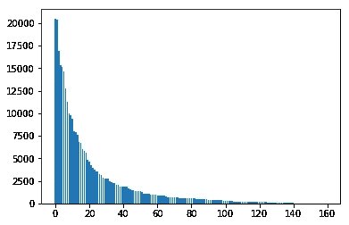
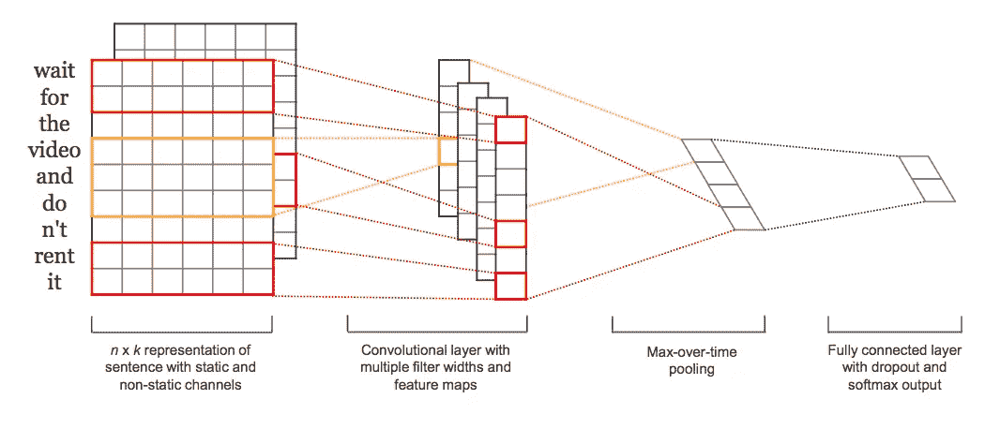
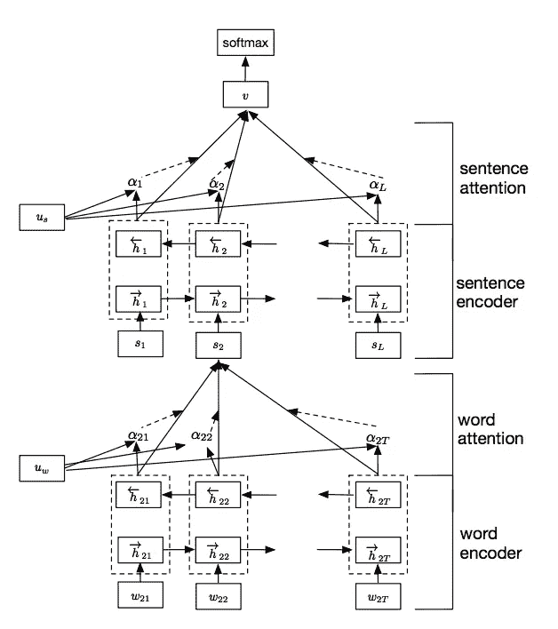

# 危机报告分类

> 原文：<https://towardsdatascience.com/classifying-crisis-reports-17464661221d?source=collection_archive---------6----------------------->

这篇文章描述了我对日益增长的不稳定性的解决方案:由英国科技部、军情五处和军情六处组织的危机报告分类挑战。该解决方案在 579 个竞争对手中获得第三名。 [*链接到最终排行榜*](https://www.datasciencechallenge.org/challenges/2/growing-instability) *。*

# 任务描述

文本分类是给一段文本分配一个类别或范畴的任务。它是自然语言处理领域的一个分支，在情感分析、垃圾邮件检测和标签等方面都有应用。在这个挑战中，目标是用危机标签对《卫报》的文章进行分类。标签的几个例子是“澳大利亚安全和反恐”，“集束炸弹”，“埃博拉”，“法国火车袭击”，“美国枪支控制”。

挑战提供了一个训练集和一个测试集。训练集包括从 1999 年到 2014 年的所有新闻文章及其标签。大约有 160 万篇文章。测试集由 2015 年和 2016 年的文章样本组成。主题词典提供了所有的危机标签。主题词典中共有 160 个标签。标签可以分为两种类型:

*   围绕特定事件的话题。例如“里约 20 地球峰会”、“突尼斯袭击 2015”。与这些主题相关的文章通常只在某一段时间内(一个月或一年)出现
*   围绕概念的话题。例如“伦理”、“印度”、“德国”。与这些主题相关的文章在大多数年份都有。但是，内容每年都不一样。

任务的评估指标是微观平均 F1 分数。这是通过对测试示例的每个单独决策的真阳性、假阳性和假阴性求和来获得的，以产生其中每个测试示例(文档)被同等加权的全局平均值。

F1 得分= 2×TP / (2×TP + FP + FN)

# 数据集探索和基线

大多数文章的标签不在主题词典中。训练集中大约有 235，000 篇文章具有出现在主题词典中的标签。我们使用这个子集进行开发和验证。

Fig 1: Number of articles per topic

一些主题如“英国犯罪”、“伊拉克”、“宗教”和“移民”有大量的文章(超过 15000)。大多数题目至少有 100 个例子。有趣的部分是 12 个主题没有任何文章。分别是'布鲁塞尔袭击'、'巴士底日卡车袭击'、'寨卡病毒'、'奥兰多恐怖袭击'、'柏林圣诞市场袭击'、'查理周刊袭击'、'突尼斯袭击 2015 '、'圣贝纳迪诺枪击案'、'巴黎袭击'、'和平与和解'、'土耳其政变企图'、'法国火车袭击'、'激进主义'、'慕尼黑枪击案'。这些主题大多是发生在 2015 年和 2016 年的事件(除了“和平与和解”和“激进主义”)，因此没有关于它们的培训数据。

这个挑战是一个多标签分类的例子，其中多个标签可以分配给每件商品。我把标签编码成一个 160 维的热向量。我尝试的两个基线是单词包和平均单词向量。在前一种情况下，我将文章转换成一袋单字和双字，并使用它们的频率作为特征。在后者中，我首先使用训练集来训练 300 维的单词嵌入。然后我把每篇文章转换成一个 300 dim 的均值嵌入。前一个特征集是稀疏向量，而后一个是密集向量。我在这两个特征集上应用的两个机器学习算法是前馈神经网络和梯度推进决策树。F1 的最佳基线得分为 0.38。

# 体系结构

我在这次挑战中使用了两种方法:

*   在训练集中有文章的主题的监督学习。这让我在公开数据上的 F1 分数达到了 0.64 左右。
*   用于在训练集中没有文章的主题的规则引擎，其在公开数据上将上述分数提高到 0.6626 F1 分数。

对于监督学习部分，这里是我实验的算法。所有模型都是用 Keras 实现的:

*   **卷积神经网络:**CNN 是用于文本分类的常用模型之一。Kim Yoon 关于用于句子分类的[卷积神经网络](http://www.aclweb.org/anthology/D14-1181)的论文是一个很好的起点。我通过修改过滤器的数量、池大小和过滤器大小来试验不同的架构。我还用预先训练的手套向量、谷歌新闻向量和输入数据上训练的嵌入进行了实验。对我有用的架构是使用在输入上训练的嵌入。随后是 5 个卷积层，滤波器尺寸为 3、5、7、9 和 11。在这之后，有一个合并层，然后依次是 3 个卷积，池和辍学层。最后一层是尺寸为 160 的 softmax 层。
    模型的最后一部分是确定每个主题的阈值。最初，我尝试将所有主题的阈值设为 0.5。然而，为每个主题选择不同的阈值有相当大的提升。阈值是在验证集上学习的。最好的成绩是 F1 得分 0.615。

Fig 2: CNN architecture diagram Source: [http://www.aclweb.org/anthology/D14-1181](http://www.aclweb.org/anthology/D14-1181)

*   **具有 softmax 层的双向 LSTM:**这是另一种用于文本分类的通用架构。基本层是单词嵌入，接着是双向 LSTM 层和 softmax 层。在对这个模型做了一点试验后，我意识到它有两个缺点。首先，与 CNN 模型相比，它在每个时期花费了大约 3 倍的时间(所有训练都是在 AWS p2.xlarge 中完成的，其中有 Tesla k80 GPU)。二是性能比 CNN 机型差很多。最好的 F1 成绩是 0.52。因此，我决定不再继续这种模式。

Fig 3: LSTM network for classification Source: [http://deeplearning.net/tutorial/lstm.html](http://deeplearning.net/tutorial/lstm.html)

*   **关注 GRU 网络:**我试验的下一个模型是 GRU 网络上的关注层。gru 在某种意义上类似于 LSTMs，它们使用门控机制来学习长期依赖性。然而，它们具有较少的门(它们没有输出门)，因此具有较少的参数。他们的训练速度相当快，F1 分数为 0.621。
*   **分层注意模型:**该体系结构首先由杨等人在论文【用于文档分类的分层注意网络】中提出。艾尔。这个模型的独特之处在于，它有两个层次的注意机制，既适用于单词，也适用于句子。这有助于它有区别地识别更多和更少的重要内容。我在这里使用了 Richard Liao 实现的模型。这个模型的优点是，当我们查看给定文本的注意力权重时，我们可以了解哪些单词和句子对标签有贡献。这对于调试非常有用。这也被证明是最佳的单一网络模型，F1 值为 0.626。

*   **以上模型的叠加:**在检查了这些模型的输出后，我意识到，对于很多题目来说，输出并不是高度相关的。这为堆叠这些模型提供了机会。我使用开发集的交叉验证，从每个模型中创建了一个 160 维的特征向量。这导致了一个 640 维的特征向量，我通过一个前馈网络。该网络有两个隐层，分别为 480 和 320 个单元。这给了我最好的 F1 成绩 0.6415。

到目前为止，我对没有训练数据的主题的预测为零。由于许多话题都是欧洲的重大恐怖袭击，我预计《卫报》会有大量报道。我试验的最初模型是检查文章中是否存在主题字符串。例如，对于主题“巴黎袭击”，将所有具有字符串“巴黎袭击”的文章标记为真。但是这个模型导致了召回率的损失，并且没有特别高的精度(与《查理周刊》袭击事件相关的文章也有‘巴黎袭击’这个短语)。该模型的下一次迭代涉及使用主题字符串中所有标记的计数作为特征，并使用手动阈值进行区分。然而，选择最佳阈值是困难的，我没有取得任何重大进展。

到目前为止，我还没有在任何文章中使用过的一个特性是文章的日期。这在这里很有用，因为在袭击发生之前不会有关于“巴黎袭击”的文章。另一个认识是，在攻击后的几天内，它的主题标签和攻击位置的主题标签有很高的相关性。例如，在巴黎袭击之后，标签“法国”和“巴黎”与“巴黎袭击”有很强的相关性。我使用这种相关性来创建一个种子文章集，这些文章极有可能属于新标签。考虑作为种子集一部分的文章是在攻击当天到攻击后一周内发表的文章(对于覆盖范围更大的攻击，这可能会增加)。然后，我建立了一个命名实体袋监督学习模型，以在结束后对文章进行分类(我最初尝试使用单词袋，但它给出的结果比命名实体袋差)。对于模型的反面例子，我使用了该日期之前文章的随机样本。这在实践中效果很好，我能够在公共数据集上获得 0.6626 的分数。

# 未来的工作

我很想在未来探索一些想法，但是没有足够的带宽:

*   为每个主题标签建立一个模型，而不是一个统一的模型。
*   将所有的 CNN、RNN 和注意力模型合并成一个大的神经网络，而不是堆叠。
*   探索没有训练数据的主题的替代模型。
*   更好地利用日期特性进行分类。直觉上，一篇 1999 年的文章和一篇 2014 年的文章权重相同是没有意义的。

*不幸的是，作为竞赛协议的一部分，我们不得共享数据和代码。但是，希望这篇文章对所有文本分类从业者有用。*