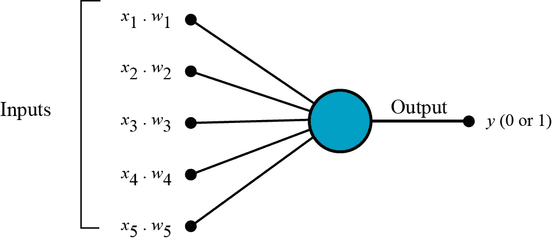
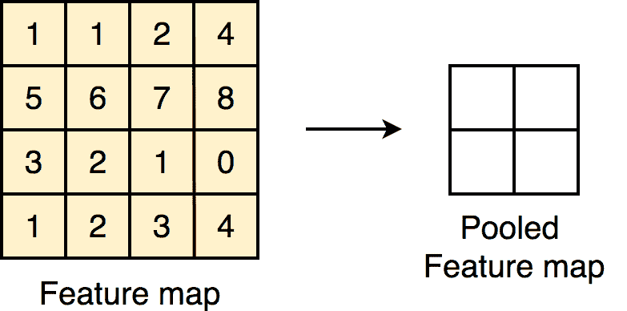
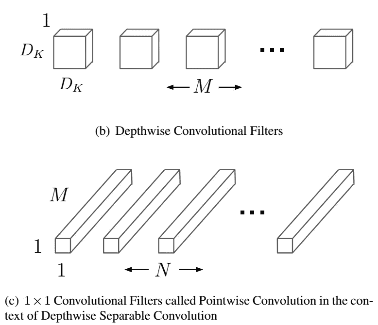

# 用卷积神经网络对皮肤损伤进行分类

> 原文：<https://towardsdatascience.com/classifying-skin-lesions-with-convolutional-neural-networks-fc1302c60d54?source=collection_archive---------10----------------------->

## 医学深度学习指南和介绍。

Photo by [Rawpixel](https://unsplash.com/@rawpixel) on [Unsplash](https://unsplash.com/photos/hXOiVghYBNc).

# 想象一下。

你醒来后发现皮肤上有一个可怕的疤痕，于是你去医生办公室检查。他们说没事，所以你可以回家，几个月内不要担心，但随后你会从那个地方开始一跳一跳地疼——现在看起来很丑，很危险。由于你的医生的误诊，它已经发展成了恶性肿瘤。误诊的普遍程度很吓人。一项研究表明，超过 1/20 的美国成年人在过去被误诊，其中一半以上是有害的。许多皮肤损伤可能是无害的，但其他的可能会**威胁生命**。立即发现这些肿瘤非常重要，因为这是治疗它们最容易的时候。

最近，我们看到人工智能已经成为我们日常生活中不可或缺的一部分。我们发现它被用在我们的文本推荐、广告个性化、虚拟助手等等。随着人工智能在这些领域取得如此巨大的进步，它有**无限的潜力**通过**深度学习对医疗保健产生影响。**考虑到这一点，我着手制定一个端到端的解决方案，使用深度学习对皮肤病变进行分类。

我们可以通过使用卷积神经网络来实现准确可靠的医学图像分析技术，卷积神经网络是一种用于分析图像的深度神经网络。在我们进入 CNN 之前，让我们稍微回溯一下，看看神经网络是如何工作的。神经网络本质上是以类似于人脑工作方式的方式模拟的计算机程序。像我们的大脑一样，神经网络由一大堆神经元组成，这些神经元不能单独做很多事情，但当它们在网络中连接在一起时，可以完成一些非常难以置信的任务。

***神经元是做什么的？***

A neuron takes in some inputs, operates on it, and gives an output. [Source](https://cdn-images-1.medium.com/max/1600/1*_Zy1C83cnmYUdETCeQrOgA.png).

神经元的工作很简单，它接受几个输入；让我们称它们为 X1、X2 和 X3，如图所示，然后输出一个结果。每个输入都有一个与之相关的权重系数。这些权重影响神经元的输出，并且它们被不断地改变以获得改进的输出(这更准确)。

把神经网络想象成一群白蚁。一只白蚁本身是微不足道的，并不能真正做任何事情，但当你有数百万只白蚁在一起时，它们可以通过学习并最终进化来完成令人难以置信的任务。

A neural network with 2 hidden layers. [Source](https://cdn-images-1.medium.com/max/1600/1*DW0Ccmj1hZ0OvSXi7Kz5MQ.jpeg).

神经网络通常被用作**监督学习的一种方法，**这基本上意味着它们学习如何通过识别数据中的模式来进行预测。我们给它的数据越多，它就越有可能做出更好的预测。但是神经网络如何在我们处理的一些非常复杂的数据中找到模式呢？

它的学习方式与人类相似。首先，它浏览数据并做出超级随机的预测，这些预测根本不太准确，然后它使用一种叫做 [**反向传播**](https://ml-cheatsheet.readthedocs.io/en/latest/backpropagation.html) 的技术，从它犯下的错误中学习，然后试图修复它们。它做得越多，预测就越准确。它们甚至经常能够识别人类永远看不到的模式和相互关系！

那么我们如何将这一点应用到皮肤病变的图片上呢？我们使用一种特殊类型的神经网络，称为卷积神经网络。

# 卷积神经网络

卷积神经网络不同于普通的神经网络，因为它们包含一种特殊类型的层，称为**卷积层**，它包含一个过滤器，能够理解图像中某些类型的模式。

A graphical demonstration of a filter. [Source](https://cdn-images-1.medium.com/max/1600/1*Fw-ehcNBR9byHtho-Rxbtw.gif).

你可以把滤镜想象成手电筒。你将它照射在一张照片的不同部分，寻找一些特征，并在特征图上写下它是否存在(或在多大程度上存在)。通常，位于最开始的图层会被用于一些非常简单的事情，比如边缘检测。随后，图层可以检测更复杂的特征，如眼睛、鼻子和手指。所有这些特征图被放入网络末端的一长串特征中，用于最终对图像进行分类。

除了卷积层，CNN 还包含几个其他层，即池和分类层。

Standard architecture of a CNN

汇集层对于确保 CNN 的训练不会花费太多时间是非常重要的。他们通过**缩小图像的尺寸来做到这一点。**它的工作方式与卷积层非常相似，在卷积层中，过滤器会通过图像，但现在，过滤器会通过数据，提取最重要的信息，并将其放入较小的矩阵中。这使得您的计算机更容易使用。

A Pooling Layer reducing a feature map by taking the largest value. [Source](https://cdn-images-1.medium.com/max/1000/1*lRVHY6UXH7K5sfr9L_YVvg.gif).

所有这些层在最后连接在一起，成为一个产生最终分类的[**soft max**](https://medium.com/data-science-bootcamp/understand-the-softmax-function-in-minutes-f3a59641e86d)**函数(分类层)。**

# **构建分类器**

**让我们开始构建我用来对皮肤损伤进行分类的模型。我使用 native Keras 构建了 CNN，如果您没有机器学习的经验，请不要担心，通过本指南，您应该能够很好地理解它是如何工作的！我使用了**转移学习**来创建这个模型，这意味着我使用了一个叫做 MobileNet 的**预训练网络**，它是用超过 1400 万张图像的数据集 **ImageNet** 训练的，并且**给它添加了一些层**，所以它可以对皮肤病变进行分类。这个想法是，我们采用一个用大量数据训练的模型，并将其用于我们没有那么多数据的新任务。通常，这有助于**提高最终模型的准确性，并减少训练时间！****

**我们使用 **MobileNet** 主要是因为它的**速度**。当我开始做这个项目时，我遇到的一个问题是像 [Resnet50](https://arxiv.org/abs/1512.03385) 这样的模型在训练速度和实时预测方面的性能非常差。**

## ****是什么让 MobileNet 更快？****

**之前，我解释了卷积层如何通过图像上的过滤器。当图像有不止一个颜色通道时(RGB 有 3 个通道)，这很难计算。这就是**深度方向可分离卷积**发挥作用的地方。这就是 MobileNet 的特别之处，也是它比其他网络快得多的原因。**

****

**深度方向卷积将卷积过程分为两步。它将滤镜传递给图像中的每个单独的层，使滤镜的深度为 1。如果有三层，红色，绿色和蓝色，它将通过不同的过滤器通过每一层。之后，它通过一个称为逐点卷积的过程，对所有层应用 1x1 卷积来合并层。深度方向可分离卷积的总计算量比标准卷积低**8-9 倍**，这使得它能够在移动设备上运行！我简单地看了一下，如果你想更好地理解深度方向的卷积，看看这篇论文。**

## **10000 哈姆**

**在 [HAM10000 数据集](https://www.kaggle.com/kmader/skin-cancer-mnist-ham10000)中，我们将获得训练模型所需的图像。这是 7 种不同类型的皮肤损伤的大约 10，000 个标记图像的集合。**

**这些是在数据集中发现的病变类型:**

*   **光化性角化病**
*   **基底细胞癌**
*   **良性角化病**
*   **皮肤纤维瘤**
*   **恶性黑色素瘤**
*   **黑素细胞痣**
*   **血管病变**

**你可以在这里找到更多关于它的信息。**

****现在我们来看一下代码。****

**我们从导入我们需要的所有库开始。一大堆 [Keras](https://keras.io/) 进口需要构建我们 CNN 的不同部分。我们还导入了 [Numpy](http://www.numpy.org/) 、 [itertools](https://docs.python.org/3/library/itertools.html) 和 [Scikit-Learn](https://scikit-learn.org/) 。随着我们的发展，我们将探索这些功能的用途！**

**现在，让我们声明一些变量，这些变量在以后会对我们有用。我们设置了一些变量，这些变量包含了训练数据和评估数据的位置，这样我们更容易处理。样本的数量就是我们使用的数据集中有多少图像。批量大小是指在网络权重更新之前您处理的图像数量。我们输入到神经网络的图像的大小是 224x224，稍后我会详细介绍这一点。最后，我们需要声明网络需要向前/向后传递多少次，直到它分析了每一张图像，我们可以通过将数据中的图像总数除以批量大小，然后取整来完成。**

**我们需要做的另一个真正重要的步骤是**数据预处理**，因为我们使用的是 **MobileNet** 的迁移学习。我们需要重新训练这个网络中的几个层，以便它能处理皮肤损伤图像。注意，MobileNet 接收 224x224 尺寸的输入图像，我们需要预处理数据以符合这个标准。**

**在这里，我们对网络进行了一些重要的更改。MobileNet 模型通过添加一个丢弃层和一个密集输出层进行了修改。我们使用 dropout 来防止**过度拟合**数据。当网络变得非常非常擅长对你给它的数据进行分类时，这种情况就会发生，但除此之外就没什么了。在添加这一层之后，我们添加最后的致密层，它具有附加的激活功能。这需要它收集所有的特征地图，然后给我们预测。在我们对网络结构做了这些改变后，我们想冻结一些层来加快训练速度。在这种情况下，我们冻结了除最后 23 层以外的所有内容，因此我们的图像数据仅在 MobileNet 的最后 23 层上进行训练。**

**既然我们已经微调了我们的模型，我们需要创建几个度量来确定我们的模型有多精确。然后我们为我们的模型编辑所有的信息，这样它就可以被训练了。对于训练，我们使用 [Adam 优化器](/neural-network-optimization-algorithms-1a44c282f61d)和[分类交叉熵](https://ml-cheatsheet.readthedocs.io/en/latest/loss_functions.html#cross-entropy)损失函数。本质上，损失函数测量模型预测的错误程度，优化器改变权重，试图使模型更加准确。这两个函数在机器学习中非常重要，你可以在上面的链接中了解更多。**

**现在，最后，我们训练模型，将我们上面创建的所有组件拼凑在一起。程序将此保存到文件中，如果我们想要实现这个模型，这是至关重要的。**

**该模型获得了大约 85%的准确率，用 HAM10000 数据集进行了测试，但是，我预测在现实世界中它不会那么可靠。当然，这个问题很容易解决，只要有一个更大的图像集合来训练它，并在更广泛的环境中进行训练。**

**为了在网络上运行这个，我将 Keras 模型转换为 TensorflowJS 模型，并且能够通过遵循[这个指南](https://www.youtube.com/watch?v=HEQDRWMK6yY&list=PLZbbT5o_s2xr83l8w44N_g3pygvajLrJ-)很容易地在网络上实现它。**

**你可以在我的网站上看到这个模型的实现[这里](https://aryanmisra.com/skinpredictapp.html)，如果你想仔细看看这个模型，一定要看看我的 [GitHub](https://github.com/aryanmisra/Skin-Lesion-Classifier/) 。**

****

**Web implementation of the model.**

**这里是模型的 [web 实现，我已经提供了项目的描述以及一些关于皮肤损伤类型的信息，来源于](https://aryanmisra.com/skinpredictapp.html)[这里](https://arxiv.org/ftp/arxiv/papers/1803/1803.10417.pdf)。**

**如果您没有任何图片来测试它，我还为每个类提供了一些示例图片。该模型在非皮肤背景的病变图片上表现不太好，因为它没有经过这样的图像训练。正如我上面所说的，从 HAM10000 数据集计算的准确性约为 85%，虽然这对于医疗用途来说肯定是不够的，但专业支持和更大的数据集将产生一个可用于临床使用和家庭诊断的模型。**

**像这样的技术的影响是巨大的。通过使用人工智能技术，我们有可能消除临床上的误诊，就像这样。我们拥有的数据和支持越多，它就越能成长并变得更加准确。只有 10，000 张图像，我们达到了大约 85%的准确率，但是想象一下，如果我们有**数百万张**图像，会有多好。这些模型将拥有医生的技能，医生已经看过并从**数百万张图像**中学习。你能想象吗？**

**人工智能已经在扰乱医疗保健领域。随着我们继续将它纳入主流医学，治疗和诊断的质量将会大大提高。我们已经看到人工智能取代了许多制造和文书工作，但许多人不认为人工智能对医疗保健这样重要的领域有影响。通过使用人工智能进行诊断，我们可以消除可预防的疾病，并创造一个我们不再需要担心获得准确诊断的未来。**

****如果你喜欢我的文章或者学到了新东西，请务必:****

*   **在 [LinkedIn](https://www.linkedin.com/in/aryan-misra/) 上与我联系。**
*   **给我发一些反馈和评论(aryanmisra@outlook.com)。**
*   **查看 [web 实现](https://aryanmisra.com/skinpredictapp.html)。**