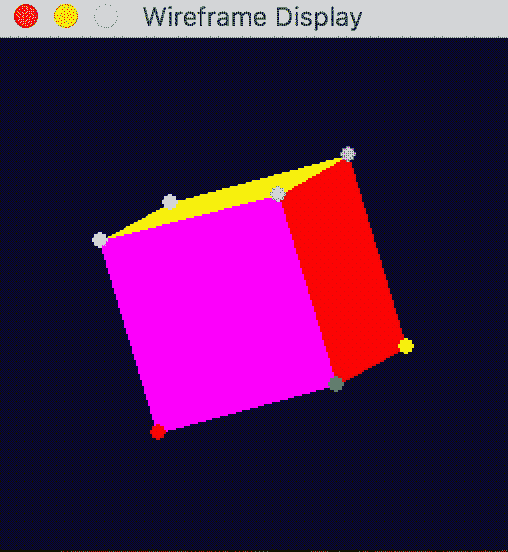
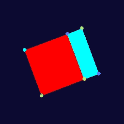
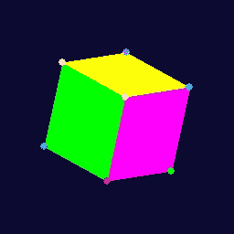
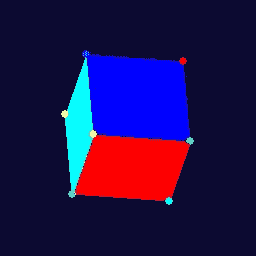
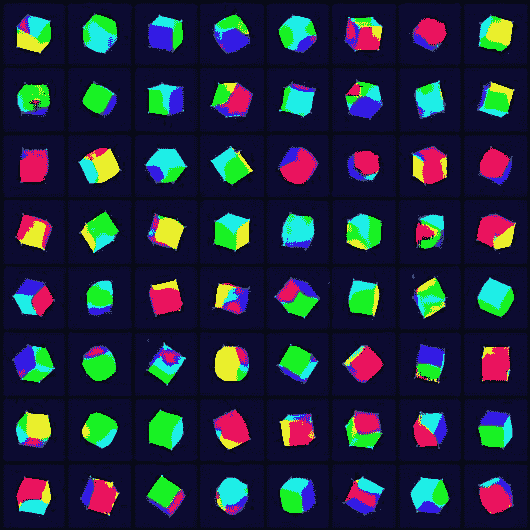
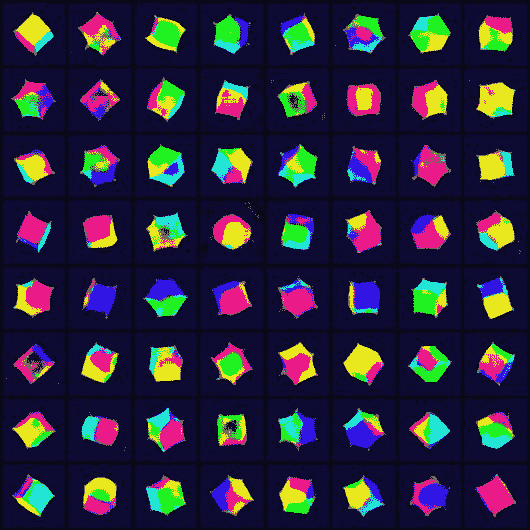

# cLPR:一个用于学习姿态和旋转的 3D 数据集

> 原文：<https://towardsdatascience.com/clpr-a-3d-dataset-for-learning-pose-and-rotation-44a39e0a528a?source=collection_archive---------10----------------------->

如果你仍然在媒体上阅读这篇文章，我已经把我的博客搬到了 http://yvanscher.com/blog.html

今天我将发布 *cLPR* 数据集，一个用于在 3D 机器学习中工作的数据集。该名称代表**立方体**用于**学习**姿势**和**旋转**。目标是为测试机器学习算法提供许多不同位置的彩色 3D 立方体的良好基线数据集，这些算法的目标是学习姿势和旋转。**



在此下载数据集:

[https://bit.ly/2yeeA15](https://bit.ly/2yeeA15)

## 数据

数据集包含立方体的 32x32、64x64、128x128、256x256 jpeg 图像(3d 对象的 2d 投影)。jpegs 没有任何质量损失。数据看起来像这样:



The cube in 3 different positions. The first and third image are showing 2 of the same sides (red and cyan).

## 标签

标签在二进制 numpy 文件中提供。该文件被称为`cube1–1.14.3–2018–06–10–12–30–10.npy`，通常为`cubeN-x.xx.x-datetime.npy`，其中`x.xx.x`是用于转储文件的 numpy 版本，`N`是该数据文件的多维数据集。它包含数据集中所有图像的立方体中节点的每个位置和旋转。对于这个数据集，结构是 250047 x 8 x 6，它的位置 x 节点 x 6 numpy 数组，其中最后一个维度(0，1，2)的前 3 个值是 x，y，z 位置，最后一个维度(3，4，5)的后 3 个值是以弧度表示的 x，y，z 旋转。您也可以通过修改脚本在`rotation_positions`数组中存储的内容来创建您想要的任何标签(`projector.py`，第 90 行)。

所以结构看起来像:

## 制作数据集

数据集是使用名为`pygame`的包生成的，该包最初是为制作 python 游戏而设计的。这个包很不错，因为它让你可以轻松地绘制和渲染 2d 或 3d 对象。我使用 pygame 是因为我希望代码足够简单，能够让图形经验和矩阵乘法基础知识有限的人理解。

用于生成数据集的[代码](https://github.com/yvan/cLPR)在 github 上。让我们来看看这些代码是如何在高层次上工作的。

## 创建一个线框

首先，我们创建一个立方体的线框。这个线框由节点、边和面组成。节点是空间中的点，每个用 x，y，z 坐标表示。我们将所有节点存储在一个 8x3 的 numpy 数组中。边是两个节点(numpy 数组中节点的索引)。面是连接在一起的 4 个节点(也是 numpy 数组中节点的索引)。

您可以像这样创建一个线框:

我用它来创建 8 个节点，6 个面。您实际上不需要指定边，只需要指定节点和面。您可以测试立方体线框创建；运行存储库中包含的`python wireframe.py`脚本:

对于这个线框类别，`wireframe.py`唯一的外部依赖是`numpy`。这个脚本将创建一个立方体并打印节点、边和面。

## 产生旋转

然后，我生成一组旋转，我想在三维应用到立方体的节点(立方体的角落)。为了生成旋转，我只需遍历 0-6.3 弧度范围内所有可能的旋转组合(接近 2π弧度，但不完全完美)。

上面的代码片段将生成大约 360 度，2π弧度的旋转。然后在 pygame 的每一帧/迭代中，我们将抓取其中一个旋转并显示出来。

## 步骤 3 渲染线框

我使用 pygame 的函数绘制多边形来渲染线框。该函数获取一系列边(2 个点，[(x，y，z)，(x，y，z)])并在屏幕上以给定的点和边的顺序用该颜色绘制一个多边形。下面是我的代码的快速和肮脏的版本；实际的脚本要复杂一些。

## 第 4 步应用一个旋转和重新中心立方体

为了对这个立方体进行旋转，我对适当的轴使用了一个旋转矩阵。所以要绕着 *x* 轴旋转，我会用`wireframe.py`的`create_rot_x`。该函数返回一个矩阵，用于在 *x* 轴上旋转我们需要的弧度数。然后我在`transform`函数中在线框的节点和我们创建的旋转矩阵之间做一个点积。所有这些只是将我们节点的 x，y，z 位置乘以矩阵中正确的数字，这样新的位置就会沿着 *x* 旋转任意多的弧度。我对这次旋转的 *x* 、 *y* 和 *z* 弧度重复上述过程。完成后，重新调整立方体的中心，使它的中间在屏幕的中心。

## 步骤 5 将立方体节点重置到它们的初始位置

我存储初始位置，并在每次旋转+重定中心+立方体快照后重置它。这使得推理立方体在每次迭代中做什么变得更容易，移动到我给它的旋转。从一个旋转运动到另一个旋转运动也可能会有万向节锁的问题。这有点令人迷惑，所以我想完全避免它。

## 重复第 3-5 步

当我这样做时，我在每次旋转后截屏 pygame 屏幕，并将位置信息存储在一个 numpy 数组中。在这个过程中，我将图像写入磁盘，最后保存一个包含所有节点位置和旋转的 numpy 数组。

## 最后一步

标签的目视检查和程序测试。我回放了 numpy 文件(`projector.py`的`-t`输入选项回放了 npy 文件),看到旋转看起来不错。还通过`test_npy_positions`功能(输入到`projector.py`的`-n`输入)运行它，该功能将它与每个部分位置的已知正确值进行比较。上面的解释旨在让你了解代码是如何工作的，更多细节见 github 上的[代码。代码并不完美，数据集也不完美，还有很大的改进空间(例如，为标签添加颜色映射以使跟踪更容易)。请随时提出拉请求或自己动手。我真的很感激。](https://github.com/yvan/cLPR)

## 你能用这个数据集做什么？

你可以做的一件事是训练可变自动编码器。为了展示如何使用这个数据集，我提供了两个不同的自动编码器([一个经典的](https://github.com/yvan/cLPR/blob/master/example_dense_vae.ipynb)，[一个传统的](https://github.com/yvan/cLPR/blob/master/example_conv_vae.ipynb))。都有点，泛泛而谈…但重点只是展示一个例子，并不是要有一个完美的模型。

下面是一张图片，其中每个单元代表一个潜在空间的区域，我已经采样，然后通过我们的解码器网络生成一个立方体:



不是所有这些看起来都像立方体，但是嘿，有几个看起来像！[代码在这个笔记本里](https://github.com/yvan/cLPR/blob/master/example_conv_vae.ipynb)。

不要气馁。生成模型是出了名的困难和挑剔，这里有一个我失败的模型输出的例子:


Failed (yet cool) cube outputs.

以下是我在上述数据子样本训练中制作的 vae 模型的必选 gif(每个时期的快照):



GIF of training VAE

如果你想要一个更好的例子，让自动编码器在 autoencoder 中尝试不同的发行版，请[看看这篇文章](https://nicola-decao.github.io/s-vae/)(以及附带的 github 代码)，作者是我在阿姆斯特丹大学的朋友 Tim Davidson 和他的几个同事。还有一篇关于 SO3 自动编码器的非常酷的[论文](https://arxiv.org/abs/1807.04689)使用了这个数据集的一个变种。

## 结论

谢谢你坚持到最后。如果您发现数据集或任何脚本有问题，请联系我；人们已经在研究论文和项目中使用这种数据(预发布),因此问题应该被了解、公布和调试。

如果您想引用该数据集，您可以这样做:

```
Yvan Scher (2018). cLPR Dataset. Brooklyn, NY: The InternetOR@misc{Scher:2018,
author = "Yvan Scher",
year = "2018",
title = "cLPR Dataset",
url = "[https://bit.ly/2yeeA15](https://bit.ly/2yeeA15)",
institution = "The Internet"}ORJust say you used the cLPR dataset and link back to this post :)
```

我要感谢[彼得·科林里奇](http://www.petercollingridge.co.uk)他有一些不错的 pygame 教程。如果你感兴趣的话，我用 pygame 写了其他的[博客](https://medium.com/@yvanscher/how-to-make-a-game-with-pygame-fc85159ae354)。如果你想了解图形和人工智能领域的最新项目和有趣的事情，你应该订阅我的时事通讯: [***一代机器***](https://tinyletter.com/generationmachine) 。

干杯！