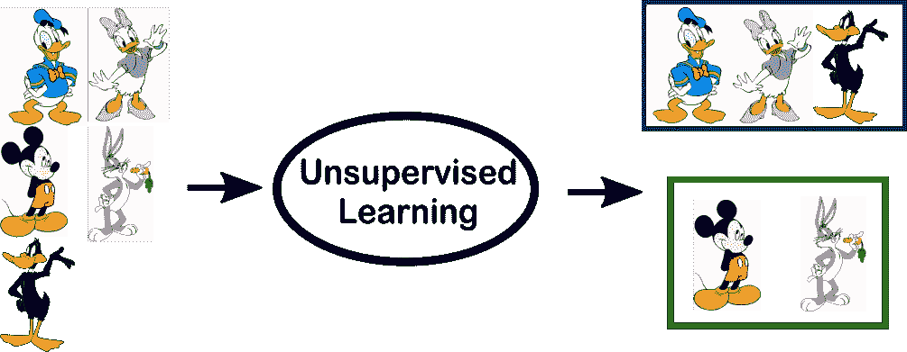
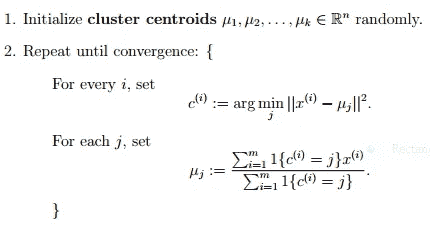
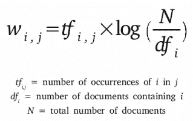
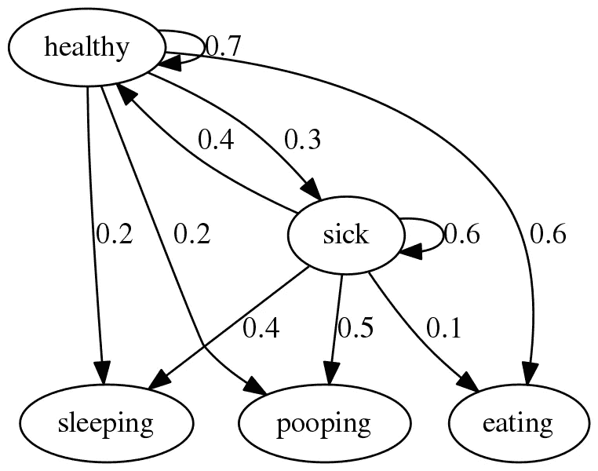
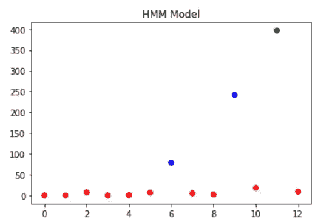
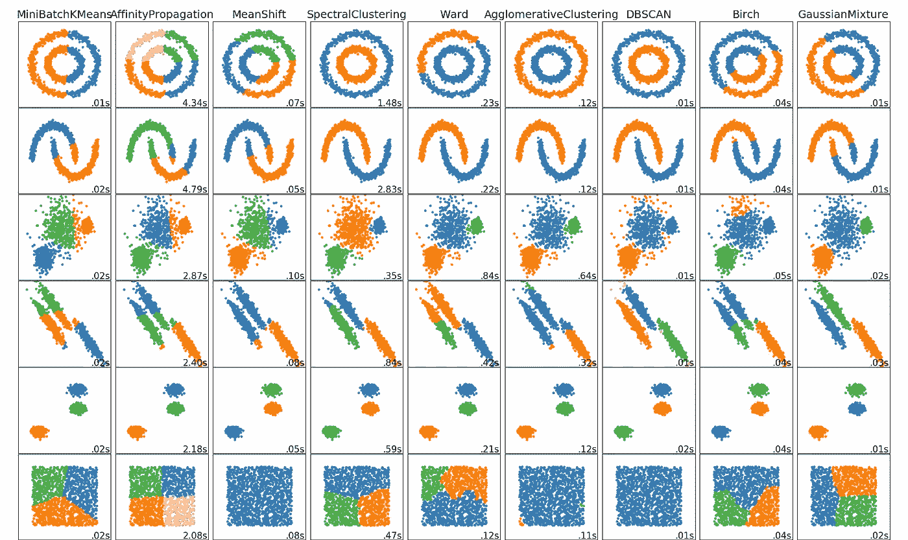

# 基于聚类的无监督学习

> 原文：<https://towardsdatascience.com/clustering-based-unsupervised-learning-8d705298ae51?source=collection_archive---------1----------------------->



无监督机器学习是从“未标记的”数据(分类或归类不包括在观察值中)推断描述隐藏结构的函数的机器学习任务。使用无监督学习算法的常见场景包括:
-数据探索
-离群点检测
-模式识别

虽然有一个详尽的聚类算法列表(无论您使用 R 还是 Python 的 Scikit-Learn)，但我将尝试涵盖基本概念。

# k 均值

最常见和最简单的聚类算法是 K-Means 聚类。这个算法包括你告诉算法在数据集中有多少可能的聚类(或 K)。然后，该算法迭代地移动 k-中心，并选择聚类中最接近质心的数据点。



以 K=3 为例，迭代过程如下:


一个显而易见的问题是选择 K 值的方法。这是使用肘形曲线完成的，其中 x 轴是 K 值，y 轴是某个目标函数。一个常见的目标函数是数据点和最近质心之间的平均距离。


K 的最佳数值是“肘部”或扭曲区域。在这一点之后，通常认为添加更多的集群不会为您的分析增加显著的价值。以下是在 iris 数据集上使用 Scikit-Learn 的 K-Means 的示例脚本:

```
from sklearn.cluster import KMeans
import matplotlib.pyplot as plt
from mpl_toolkits.mplot3d import Axes3D
import numpy as np
%matplotlib inline
from sklearn import datasets#Iris Dataset
iris = datasets.load_iris()
X = iris.data#KMeans
km = KMeans(n_clusters=3)
km.fit(X)
km.predict(X)
labels = km.labels_#Plotting
fig = plt.figure(1, figsize=(7,7))
ax = Axes3D(fig, rect=[0, 0, 0.95, 1], elev=48, azim=134)
ax.scatter(X[:, 3], X[:, 0], X[:, 2],
          c=labels.astype(np.float), edgecolor="k", s=50)
ax.set_xlabel("Petal width")
ax.set_ylabel("Sepal length")
ax.set_zlabel("Petal length")
plt.title("K Means", fontsize=14)
```


如上面的 3D 图所示，K-means 的一个问题是它做硬标签。但是，您可以看到紫色和黄色集群边界上的数据点可以是任意一个。对于这种情况，可能需要不同的方法。

# 混合模型

在 K-Means 中，我们做了所谓的“硬标记”，在这里我们简单地添加最大概率的标记。然而，存在于聚类边界处的某些数据点可能仅仅具有在任何一个聚类上的相似概率。在这种情况下，我们看的是所有的概率，而不是最大概率。这就是所谓的“软标签”。

```
from sklearn.mixture import GaussianMixture
import matplotlib.pyplot as plt
from mpl_toolkits.mplot3d import Axes3D
import numpy as np
%matplotlib inline
from sklearn import datasets#Iris Dataset
iris = datasets.load_iris()
X = iris.data#Gaussian Mixture Model
gmm = GaussianMixture(n_components=3)
gmm.fit(X)
proba_lists = gmm.predict_proba(X)#Plotting
colored_arrays = np.matrix(proba_lists)
colored_tuples = [tuple(i.tolist()[0]) for i in colored_arrays]
fig = plt.figure(1, figsize=(7,7))
ax = Axes3D(fig, rect=[0, 0, 0.95, 1], elev=48, azim=134)
ax.scatter(X[:, 3], X[:, 0], X[:, 2],
          c=colored_tuples, edgecolor="k", s=50)
ax.set_xlabel("Petal width")
ax.set_ylabel("Sepal length")
ax.set_zlabel("Petal length")
plt.title("Gaussian Mixture Model", fontsize=14)
```


对于上面的高斯混合模型，数据点的颜色基于靠近聚类的高斯概率。RGB 值基于与红色、蓝色和绿色聚类的接近度。如果您查看蓝色和红色集群边界附近的数据点，您将看到紫色，表明数据点靠近任一集群。

# 主题建模

既然我们已经讨论了数值，让我们转向分类值。一个这样的应用是文本分析。解决这类问题的常用方法是主题建模，将文档或文档中的单词分类成主题。其中最简单的是 TF-IDF 模型。TF-IDF 模型根据单词的重要性对其进行分类。这取决于它们在特定文档中的出现频率(例如科学期刊中的特定科学主题)以及在所有文档中常见的词(例如停用词)。



我最喜欢的算法之一是潜在的狄利克雷分配或 LDA 模型。在这个模型中，文档中的每个单词都有一个基于整个文档语料库的主题。下面，我附上了华盛顿大学机器学习专业化课程的幻灯片:


LDA 模型本身背后的机制很难在这篇博客中解释。然而，人们的一个常见问题是决定主题的数量。虽然对此没有确定的答案，但我个人更喜欢实现每个文档的单词向量的 K 均值的肘形曲线。每个词向量的接近程度可以通过余弦距离来确定。


# 隐马尔可夫模型

最后，让我们介绍一些时间序列分析。对于聚类，我最喜欢的是使用隐马尔可夫模型或 HMM。在马尔可夫模型中，我们寻找状态和给定当前状态的下一个状态的概率。下面的例子是一只狗在马尔可夫模型中的生活。



让我们假设狗生病了。鉴于目前的状态，它有 0.6%的几率在下一个小时继续生病，0.4%的几率在睡觉，0.5%的几率在拉屎，0.1%的几率在吃东西，0.4%的几率会恢复健康。在 HMM 中，您提供时间序列数据中可能有多少个状态供模型计算。下面给出了波士顿房价数据集的一个示例，包含 3 个州。

```
from hmmlearn import hmm
import numpy as np
%matplotlib inline
from sklearn import datasets#Data
boston = datasets.load_boston()
ts_data = boston.data[1,:]#HMM Model
gm = hmm.GaussianHMM(n_components=3)
gm.fit(ts_data.reshape(-1, 1))
states = gm.predict(ts_data.reshape(-1, 1))#Plot
color_dict = {0:"r",1:"g",2:"b"}
color_array = [color_dict[i] for i in states]
plt.scatter(range(len(ts_data)), ts_data, c=color_array)
plt.title("HMM Model")
```



与每个聚类问题一样，决定状态的数量也是一个常见问题。这可以是基于域的。例如，在语音识别中，通常使用 3 种状态。另一种可能性是使用肘部曲线。

# 最后的想法

正如我在博客开始时提到的，我不可能涵盖所有的无监督模型。同时，基于您的用例，您可能需要算法的组合来获得相同数据的不同视角。至此，我想以 Scikit-Learn 在玩具数据集上著名的聚类演示结束您的演讲:

