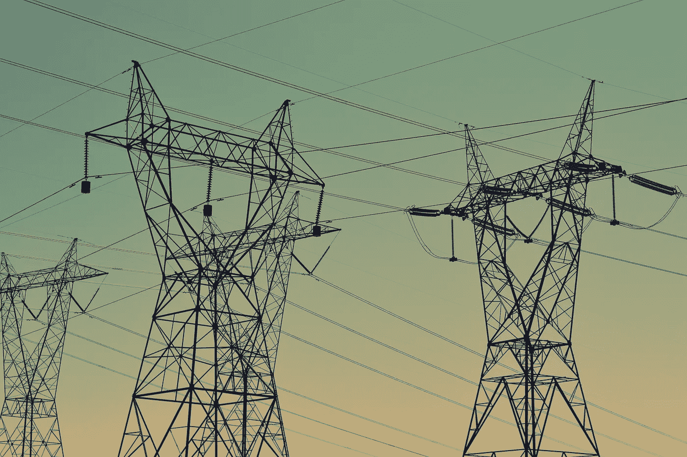
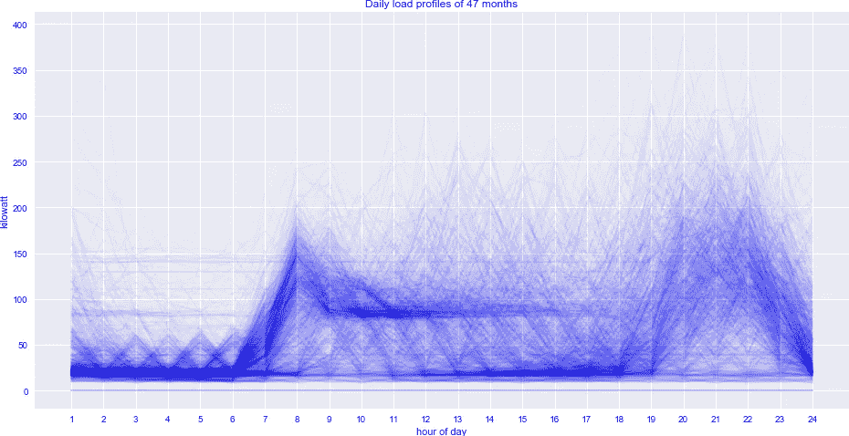
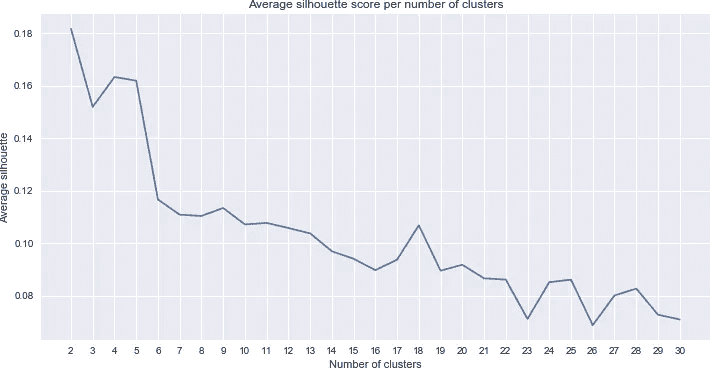
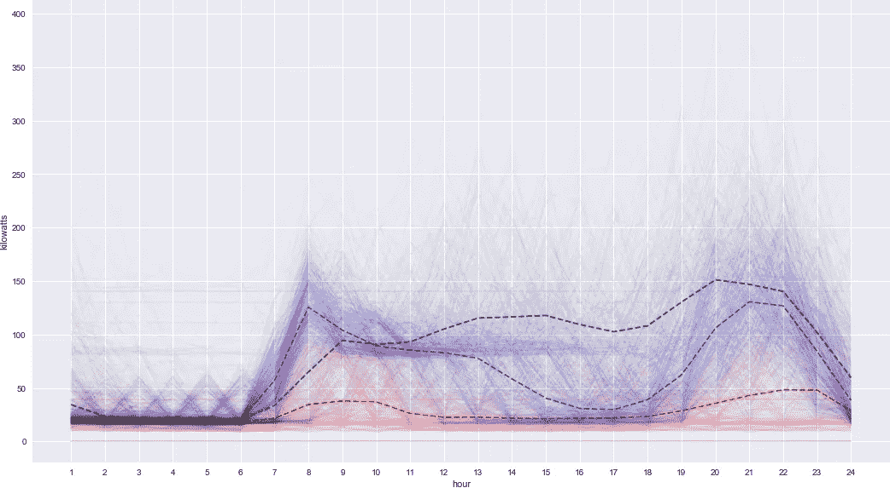

# 用 K-means 聚类用电曲线

> 原文：<https://towardsdatascience.com/clustering-electricity-profiles-with-k-means-42d6d0644d00?source=collection_archive---------6----------------------->

Photo by [Fré Sonneveld](https://unsplash.com/@fresonneveld?utm_source=unsplash&utm_medium=referral&utm_content=creditCopyText) on [Unsplash](https://unsplash.com/s/photos/electricity?utm_source=unsplash&utm_medium=referral&utm_content=creditCopyText)

机器学习在能源领域有广泛的应用。一个非常令人兴奋的是提取对电力消费行为的见解。个人或家庭一天中使用能量的方式也被称为“能量指纹”。

在本文中，我们将介绍如何使用 K-means 聚类算法来发现单个家庭的日常负载模式。

该数据集包含 2006 年 12 月至 2010 年 11 月(47 个月)期间收集的 2075259 个测量值。你可以在这里找到[。](https://archive.ics.uci.edu/ml/datasets/individual+household+electric+power+consumption)

# 首先，让我们准备好数据

上面的图显示了 1456 天的所有日负荷曲线。通过观察较暗的区域(这里集中了更多的曲线)，我们可以看到两种清晰的消费行为模式。

# K-均值聚类

K-means 是一种[无监督机器学习](https://en.wikipedia.org/wiki/Unsupervised_learning)算法，其中必须事先定义聚类的数量。这就留下了选择多少个集群的问题。

解决这一问题的常用方法是使用[轮廓值](https://en.wikipedia.org/wiki/Silhouette_(clustering))。这是一个衡量点与自己的聚类相比与其他聚类相似程度的指标。其范围从-1 到 1，其中高值表示某个点与其所属的聚类匹配良好。

我们对所有负载曲线的轮廓取平均值，以便对算法的执行情况有一个全面的了解。

我用一系列的集群数(从 2 到 30)进行实验。重要的是在相同的范围内缩放每个周期，以便能量负载的大小不会干扰群集的选择。

最大平均轮廓出现在只有 2 个聚类时，但是为了更好地说明这个例子，我选择 3 个。让我们看看它们是什么样子:

正如我们所看到的，K-means 发现了三组独特的负载曲线。

绿色集群包含在整个下午保持稳定能源使用的负载。也许这些天居住者呆在家里，像周末和特殊的日期。

蓝色集群在早上有一个高峰，在下午使用量下降，在晚上再次达到高峰。这种模式似乎适合居住者上班和/或上学的工作日。

最后，红色聚类显示全天消费量较低的日子。也许是假日里只有几个电器开着的情况？

# 用 t-SNE 验证结果

我们可以验证聚类算法结果的一种方法是使用一种形式的[维度缩减](https://en.wikipedia.org/wiki/Dimensionality_reduction)并在 2D 平面中绘制点。然后，我们可以根据它们所属的集群给它们上色。

为此，一种流行的算法叫做 [t-SNE](https://en.wikipedia.org/wiki/T-distributed_stochastic_neighbor_embedding) 。算法的内部工作超出了本文的范围，但是可以在这里找到一个很好的解释。

需要记住的是，SNE 霸王龙对 K-means 发现的聚类一无所知。

在上面的图中，每个点代表一个每日的负载曲线。它们从 24 维减少到 2 维。理论上，高维空间中的点之间的距离保持不变，因此相互靠近的点指的是相似的载荷分布。大多数蓝色、红色和绿色点相互靠近的事实表明聚类效果良好。

# 结论和进一步的工作

本文提出了一种利用 K-means 算法发现用电量聚类的方法。我们使用剪影分数来寻找最佳的聚类数，并使用 t-SNE 来验证结果。

至于下一步，我们可以尝试不同的聚类算法。Scikit-learn 有很多值得探索的地方。一些不需要先验地选择聚类的数量。

另一个有趣的应用是将这个模型扩展到不同的家庭，并找到家庭中相似能源消耗行为的聚类。

我希望你喜欢它！如果您有任何意见和/或建议，请随时联系我。