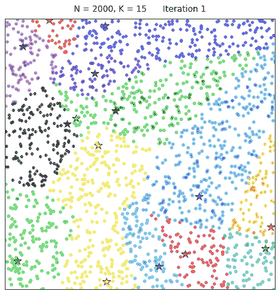
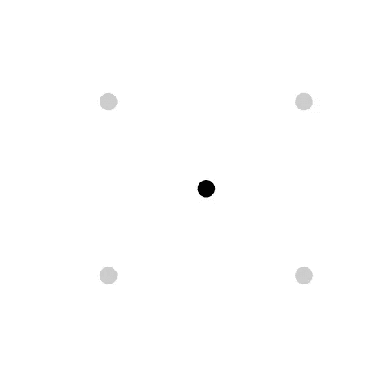
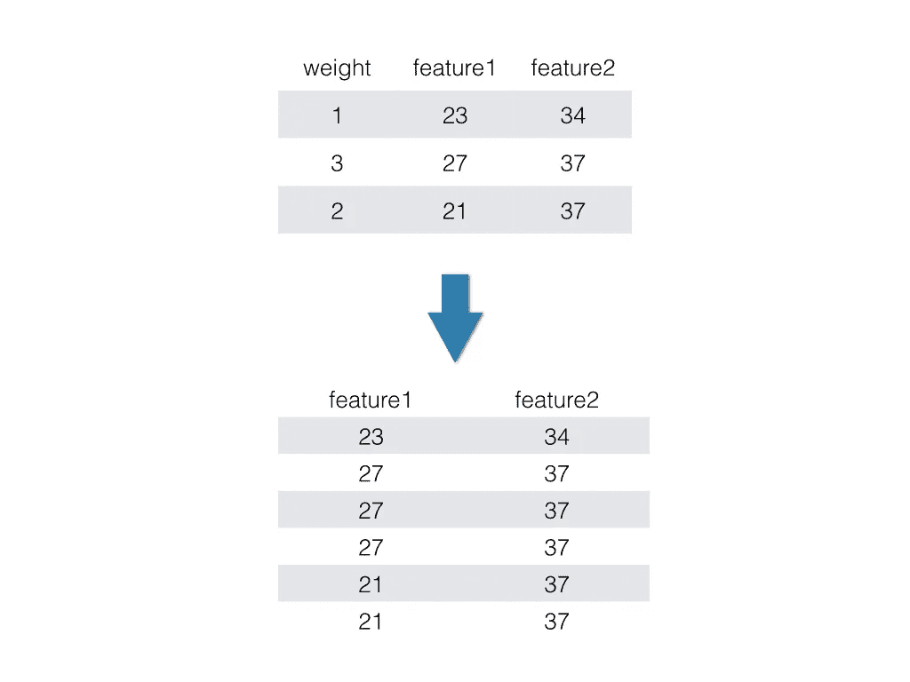
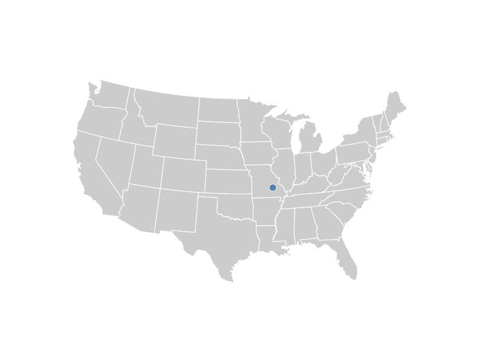
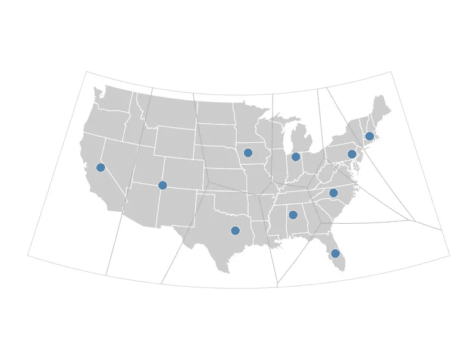
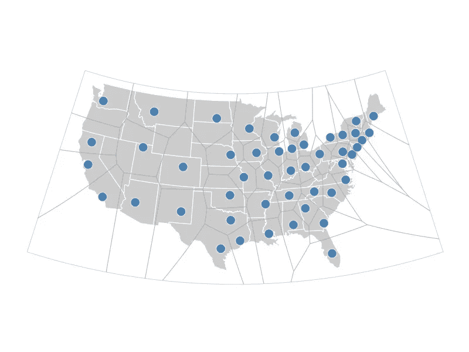

# 美国人口聚类:观察加权 k-均值

> 原文：<https://towardsdatascience.com/clustering-the-us-population-observation-weighted-k-means-f4d58b370002?source=collection_archive---------0----------------------->

感谢 Chris Decker 提供以下信息:

对于最近几年发现这个帖子的人: **scikit learn 在 2018 年 0.20.0 的 KMeans 中实现了一个“sample_weight”参数**。**再也不用自己卷了。**

———
在这篇文章中，我详细介绍了一种 k-means 聚类形式，其中权重与个体观察值相关联。

[k 均值聚类](https://en.wikipedia.org/wiki/K-means_clustering)近 60 年来一直是机器学习的主力。它简单、有效、直观。我喜欢它的原因之一是，你可以随着时间的推移绘制集群任务，并看到它学习。



From: [https://datasciencelab.wordpress.com/2013/12/12/clustering-with-k-means-in-python/](https://datasciencelab.wordpress.com/2013/12/12/clustering-with-k-means-in-python/)

但是，它的伸缩性不是特别好。在笔记本电脑上，你能聚集 10，000 个点吗？当然，没问题。一百万？也许吧，但是会很慢。一亿分？Fuhgeddaboutit！

假设我们想对美国人口进行聚类。为什么？我们可以设置 k=48，并根据当前的人口中心来确定较低的 48 个州的情况。或许，我们想在全国设立 k=1000 个配送中心。也许我们要设置 k = 1000 万个星巴克位置。

美国人口有 3 亿多人。你如何使用 k-means 对它们进行聚类？忽略并行 k-means，让我们限制它在一台笔记本电脑上运行不到 3 分钟。想法？

你可以做的一件事是对数据进行采样；也就是说，用减少的、有希望是代表性的数据子集来运行。另一种方法是聚合数据，大大减少点的数量，但将每个点与每个聚合点代表的原始样本大小相关联。换句话说，对每一点进行加权。

我们可以从哪里获得这样的数据集？美国人口普查局。它们提供了一个非常方便的数据集，其中包含每个邮政编码的居民数量。美国大约有 43，000 个邮政编码，这个数字我们可以轻松地在笔记本电脑上聚集起来。想象一下，我们有一个由邮政编码、经纬度对(k-means 使用的 x-y 坐标)和该邮政编码中的居民数量(体重)组成的数据文件:

```
“zip”,”state”,”latitude”,”longitude”,”population”
“00601”,”PR”,18.180103,-66.74947,19143
“00602”,”PR”,18.363285,-67.18024,42042
.
.
.
99929,”AK”,56.409507,-132.33822,2424
99950,”AK”,55.875767,-131.46633,47
```

## 履行

当然，我们可以去 scikit-learn 或 R 或其他主要的机器学习库运行一些加权 k-means 算法。可惜不是。在一些库中有加权 k-means，但是它们不是我们想要的那种。它们不是为观察值而是为*特征*提供权重。

也就是说，使用特征权重，我们可以指定纬度应该比经度更影响质心。然而，我们想要指定*观察值*-权重，使得邮政编码=10012(一个密集的曼哈顿邮政编码)对质心的吸引力远远大于 59011(蒙大拿州一个广阔的低密度区域)。

核心思想非常直观。取(x，y)平面上的四个等权点，质心为(mean(x)，mean(y))。



如果我们应用权重，比如说 w=(13，7，4，4)，那么权重为 13 的点具有大得多的引力，应该会将聚类中心拉得更靠近它。加权质心现在是:(加权平均(x，w)，加权平均(y，w))


距离度量可以是我们通常的欧几里德距离。然而，当我们处理纬度-经度对时，正确的直线距离度量被称为 H [反正弦距离](https://en.wikipedia.org/wiki/Haversine_formula)，所以我们将使用它。

我无法在主要的库中找到实现。就连 stackoverflow 都让我失望了。[来自那里的一个建议](http://stackoverflow.com/questions/29506495/weighted-clustering-with-pycluster)是复制数据点。也就是说，如果加权数据如图所示(上图)，将会创建等效的未加权数据集(下图):



显然，这存在扩大数据规模的问题——这正是我们想要解决的问题——而且这只适用于小整数权重。

相反，我从 [stackexchange](http://codereview.stackexchange.com/questions/61598/k-mean-with-numpy) 中找到了一个不错的“常规”k-means 示例(感谢 [Gareth Rees](http://codereview.stackexchange.com/users/11728/gareth-rees) ！)我将其剥离并修改为观察加权:

```
import random
import numpy as np
import pandas as pd 
import scipy.spatial
from haversine import haversinedef distance(p1,p2):
  return haversine(p1[1:],p2[1:])def cluster_centroids(data, clusters, k):
  results=[]
  for i in range(k):
    results.append( np.average(data[clusters == i],weights=np.squeeze(np.asarray(data[clusters == i][:,0:1])),axis=0))
  return resultsdef kmeans(data, k=None, centroids=None, steps=20):
  # Forgy initialization method: choose k data points randomly.
  centroids = data[np.random.choice(np.arange(len(data)), k, False)] for _ in range(max(steps, 1)):
    sqdists = scipy.spatial.distance.cdist(centroids, data, lambda u, v: distance(u,v)**2) # Index of the closest centroid to each data point.
    clusters = np.argmin(sqdists, axis=0) new_centroids = cluster_centroids(data, clusters, k) if np.array_equal(new_centroids, centroids):
      break centroids = new_centroids

  return clusters, centroids#setup
data = pd.read_csv(“us_census.csv”)
data = data[~data[‘state’].isin([‘AK’,’HI’,’PR’])]
vals = data[[‘population’,’latitude’,’longitude’]].values
k = 3
random.seed(42)#run it
clusters,centroids=observation_weighted_kmeans(vals,k)#output
data[‘c’]=[int(c) for c in clusters]
lats = [centroids[i][1] for i in range(k)]
data[‘clat’] = data[‘c’].map(lambda x: lats[x])
longs = [centroids[i][2] for i in range(k)]
data[‘clong’] = data[‘c’].map(lambda x: longs[x])
data.to_csv("clustered_us_census.csv", index=False)
```

在旧的 Macbook Air 上，运行时间从 2 秒(k=1)到 160 秒(k=48)不等。

## 结果

美国人口的质心在哪里(即 k=1)？似乎是在密苏里州东南部。



对于 k=10，



最后，如果我们根据人口密度“重新划分”我们的州，那么我们会看到一个非常不同的画面。至少 5 个状态将被划分给邻居，并且 CA 和 TX 被分成四个或五个区域。



更新(2017–05–09):以下是完整源代码:[https://github . com/leaping llamas/medium _ posts/tree/master/observation _ weighted _ k means](https://github.com/leapingllamas/medium_posts/tree/master/observation_weighted_kmeans)

更新(2018–06–10):上面显示的中 post 代码存在一些 bug。然而，github 代码工作得很好。为了明确起见，请确保您正在运行:[https://github . com/leaping llamas/medium _ posts/blob/master/observation _ weighted _ k means/medium . py](https://github.com/leapingllamas/medium_posts/blob/master/observation_weighted_kmeans/medium.py)

P.S .如果您要对数据的某个子集进行聚类，比如说对一个州内的地区进行聚类，您需要确保调整质心初始化。也就是说，确保初始质心随机分布在感兴趣的区域内(而不是像示例代码中那样分布在更大的范围内),否则它们将在单个聚类中结束。