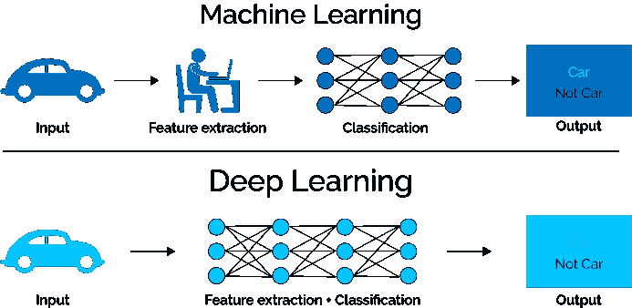
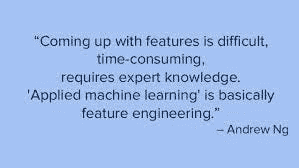
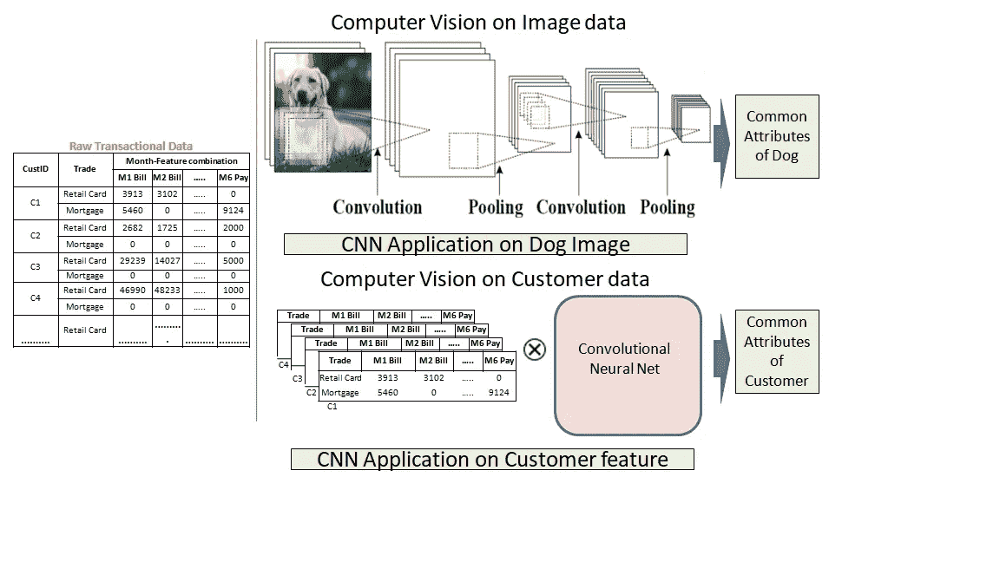
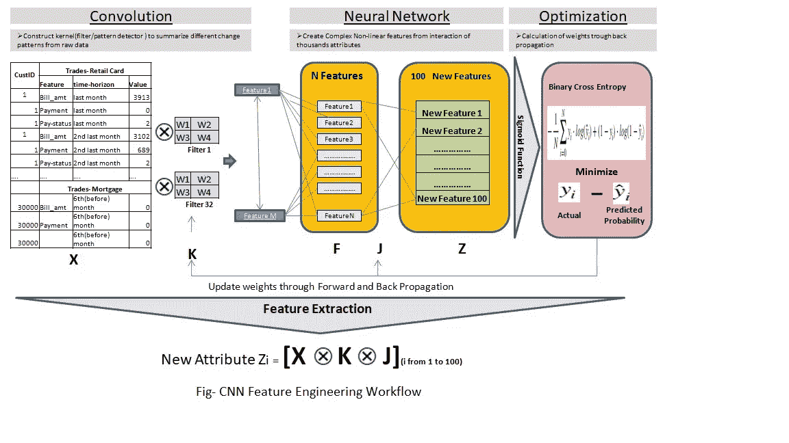
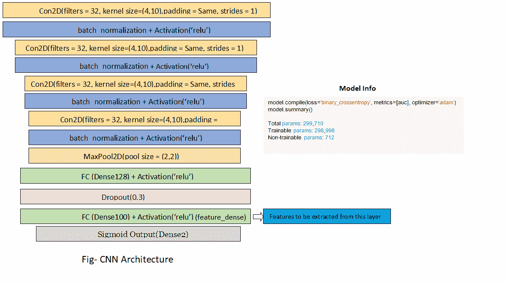
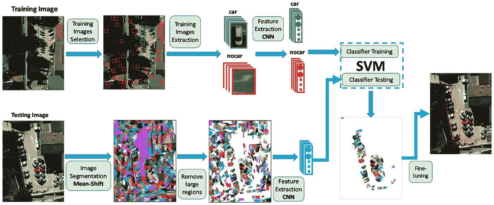

# CNN 在结构化数据中的应用——自动特征提取

> 原文：<https://towardsdatascience.com/cnn-application-on-structured-data-automated-feature-extraction-8f2cd28d9a7e?source=collection_archive---------4----------------------->



Deep Learning based Automated Feature Engineering

作者:2018 年 8 月 13 日作者:*酸溜溜的 Dey*

[T3【https://www.linkedin.com/in/sourish-dey-03420b1a/】T5](https://www.linkedin.com/in/sourish-dey-03420b1a/)

**重要特征工程:**

在我的[上一篇文章](https://www.linkedin.com/pulse/maximizing-lead-conversion-marketing-effectiveness-through-dey/)中，我讨论了从有限的特性中创造丰富特性的重要性。事实上，机器学习/深度学习模型的真正质量来自广泛的特征工程，而不是建模技术本身。虽然特定的机器学习技术可能最适合特定的业务问题/数据集，但功能是任何建模项目的通用驱动因素/关键组件。从可用数据集中提取尽可能多的信息对于创建有效的解决方案至关重要。



在这篇文章中，我将讨论一种在行业中不太流行的特征工程方法(至少对于结构化数据而言)，即使用 CNN(是的，你没听错，卷积神经网络)从结构化数据中生成特征，这是一种现代深度学习模型，广泛用于计算机视觉问题领域。我们还将在一个小数据上测试这种方法，以实际操作来创建特征——就好像它没有运行，它没有完成。

# 为什么要进行自动化特征工程:

传统上，分析师/数据科学家使用来自领域/业务知识的手动过程来创建特征。通常它被称为手工特征工程。虽然在数据科学中，我们不能否认领域知识的重要性，但这种类型的特征工程有一些缺点:

1.**繁琐:**手工特征工程可能是一个繁琐的过程。从父变量列表中可以创建多少个新特征？例如，从日期变量中，数据科学家可以创建 4 个新特征(月、年、小时和星期几)。然而，另一位数据科学家可以创建 5 个附加功能(周末指示器、节日指示器、X-mass 月指示器、季节性指数、一个月中的第几周等等)。与其他变量有关系/交互作用吗？因此，人工特征工程受到人类时间限制和想象力的限制:我们无法设想每一个可能有用的特征。

2.**人类偏见的影响:**通常，任何从事特定领域/建模项目的人，都会对某些特性产生深刻的偏见(尤其是如果这些特性是由分析师早先创建的话！)，不管它是否给模型增加了价值。

自动化特征工程的力量来了。这里可以创造的特征实际上是无限的，没有任何人为的偏见。此外，这捕获了特征之间所有可能的复杂非线性交互。当然，我们可以在任何时间点应用降维/特征选择技术来去除冗余/零重要性特征。

# 商业问题和 CNN 的相关性

这里的业务目标是根据信用卡所有人的支付状态、余额和过去几个年份(预测期的最后 6 个月)监控的支付历史来预测信用违约的概率。为了简单起见，让我们忽略滞后期(通常在客户信息提取和数据上传到系统进行分析之间存在滞后)。这个业务问题和数据准备的动机来自[https://medium . com/@ guai sang/credit-default-prediction-with-logistic-regression-b 5 BD 89 f 2799 f](https://medium.com/@guaisang/credit-default-prediction-with-logistic-regression-b5bd89f2799f)。

我没有使用跨部门的组成部分(如性别、教育等。)中，并且只保留时间序列变量(余额、支付历史等。)来介绍一下 CNN 这个商业问题。本文的目标是在这种结构化数据上概念化和实现 CNN，并使用 CNN 模型从这种数据中生成 100 个新特征。你可以在这里得到[的数据和全部代码。](https://github.com/nitsourish/CNN-automated-Feature-Extraction)

**关于数据:**

数据集使用二元变量“下个月的默认付款”(Yes = 1，No = 0)作为响应变量。该集合中有 18 个特征(不包括 ID ):

*   1:6 =X1 预测期最后一个月的还款情况；。。。；X6 =预测期前第 6 个月的还款情况。还款状态的衡量标准是:-1 =按时支付；1 =延迟一个月付款；2 =付款延迟两个月；。。。；8 =付款延迟八个月；9 =付款延迟 9 个月及以上。0 表示没有交易
*   X7 =参考时间范围最后一个月的账单金额；….X12 =参考时间范围之前第 6 个月的账单金额；
*   X13 =参考时间范围最后一个月的账单金额；….X18 =参考时间框架前第 6 个月的支付金额；

# CNN 格式的数据表示:

深度学习方法，特别是 CNN，已经在基于图像的数据领域取得了很多成功，其中数据在规则的像素网格中提供了清晰的结构化拓扑。虽然关于卷积神经网络(CNN，或 ConvNet)的详细讨论超出了本文的范围，但让我们来看看是什么让 CNN 如此受欢迎？

深度学习方法，特别是 CNN，已经在基于图像的数据领域取得了很多成功，其中数据在规则的像素网格中提供了清晰的结构化拓扑。虽然关于 **CNN** 或 **ConvNet** 的详细讨论超出了本文的范围，但是让我们来看看是什么让 CNN 如此受欢迎？

**缩减参数(参数共享):**在卷积运算(层)时，每个输出值(图中卷积特征)不需要连接到前一层(图中图像)的每个神经元，只需要连接到当前应用卷积核的那些被称为*感受野*的神经元。卷积层的这种特性称为**局部连通性**。同样，相同的权重应用于卷积，直到参数的下一次更新。卷积层的这种特性称为**参数共享**。与通常的 ANN(人工神经网络)结构相比，这些大大减少了所需的参数数量，在 ANN 结构中，每一对输入/输出神经元之间都有一个连接。


**移位/平移方差**:表示当输入移位时，输出也移位，否则保持不变。具体到一幅图像，你可以把一个物体识别为一个物体，即使它的外观*以某种方式变化*。

因此，简而言之，要对任何数据应用 CNN，需要以某种方式准备数据，以便存在局部模式，并且相同的局部模式在任何地方都是相关的。具体到我们的数据，我们有时间序列的事件范围(平衡，支付等。)对于单个客户，这使得数据充满了她本地的模式，因此这些参数可以在客户之间共享。我们只需要准备适合馈入个人客户的 CNN 特征矩阵的数据，与 d * w * n 的图像帧矩阵相同(d、w 和 n 是图像帧的深度、宽度和通道号)。

详细说明我们是否有 m 个特征的 N 个客户(这里是余额/付款等。)跨越 t 个时间范围(此处为第 1 个月、第 2 个月等。)对于 p 不同的交易(交易是不同的信用额度，如零售卡、抵押贷款等。).因此，单个客户的 m 个特征、t 个时间范围和 p 个交易类似于图像特征阵列的宽度、深度和通道数。准确地说，对于我们的数据，每个客户的维度将是 m * t * p，整个数据的维度将是 N*m*t*p。现在，这使得原始结构化数据成为图像帧类型的数据，非常适合应用 CNN 通过卷积运算提取客户间复杂的非线性局部模式。



# 数据准备:

原始数据集由一张贸易-零售卡组成。为了使它更相关和更具挑战性，我为一个额外的交易——抵押贷款创建了虚拟数据集(将目标变量状态标记为原始数据)。数据比零售卡数据稀疏，值可能不是 100%符合逻辑。最终数据集( [CreditDefault.csv](https://github.com/nitsourish/CNN-automated-Feature-Extraction/blob/master/CreditDefault.csv) )保存在[这里](https://github.com/nitsourish/CNN-automated-Feature-Extraction)。

因此，我们有 30k 个不同的客户 id 和总共 60k 个观察值，前 30k 个观察值是零售卡的，接下来 30k 个是抵押贷款的。

包含数据准备代码的详细解决方案在[https://github . com/nitsourish/CNN-automated-Feature-Extraction/blob/master/CNN _ Feature _ Extraction . ipynb](https://github.com/nitsourish/CNN-automated-Feature-Extraction/blob/master/CNN_feature_extraction.ipynb)。这是这个问题的棘手部分是准备格式(像图像格式)的数据，以便我们可以应用 CNN。准确地说，对于我们的数据，每个客户的维度将是 3(特征数量)* *6(时间范围)** 2(交易)，并且将有 30000 个该维度的框架。因此，对于整个数据，它将是一个 30000 * *3(宽度)** 6(深度)* 2(通道数)的数组。所以这些数据对于训练一个卷积网络来说是完美的。



Pipeline- CNN Feature Extraction

准备好特定于渠道的数据后，我们可以看到维度:

```
shape of channel1(retail)data: (30000, 3, 6, 1)
shape of channel2(mortgage)data: (30000, 3, 6, 1)
```

在合并这两个阵列之后，数据适合于馈入 CNN 作为输入体，以提取具有非线性交互的复杂特征。

```
shape of input volume(layer)data: (30000, 3, 6, 2)
```

现在数据看起来像图像帧数据图像像数据(体积 3*6*2 的 30000 个图像帧)。现在，我们需要以一种热编码格式将目标变量(下个月的默认付款)映射到客户 ID。

```
X = np.concatenate((retail, mort),axis=3)Y = event_id[['default payment next month']].valuesY = to_categorical(Y,2)
In our data we have payment default rate is: 28.402671 percent
```

在数据中，我们有 28.40%的付款 _ 违约率。虽然事件发生率不是 50%，但我们可以说这是一个相当平衡的数据。所以不需要做任何重量校正

# CNN 的特征提取

为了从 CNN 模型中提取特征，首先我们需要用最后的 sigmoid/logistic 密集层(这里是维度 2) w.r.t .目标变量来训练 CNN 网络。训练网络的目标是通过多次向前和向后迭代来识别网络的正确权重，最终尝试最小化二进制交叉熵(误分类成本)。这里我将使用 keras 框架，后端为 TensorFlow(tf)。对于我们的业务问题，AUC 是评估指标，我们将通过最大化每个时期的 AUC 值来进行优化(Keras 没有默认的 AUC 指标。但是，我们可以利用 tf 为 AUC 创建定制的评估函数。)

# CNN 架构

在到达最后一个 sigmoid 输出层之前，我们用 4 个 conv 层(conv +激活+池化(可选))和 2 个 FC(全连接层)构建了以下 CNN。



我们利用早期停止来训练 epochs = 100 的模型，以防止过度拟合。使用我的 NVIDIA GTX GeForce 1060 GPU(val _ AUC = 0.8317)进行训练用时不到 10 分钟。

**特征提取方法**

现在，通过使用预训练的模型，我们可以直接将这些权重应用于数据，去除最后的 sigmoid/logistic 层(在这个问题中，直到 100 维的密集层)。我们可以用这一点来计算任何新数据的相同商业问题的这些特征。我们只需要前馈网络，它将直接映射最终权重来计算某个中间层的要素，而无需再次构建网络。这是一种迁移学习。基于我们对特征数量的要求，我们可以在任何具有期望维度的中间密集层提取特征。对于这个问题，我们将使用一个中间模型来提取特征，直到 CNN 的“特征密集”层。

```
*#Preparing Indermediate model-removing last sigmoid layer*
intermediate_layer_model = Model(inputs=model.input,outputs=model.get_layer('feature_dense').output)
intermediate_layer_model.summary()
```

*输出层的维度是 100，所以如果我们预测用这个网络对一个新的数据用同样的输入维度，我们可以创建 100 个新的复杂特征。*

```
*#predict to get featured data*
feauture_engg_data = intermediate_layer_model.predict(X)
feauture_engg_data = pd.DataFrame(feauture_engg_data)
print('feauture_engg_data shape:', feauture_engg_data.shape)
feauture_engg_data shape: (30000, 100)
```

*   我们成功地捕捉了原始变量之间的 100 个复杂的相互作用。

# 对 feauture _ engg _ data 的进一步探讨

让我们偷偷看看这些特性是否有价值。尽管有一些更好的方法，但为了简单起见，让我们捕捉这些新特性与目标变量“下个月的违约付款”之间的一些二元关系。虽然对于分类目标变量相关性不是 100%正确的方法，但我们将计算所有新值与目标变量的相关性，作为变量的近似值，这对最终模型可能很重要。

```
*#Sorting correlation values in decsending order*
new_corrs = sorted(new_corrs, key = lambda x: abs(x[1]), reverse = True)
*#Let's see top 10 correlation values*
new_corrs[:10] 
[('PAY_1', 0.32479372847862253),
 ('PAY_2', 0.26355120167216467),
 ('PAY_3', 0.2352525137249163),
 ('feat_78', -0.22173805212223915),
 ('PAY_4', 0.21661363684242424),
 ('PAY_5', 0.20414891387616674),
 ('feat_86', -0.20047655459374053),
 ('feat_6', -0.19189993720885604),
 ('PAY_6', 0.1868663616535449),
 ('feat_3', -0.17394080015462873)]
```

我们可以看到 4 个新创建的变量(feat_78，feat_86，feat_6，feat_3)在与“下个月违约付款”的相关性(伪)方面排名前 10。虽然在此基础上没有什么具体的可以说这些变量的预测强度，但至少这些变量值得进一步研究。

我们还可以根据绝对幅度相关性来查看最高相关变量的 KDE(核密度估计)图。


# 强调 CNN 用于特征提取

现在关键的问题是为什么 CNN/深度学习方法只用于特征提取。为什么不用它作为分类器呢？有两个主要原因:

**局部模式**:我们在这个商业问题中使用的数据(适用于我们使用结构化数据的大多数场景)，也包括横截面(静态)变量，在这里我们不会发现任何局部模式。所以我们不能用 CNN 对整个数据做分类器。当然，对于具有平移/平移不变性的数据，我们可以使用 CNN 作为最终分类器。

**基础设施挑战**:构建大规模工业数据并投入生产需要大量基础设施支持(GPU、AWS 等)。)，这可能并不适用于每个组织。

**模型运行中的延迟**:即使有适当的基础设施，相当复杂的深度学习模型的前向传播也要比 XGBoost、RF、SVM 等高效分类器花费更长的时间。事实上，在某些需要超快的实时预测的应用中，最好的解决方案是使用自动技术(如 CNN 特征提取)提取特征，然后添加相对简单的分类器。



Automated Feature Extraction + Classifier

**监管挑战**:尽管对机器学习/人工智能有着巨大的关注，但在实施预测模型之前，特别是进入银行/保险/金融领域的组织必须通过内部/外部监管流程，这可能需要艰苦的劝说才能在生产系统中使用这些最新技术。相反，如果最终分类器是传统模型，则从建模方法的角度来看，可能不存在挑战。

## 改进和前进的道路:

作为现代[人工智能](https://en.wikipedia.org/wiki/Artificial_Intelligence)和[深度学习](https://en.wikipedia.org/wiki/Deep_Learning)大师，吴恩达准确地说，“……应用机器学习基本上是特征工程。”创建有意义的特征空间的重要性不能被夸大，并且自动化特征工程技术旨在帮助数据科学家解决特征创建的问题，从原始数据集无缝地构建成百上千的新特征。但是，目的不是取代数据科学家。相反，这将使她能够专注于机器学习管道中其他有价值的部分，如功能选择、探索新方法、将健壮的模型交付到生产中等。我们刚刚讨论了自动化特征工程的一种潜在方法。当然还有一些其他类似的技术。我喜欢在未来探索这些。同时渴望听到 CNN 在结构化数据(关系数据库)上的其他应用，在任何其他商业问题上的应用。