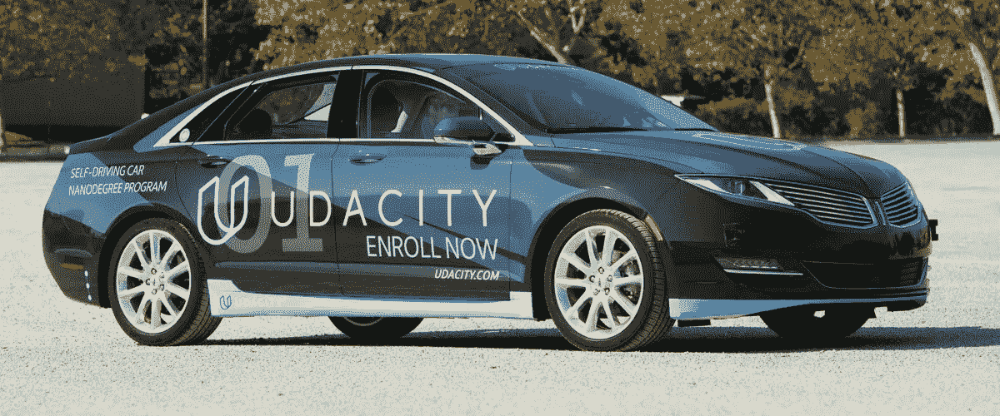
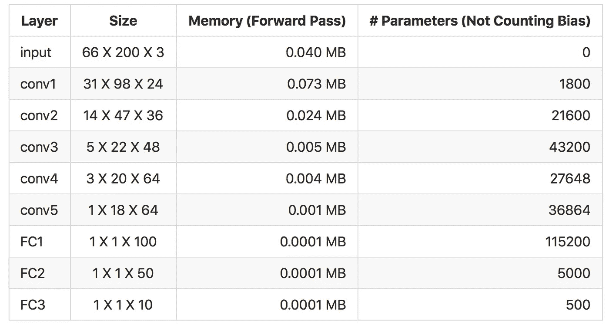

# Udacity 驾驶模拟器中的 CNN 模型比较

> 原文：<https://towardsdatascience.com/cnn-model-comparison-in-udacitys-driving-simulator-9261de09b45?source=collection_archive---------0----------------------->



对于 Udacity 的自动驾驶汽车 Nanodegree 项目 3，他们创建了一个驾驶模拟器，可用于训练和测试自动驾驶模型。我使用模拟器中车辆的前向图像和转向角度，训练并比较了两个架构差异很大的卷积神经网络(CNN)模型。结果表明，对于这种类型的任务，CNN 架构的选择不如所使用的数据和增强技术重要。在结果中可以看到模拟器中模型的并排视频。

# 方法

我对这个项目的一般方法是使用 Udacity 提供的训练数据和尽可能多的必要的数据增强技术来产生可以在模拟器中成功绕过不同轨道的模型。我尝试了两种不同的 CNN 模型:第一种是他们论文中公认的 NVIDIA 模型:

[https://images . NVIDIA . com/content/tegra/automotive/images/2016/solutions/pdf/end-to-end-dl-using-px . pdf](https://images.nvidia.com/content/tegra/automotive/images/2016/solutions/pdf/end-to-end-dl-using-px.pdf)

第二个是我为 Udacity 的开源挑战#2“使用深度学习预测转向角度”开发的类似模型:

[https://github . com/Chris gundling/自驾车/树/主/转向模型/社区模型/cg23](https://github.com/chrisgundling/self-driving-car/tree/master/steering-models/community-models/cg23)

这些模型非常不同，因为 NVIDIA 只使用了大约 25 万个参数，而我尝试的原始 VGG 风格模型有近 3400 万个参数。

我试验了各种数据预处理技术、7 种不同的数据扩充方法，并改变了我测试的两个模型中每一个的压差。最后我发现，虽然 VGG 风格的模型驾驶稍微平稳，但需要更多的超参数调整。NVIDIA 的架构在推广到测试轨道(Track2)方面做得更好，付出的努力更少。最终的 NVIDIA 模型没有使用 dropout，并且能够在轨道 1 和 2 上行驶。我在 CPU 上的模拟器中测试时，遇到了较大的 VGG 风格模型的转向延迟问题。我最终将这个模型的图像尺寸从 128X128X3 缩小到 64X64X3，并将全连接层的尺寸减半。这使得 VGG 风格的模型可以在赛道 1 和 2 上行驶。

# 承认

我要感谢 Vivek Yadav 在这个项目上的精彩帖子。实现的一些数据增强技术是他在这篇文章中描述的想法:

[https://chatbotslife . com/using-augmentation-to-mimic-human-driving-496 b 569760 a9 # . yget 03 t5g](https://chatbotslife.com/using-augmentation-to-mimic-human-driving-496b569760a9#.yget03t5g)

我还要感谢 Udacity 的 Yousuf Fauzan 对旋转透视变换的实现。我在“线外”活动中遇到了优素福，他在 Udacity 的挑战#2 中运用了这一技术。该脚本使用旋转矩阵对图像进行不同程度的透视变换。

# 数据探索

Udacity 提供的数据由 8036 个中心、左侧和右侧组成。jpg 图片，总数据量为 24109 个例子(只有 323 MB 的数据！).这些训练图像都来自轨道 1。这些图像宽 320×高 160。下面的示例显示了从汽车上以一个时间步长拍摄的左/中/右图像。


Left, Center and Right Camera Images Respectively from the Simulator Vehicle on Track 1

Udacity 数据集驾驶日志中提供的转向角绘制如下。转向角以 1/25 的因子进行预缩放，因此它们在-1 和 1 之间(模拟器产生的最大/最小转向角为+/- 25 度)。


Udacity Provided Training Data

我知道模型训练需要一个评估指标，所以我分离出 480 个中心摄像机图像和它们对应的转向角度，用于验证集。这是一个比我通常使用的验证集更小的验证集，但是我不想放弃太多的训练数据。我考虑实现 k-fold 交叉验证来开发一个更好的验证误差度量，但是我发现单个验证集与实际驾驶能力相当一致。我没有使用专门的“测试集”来计算均方根误差，而是将第 2 轨的性能作为我的测试集。

# **数据预处理**

我密切关注了关于收集培训数据的 Slack 的讨论。似乎很多人很难只用他们的电脑键盘来收集“平稳”的驾驶数据。Udacity 的数据在一定程度上解决了这个问题，但基于使用 Udacity 挑战#2 中真实人类转向数据的经验，所提供的模拟器转向数据仍然看起来更像是阶跃。

**指数平滑**

我通过对驾驶训练数据应用指数平滑来解决这个问题。指数平滑(布朗的方法)有助于产生更平滑的转向过渡，但也会截断和移动数据。我应用了一个缩放比例来恢复一些转向幅度，并将数据移动了几个时间步长，这样转向就不会被延迟。对于前 1200 个训练示例，可以在下面看到指数平滑的结果。


Exponential Smoothing of Udacity Steering Data

**正常化**

我使用等式(x-128)/128 将所有图像像素值标准化。这会将值规范化为介于-1 和 1 之间。我这样做是为了训练数据、验证数据，并在模拟器驾驶脚本中实现它来测试模型。

**裁剪**

在增强后，我从每张图像中剪掉了底部的 20 个像素和顶部的 40 个像素。这从图像中移除了汽车的前部和地平线以上的大部分天空。

**调整规模**

对于 NVIDIA 型号，我与他们的方法保持一致，使用高度为 66 像素、宽度为 200 像素的图像。对于 VGG 风格的模型，我使用了 64 高 64 宽的图片来缩小来自 Udacity 挑战#2 的原始模型。

# **数据增强**

使用了七种不同的增强技术来增加模型在训练期间可以看到的图像数量。这大大降低了模型过度拟合数据的趋势。

增量的另一个主要好处是它们可以模拟恢复。视点变换、图像移位和使用左/右图像都添加了模拟汽车恢复到中心的训练数据，而实际上不必收集任何恢复数据。使用定制的生成器/产量方法在运行中执行扩增。实施的数据扩充技术如下:

1.  ***透视/视点变换*** —与 NVIDIA 论文中描述的类似，旋转透视变换应用于图像。我必须对透视变换的转向角度调整做一些调整，因为我发现一对一的透视变换角度对转向角度调整太大了。我决定在-80 到 80 度之间均匀地旋转图像透视。然后，我将视角除以 200，以调整转向角度。这提供了+/- 0.4 单位或 10 度的最大/最小转向角调节。
2.  ***图像翻转*** —由于训练数据中的左转弯和右转弯不均匀，因此图像翻转对于模型泛化到轨迹 2 非常重要。当图像翻转时，我也翻转了转向角的符号。
3.  ***左/右摄像机图像*** —我使用了来自汽车的左/右摄像机图像，这立即使训练数据的大小增加了三倍。在仔细检查左/右图像并寻找中心图像的共同特征后，我估计左/右图像从中心摄像机水平偏移了大约 60 个像素。基于这些信息，我为这些左/右图像选择了+/- 0.25 单位或+/- 6.25 度的转向角校正。
4.  **—我对图像进行了水平和垂直移动。我的最大/最小水平和垂直位移是每个方向 40 像素。我在模型训练时调整了这个值。考虑到我估计左/右图像会偏移 60 个像素，我对最大水平偏移应用了稍微小一点的转向角校正。垂直移动没有转向角校正。**
5.  *****图像亮度*** —我通过转换到 HSV 色彩空间和将 V 像素值从 0.5 缩放到 1.1 来调整图像的亮度。这主要是为了帮助推广到轨迹 2，那里的图像通常更暗。**
6.  *****图像模糊*** —我不确定这种技术对模拟器有多大用处，但这种技术应该有助于模型在使用更多“真实世界”类型的数据时进行归纳，这些数据有时会出现模糊。我使用了可变高斯平滑来模糊图像。**
7.  *****图像旋转****——*与透视变换不同，我对图像进行了小旋转，以模拟相机的抖动。同样，不确定这对模拟器有多大用处，但对自动驾驶汽车上的真实摄像头会有用。**

**对于视点变换、图像偏移和左/右图像，我还尝试实现了基于速度的转向角校正。我的直觉是，在更高的速度下，转向校正应该更小或更平缓。我惊讶地发现，我不能让这个工作，以及有一个恒定的转向角校正。随着进一步的调整和对左/右相机图像位置的更好的了解，我认为这个方法会起作用。**

**基于速度的转向调整是通过定义汽车返回中心的 2 秒响应时间来实现的。随着车速的增加，在 2 秒钟内返回中心所需的转向角减小。下图显示了转向角校正的计算方法:**

****

**Speed Based Steering Adjustment**

# **数据生成程序**

**所实现的数据生成器在左/中/右图像之间随机选择，并且还随机选择要应用的增强技术。我发现仅提供增强的训练数据不如用非增强的原始图像和增强的图像的组合来训练模型有效。**

**首先用较大的转弯训练模型，然后让较小转弯的数据慢慢漏入训练中。这个想法直接归功于其他几个在 Medium 上发布这个想法的学生。如果该模型最初是用低转向角训练的，它将偏向于更直的驾驶，我发现它在最尖锐的弯道中表现不佳。使用数据生成器，下图显示了数据生成器在训练运行期间为前 30 个训练示例生成的图像和增强选项。这些图像已经被裁剪和调整大小。图像标题如下所示:**

*   **ang:图像的转向角度标签**
*   **凸轮:相机选择(左/中/右)**
*   **8 月:1 是不增加，2 是增加**
*   **opt:数据扩充选项为: *1。翻转、抖动、模糊、亮度*、 *2。移动图像和 3。旋转视点变换***

****

**Image Augmentation Examples**

# **模型设置和超级参数**

**我的目标是训练这两个模型中的每一个。NVIDIA type 和 2。具有尽可能多的相似超参数的 VGG 类型。我使用以下参数来训练这两个模型。**

*   **最大历元数— 8 (5 或 6 个历元的训练通常为 NVIDIA 提供最佳模型，而 VGG 风格只有 1-3 个历元)**
*   **每个时期的样本数— 23040**
*   **批量大小— 64**
*   **优化器—学习率为 1e-4 的 Adam**
*   **激活—VGG 风格的 Relu 和 NVIDIA 型号的 elu**

**在 Keras 中实现的 NVIDIA 模型如下所示:**

```
**# Layer 1x = Convolution2D(24, 5, 5, activation=’elu’, subsample=(2, 2), border_mode=’valid’, init=’he_normal’)(img_input)# Layer 2x = Convolution2D(36, 5, 5, activation=’elu’, subsample=(2, 2), border_mode=’valid’, init=’he_normal’)(x)# Layer 3x = Convolution2D(48, 5, 5, activation=’elu’, subsample=(2, 2), border_mode=’valid’, init=’he_normal’)(x)# Layer 4x = Convolution2D(64, 3, 3, activation=’elu’, subsample=(1, 1), border_mode=’valid’, init=’he_normal’)(x)# Layer 5x = Convolution2D(64, 3, 3, activation=’elu’, subsample=(1, 1), border_mode=’valid’, init=’he_normal’)(x)# Flatteny = Flatten()(x)# FC 1y = Dense(100, activation=’elu’, init=’he_normal’)(y)# FC 2y = Dense(50, activation=’elu’, init=’he_normal’)(y)# FC 3y = Dense(10, activation=’elu’, init=’he_normal’)(y)# Output Layery = Dense(1, init=’he_normal’)(y)model = Model(input=img_input, output=y)model.compile(optimizer=Adam(lr=1e-4), loss = ‘mse’)**
```

****模型建筑****

**这两个模型的模型架构如下所示。如简介中所述，这些模型的主要调整参数是压差。对于 NVIDIA 型号，令人有些惊讶的是，该型号在轨道 1 和 2 上都表现最佳，没有掉线。任何掉线都会导致赛车在弯道中转向不够有力。对于 VGG 型模型，最后一个 conv 层和全连接层中的一些丢失提高了性能。**

***NVIDIA 型号结构和参数***

****

**这使得每个图像向前传递 0.6 MB，向后传递 1.2 MB。使用 64 的批处理大小，在向后传递期间最大内存使用量将是 75 MB。**

***VGG 型号结构及参数***

****

**这使得每个图像向前传递 1.2 MB(约 0.3MB * 4 字节)，向后传递 2.4 MB。使用 64 的批处理大小，在向后传递期间最大内存使用量将是 150 MB。将结构和参数与 NVIDIA 的模型进行比较，在近 430 万个参数中，该模型的参数明显多于 NVIDIA 的。**

# **结果**

**以下视频显示了路线 1 和路线 2 的两种型号的并排比较。虽然 VGG 风格的车型似乎驾驶稍微顺畅，但英伟达的车型在赛道 2 上表现更好。我在使用 VGG 风格模型过度拟合轨道 1 时遇到了麻烦，驾驶行为高度依赖于模型训练的下降和时代数。**

****以 0.2 节气门开度在轨道 1 上行驶****

**Track 1 Driving — *NVIDIA Model on Left and VGG Style Model on Right***

****在 0.3 节气门开度的轨道 2 上行驶****

**Track 2 Driving — *NVIDIA Model on Left and VGG Style Model on Right***

# **结论**

**自从 Udacity 首次发布 Nanodegree Term 1 项目以来，我最期待的就是参与这个项目。由于在道路上收集高质量和高数量的真实世界数据存在困难，因此能够在模拟器中用看似无限的数据训练这些模型可能会在自动驾驶方面取得重大突破。正如在这个项目中所看到的，即使使用相对少量的数据和相当简单的 CNN 模型，车辆也能够成功地通过这两个过程。**

**我期待着继续这项工作，并一直致力于实施 RNN/LSTM 和强化学习方法来控制转向，油门和刹车。我也很好奇使用真实世界和模拟器数据的组合来训练这些模型，以了解如何在模拟器中训练的模型可以推广到真实世界，反之亦然。**

# **硬件/测试设置**

**我使用 Udacity 的 CarND AWS AMI 的修改版和 g 2.2x 大 GPU 来训练这些模型，并在我带 CPU 的 Macbook Pro 笔记本电脑上测试这些模型。模拟器被设置为“最快”的设置，屏幕分辨率为 640 X 480。**

# **密码**

**这个项目的所有代码都是用 Python 实现的，可以在我的 github 档案中找到:**

**【https://github.com/chrisgundling **