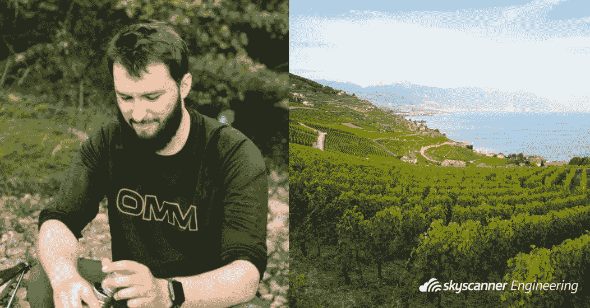
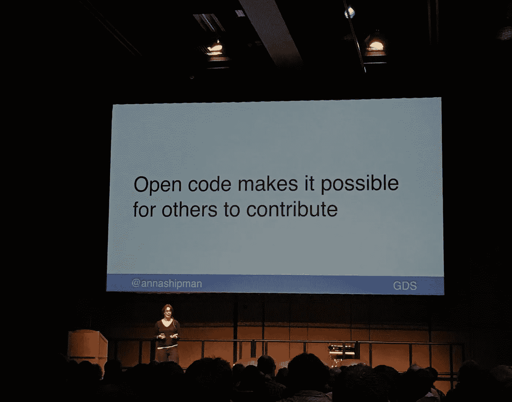

# 公开编码

> 原文：<https://towardsdatascience.com/coding-in-the-open-349e07d25898?source=collection_archive---------6----------------------->

## 2017 年图灵节上你应该从全栈工程中知道的 3 件事

Coding in the open

艾瑞克·阿特罗斯科

今年[图灵节](https://www.turingfest.com/)的工程赛道挤满了令人惊叹的演讲者，涵盖了广泛的主题，从英国政府如何免费提供他们的一些服务代码，如何在开源项目中做更好的贡献者，到云的发展方向以及它可以解决什么问题。

我想谈谈三个与开源项目、内部项目和软件开发相关的会议。

## 公开编码

这一天开始于[来自](https://www.turingfest.com/speakers/anna-shipman/)[政府数字服务](https://www.gov.uk/government/organisations/government-digital-service) (GDS)的安娜·希普曼分享她的故事，当用户报告一个问题时，从长达 18 个月的等待获得代码修复，到能够在不到一周的时间内发布用户贡献的代码修复。这是通过取得平台代码的所有权以及公开代码以使每个人都可以对其做出贡献的组合来实现的。由于默认为开源项目，可见性增加，这也意味着服务/代码可以在 GDS 的不同项目中重用。与任何足够大的公司一样，你会有不一定经常在一起工作的人和项目，但是他们都面临类似的问题，并且很可能会针对这些问题制定自己的解决方案。在许多情况下，重复的努力是一种浪费，通过公开代码，他们能够防止这样的情况经常发生。

在 [Skyscanner](https://www.skyscanner.net/) 我们鼓励内部对项目做出贡献，这样当你发现有些事情不太对劲，或者你看到你可以为之做出贡献的改进时，你就能够并被鼓励采取行动。通过遵循开源项目的原则，我们鼓励每个项目都有一个自述文件，包含入门步骤和投稿指南。通过降低其他人开始工作的门槛，我们增加了人们和团队之间的协作，这些人和团队通常不会在日常基础上相互交流。

Anna Shipman (GDS), Turing Fest 2017

演讲中提到的另一点是，通过公开代码，您可以获得新的反馈。这也导致人们更加关注并质疑他们是否愿意接受某些设计和实现决策，因为这些决策将会向更广泛的受众发布。

为了保持建设性的反馈流，并增加让遇到类似问题的其他人意识到您正在解决或已经解决了这个问题的机会，我们有专门设计的论坛来呈现、回顾、讨论和提供反馈。

## 贡献

开源也是接下来演讲的主题。Mike McQuaid 谈到了有效的开源交互。我们讨论了与您的操作系统交互的三种不同人群:

1.  用户
2.  贡献者
3.  保持器

我们讨论了每个群体的典型需求，以及人们如何在这些群体之间移动。我们讨论了围绕维护人员的部分职责引入过程如何能够为技术工作腾出时间。我们看了一些为[自制软件](https://brew.sh/)(迈克是维护者)管理和获取贡献的过程的例子，以及如何减少贡献的摩擦，无论是通过提交错误报告、功能请求还是实际的代码贡献。这是通过为如何恰当地提交错误报告提供清晰的步骤来实现的，自动化了贡献所需的一些令人困惑的(对于经验不足的用户)和耗时的步骤。OSS 项目的关键成分是社区，你希望你的社区积极参与并做出贡献。您的社区中的大多数人将是用户，您将有一些贡献者，维护者的百分比通常会更小。我相信 Mike 称之为追加销售。通过接触用户来吸引你的社区，让他们更多地参与进来，允许他们挠痒痒，并为修复他们发现的问题做出贡献——甚至改善他们已经想了一段时间的事情。

Mike McQuaid talked about effective open source interactions

和任何项目一样，不管是内部的还是其他的，你都会从处理用户反馈、特性请求和用户贡献的过程中受益。当开始一个新项目时，重要的是要考虑你创建的产品/服务/工具是否是你希望人们为之做出贡献的东西。也许这将是他们生产道路的一部分。如果是这样的话，你应该创建一个清晰的贡献指南以及一套规则，在项目生命周期的早期设定对贡献的期望。这样你就可以把最大的时间花在软件本身上，而不是(例如，当项目获得牵引力时)处理不断涌入的需要你宝贵注意力的请求。

这是我们想要做好的事情。我们有许多项目，合并请求源源不断地到来。在许多情况下都有很好的支持文档，而且投稿过程通常都经过了深思熟虑。但这并不意味着我们不能变得更好，无论是涉及架构的变化以确保迭代可以更快更容易地实现，还是改变团队处理外部请求的方式，同时照顾他们自己的 backlog。

在更个人的层面上，几年前我曾经嘲笑通过写文档、投稿指南和仔细考虑这些问题来开始一个项目的想法。我想从架构的角度解决一个问题，弄清楚实现将从哪里开始，以及什么是难点。我的现实检查是我的团队第一次继承了一个在生产中运行的服务——没有文档和指南，基本上除了远程访问操作基础设施和源代码什么都没有。当然，我们遇到了一些直接影响生产的问题，上周就需要解决了！所以我们需要问问以前的房主。问题是，最初负责编写服务的工程师已经在三年前离开了公司。

事情在发生，人们在移动，项目在易手，服务经常被遗忘，在后台运行，直到出现问题。问题不在于“是否”会出错，而在于“何时”会出错，因此重要的是要腾出时间来编写文档，并确保未来的项目移交是无痛和无缝的——而不是在项目结束时疯狂地匆忙或事后思考(因为让我们面对现实吧，如果在长期运行或延迟的项目结束时要删除一些东西，那肯定是文档)。

## 炉边谈话

当天的第三场会议是与[迈克尔·普赖尔](https://twitter.com/michaelpryor)(Fog Creek Software、Trello 和 Stack Overflow 的创始人)和[约翰·皮布尔斯](https://twitter.com/johnjpeebles)(爱丁堡创业公司[行政](https://www.getadministrate.com/)的首席执行官)的炉边聊天。作为一个每天与 Stack Overflow 和 Trello 打交道的人，我发现听一听参与创建这两家公司的人说些什么很有意思。

对话把我们带回到博客还不存在的时候，也没有一种简单的方法来为开发者分享想法和经验。虽然当时有一些公司关注这一点，但数量非常少。开发人员主要履行支持角色，这导致了不满——但最终也认识到事情可以(并且应该)以更好的方式完成。

就在那时，迈克尔和乔尔·斯波尔斯基决定创办自己的公司，并弄清楚怎样才能建立一家工程师们希望 T1 去工作的公司。聆听他们使用 Fog Creek 软件的历程、他们学到的经验、犯过的错误以及他们设法学到的东西，也是一次令人谦卑的经历。

我最喜欢的一句话是:

> "我们经历了十年的失败，建立了堆栈溢出."

人们往往倾向于认为那些已经取得很大成就的人并没有犯很多错误，他们只是第一次尝试就把事情做对了。那里躺着疯狂；很容易给自己施加巨大的、不必要的压力，消耗时间、理智和生产力。许多成功人士犯了错误，但仍然继续做着伟大的事情，那么为什么要陷在没有结果的事情上呢？我从这次演讲中得到的主要启示是，要预料到会犯错误，不要担心会犯错误，而是要从中吸取教训……下次做得更好，不管你在做什么。

## 那么……判决。

我参加了这两天的会议，参加了所有专题(战略、产品、工程和营销)的混合会议，很容易说这是一次精彩的会议，有强大的阵容和出色的演讲者。讨论的话题范围很广，这意味着每个人都有感兴趣和有价值的东西。

# 与我们合作

我们在 Skyscanner 以不同的方式做事，我们正在全球办事处寻找更多的工程团队成员。看看我们的 [Skyscanner 职位](https://www.skyscanner.net/jobs/)寻找更多空缺。

Team in Action

# 关于作者

我是 Irek Atroszko，是 Skyscanner 的软件工程师。我主要从事后端服务。工作之余，我的兴趣主要在于上好的咖啡、书籍、锋利的日本刀和定期的苏格兰徒步旅行。

Irek Atroszko, Skyscanner