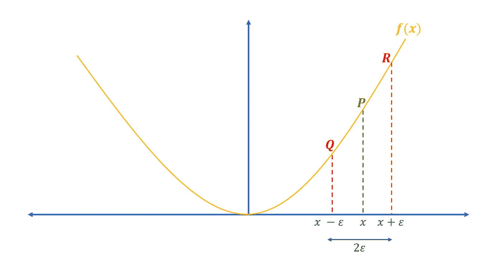

# 编码神经网络—梯度检验

> 原文：<https://towardsdatascience.com/coding-neural-network-gradient-checking-5222544ccc64?source=collection_archive---------4----------------------->


在之前的帖子[编码神经网络——前向传播和反向传播](/coding-neural-network-forward-propagation-and-backpropagtion-ccf8cf369f76)中，我们在`numpy`中实现了前向传播和反向传播。然而，从头开始实现反向传播通常更能减少错误。因此，在对训练数据运行神经网络之前，有必要检查我们的反向传播实现是否正确。在我们开始之前，让我们重温一下什么是反向传播:我们从最后一个节点开始，以相反的拓扑顺序遍历节点，计算成本相对于每条边的节点尾部的导数。换句话说，我们计算成本函数相对于所有参数的导数，即∂J/∂θ，其中θ表示模型的参数。

测试我们实现的方法是计算数值梯度，并与反向传播(分析)的梯度进行比较。有两种计算数值梯度方法:

*   右侧表格:


*   双面形式(见图 1):



**Figure 1:** Two-sided numerical gradients

近似导数的双侧形式比右侧形式更接近。让我们用下面的例子来说明，使用函数 *f(x) = x* ，在*对 x = 3* 求导。

*   分析导数:


*   双侧数值导数；


*   右手数值导数:


如上所述，解析导数和双边数值梯度之间的差异几乎为零；但是解析导数和右侧导数相差 0.01。因此，我们将使用双边ε方法来计算数值梯度。

此外，我们将标准化数值之间的差异。使用以下公式的梯度和分析梯度:如果差值≤ 10e-7，那么我们的实现是好的；否则，我们会在某处出错，不得不返回并重新访问反向传播代码。

以下是实施梯度检查所需的步骤:

1.  在计算数值梯度和分析梯度时，从训练数据中选择随机数量的示例来使用它。

*   不要使用训练数据中的所有示例，因为梯度检查非常慢。

2.初始化参数。

3.计算前向传播和交叉熵成本。

4.使用我们的反向传播实现来计算梯度。

5.使用双边ε方法计算数值梯度。

6.计算数值梯度和分析梯度之间的差异。

我们将使用我们在*“编码神经网络-前向传播和后向传播”*帖子中编写的函数来初始化参数，计算前向传播和后向传播以及交叉熵成本。

我们先导入数据。

```
# Loading packages
import sys
import h5py
import matplotlib.pyplot as plt
import numpy as np
from numpy.linalg import normimport seaborn as sns sys.path.append("../scripts/")
from coding_neural_network_from_scratch import (initialize_parameters, L_model_forward, L_model_backward, compute_cost)# Import the data
train_dataset = h5py.File("../data/train_catvnoncat.h5")
X_train = np.array(train_dataset["train_set_x"]).T
y_train = np.array(train_dataset["train_set_y"]).T
X_train = X_train.reshape(-1, 209)
y_train = y_train.reshape(-1, 209)X_train.shape, y_train.shape((12288, 209), (1, 209))
```

接下来，我们将编写帮助器函数，帮助将参数和梯度字典转换成向量，然后再将它们转换回字典。

```
def dictionary_to_vector(params_dict):
L = len(layers_dims)
parameters = {}
k = 0
for l in range(1, L):
# Create temp variable to store dimension used on each layer
w_dim = layers_dims[l] * layers_dims[l - 1]
b_dim = layers_dims[l]
# Create temp var to be used in slicing parameters vector
temp_dim = k + w_dim
# add parameters to the dictionary
parameters["W" + str(l)] = vector[ k:temp_dim].reshape(layers_dims[l], layers_dims[l - 1]) 
parameters["b" + str(l)] = vector[ temp_dim:temp_dim + b_dim].reshape(b_dim, 1)
k += w_dim + b_dim
return parametersdef gradients_to_vector(gradients):
# Get the number of indices for the gradients to iterate over valid_grads = [key for key in gradients.keys() if not key.startswith("dA")]
L = len(valid_grads)// 2
count = 0
# Iterate over all gradients and append them to new_grads list
for l in range(1, L + 1):
if count == 0:
new_grads = gradients["dW" + str(l)].reshape(-1, 1)
new_grads = np.concatenate((new_grads, gradients["db" + str(l)].reshape(-1, 1)))
else:
new_grads = np.concatenate((new_grads, gradients["dW" + str(l)].reshape(-1, 1)))
new_grads = np.concatenate( (new_grads, gradients["db" + str(l)].reshape(-1, 1)))
count += 1
return new_grads
```

最后，我们将编写梯度检查函数，它将计算解析梯度和数值梯度之间的差异，并告诉我们反向传播的实现是否正确。我们将随机选择一个例子来计算差异。

```
def forward_prop_cost(X, parameters, Y, hidden_layers_activation_fn="tanh"):
# Compute forward prop
AL, _ = L_model_forward(X, parameters, hidden_layers_activation_fn) # Compute cost
cost = compute_cost(AL, Y)
return cost def gradient_check( parameters, gradients, X, Y, layers_dims, epsilon=1e-7, hidden_layers_activation_fn="tanh"):
# Roll out parameters and gradients dictionaries
parameters_vector = dictionary_to_vector(parameters) gradients_vector = gradients_to_vector(gradients)
# Create vector of zeros to be used with epsilon
grads_approx = np.zeros_like(parameters_vector)
for i in range(len(parameters_vector)):
# Compute cost of theta + epsilon
theta_plus = np.copy(parameters_vector)
theta_plus[i] = theta_plus[i] + epsilon
j_plus = forward_prop_cost( X, vector_to_dictionary(theta_plus, layers_dims), Y, hidden_layers_activation_fn)
# Compute cost of theta - epsilon
theta_minus = np.copy(parameters_vector)
theta_minus[i] = theta_minus[i] - epsilon
j_minus = forward_prop_cost( X, vector_to_dictionary(theta_minus, layers_dims), Y, hidden_layers_activation_fn)
# Compute numerical gradients
grads_approx[i] = (j_plus - j_minus) / (2 * epsilon)# Compute the difference of numerical and analytical gradients numerator = norm(gradients_vector - grads_approx)
denominator = norm(grads_approx) + norm(gradients_vector)
difference = numerator / denominatorif difference > 10e-7:
print ("\033[31mThere is a mistake in back-propagation " +\ "implementation. The difference is: {}".format(difference))
else:
print ("\033[32mThere implementation of back-propagation is fine! "+\ "The difference is: {}".format(difference))return difference# Set up neural network architecture
layers_dims = [X_train.shape[0], 5, 5, 1]# Initialize parameters parameters = initialize_parameters(layers_dims)# Randomly selecting 1 example from training data
perms = np.random.permutation(X_train.shape[1])
index = perms[:1]# Compute forward propagation
AL, caches = L_model_forward(X_train[:, index], parameters, "tanh") # Compute analytical gradients
gradients = L_model_backward(AL, y_train[:, index], caches, "tanh") # Compute difference of numerical and analytical gradients difference = gradient_check(parameters, gradients, X_train[:, index], y_train[:, index], layers_dims)There implementation of back-propagation is fine! The difference is: 3.0220555297630148e-09
```

恭喜你！我们的实现是正确的:)

# 结论

以下是一些关键要点:

1.  双侧数值梯度比右侧形式更接近解析梯度。

2.因为梯度检查非常慢:

*   将它应用到一个或几个训练例子中。
*   在确定反向传播的实现是正确的之后，在训练神经网络时关闭它。

3.应用退出方法时，梯度检查不起作用。使用 keep-prob = 1 检查梯度检查，然后在训练神经网络时更改它。

4.ε= 10e-7 是用于分析梯度和数值梯度之差的常用值。如果差值小于 10e-7，则反向传播的实现是正确的。

5.感谢 Tensorflow 和 Pytorch 等*深度学习*框架，我们可能会发现自己很少实现反向传播，因为这样的框架为我们计算；然而，要成为一名优秀的深度学习实践者，了解幕后发生的事情是一个很好的实践。

创建这篇文章的源代码可以在[这里](http://(https://github.com/ImadDabbura/blog-posts/blob/master/notebooks/Coding-Neural-Network-Gradient-Checking.ipynb)找到。

*原载于 2018 年 4 月 8 日*[*imaddabbura . github . io*](https://imaddabbura.github.io/posts/coding-nn/gradient-checking/Coding-Neural-Network-Gradient-Checking.html)*。*