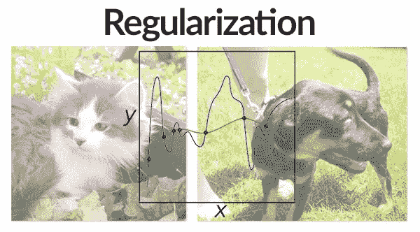
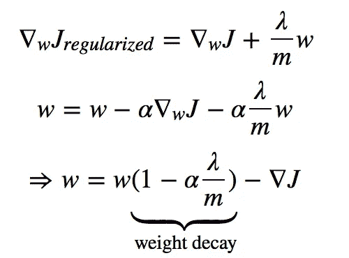
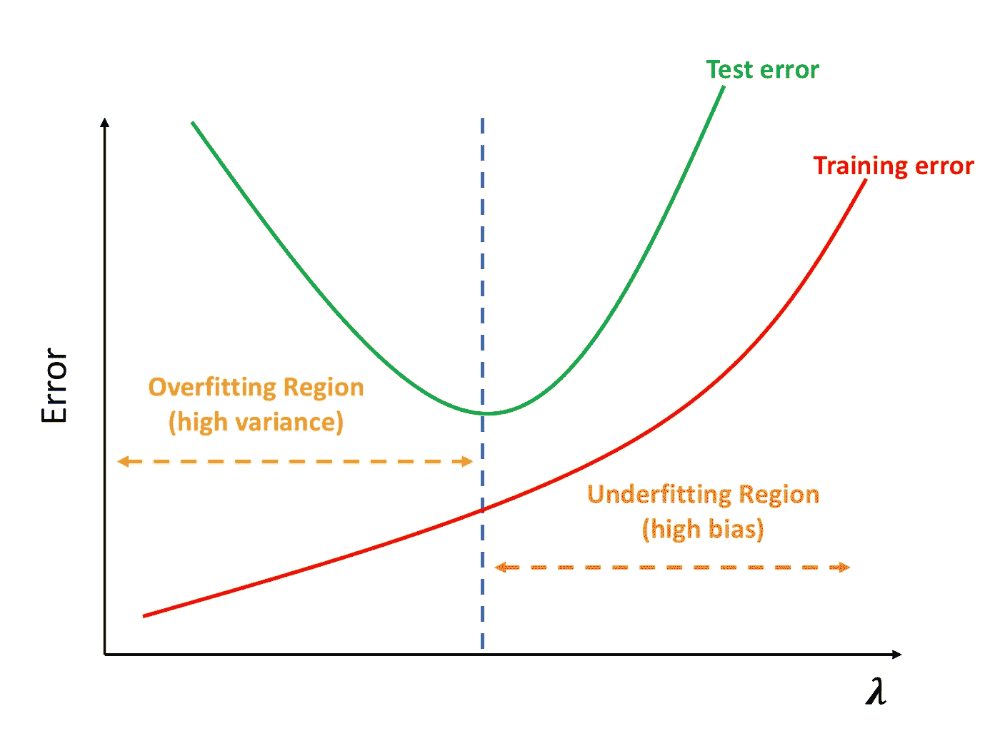
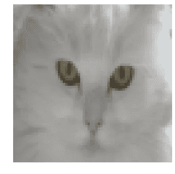
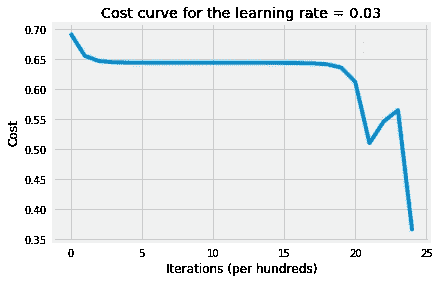
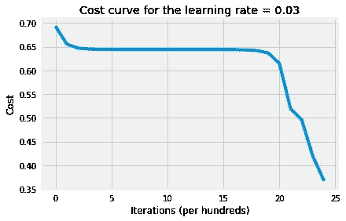

# 编码神经网络—正则化

> 原文：<https://towardsdatascience.com/coding-neural-network-regularization-43d26655982d?source=collection_archive---------3----------------------->



[Source](https://www.pyimagesearch.com/2016/09/19/understanding-regularization-for-image-classification-and-machine-learning/)

# 偏差-方差权衡

泛化(测试)误差是机器/深度学习中最重要的度量。它为我们提供了对未知数据的模型性能的估计。测试误差被分解为 3 个部分(见图 1): **方差、平方偏差和不可约误差**。


**Figure 1:** Bias and variance as a function of model complexity (flexibility). [Source](http://scott.fortmann-roe.com/docs/BiasVariance.html)

具有高偏差的模型对于数据来说不够复杂(太简单),并且往往不适合。最简单的模型是取目标变量的平均值(模式)并将其分配给所有预测。相反，具有高方差的模型通过紧密跟随(模仿)训练数据来过度拟合训练数据，其中学习算法将跟随信号和噪声。请注意，随着模型的复杂性(灵活性)增加，⟹模型将变得更难解释，如神经网络。下面是偏差-方差分解:


其中:

*   var(ε):由每个例子中省略的特征和不可测量的变化引起的不可约误差。
*   偏差( *ŷ* ):用简单模型近似现实生活中的问题而引入的误差。
*   var( *ŷ* ):如果我们使用不同的数据集进行估算， *ŷ* 将发生变化的量。

因此，我们只能控制*ŷ*的方差和偏差，而不能控制不可约误差。因此，我们的工作是尝试估计正确的复杂度水平，以实现最低的测试误差。

# 正规化

正则化通过使学习算法对训练数据和过程不太敏感来增加学习算法的稳定性。由于我们不知道也无法访问可用于比较估计函数的真实函数，因此最佳策略是构建一个非常复杂的模型，该模型非常适合训练数据(过度拟合),并对其进行调整，使其具有良好的泛化(测试)误差。当使用正则化时，我们试图减少泛化误差，这可能会导致过程中训练误差的增加，这是可以的，因为我们关心的是模型泛化的程度。通过正则化，我们试图通过增加偏差和减少方差，将过度拟合的非常复杂的模型恢复为良好的模型。这建立在复杂模型具有大参数而简单模型具有小参数的假设上。

以下是用于正则化的一些方法:

1.  **L2 参数正则化**:又称**权重衰减**。该方法在目标函数中加入 L2 范数罚函数，使权值向原点移动。即使该方法将所有权重以相同的比例向零收缩；然而，它永远不会使任何权重恰好为零。
2.  **L1 参数正则化(Lasso)** :可以看作是一种特征选择方法，因为；与 L2 正则化相反，一些权重实际上为零。它通过在目标函数中加入 L1 范数惩罚，将所有权重缩小相同的量。
3.  **辍学**:辍学可以被视为一种近似套袋技术。在每次迭代中，我们随机关闭每层上的一些神经元，并且在前向传播和反向传播中都不使用这些神经元。这将迫使神经网络分散权重，而不是专注于特定的神经元，因为它永远不会知道哪些神经元会在每次迭代中出现。因此，它可以被视为在每次迭代中训练不同的模型。此外，由于我们在每次迭代中丢弃了一些神经元，这将导致更小的网络，这反过来意味着更简单的网络。
4.  **增强**:通过使用训练样本添加虚假数据，并在图像识别的情况下对其添加扭曲，如重新缩放和旋转图像。这里的想法是，最好根据更多的数据来训练模型，以获得更好的性能。请注意，扩充示例不会像独立示例那样为模型添加太多信息，但当收集更多数据不可行时，它仍然是一种有效的替代方法。
5.  **提前停止**:该方法试图优化代价函数并使其正则化，从而使其具有更低的泛化误差。它的工作方式是，在每次迭代中，我们记录验证错误。如果验证误差有所改善，我们将存储参数的副本，并将继续下去，直到优化算法终止。如果计算时间和资源对我们来说是个问题，这是个好方法。

在这篇文章中，我们将讨论 L2 参数正则化。

# L2 参数正则化

我们通常不正则化偏差，只正则化权重。我们可以使用 hessian 矩阵及其特征值和特征向量来查看权重对权重衰减的敏感度。权重 *wi* 将使用(λi/λi + *α)* 进行重新调整，其中λi(特征值)测量 hessian 矩阵在该方向(特征向量)上的灵敏度，而 *α* 是正则化超参数。因此，

*   如果λi ≫ *α* ，则成本函数在该方向上非常敏感，并且相应的权重显著降低了成本，⟹不会衰减(收缩)太多。
*   如果λi≪ *α* ，则成本函数在该方向不敏感，并且相应的权重不会显著降低成本，⟹向零衰减(收缩)。

目标函数(二进制交叉熵)将从:


收件人:


此外，新的梯度和更新方程将是:



注意，这里 *α* 是学习率，λ是正则化超参数。随着λ增加，偏差增加(模型变得不太灵活),出现以下极端情况(见图 2):

*   λ = 0，无正则化。
*   λ → ∞时，模型变得非常简单，所有权重基本为零。在回归的情况下，我们最终得到的截距只等于目标变量的平均值。



**Figure 2:** Model complexity (underfitting/overfitting) as a function of regularization parameter λ

有时，使用法线方程来了解 L2 参数正则化是如何工作的可能会有所帮助。正常方程是:


这意味着:

*   将λ加到方差上会降低权重，因为


*   即使 *X^TX* 不可逆，给每个特征加λ也会使其满秩矩阵⟹可逆。

为了说明正则化如何帮助我们减少概化错误，我们将使用 cats_vs_dogs 数据集。该数据集包含猫和狗的图像。我们将尝试建立一个神经网络来分类图像中是否有猫或狗。每幅图像的 RGB 比例为 64 x 64 像素。

我们将使用我们在 [*“编码神经网络-前向传播和反向传播”*](https://nbviewer.jupyter.org/github/ImadDabbura/blog-posts/blob/master/notebooks/Coding-Neural-Network-Forwad-Back-Propagation.ipynb) 帖子中编写的函数来初始化参数，计算前向传播、交叉熵成本、梯度等。

让我们导入数据，看看形状以及来自训练集的猫图像样本。

```
Training data dimensions:
X's dimension: (12288, 209), Y's dimension: (1, 209)
Test data dimensions:
X's dimension: (12288, 50), Y's dimension: (1, 50)
```



**Figure 3:** Sample image

训练集有 209 个示例，测试集有 50 个示例。让我们首先编写所有能帮助我们编写多层神经网络的辅助函数。

现在我们准备训练神经网络。我们将首先建立一个没有正则化的神经网络，然后建立一个正则化的神经网络，以查看哪一个具有更低的泛化误差。请注意，应该调整λ以获得最佳结果，但是我们将在这里选择一个任意值来说明这个概念。两个神经网络都有 2 个隐藏层，每个隐藏层有 5 个单元。

```
# set up layers dimensions
layers_dims = [X_train.shape[0], 5, 5, 1]# train NN
parameters = model_with_regularization(X_train, Y_train, layers_dims, learning_rate=0.03, num_epochs=2500, print_cost=True, hidden_layers_activation_fn="tanh", lambd=0)print("The training accuracy rate: {}".format(accuracy(X_train, parameters, Y_train, "tanh")[-7:]))print("The test accuracy rate: {}".format(accuracy(X_test, parameters, Y_test, "tanh")[-7:]))The cost after 100 iterations: 0.6555634398145331
The cost after 200 iterations: 0.6467746423961933
The cost after 300 iterations: 0.6446638811282552
The cost after 400 iterations: 0.6441400737542232
The cost after 500 iterations: 0.6440063101787575
The cost after 600 iterations: 0.6439697872317176
The cost after 700 iterations: 0.6439570623358253
The cost after 800 iterations: 0.6439491872993496
The cost after 900 iterations: 0.6439407592837082
The cost after 1000 iterations: 0.6439294591543208
The cost after 1100 iterations: 0.6439131091764411
The cost after 1200 iterations: 0.6438883396380859
The cost after 1300 iterations: 0.6438489715870495
The cost after 1400 iterations: 0.6437825798034876
The cost after 1500 iterations: 0.6436617691190204
The cost after 1600 iterations: 0.6434191397054715
The cost after 1700 iterations: 0.642864008138056
The cost after 1800 iterations: 0.6413476000796884
The cost after 1900 iterations: 0.6360827945885947
The cost after 2000 iterations: 0.6124050450908987
The cost after 2100 iterations: 0.511236045905345
The cost after 2200 iterations: 0.5287658028657057
The cost after 2300 iterations: 0.43124104856359174
The cost after 2400 iterations: 0.38213869447364884
The cost after 2500 iterations: 0.3386708692392079The training accuracy rate: 82.30%.
The test accuracy rate: 78.00%.
```



**Figure 4:** Cost curve with no regularization

训练准确率为 82.30%，测试准确率为 78%。训练和测试精度之间的差别并不大，也就是说，我们没有太多的过度拟合。所以稍微正则化一点可能会有帮助比如λ= 0.02。从业者推荐的λs 值有:0.02，0.04，0.08，0.16，0.32，0.64，1.28，2.56，5.12，10.24。

```
# train NN with regularization
parameters = model_with_regularization(X_train, Y_train, layers_dims, learning_rate=0.03, num_epochs=2500, print_cost=True, hidden_layers_activation_fn="tanh", lambd=0.02)

print("The training accuracy rate: {}".format(accuracy(X_train, parameters, Y_train, "tanh")[-7:]))print("The test accuracy rate: {}".format(accuracy(X_test, parameters, Y_test, "tanh")[-7:]))The cost after 100 iterations: 0.6558634554205135
The cost after 200 iterations: 0.6470807090618383
The cost after 300 iterations: 0.6449737235917311
The cost after 400 iterations: 0.6444519406797673
The cost after 500 iterations: 0.6443191828114609
The cost after 600 iterations: 0.6442831256251426
The cost after 700 iterations: 0.6442705985766486
The cost after 800 iterations: 0.6442628048800636
The cost after 900 iterations: 0.6442544325786784
The cost after 1000 iterations: 0.6442432311807257
The cost after 1100 iterations: 0.6442270988055475
The cost after 1200 iterations: 0.6442027847231018
The cost after 1300 iterations: 0.6441643410411311
The cost after 1400 iterations: 0.6440998547029029
The cost after 1500 iterations: 0.6439832000181198
The cost after 1600 iterations: 0.6437505375793907
The cost after 1700 iterations: 0.6432228625403317
The cost after 1800 iterations: 0.6417982979158361
The cost after 1900 iterations: 0.6369273437378263
The cost after 2000 iterations: 0.6152774362019153
The cost after 2100 iterations: 0.5207828651496548
The cost after 2200 iterations: 0.5145012356446598
The cost after 2300 iterations: 0.40757220705507585
The cost after 2400 iterations: 0.517757346098386
The cost after 2500 iterations: 0.4574831239241244 The training accuracy rate: 65.55%.
The test accuracy rate: 80.00%.
```



**Figure 5:** Cost curve with regularization

如以上结果所示，我们通过将测试精度从 78%提高到 80%来改善泛化误差。另一方面，训练准确率从 82.30%下降到 65.55%。

# 结论

正则化是解决过拟合的有效技术。由于我们不知道数据的真实分布，基于经验分布的经验风险容易过度拟合。因此，最佳策略是很好地拟合训练数据，然后使用正则化技术，以便模型能够很好地推广。L2 参数正则化和丢失是机器学习中最广泛使用的两种正则化技术。

*   诸如 L2 和 L1 参数正则化的正则化技术的隐含假设之一是参数的值应该为零，并且试图将所有参数收缩为零。这意味着避免很好地遵循训练数据，这使得学习算法挑选一些在应用于看不见的数据时没有帮助的噪声。
*   λ的值应该被调整以获得最佳的泛化误差。当比较具有λs 值的模型时，我们通常使用验证集，并选择具有最低验证误差的模型。
*   如果模型遭受过拟合，即训练误差≪validation 误差，则仅使用正则化。
*   如果使用正则化后验证误差仍然很高，那么我们很可能处于欠拟合区域。换句话说，我们的模型仍然过于简单，已经有很高的偏差。因此，增加模型的复杂性，然后使用正则化。
*   由于我们试图解决的大多数任务没有足够的数据(或者收集更多数据的成本很高)，鉴于神经网络的复杂性，过度拟合将比欠拟合在深度学习中更普遍。

创建这篇文章的源代码可以在[这里](https://github.com/ImadDabbura/blog-posts/blob/master/notebooks/Coding-Neural-Network-Regularization.ipynb)找到。帖子的灵感来自 deeplearning.ai 课程。

*原载于 2018 年 5 月 8 日*[*imaddabbura . github . io*](https://imaddabbura.github.io/posts/coding-nn/regularization/Coding-Neural-Network-Regularization.html)*。*