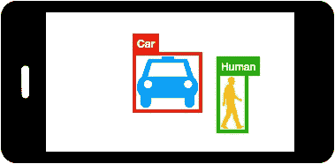
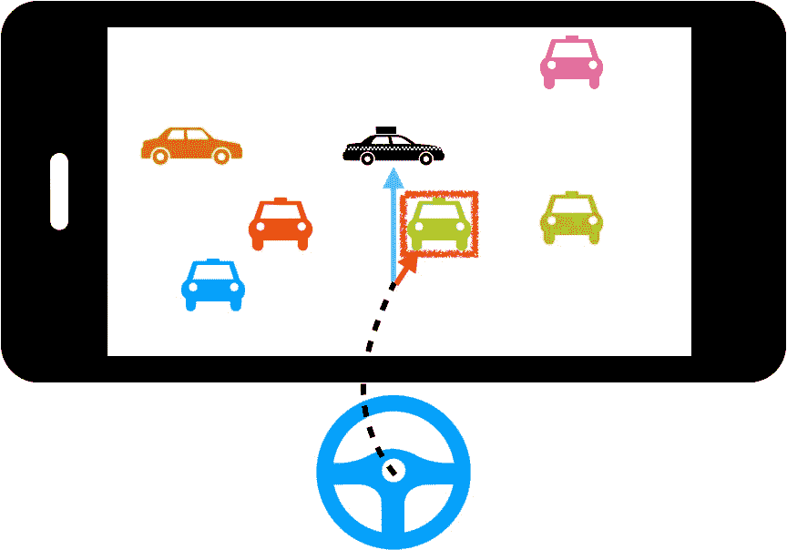
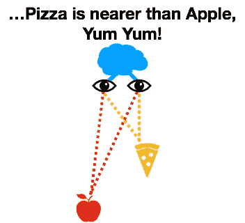

# 使用 CoreML 的碰撞检测系统

> 原文：<https://towardsdatascience.com/collision-detection-system-using-coreml-f453923670a4?source=collection_archive---------15----------------------->

最近在 WWDC 17，苹果推出了 CoreML 和 ARKit。这开启了无数的可能性，让数以百万计的人可以通过他们的手机来设计令人惊叹的应用程序。利用这些新技术，我们想为什么不设计一个可以在日常通勤中帮助每个人的应用程序。经过一番头脑风暴，我们决定建立一个驾驶辅助 dashcam 应用程序。

我们计划设计的驾驶员辅助应用程序将由一个碰撞检测管道组成，该管道将检测驾驶员是否会撞到车辆前方的障碍物。该应用程序将不断从相机中获取帧，检测每帧中的对象，找到每个对象的深度，传感器融合以计算车辆的速度和碰撞时间。

# **物体检测:**

从上面的讨论中，我们可以理解，解决这个问题的第一个里程碑是使对象检测算法在移动电话上工作。理想的算法应该以最高的精度预测障碍物，几乎实时运行，并且没有假阳性。基于这些要求，解决对象检测问题的最佳方法是使用深度学习算法。

以对象检测问题而闻名的深度学习算法有 R-CNN、快速 R-CNN、更快 R-CNN、YOLO、YOLO 9000、SSD、MobileNet SSD。

经过一个月的头脑风暴和编码，我们使用 CoreML 框架实现了 YOLO，达到了目标检测的里程碑。

Object Detection Prototype

我们在下面的博客中记录了我们是如何完成这项任务的— [**链接**](https://sriraghu.com/2017/07/12/computer-vision-in-ios-object-detection/) 。

# 深度计算:

障碍物的深度可以定义为障碍物距离摄像机的距离。

Depth (or) Distance of obstacle from car

一般来说，深度可以通过一些特殊的硬件立即计算出来，这些硬件通常被称为 RGBD 相机。现在流行的消费级 RGBD 相机是微软的 Kinect (Xbox)。但另一方面，消费者手机没有深度传感器。它们只是 RGB 相机(又称单目视觉)。我们怎么计算深度呢？

为了使用单目摄像机计算与汽车的距离，我们可以遵循以下策略之一

1.  时间方法——根据图像中运动的时间顺序计算深度(例如:视觉里程计)
2.  每帧方法-其中在当前帧中计算的深度独立于先前的帧(例如:三角测量技术，或深度学习技术等)。)

在我们的例子中，我们现在选择了每帧三角测量法，并提出了一些数学公式，找到了计算汽车深度的方法。用我们的公式计算的深度在米的尺度上是精确的，但在厘米的尺度上就不那么精确了。因此，我们决定保持三级(安全、中等和危险)碰撞检测报警系统，而不是非常精确的深度精度。

# 传感器融合:

一旦我们从上述阶段计算出深度，我们将使用传感器融合来组合手机中的各种传感器，以获得我们汽车的速度。然后，我们在简单的运动学公式中使用它来计算特定帧中的 T.T.C(碰撞时间)。在研究人类对警报的平均反应时间的基础上，我们战略性地将 T.T.C .划分为警报系统的三个阶段。

此外，假设用于检测汽车的算法是鲁棒的并且视野良好，那么我们很有可能在一帧中检测到许多汽车。在这种情况下，我们可能需要找到一辆我们将来可能会撞上的车。通过传感器融合，我们通过图像处理技术稳健地计算我们汽车的轨迹，将问题从' *n* 辆汽车归结为 **1** 辆汽车，然后我们计算那辆特定汽车的 T.T.C。

Trajectory of car estimation from sensor fusion and T.T.C

将这些放在一起，我们已经准备好了管道的基本工作演示，可以在下面的视频中看到。

Demo (Testing Phase)

# 未来工作:

在这篇博客中，我们展示了如何利用 CoreML、计算机视觉和传感器融合的力量来创建一个能够真正帮助人们日常通勤的应用程序。我们正在积极工作，使用深度学习技术或鲁棒的视觉惯性里程计技术来改进检测到的车辆的深度估计。此外，我们正在计划是否可以使用 iPhone 7 Plus(窄基线相机系统)中提供的两个相机的功率来估计深度。根据从两个不同视点(或两个相机)捕获的图像来估计场景中对象的深度的区域被称为“来自立体的深度”。这个领域是受人类视觉系统的启发而产生的，下图概括了我试图解释的内容。

Depth estimation of objects through stereo vision

感谢您阅读本博客，并请留下您对我们工作的评论/看法。我还要感谢苹果公司的 CoreML 团队，是他们惊人的 API 让这一切成为可能。