# 用 D3.js 从玩具视觉过渡到真实应用

> 原文：<https://towardsdatascience.com/combining-d3-with-kedion-graduating-from-toy-visuals-to-real-applications-92bf7c3cc713?source=collection_archive---------10----------------------->

## 将 UI 元素绑定到 D3 视觉效果

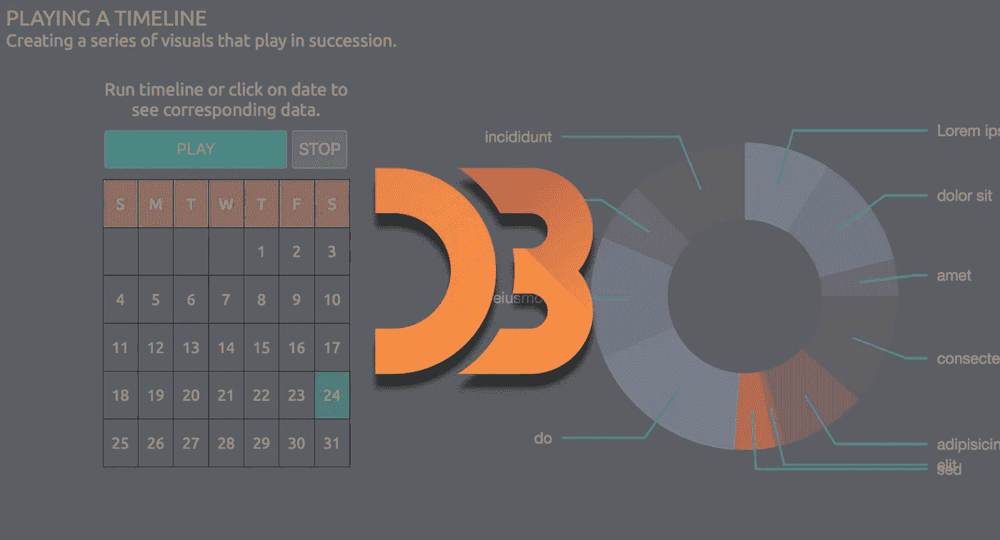

**注意** : D3 现在使用了 Observable，我在[这篇文章中提到过。](/creating-web-applications-with-d3-observable-d5c53467ff12)

我们经常孤立地学习技术和方法，与数据科学的真正目标脱节；创造由机器学习驱动的真实应用。但是我说的*真正的*是什么意思呢？对我来说，真实意味着我们接触的任何技术都应该是整体应用的一部分，提供真正的用户体验。

训练新的 TensorFlow 模型？建立一个基于面部识别的应用程序。编写了一个自动执行常见数据清理任务的库？创建一个界面，使团队能够通过浏览器合并和清理数据。发现了一种新的文档分类方法？制作一个上传公司电子邮件档案的工具，识别与相关主题相关的所有主题，如团队建设。

我热衷于制造真正的产品，因为我知道这是在这个领域做好的唯一途径。我们需要通过人们与之互动的真实软件来表达机器学习概念，并理解如何用数据来打造用户体验。

孤立工作的一个常见例子是数据可视化。虽然“用数据讲故事”可能很强大，但故事本身并不能带来真正的解决方案。如果您的数据科学从未超越幻灯片，那么您就没有真正做过数据科学。利益相关者需要接触和感受解决方案的样子。有了今天的高级工具，数据科学家没有借口不编写真正的应用程序来展示他们的工作。

> 如果您的数据科学从未超越幻灯片，那么您就没有真正做过数据科学。

在这篇文章中，我将展示如何通过结合 D3 和 Azle 来构建真正的应用程序。让这些应用成为现实的是 D3 的**绑定**到应用中的 UI 元素。正是元素和视觉之间的这种联系确保了可视化不仅仅是讲故事的人；它们是解决实际问题的应用程序的组成部分。

# 内容

*   **简介**
*   **设置您的项目**
*   **构建一个 AZLE 应用程序**
*   **增加 D3 视觉效果**
*   **包装器参数和额外函数**
*   **将 D3 绑定到 UI 元素**
*   **添加动画**
*   **动态改变数据**
*   **图表间的通信**
*   **运行时间表**
*   **委托点击事件**
*   **客户端数据**

我创建了一个**演示应用程序**，展示了本文中讨论的主题。你可以在这里查看应用[以及在 GitHub 上对应的](https://collaboratescience.com/azle_d3/)[回购](https://github.com/WorldofDataScience/azle_d3)。

Example application that combines Azle with D3.

# D3 和 AZLE

在我题为[学习构建机器学习服务、原型化真实应用程序以及将您的工作部署给用户](/learn-to-build-machine-learning-services-prototype-real-applications-and-deploy-your-work-to-aa97b2b09e0c)的文章中，读者第一次接触到了 [Azle](https://azlejs.com/) 。Azle 使用布局、预样式元素和易于使用的 REST API，支持快速的产品原型开发。

[D3.js](https://d3js.org) 是一个 JavaScript 库，用于生成动态的、交互式的数据可视化。D3 能够生成由数据驱动的图表和图形，并且已经成为行业标准的可视化工具。

虽然在 D3 的网站上有很多视觉效果的例子，但是对于如何在应用程序中包含这些视觉效果却没有什么支持。尽管许多库有助于更容易地创建 D3 视觉效果，但这并不等同于实现应用程序和 D3 之间的通信。

我们可以尝试使用我们组织当前的技术堆栈进行原型制作，但是当我们想要快速产生一个新的想法时，这是多余的。我们也可以使用一个包，允许我们用 R 或 Python 来构建“交互式 web 应用程序”。但是这种选择并不能使应用程序具有组织现有产品的外观和感觉。想象一下，试图用 Shiny 重现亚马逊或网飞的界面。还有一种将 UI 元素添加到视觉效果的“小部件方法”,但这将 UI 限制在视觉效果本身，而不是与完整的应用程序集成。

Azle 对 D3 的支持是不同的，因为没有你不能用 Azle 完成的布局或样式。任何 HTML、CSS 或 JavaScript 都可以添加到 Azle 应用程序中，尽管您通常只需要它自己高度声明性的语法。您组织的产品的外观和感觉可以很快被模仿，这意味着您的机器学习正在利益相关者认可的应用程序上进行测试。从对知名产品进行改进的原型中赢得认同要容易得多。

让我们开始吧。

# 设置

在这一节中，我将介绍设置 D3 与 Azle 一起工作的必要步骤。一旦你完成了这些步骤几次，你会发现设置你的 Azle_D3 项目又快又简单。这些步骤对于您决定与 Azle 一起使用的任何 D3 可视化都是相同的。

# 步骤 1:选择初学者视觉

网上有大量的 D3 例子，从头开始构建 D3 是没有意义的。你可能要重新发明轮子，把宝贵的开发时间花在寻找现有视觉效果上。第一步是从 D3 的[网站](https://d3js.org)选择一个现有的 D3 视觉。你可以点击顶部的例子来预览许多视觉效果，这里有更大的列表。


D3 Website

让我们选择一个*基本图表*来展示我们如何设置我们的项目。我将选择这里的**条形图**:

[](https://bl.ocks.org/mbostock/3885304) [## 条形图

### 迈克·博斯托克街区 3885304 号

bl.ocks.org](https://bl.ocks.org/mbostock/3885304) 

# 步骤 2:创建目录结构

与任何应用程序一样，我们需要创建一个目录结构来保存我们的文件。你可以**在这里下载**目录结构[以节省时间。下载后，检查您的下载文件夹。您应该看到以下内容:](http://collaboratescience.com/medium_files/azle_d3_directory.zip)

```
**azle_d3_directory**
├── **d3_visuals** └── barchart.html
├── **data** └── barchart.tsv
├── index.html
├── **scripts**
```

**d3_visuals** 文件夹保存 d3 提供的 html 文件。**数据**文件夹保存 D3 读取的本地数据。**脚本**保存任何 Azle 脚本，*index.html*是我们应用程序的主页面。这些文件现在是空的，因为我们将在本文中粘贴所需的代码。

无论我们需要支持多少视觉效果或数据集，这种相同的结构都将服务于我们的应用程序。更多的 D3 视觉效果意味着更多的*。d3_visuals 文件夹中的 html* 文件，以及 data 文件夹中的更多数据集。

# 步骤 3:从 D3 添加 HTML 和数据

因为我们使用 D3 的条形图，所以我们将添加 D3 示例页面上提供的 **HTML 和数据**用于条形图。

## 获取 HTML:

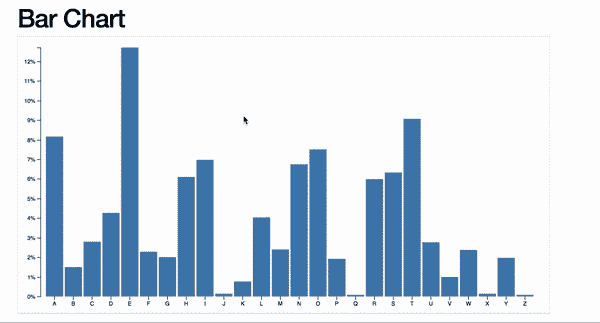

Grabbing **html** from D3 example page

在上面的 GIF 中，你可以看到我从 D3 的条形图示例中抓取 html，并将其粘贴到 d3_visuals 文件夹中的 barchart.html 文件中。

## 获取数据:

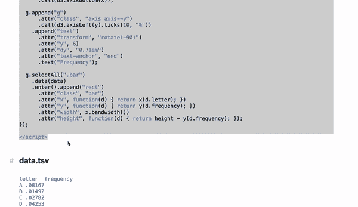

Grabbing **data** from D3 example page

上面，我从 D3 的条形图示例中抓取 data.tsv，并**将其粘贴到 data 文件夹**中我的条形图. tsv 文件中。D3 使用的另一种常见数据格式是 CSV。数据格式并不重要，因为我们正在抓取的视图已经被创建来读取这种数据类型。稍后，我们还将看看使用 JavaScript 对象存储在客户端的本地数据。

# 步骤 4:从 Azle 添加 HTML 模板


我们现在准备开始使用 Azle 创建一个与 D3 条形图交互的应用程序。我们从所有 Azle 应用程序开始；通过使用 Azle 的 **html 模板文件:**

Beginning HTML template for Azle application.

这是我们开始添加 Azle 函数来构建我们的应用程序所需要的一切。

# 步骤 5:包装 D3 视觉效果

我们需要一种方法来将数据从我们的应用程序传递到我们的 D3 视图。为了做到这一点，我们使用以下 3 个步骤对 D3 HTML 文件(【barchart.html】T2)做了一个小小的修改:

1.  **将 Azle 库添加到 D3** 文件中；
2.  **将**所有原生 D3 代码包装在 **draw_visual** 函数内；
3.  **将所有函数参数**设置为 **azle_args。**

让我们用条形图视觉效果来做这些事情:


**Azle** has been added to D3’s .html file. Also, all D3 code has been **wrapped** inside the draw_visual function. Finally, we have set **arguments[0]** to azle_args.

> 取任意一个 D3 代码，简单地用 **draw_visual** 函数将它包装起来。还要添加行 **azle_args = arguments[0]** 。这使得数据和函数能够进出我们的 D3 视觉。

## 寻找钩子

有了上面的步骤，我们可以使用 Azle 将数据和函数传入传出我们的 D3 visual。决定传递哪些数据/函数取决于我们希望动态改变什么。

例如，假设我们希望允许用户通过简单地单击应用程序中的一个按钮来更改驱动可视化的数据集。在这种情况下，我们查看 D3 代码以了解数据集在哪里被读取，并用 azle_args 和我们选择的*键*替换文件名:

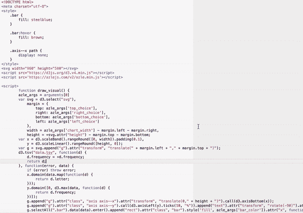

**Finding D3 hooks** and replacing with azle_args.

在上面的 GIF 中，我使用了**键** [“数据选择”]。这个键可以是您喜欢的任何键，只要您在 wrapper_arguments 中使用相同的键，这将在下面讨论。换句话说，azle_args 用于接受来自 azle 的数据，并使用它的值替换 D3 的硬编码部分。

我们可以在 D3 中找到各种挂钩，将我们的视觉绑定到应用程序的其他部分。另一个例子是使用 Azle 的颜色选择器来允许用户改变我们的条形图的颜色。在这种情况下，我们在 D3 内部查找设置条形颜色的位置，并用 azle_args["bar_color"]替换颜色。

# 用 D3 制作真正的应用程序

现在我们已经设置好了一切，我们可以将我们的 D3 可视化添加到一个真实的应用程序中。因为 Azle 是为构建应用程序而设计的，所以让我们创建一个 Azle **布局**并**添加我们的条形图**。然后我们会看到我们如何与我们的视觉沟通。

## 1)启动一个简单的 Web 服务器

为了使用我们的应用程序，我们需要一个 web 服务器。这些很容易在任何本地机器上创建。例如，在我的 Mac I **上打开终端**，进入 azle _ d3 _ 目录，运行下面一行:

```
python3 -m http.server
```

现在我打开浏览器，进入 [http://localhost:8000](http://localhost:8000)

## 2)准备页面

我们一如既往地从准备 Azle 的基础页面开始。虽然我有一个脚本文件夹，但我会将脚本标签之间的所有内容放在我的 index.html 文件的底部，create_azle 函数内的**:**

Basic page setup for Azle.js

让我们给我们的应用程序添加一些基本的**样式**、一个**部分**和一个**布局**:

我们现在有了一个布局，可以用来在屏幕上**定位我们的内容**:


An Azle **layout**

我使用 1 行 2 列的布局，因为我希望我的 UI 元素在左边，我的 D3 视觉在右边。

## 4)添加 D3 可视化

在我们的应用程序中添加 D3 视觉效果需要 3 个主要部分:

1.  **add_d3_visual** 函数；
2.  **wrapper_arguments** 对象；
3.  **额外功能**对象。

## add_d3_visual

为了添加我们的 D3 视觉，我们使用 Azle 的 **add_d3_visual** 函数。在这里，我将条形图添加到我在上面创建的布局的第二个单元格中:

Adding a D3 visual in Azle

注意我是如何在 add_d3_visual 函数中指定 **wrapper_arguments** 和 **extra_functions** 的。我们现在将创建这些对象。

## **包装 _ 参数**

与任何 JavaScript 对象一样，wrapper_arguments 是一个属性列表，每个属性是一个键/值对。在这里，我们列出了想要传递给 D3 视觉效果的任何值(就像上面的 data_choice 示例)。我将在我的条形图中找到一串我想使用 Azle 设置的*钩子*(并最终在我的应用程序中使用 UI 元素动态控制)。下面是我的条形图的 wrapper_arguments 对象:

Setting properties in wrapper_arguments object

对于其中的每一个，我都用 **azle_args["key"]** (例如，azle_args["bar_color"])替换了我的条形图 D3 代码的一部分。

## **额外功能**

实际上有 2 种方法我们可以使用 Azle 将信息传递给 D3 。我们已经看到了如何使用 wrapper_arguments 传递数据。只要我们在 D3 中找到挂钩，我们只需添加 azle_args["key"]来控制该属性。但是**如果我们的 D3 视觉是用 CSS 而不是 D3** 来样式化的呢？

例如，我们的条形图中的条形颜色使用 CSS 设置在顶部:


在这种情况下，我们可以像上面一样修改 D3 代码，使用 azle_args 为条形着色，或者我们可以将一个函数传递到我们的 visual 中，并直接设置“bar”类的样式。让我们来看看这两种场景的区别。

**场景 1** :用 *azle_args* 传递值

在下面的 GIF 中，我在 D3 内部查找创建条形图的位置，然后添加必要的代码以接受来自 azle_args 的条形图颜色:


**Modifying D3** to accept bar color dynamically using azle_args.

这意味着我添加到我的 wrapper_arguments(在 *barchart_wrapper_args* 中)的 bar_color 属性将被传递到我的 D3 visual 中，并且条将被适当地着色。

**场景 2** :将函数直接传递给 D3

在这个场景中，我将使用 **extra_functions** 来设置条的颜色，允许我们在视觉中操作 CSS。在这种情况下，我们使用我们想要影响的元素的**类名**。上图(红色箭头)中，我们看到我们的酒吧的类名是“酒吧”Azle 使用类名来定位元素，所以这是一个自然的选择。也就是说，JavaScript 和 D3 在样式和事件方面有一些差异，所以我们将在额外的函数中使用 Azle 专用的 **style_d3** 函数。

因为我们已经使用 wrapper_arguments 很好地实现了条形颜色，所以我将使用其他颜色。事实上，我发现如何使用 D3 给条形图上的**标签**着色和调整大小很有挑战性。在一些 D3 例子中，我们看到这些标签使用 CSS 样式，使用名称**文本**以及**填充**和**字体大小**。让我们在 extra_functions 中使用 Azle 的 **all_style_d3** 函数来定位“文本”:

我们将我们的 style_d3 函数添加到 **extra_functions** 对象**，**中，我称之为条形图 _extras:

Creating a barchart_extras object

style_d3 前面的 **all_** 前缀是 Azle 定位一个类的所有实例的方式。因为我们想给所有的条着色，所以我们在这里使用它。你可以回顾一下 Azle 的[文档](https://azlejs.com/)来熟悉 Azle 的风格语法。

现在，当我们的 **add_d3_visual** 函数被调用时，**两个*包装器 _ 参数*和*额外 _ 函数*都将被传递给我们的 D3 visual** :


让我们为更好的对比设计我们的应用程序。

```
az.**style_sections**('my_sections', 1, {
     "background" : "darkslategrey"
 })
```


我们可以看到，因为列在 wrapper_arguments 中，所以设置了条形颜色，因为在 extra_functions 中使用了 all_style_d3，所以对文本标签进行了着色和调整大小。

添加条形图后，我们的布局有点变形，但我们会尽快修复。

> 我们不必在 extra_functions 中使用 Azle 函数。我们还可以使用 extra_functions 将普通的 Javascript 传递给任何 D3 visual。只要确保函数用引号括起来。

## 5)添加 UI 元素

让我们在布局的左侧添加一些 UI 元素。我首先将另一个布局添加到我的原始布局的第一个单元格，以便将我的 UI 元素放置在左侧。然后，我将我的 UI 元素添加到新布局的每个单元格中:

Adding UI elements to Azle Application

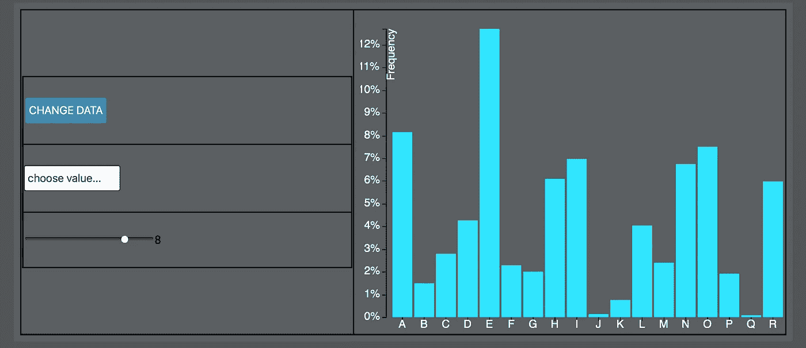

让我们清理一下我们的布局，做一些基本的样式。首先，我将**设置第一个布局上每一列的宽度**:

```
az.**style_layout**('my_layout', 1, {
     "column_widths" : ['20%', '80%']
 })
```

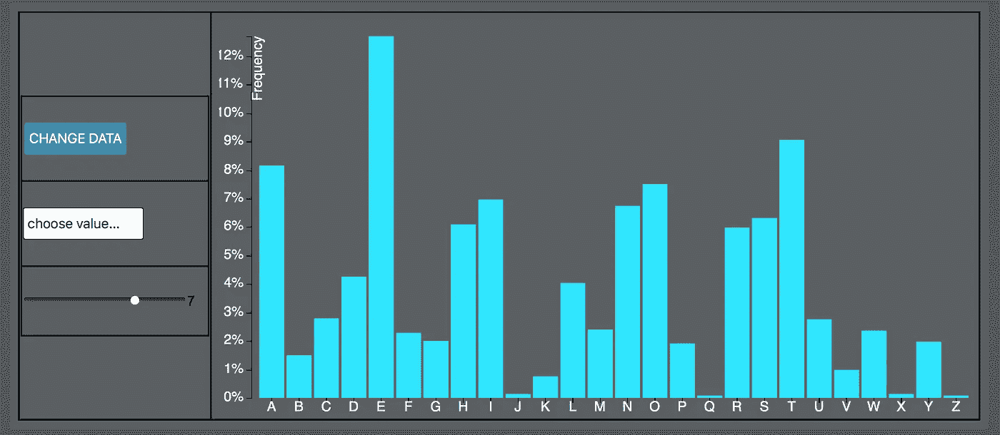

我们可以看到 UI 元素和 D3 visual 现在在布局中的位置是正确的。我还想让左边的 UI 元素在它们自己的单元格内居中。

```
az.**all_style_layout**('element_layout_cells', {
     "halign" : "center"
 })
```


另外，默认的**按钮颜色**和**滑块标签**与深色背景不太匹配。让我们改变这些:

```
az.**style_button**('data_button', 1, {
     "background" : "rgb(254, 225, 180)",
     "color" : "black"
 })

 az.**style_slider**('my_slider', 1, {
     "color" : "white"
 })
```

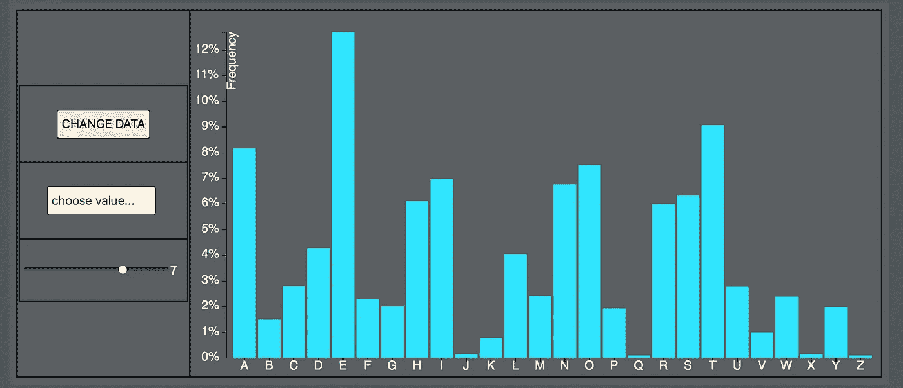

最后，让我们**移除两个布局上的边框**，给我们一个干净的应用程序。将两种布局样式都设置为包含 0 的边框属性:

```
az.**style_layout**('my_layout', 1, {
     "column_widths" : ['20%', '80%'],
     "border" : 0
 })

 az.**style_layout**('element_layout', 1, {
     "border" : 0
 })
```

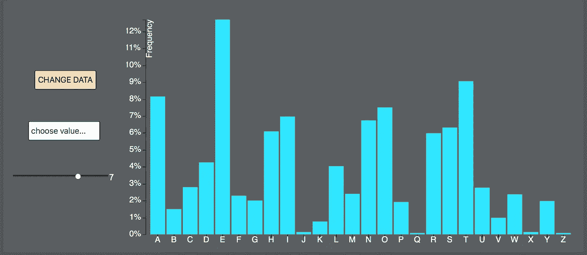

Removing Borders on Azle Layouts

既然我们已经知道了如何添加一个可视元素，以及一些基本的 UI 元素，那么是时候开始将我们的 D3 可视元素绑定到 UI 元素了。

# 将 D3 视觉效果绑定到 UI 元素

用 D3 创建真正的软件是为了确保我们可以在应用程序中使用 UI 元素与可视化交互。Azle 使用了 **2 个函数来与 D3 交互:**

1.  **call_d3_wrapper**
2.  **call_d3_extra**

## 调用 _ d3 _ 包装器

在上面的第 4 部分中，我们使用了 wrapper_arguments 来列出我们想要传递给 D3 visual 的任何值。 **call_d3_wrapper** 函数用于动态改变我们的 wrapper _ arguments*。这意味着我们放在 D3 视觉元素中的任何挂钩(使用 azle_args)都将响应我们在 call_d3_wrapper 中指定的更改。*

*call_d3_wrapper 函数使用普通的 Azle 风格的目标，带有 target_class 和 target_instance，还列出了与我们的 wrapper_arguments 相关的属性:*

```
*az.**call_d3_wrapper**('my_barchart', 1, {
    "wrapper_arguments" : barchart_wrapper_args,
    "extra_functions" : barchart_extras,
    "bar_color" : passed_value
})*
```

*注意 call_d3_wrapper 函数**期望** **列出 wrapper_arguments *和* extra_functions** 。我们指定 extra_functions 的原因是为了在重绘视图时保留样式。在上面的例子中，我计划向“bar_color”属性动态传递一个值。*

*让我们将更改数据按钮绑定到条形图上。在 Azle 中，我们使用 **add_event** 函数来**将事件附加到 UI 元素**:*

```
*az.**add_event**('data_button', 1, {
     "type" : "click", 
     "function" : ""
 })*
```

*这里我们简单地指定了事件的类型(比如点击)和事件触发时调用的函数。我们想在用户点击按钮时调用 call_d3_wrapper 函数。为了让这更有用，让我们允许用户在点击按钮时**在数据集**之间来回切换。我将创建两个独立的 change_data 函数，每个函数都用适当的 data_choice 调用自己的 call_d3_wrapper。然后我会用 Azle 的 **toggle_functions** 作为 add_event 里面的函数。让我们使用 Azle 的*包装函数*来组织我们的代码。*

***结果**:*

*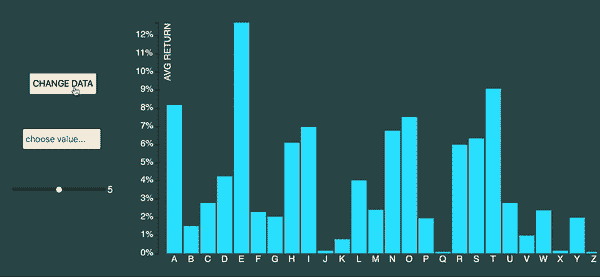*

*我们刚刚创建了 UI 元素和 D3 视觉元素之间的第一个绑定。*

*对于下拉菜单，让我们允许用户**在 3 种不同的颜色**中选择我们的条。首先，我们需要返回到我们的 **add_dropdown** 函数，并添加**选项**，我们最初将其留空:*

```
*az.**add_dropdown**('element_layout_cells', 2, {
     "this_class" : "choose_drop", 
     "title" : "choose color...",
     "options" : ['blue', 'yellow', 'hotpink']
 })*
```

*我还把标题改成了“选择颜色”*

*现在我们可以像以前一样使用 **add_event** ，但是这一次将目标指向我们的 dropdown 元素，并选择 *change* 作为事件类型。我将把我的 call_d3_wrapper 放在一个名为 *recolor_bars* 的函数中，然后用我的 *add_event* 调用它:*

*Binding a dropdown to a D3 Visual in Azle*

*注意，这次我是**向 add_event 内部的函数传递一个参数**(*recolor _ bars()*函数)。我传递的参数是从下拉列表中选择的值(使用 **this.value** 是 JavaScript 中的标准做法)。*

***结果**:*

*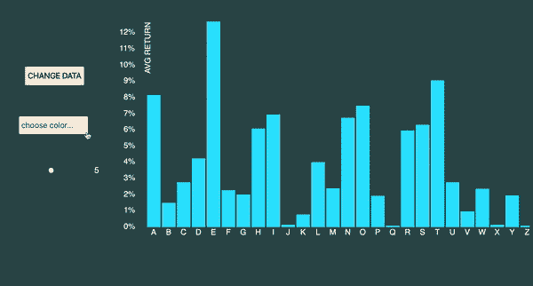*

*现在让我们将滑块绑定到条形图上。现在我们知道该怎么做了。这次最大的不同是**事件类型**被称为 *as_change* 。当滑块移动时，该事件类型传递参数**。让我们允许用户更改图表的上边距:***

*Binding a slider to a D3 Visual in Azle*

*如果你试着移动滑块，你会发现图表变化不大。我们需要**增加滑块**元素的取值范围，使其对我们的用例有用:*

```
*az.**add_slider**('element_layout_cells', 3, {
     "this_class" : "my_slider", 
     "min_value" : 0,
     "**max_value**" : 100,
     "default_value" : 5
 })*
```

***结果**:*

*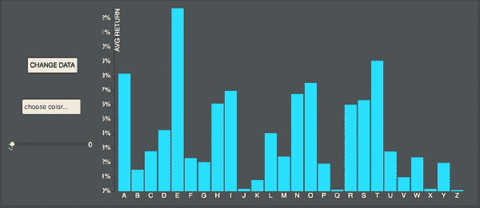*

## *call_d3_extra*

*正如我们有一个函数可以动态改变我们的 wrapper _arguments 一样，我们也有一个函数可以动态改变我们的 extra_functions。我们在上面的第 4 节中使用了 extra_functions 来设置文本的颜色和大小。让我们使用 call_d3_extra 将我们的滑块绑定到文本大小，允许用户动态地*改变文本大小。 **call_d3_extra** 函数的使用方式与 call_d3_wrapper 相同:**

*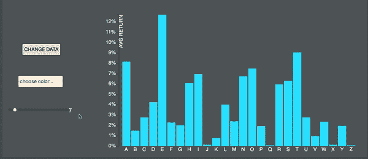*

*Dynamically changing tick size in a D3 visual using Azle*

*注意，当我们使用 call_d3_extra 时，**转换更加平滑，因为图表没有被重画。***

*我想展示的另一个 UI 元素是**颜色选择器**。让我们添加另一个按钮，它提供了一个颜色选择器，用户可以使用它来动态地改变条形的颜色。首先，我们需要**向 elements_layout** 添加另一行。然后我们可以**添加并样式化我们的按钮**，并使用 **add_event** 来触发 **add_color_picker** 函数:*

***结果**:*

**

*Using the color picker in Azle*

*在本文的剩余部分，我将展示视频开头提到的**演示应用程序**中内置的示例。这个包含所有源代码的完整示例应用程序可以在 GitHub [这里](https://github.com/sean-mcclure/azle_d3)找到。*

# *添加动画*

*我们有很多方法可以将 Azle 功能与 D3 混合搭配。一种选择是添加动画。我们可以*结合* **call_d3_extra** 和 Azle 的 **animate_element** 函数来动画化 d3 里面的一个特定元素。*

*在这种情况下，我们需要**为 D3** 中的每个元素分配一个惟一的 id。我们可以在 D3 中直接这样做，或者使用 Azle 的 **all_apply_id** 函数。*

*一旦分配了 id，我们就可以使用 Azle 的 **all_add_event** 函数来添加一个悬停事件，每当元素被悬停时，该事件就会调用 Azle 的 **animate_element** 函数。*

***结果**:*

**

> *注意我们没有使用 **all_** 前缀来动画显示所有的条。这将导致当只有一个条被悬停时，所有的条都被激活，这不是期望的行为。*

*这是另一个动画示例:*

*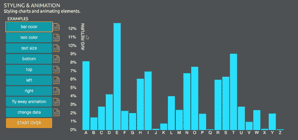*

*你可以用 Azle 提供的任何动画进行实验。*

# *动态更改数据*

*一个常见的场景是允许用户更改驱动特定视觉的数据。我们已经看到了这样的例子。下面是演示应用程序中使用的示例:*

*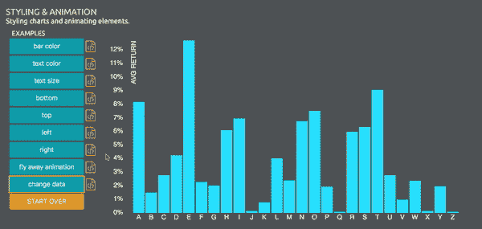*

*这里有一个带有**单选按钮**的按钮，我们可以在不同的数据集以及数据子集之间进行选择:*

*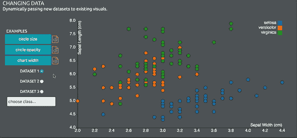*

*稍后，我们将看到如何使用从 REST API 获取的客户端数据来实现这一点。*

# *保留样式*

*需要注意的一件重要事情是，我们如何在 UI 元素之间移动，而不破坏最近的更改。例如，在下面的散点图中，我可以更改圆形大小，然后更改图表宽度，更改数据集，并过滤数据，同时始终保持样式(注意 GIF 动画使过渡看起来不太平滑)。*

**

# *2 个 D3 图表之间的通信*

*让 2 D3 图表相互交流通常很有用。例如，允许用户与一个视觉对象交互，并让该交互影响显示相应信息的第二个视觉对象，这可能是有意义的。*

*我们简单地**添加 2 个视觉效果**和一个*桥接功能*来完成这个工作。让我们试一试。*

*我们创建一个布局，用 1 行和 2 个单元格来容纳两种视觉效果。我称之为双重布局。然后我们像往常一样添加视觉效果:*

*将**条形图**图表添加到布局单元格 1*

*将**折线图**添加到布局单元格 2*

***将悬停事件**添加到条形图中，即调用一个 ***桥函数*** :*

***Calling a 2nd D3 visual** with Azle*

*这里，我们将一些属性添加到条形图的 extra_functions 对象中。最重要的一个是“call_line_chart”，在这里我做了以下事情:*

*   ***将 id**应用于所有条形元素；*
*   ***将悬停事件**添加到所有 bar 元素中；*
*   ***悬停时调用桥接函数**。*

*前两步和我们制作动画的步骤是一样的。bridge 函数是当用户将鼠标悬停在条形图上的某个条上时调用的函数。**桥函数**需要调用第二张图上的**call _ D3 _ wrapper:***

***桥接功能**:*

*注意我们的条形图上的悬停事件是如何调用桥函数的。它使用前缀**父**。这是因为桥函数存在于 D3 视觉之外。它还使用 Azle 的 get_target_instance()函数来获取使用其 id 的 bar 的实例。*

***结果**:*

*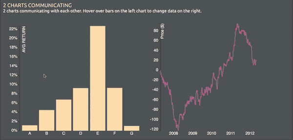*

*2 D3 charts communicating with each other using Azle*

*注意，我们为这个条形图重用了相同的 HTML 文件(与本文开始时使用的相同)。我们只改变了它的 wrapper_arguments 和 extra_functions。*

*在上面的例子中，我使用 Azle 将一个悬停事件添加到视觉效果中。但是 D3 有自己的事件，使用 visual 自带的事件可能更有意义，尤其是 D3 支持的非标准事件。在下面的例子中，我使用 Azle 将**和**笔刷**可视化和**水平条形图结合起来。**在这里，我将左边刷牙的最小值和最大值传递给右边的条形:***

*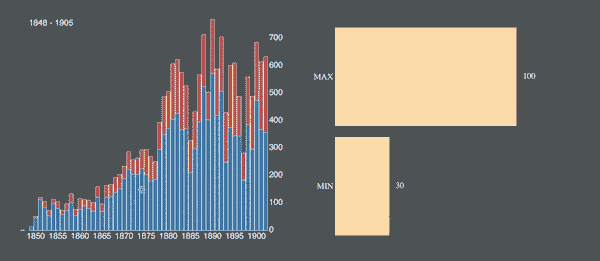*

*在这种情况下，我找到了在 D3 中更新刷取值的位置，并使用了前面示例中讨论的相同的父前缀和桥函数方法，将这些值传递给我的 call_d3_wrapper 函数:*

*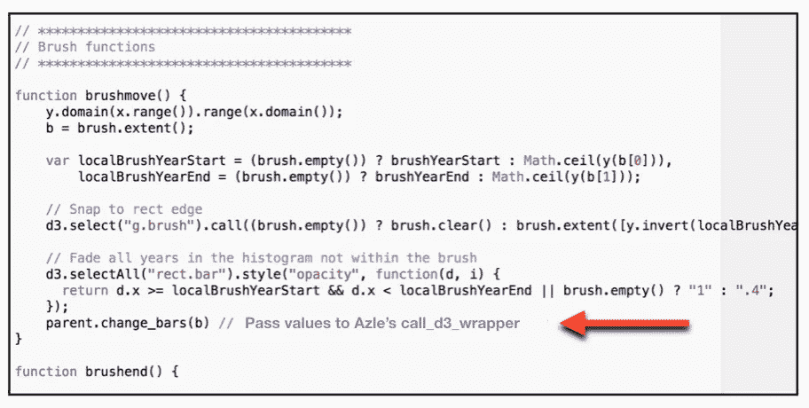*

*Passing Values from D3’s Brush Visual to Azle’s call_d3_wrapper*

*我创建了一个[**GithubGist**](https://gist.github.com/sean-mcclure/0fa4154e387faf6bf7190a3e77506b39)**你可以查看，查看上面例子的所有文件。***

# ***运行时间表***

***随着时间的推移，有时自动播放一组视觉效果是有意义的。当我们需要**用时间维度的数据讲述一个故事**时，这是有意义的。在下面的例子中，我将 **call_d3_wrapper** 与 Azle 的 **call_every** 函数结合起来，来遍历一组视觉效果:***

*****结果**:***

***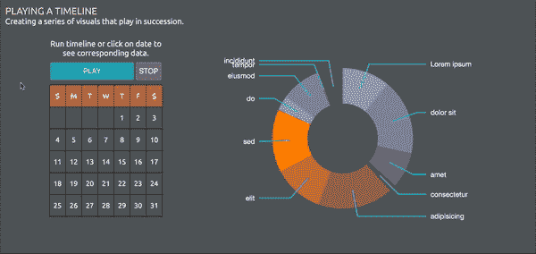***

***Using Azle’s call_every function to play timelines with D3***

# ***委派点击事件***

***委托 click 事件也是有用的，这样**就可以有计划地点击 D3 visual** 中的元素。例如，D3 上的圆形包装视觉通常期望用户点击不同的圆形来放大。让我们允许用户从下拉菜单中选择一个选项来放大视图的各个部分。***

***为此我们使用 Azle 的 **click_d3** 函数。***

*****结果**:***

***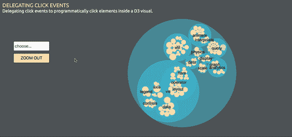***

***Using Azle’s **click_d3** with packing visual***

***同样的方法，这次用的是**地图**:***

***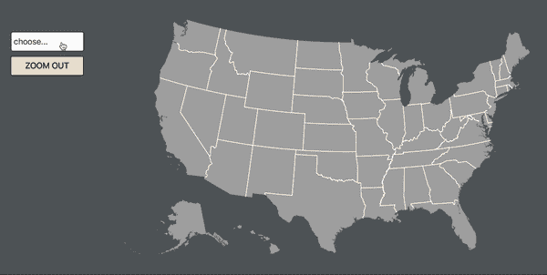***

***Using Azle’s **click_d3** with map visual***

***…以及**可折叠采油树**:***

***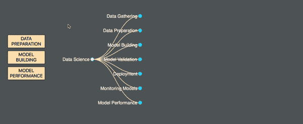***

***Using Azle’s **click_d3** with tree visual***

# ***客户端数据***

***到目前为止，我们假设 D3 数据保存在磁盘上。例如，上面我们使用了 TSV 和 CSV 文件。对于模拟应用程序，这通常就足够了。但是有时我们需要使用客户端数据，在这种情况下，数据作为 JavaScript 对象被存储、读取或上传。***

***在这一节中，我将通过 3 种主要的客户端场景展示如何使用 Azle 和 D3:***

1.  *****JavaScript 对象**硬编码到我们的文件中；***
2.  ***从 RESTful API**获取数据**；***
3.  *****通过浏览器上传**数据。***

## ***文件中的 JavaScript 对象***

***有时我们不需要磁盘上的数据，比如当我们模仿一个快速演示应用程序或使用不变的数据时。***

***在这个例子中，我将展示如何在数据存储为 JavaScript 对象的数据集之间进行转换。我将使用和弦图，它使用值的矩阵作为数据。首先，让我们创建 3 个矩阵，并将它们存储在一个名为 *all_chord_data* 的 JavaScript 对象中。我还将创建一个名为 *switch_client_side* 的函数，它使用 **call_d3_wrapper** 来设置 data_choice，就像我们之前所做的那样:***

***Switching between D3 datasets stored **client-side** using Azle***

***我们简单地将单选按钮绑定到 Azle 的 **call_d3_wrapper** 函数，以更改我们的 chord 图上的数据集。***

*****结果**:***

***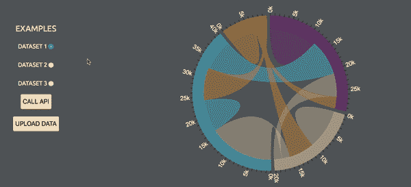***

## ***从 REST API 获取数据***

***任何应用程序中的一个常见场景是从 REST API 获取数据。在需要运行分析并将结果返回给产品的机器学习应用中尤其如此。***

***Azle 的 **call_api** 函数就是用于这个目的。熟悉我的文章[构建机器学习服务和原型化真实应用](/learn-to-build-machine-learning-services-prototype-real-applications-and-deploy-your-work-to-aa97b2b09e0c)的读者会认识到这个功能。这允许我们进行 REST 调用，等待响应，然后在收到数据后运行我们选择的函数。让我们使用 call_api 从我为本文编写的 api 中获取数据:***

*****结果**:***

******

***这里我们可以看到从 call_api 接收到新数据后和弦图的变化。***

## ***从浏览器上传数据***

***允许用户从浏览器上传数据会很有用。与其他客户端场景一样，这适用于较小的汇总数据集。***

***在这里我创建了一个名为 **my_data.json** 的**文件**。在这个文件中是和弦图的矩阵，正如我们在上面看到的:***

***my_data.json***

***这是标准的 JSON 格式，允许我索引不同的数据集。这里我只在我的文件中存储了一个矩阵，但是它可以是多个，就像我们在上面使用 JS 对象时所做的那样。***

***我们将使用 Azle 的 **add_upload_button** 函数来添加必要的 UI 元素:***

***Adding an upload button in Azle***

***数据文件上传后，我们必须决定要做什么。这里，我将在 function 属性(在 JavaScript 中称为“字符串文字”)的单引号之间嵌入我的 call_d3_wrapper 函数:***

*****结果**:***

***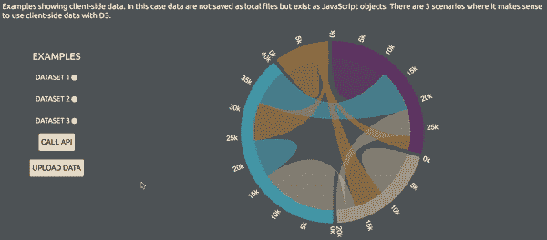***

***我们可以看到在上传时驱动我们视觉变化的数据集。***

# ***摘要***

***在本文中，我展示了如何将 D3 和 Azle 结合起来。具体来说，我们已经看到了如何将 UI 元素绑定到可视化，以确保我们的故事被集成到一个真实的应用程序中。如果 D3 和/或 Azle 不是你选择的工具，那也没关系。重要的是**构建真正的应用**而不是仅仅停留在幻灯片上的东西。你的组织将更好地理解数据和机器学习的好处，你的个人数据科学教育将增加十倍。***

***一如既往，请在评论区提问。***

*****如果您喜欢这篇文章，您可能也会喜欢以下内容**:***

***[](/learn-to-build-machine-learning-services-prototype-real-applications-and-deploy-your-work-to-aa97b2b09e0c) [## 学习建立机器学习服务，原型真实的应用程序，并部署您的工作…

### 在这篇文章中，我将向读者展示如何将他们的机器学习模型公开为 RESTful web 服务，原型真实…

towardsdatascience.com](/learn-to-build-machine-learning-services-prototype-real-applications-and-deploy-your-work-to-aa97b2b09e0c) [](/gui-fying-the-machine-learning-workflow-towards-rapid-discovery-of-viable-pipelines-cab2552c909f) [## 机器学习工作流的 GUI 化:快速发现可行的流水线

### 前言

towardsdatascience.com](/gui-fying-the-machine-learning-workflow-towards-rapid-discovery-of-viable-pipelines-cab2552c909f) [](/step-by-step-guide-to-creating-r-and-python-libraries-e81bbea87911) [## 创建 R 和 Python 库的分步指南(在 JupyterLab 中)

### r 和 Python 是当今机器学习语言的支柱。r 提供了强大的统计数据和快速…

towardsdatascience.com](/step-by-step-guide-to-creating-r-and-python-libraries-e81bbea87911) 

# 奖金票据

## 通过 call_d3_extra 使用其他 JavaScript

如果您对普通 JavaScript 和/或 jQuery 的语法更熟悉，您可以使用它们。任何脚本都可以传入 **call_d3_extra** 函数。下面是一个使用 jQuery 设计图表中条形样式的示例:

Passing regular jQuery into D3 visual using Azle

## wrapper_arguments 和 extra_functions 中的“调用”属性

有时我们用 Azle 动态地改变 D3 值，并且需要我们前端的 UI 元素来记住我们传递的最后一个值。例如，假设我们在一个模态中有一个滑块，我们用它来调整我们的 D3 视觉。当我们关闭模型时，滑块消失了，每次弹出模型时，滑块都是从头开始创建的。为了确保滑块记住相同的值，我们可以简单地访问我们的 **wrapper_arguments** 对象:

Recalling the last set property in wrapper_arguments in Azle

现在，每当我们再次打开滑块时，该值就是我们最后设置的值。这可以防止 D3 在我们重新绘制图表时跳跃:

我们可以对我们的 **extra_functions** 对象使用类似的方法，尽管这次我们不能像上面那样只访问属性的键值。相反，我们使用 Azle 的 **get_current_d3_value** 函数，传递 **barchart_extras** 对象、我们赋予样式的**名称**以及**样式**本身:

Recalling the last set property in extra_functions in Azle

## Azle 中的嵌入式函数

在本文使用的大多数例子中，从函数调用函数**是通过如下方式实现的:**

在这种情况下，我们从 add_event 内部调用 change_data，change_data 是它自己包含的函数。

另一种选择是直接将 ***嵌入*** change_data()中的一个“**字符串文字**

为了嵌入函数，我们**将要嵌入的函数放在两个单引号**中。

这可能是编写应用程序的一种更快的方式，但是它也导致代码的模块化程度降低。向嵌入式函数传递参数也会带来一些挑战。您应该尝试使用 Azle 的 **add_wrapped_function** 来代替，如前所述，因为它允许我们将一组函数分组到一个单独的命名函数中。

## 更改个人 Web 服务器上的端口

如果您的端口 8000 已经被占用，您可以简单地在命令末尾添加您想要的端口号:

```
python3 -m http.server 7777
```